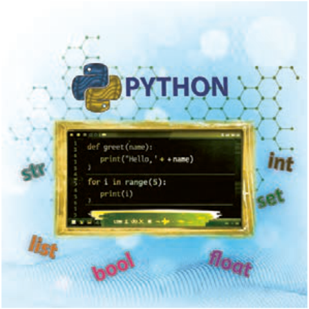

# پودمان اول

---

<!-- pdf-page: 7 | book-page: 1 -->

**صفحه ۱**

# پودمان اول

## برنامه‌نویسی پایتون

پایتون یکی از زبان‌های برنامه‌نویسی سطح بالا و پرکاربرد است که به دلیل سادگی در یادگیری و قدرت بالا در پیاده‌سازی برنامه‌ها، در حوزه‌های مختلف فناوری اطلاعات مورد استفاده قرار می‌گیرد. آشنایی با این زبان، زمینه مناسبی برای ورود هنرجویان به دنیای برنامه‌نویسی و حل مسائل رایانه‌ای فراهم می‌کند.

در این پودمان، هنرجویان با مفاهیم پایه برنامه‌نویسی به زبان پایتون آشنا می‌شوند و مهارت لازم برای مدل‌سازی داده‌ها و سازمان‌دهی برنامه‌ها را کسب می‌کنند. واحد یادگیری اول به «مدل‌سازی داده» اختصاص دارد که در آن هنرجو با انواع داده‌ها، متغیرها و ساختارهای داده‌ای آشنا شده و می‌آموزد چگونه اطلاعات را به‌صورت مناسب در برنامه‌ها ذخیره و پردازش کند. در واحد یادگیری دوم، «کار با توابع و ماژول‌ها»، هنرجویان با نحوه تعریف و استفاده از توابع آشنا می‌شوند و می‌آموزند با تقسیم برنامه به بخش‌های کوچک‌تر و استفاده از ماژول‌ها، کدی منظم، خوانا و قابل توسعه تولید کنند.
