# مدل‌سازی داده


---

<!-- pdf-page: 8 | book-page: 2 -->

**صفحه ۲**

## واحد یادگیری ۱

## مدل‌سازی داده

### آیا تابه‌حال اندیشیده‌اید

اگر بخواهید اطلاعات خودتان مثل نام، سن و رنگ مورد علاقه‌تان را در یک برنامه ذخیره کنید، چگونه این اطلاعات را سازماندهی می‌کنید؟

چگونه می‌توانید یک پیام خوشامدگویی به کاربر نمایش دهید و نام او را از کاربر دریافت کنید؟

اگر بخواهید برنامه‌ای بسازید که فقط افراد دارای شرایط سنی خاص اجازه استفاده داشته باشند، چه شرطی باید بنویسید؟

فرض کنید یک سبد خرید دارید که چند محصول در آن وجود دارد، چگونه می‌توانید همه محصولات را یکی‌یکی نمایش دهید؟

چگونه می‌توانید عددی که کاربر به‌صورت رشته وارد کرده است را برای محاسبات ریاضی آماده کنید؟

### در پایان از هنرجو انتظار می‌رود

1 توضیح دهد که پایتون چیست و چه کاربردهایی دارد و بتواند برنامه‌های ساده را در محیط `IDLE` اجرا کند.

2 قوانین نوشتن کد در پایتون (`syntax`) را رعایت کند، تورفتگی (`indentation`) را درست اعمال کند و بتواند چند دستور را در یک برنامه قرار دهد.

3 رشته‌ها و اعداد را در پایتون چاپ کند، داده‌ها را از کاربر دریافت کرده و نوع داده‌ها را در صورت نیاز تبدیل کند.

4 متغیر تعریف کند، انواع داده پرکاربرد را بشناسد و طبق قواعد `PEP` و نام‌گذاری استاندارد، نام مناسب برای متغیرها انتخاب کند.

5 از انواع عملگرها (ریاضی، منطقی، مقایسه‌ای) استفاده کند و شرط‌های ساده با `if` ایجاد کند تا تصمیم‌گیری در برنامه انجام شود.

6 لیست‌ها را تعریف و پیمایش کند، از حلقه‌های `for` و `while` برای تکرار عملیات استفاده کند، داده‌ها را در لیست‌ها و رشته‌ها پیمایش کند و از دستورات `break` و `continue` برای کنترل حلقه‌ها بهره ببرد.

### استاندارد عملکرد

هنرجو بتواند داده‌ها را در پایتون تعریف و مدیریت کند، عملیات پایه روی داده‌ها انجام دهد، از ساختارهای شرطی و حلقه‌ها استفاده کند و داده‌ها را به‌صورت سازمان‌یافته پردازش کند.


---

<!-- pdf-page: 9 | book-page: 3 -->

**صفحه ۳**

### آشنایی با پایتون و محیط برنامه‌نویسی

پایتون روی پلتفرم‌های مختلف (ویندوز، مک، لینوکس و...) کار می‌کند. این زبان برنامه‌نویسی ساختار دستوری (`syntax`) ساده‌ای شبیه به زبان انگلیسی دارد و به توسعه‌دهندگان اجازه می‌دهد، برنامه‌هایی با تعداد خطوط کمتر نسبت به برخی زبان‌های برنامه‌نویسی دیگر بنویسند.

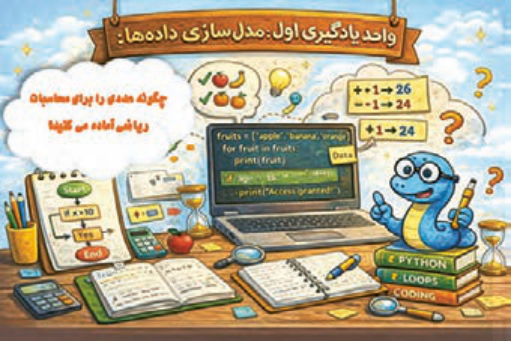

پایتون یک زبان برنامه‌نویسی مفسری است؛ به این معنا که کدها خط‌به‌خط توسط مفسر ترجمه و اجرا می‌شوند. این زبان از شیوه‌های برنامه‌نویسی رویه‌ای، شیءگرا و تابعی پشتیبانی می‌کند؛

می‌توان برنامه‌های پایتون را در قالب فایل‌هایی با پسوند `.py` در هر ویرایشگر متنی ایجاد کرد و سپس آنها را برای اجرا به مفسر پایتون ارسال نمود.

**شکل ۱**

برای شروع کدنویسی با پایتون (بعد از نصب پایتون آخرین نسخه) با استفاده از محیط `IDLE`، ابتدا منوی `Start` را باز کنید، سپس تایپ کنید `IDLE` یا `Python` `IDLE` و روی `IDLE` (`Python` `3.x`) کلیک کنید.

پنجره محیط تعاملی (پنجره `IDLE` `Shell`) باز می‌شود. در این پنجره از منوی `file`، یک فایل جدید ایجاد کنید. محیط ویرایشگر متنی پایتون باز شده و می‌توانید دستورات خود را در آن وارد کنید (شکل 2).

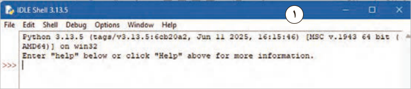

1

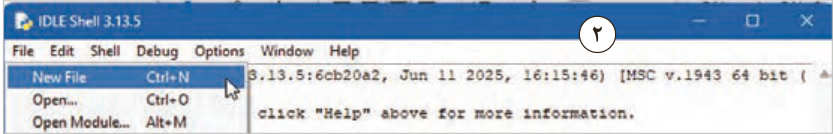

2

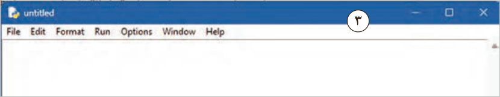

3

**شکل 2**


---

<!-- pdf-page: 10 | book-page: 4 -->

**صفحه ۴**

برای شروع کار، کد نوشته در شکل 3 را در ویرایشگر متنی پایتون وارد کنید و فایل را با کمک کلید ترکیبی `ctrl` + `s` با نام `hello.py` _ `prog01` در یک‌پوشه ذخیره کنید. در مرحله ذخیره‌سازی دقت کنید علاوه بر نام فایل باید مسیر ذخیره‌سازی فایل نیز با دقت تعیین شوند. توصیه می‌شود از قبل یک پوشه در یکی از درایو‌های `D:` یا `E:` با نام `PyProg` ایجاد و فایل‌های خود را در این پوشه ذخیره نمایید.

بهتر است نام فایل‌ها را با یک الگوی دلخواه ذخیره کنید. مثلاًً نام فایل اول که کلمه `hello` را چاپ می‌کند به‌صورت زیر باشد:

```
prog01_hello.py
```

و فایل دوم که برای کار با متغیر هاست به‌صورت زیر باشد.

```
prog02_variable
```

### نکته

به هیچ عنوان در نام فایل‌ها و پوشه‌ها از حروف فارسی استفاده نشود چرا که در آینده به مشکلات زیادی بر خواهید خورد.

مثلاً این نام کاملاً اشتباه است: سلام `.py`

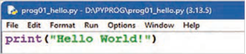

**شکل 3**

### نکته

پایتون از زبان فارسی پشتیبانی می‌کند؛ ولی حروف در آن به‌هم‌ریخته نشان داده می‌شوند. بهتر است از کاراکترهای انگلیسی در همه موارد استفاده کنید.

با استفاده از منوی `Run` دستور `Run` `Module` و یا با زدن کلید `F5` اولین برنامه ایجاد شده را اجرا کنید.

در برخی از لپ‌تاپ‌ها برای اجرای برنامه لازم است کلید ترکیبی `Fn+F5` را فشار دهید. (شکل 4)

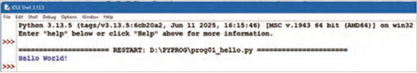

**شکل 4**


---

<!-- pdf-page: 11 | book-page: 5 -->

**صفحه ۵**

همان‌طور که در شکل 4 مشاهده می‌کنید، نتیجۀ اجرای این کد در پنجره `IDLE` `Shell` نمایش داده می‌شود. کدهای ساده را می‌توانید در محیط `IDLE` `Shell` تایپ کرده و با زدن کلید `Enter` آن را اجرا نمایید (شکل5). برای خروج از این محیط `exit`() و یا `Ctrl+d` را تایپ کنید و یا به سادگی پنجره را با زدن دکمه `Close` در بالای آن ببندید.

ساختار دستوری نوشتن کد (`syntax`) در پایتون:

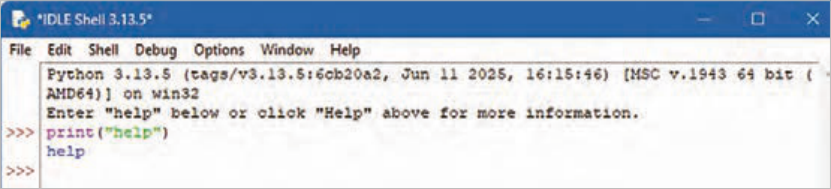

**شکل 5**

پایتون با هدف خوانایی بیشتر طراحی شده است و شباهت‌هایی با زبان انگلیسی دارد. همچنین از مفاهیم ریاضی نیز تأثیر پذیرفته است. برخلاف بسیاری از زبان‌های برنامه‌نویسی که برای پایان هر دستور از نقطه‌ویرگول (;) و پرانتز استفاده می‌کنند، پایتون از خطوط جدید برای تکمیل و جداسازی دستورات بهره می‌برد.

تورفتگی(`indent`)در پایتون: تورفتگی به فاصله‌هایی که در ابتدای یک خط کد قرار می‌گیرند، اشاره دارد. درحالی‌که در سایر زبان‌های برنامه‌نویسی، تورفتگی در کد فقط برای خوانایی است، در پایتون تورفتگی بسیار مهم است. پایتون از تورفتگی برای نشان‌دادن یک بلوک کد استفاده می‌کند.

اگر از تورفتگی صرف‌نظر کنید، پایتون به شما خطا می‌دهد. تعداد فاصله‌ها به‌عنوان یک برنامه‌نویس به شما بستگی دارد، رایج‌ترین استفاده چهار فاصله است، اما حداقل باید یکی باشد. باید از تعداد مساوی فاصله در یک بلوک کد استفاده کنید، در غیر این صورت پایتون به شما خطا می‌دهد (شکل 6). در خط5 از کد، بلوک دستور `if` که بعداً خواهید خواند، باید به اندازه یک `Tab` یا همان 4 فاصله به جلو برود. همان‌طور که مشاهده می‌شود پایتون اجرای برنامه را با یک خطا متوقف کرده است.

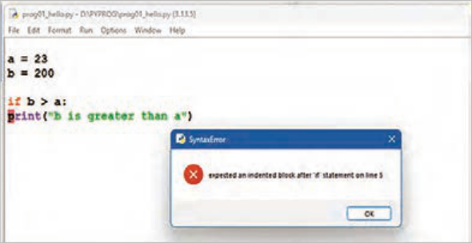

**شکل 6**


---

<!-- pdf-page: 12 | book-page: 6 -->

**صفحه ۶**

در کد زیر روش صحیح فاصله گذاری را مشاهده می‌کنید (شکل7).

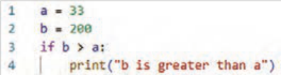

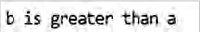

**شکل 7**

دستورات (`Statements`) در پایتون:

هر برنامۀ رایانه‌ای از مجموعه‌ای از دستورالعمل‌ها تشکیل شده است که باید توسط رایانه اجرا شوند. در زبان‌های برنامه‌نویسی، به این دستورالعمل‌ها، دستور یا `Statement` گفته می‌شود. به‌عنوان‌مثال، دستور زیر متن «`learning` `python` `is` `fun` » را روی صفحه‌نمایش چاپ می‌کند:

```
print(“learning python is fun! “)
```

وجود چندین دستور در برنامه: بیشتر برنامه‌های پایتون از چندین دستور پشت‌سرهم تشکیل می‌شوند.

رایانه این دستورات را به همان ترتیب که نوشته‌اید یکی پس از دیگری اجرا می‌کند. در نتیجه، ترتیب نوشتن دستورات در برنامه اهمیت دارد (شکل 8).

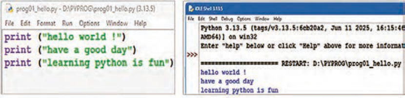

**شکل 8**

چاپ رشته‌های متنی در پایتون: پیش‌تر مشاهده شد که برای نمایش متن در خروجی برنامه، از تابع ()`print` استفاده می‌شود. در زبان پایتون، متن باید داخل گیومه قرار گیرد. برای این منظور می‌توان از کوتیشن تکی (' ') یا کوتیشن دوتایی (" ") استفاده کرد (شکل 9).

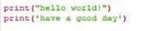

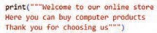

**شکل 9**


---

<!-- pdf-page: 13 | book-page: 7 -->

**صفحه ۷**

در پایتون از سه کوتیشن `Triple` `Quotes` (' ' ') یا (" " ") برای چاپ متن‌های چندخطی یا متنی که شامل کوتیشن است، استفاده می‌شود.

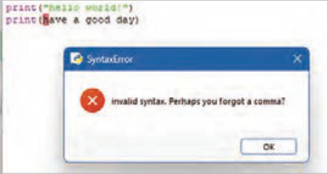

اگر فراموش کنید متن را داخل علامت نقل‌قول قرار دهید، پایتون خطایی صادر می‌کند (شکل 10).

**شکل10**

اگر می‌خواهید چندین کلمه را در یک خط چاپ کنید، می‌توانید از پارامتر `end` استفاده کنید (شکل 11).

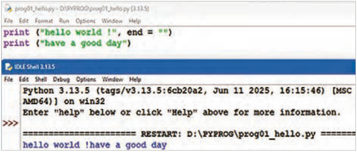

**شکل11**

چاپ اعداد در پایتون:

می‌توانید از تابع ()`print` برای نمایش اعداد صحیح یا اعشاری استفاده کنید (شکل 12).

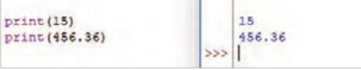

**شکل12**

می‌توانید عملیات ریاضی را درون آن انجام دهید.

همچنین در دستور `print` می‌توانید اعداد و متن را با هم ترکیب کنید (شکل 13).

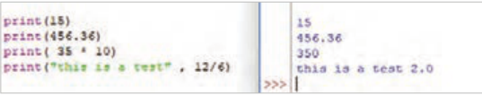

**شکل13**


---

<!-- pdf-page: 14 | book-page: 8 -->

**صفحه ۸**

### متغیر (variable) و انواع داده

متغیر، محلی از حافظه `RAM` است که برای ذخیره موقت داده استفاده می‌شود. در پایتون برای ایجاد متغیر نیازی نیست که ابتدا آن را تعریف (`declare`) و سپس مقداردهی (`initialize`) کنید؛ نوع داده به‌صورت خودکار تشخیص داده می‌شود (شکل14).

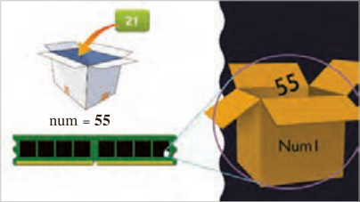

`num` = 55

کافی است که در سمت چپ عملگر انتساب یعنی " = " نام متغیر و در سمت راست آن، مقدارش را

```
بنویسید. name="baran" , num = 55
```

**شکل 14**

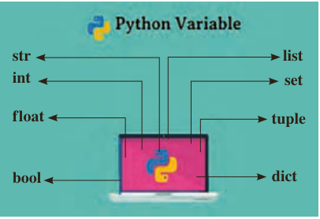

پایتون از انواع مختلفی از متغیرها پشتیبانی می‌کند (شکل 15).

`list`

`str`

پایتون از روی مقداری که به متغیر اختصاص داده

`int`

`set`

می‌شود، نوع آن را تشخیص می‌دهد.

```
f loat
```

`tuple`

مثال: `num1=15` در این مثال پایتون نوع متغیر را از نوع عدد صحیح تعیین می‌کند و نیازی به بیان نوع

`dict`

`bool`

متغیر هم نیست.

**شکل 15**

انواع داده پرکاربرد در پایتون نوع داده رشته‌ای (`str`): هر چیزی که متن باشد، مثل اسم، پیام، ایمیل، رمز عبور، شماره تلفن، توضیح، نوع داده رشته‌ای (`str`) است.

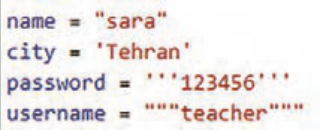

نوع داده `str` که اختصار یافته کلمه `string` است را می‌توانید با استفاده از علامت نقل‌قول تکی یا دوتایی

**شکل 16**

یا سه‌تایی تعریف کنید (شکل16).

نوع داده عدد صحیح (`int`): عددهایی که با آنها محاسبه انجام می‌دهید و اعشار ندارند همان عددهای صحیح (`int`) یا همان `integer`، هستند (شکل17).

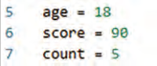

**شکل 17**


---

<!-- pdf-page: 15 | book-page: 9 -->

**صفحه ۹**

نوع داده عدد اعشاری (`folat`): این داده‌ها عددی هستند و در محاسبات ریاضی به کار گرفته م‌یشوند و دارای مقدار اعشاری هستند. مثل:

```
height = 1.75
```

تابع ()`type:` خروجی تابع `type`(), نوع داده هر متغیر می‌باشد (شکل18).

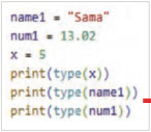

**شکل 18**

از این مرحله به بعد کدها را در محیط `VS` `Code` بنویسید. برای انجام این کار برنامه `VS` `Code` را اجرا کرده و سپس از منوی فایل دستور `new` `folder` یک‌پوشه جدید به نام `PyProg` ایجاد کنید و سپس در آن پوشه از منو فایل با انتخاب گزینه `New` `File`،


**شکل 19**

کادر `EXPLORER` انتخاب دکمه `New` `File` و یا کلید‌های ترکیبی `Ctrl+` `N` فایل جدیدی به نام `prog01.py` در این پوشه ایجاد کنید (شکل 19). حالا صفحه ویرایشگر کد باز شده و می‌توانید دستورات خود را در آن بنویسید.

برای اجرای دستورات از دکمه

در سمت راست‌بالای صفحه برنامه یا منوی `Run` استفاده کنید. نتیجه

اجرای برنامه در پایین صفحه، نمایش داده خواهد شد (شکل20).

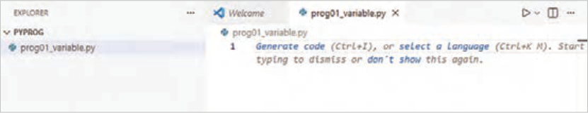

**شکل 20**

شیوه‌نامه نگارش پایتون (`PEP`) نحوه نگارش کدهای پایتون و قراردادهای کدنویسی را ارائه می‌دهد و باعث خوانایی بیشتر و تمیز (`clean`) شدن کدها می‌شود. برای مشاهده می‌توانید به `pep8.ir` مراجعه کنید.


---

<!-- pdf-page: 16 | book-page: 10 -->

**صفحه ۱۰**

### کنجکاوی

پس از مشاهده اصول `pep8` به سؤالات زیر پاسخ دهید:

1 حداکثر در یک خط چند کاراکتر می‌توان نوشت؟

2 تورفتگی‌ها چند کاراکتر باشد؟

3 آیا می‌توان در ابتدای یک خط از کاراکتر فاصله استفاده کرد؟

در `VSCode` پس از کدنویسی با فشار کلیدهای `Alt+Shift+F` به طور خودکار بیشتر مشکلات فرمت کد را بر اساس `pep8` اصلاح می‌کند. به‌شرط آنکه یکی از افزونه‌های `autopep8` ،`Black` `formatter` ، `Ruff` یا `yapf` نصب شده باشد.

قواعد نام‌گذاری متغیرها در پایتون نام متغیر نمی‌تواند شامل کاراکتر فاصله باشد. به طور مثال نمی‌توان متغیری با نام `is` `valid` تعریف کرد.

نام‌گذاری متغیرها در پایتون باید با یک حرف یا زیر خط آغاز شود. مثل (`_num` , `personl` ) نام متغیر می‌تواند شامل حروف، اعداد و زیر خط باشد.

نام متغیرها به حروف کوچک و بزرگ حساس است `Age` ،`age` و `AGE` سه متغیر متفاوت هستند.

نام متغیر نباید هیچ یک از کلمات کلیدی پایتون باشد. نام‌های `import`, `var`، `const`، `if`، `for` به‌عنوان نام متغیر اشتباه است. چون این کلمات از کلمات کلیدی پایتون هستند.

### نکته

کلمه کلیدی (`Keyword`) در پایتون به واژه‌هایی گفته می‌شود که خوِد زبان پایتون برای دستورها و ساختارهایش رزرو کرده است. این کلمات معنای از پیش تعریف‌شده دارند و به همین دلیل نمی‌توان از آنها به‌عنوان نام متغیر، تابع یا کلاس استفاده کرد.

### کنجکاوی

در پایتون روش‌های مختلفی برای تعیین نام متغیرهای چندکلمه‌ای وجود دارد. درباره آنها تحقیق کنید و در کلاس ارائه دهید.

عملگر (`operator`): نمادهای ویژه‌ای هستند که عملیات خاصی را روی مقادیر یا متغیرها انجام می‌دهند.

در این عبارات `a` + `b` یا `c` * `d` یا 4/2 به +، * و / عملگر (`operator`) گفته می‌شود.

عملوند (`operand`): مقدار یا مقدارهایی هستند که عملگرها روی آن کار می‌کنند. مثلاًً در عبارت `b+` `a` علامت "+" عملگر و `a` , `b` عملوند هستند.


---

<!-- pdf-page: 17 | book-page: 11 -->

**صفحه ۱۱**

عملوندهاِی عملگر " +" در پایتون می‌توانند، هر دو عددی یا هر دو رشته‌ای باشند که در این صورت در حالت اول، جمع ریاضی و در حالت دوم الحاق (`concatenation`) اتفاق می‌افتد (شکل21).

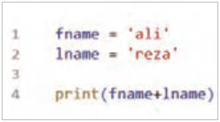

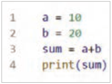

**شکل 21**

### کنجکاوی

درصورتی‌که در عملگر + یکی از عملوندها عددی و دیگری رشته‌ای باشد، چه اتفاقی می‌افتد؟

پروژه

پروژه آشپزباشی:

برنامه‌ای بنویسید که از درون لیست غذا، یکی را به‌تصادف انتخاب کند.

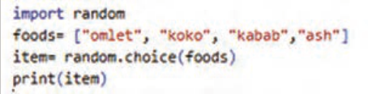

در خط اول کتابخانه `random` را به درون برنامه وارد (`import`) کنید تا بتواند در خط ۳ از متد `choice` برای انتخاب تصادفی استفاده کند.

در خط دوم شما می‌توانید لیست غذاهای محبوبتان را به لیست اضافه کنید و در منزل برای انتخاب غذا به مادر خود کمک کنید.

در خط سوم، از درون لیست `foods` یک غذا به تصادف انتخاب و درون متغیر `item` ذخیره می‌شود.

در خط چهارم، متغیر `item` که هم اکنون درون آن نام یک غذای تصادفی ذخیره است چاپ می‌شود.

به نظر شما برای اینکه شانس یک غذا در انتخاب تصادفی بیشتر شود چه تغییری در کد می‌توان اعمال کرد؟

پاسخ: در کد زیر با تکرار نام آش، شانس انتخاب آش بیشتر شده است.

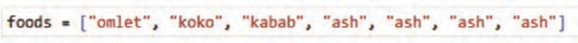


---

<!-- pdf-page: 18 | book-page: 12 -->

**صفحه ۱۲**

برخی از انواع عملگرها در پایتون:

جدول1 برخی از عملگرهای ریاضی را نشان می‌دهد که می‌توانید از آنها در انجام محاسبات ریاضی استفاده کنید.

**جدول 1**

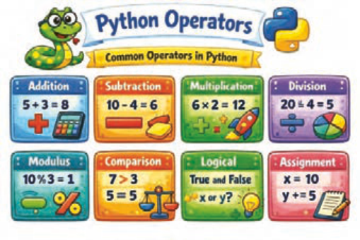

عملگر ریاضی عملگر

### کاربرد

+جمع -تفریق

*

ضرب

/

تقسیم %باقی مانده تقسیم

**شکل 22**

### کنجکاوی

در مورد انواع دیگر عملگرها تحقیق کنید و در کلاس ارائه دهید.

دستورات ورودی و خروجی:

دستور ()`print` : پیش‌تر گفته شد که دستور `print` برای نمایش خروجی استفاده می‌شود و با برخی از کاربردهای این دستور نیز آشنا شدید.

تابع ()`len` : گاهی لازم است بدانید یک متن چند کاراکتر دارد. این تابع تعداد کاراکترهای یک متن را محاسبه می‌کند (شکل23).

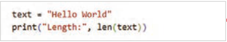

**شکل 23**

دستور()`input` : برای دریافت داده از کاربر و ذخیره در متغیر از دستور `input` استفاده می‌شود (شکل24).

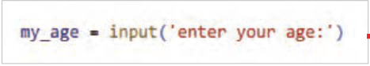

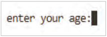

**شکل 24**


---

<!-- pdf-page: 19 | book-page: 13 -->

**صفحه ۱۳**

این دستور مقدار وارد شده از طریق صفحه‌کلید را به‌صورت رشته‌ای (`string`) دریافت می‌کند و خروجی آن یک مقدار رشته‌ای است (حتی اگر "عدد" وارد کرده باشید.) (شکل 25).

### فعالیت

متغیرهای `food`، `weighe` و `avg` را به ترتیب برای غذای موردعلاقه‌تان، وزن و معدل خود تعریف کنید. از ورودی برای هریک مقداری را دریافت کرده و سپس مقادیر را نمایش دهید و نوع هر یک را تعیین نمایید.

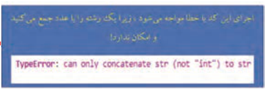

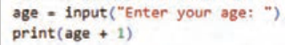

**شکل 25**

### تبدیل نوع داده (Type Casting) در پایتون

در برنامه‌نویسی پایتون گاهی لازم است نوع یک داده را به نوع دیگری تبدیل کنیم. به این کار تبدیل نوع داده یا `Type` `Casting` گفته می‌شود.

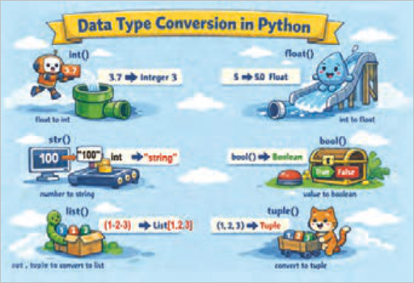

**شکل 26**

برای مثال، وقتی ورودی را با تابع ()`input` دریافت می‌کنید، مقدار واردشده به‌صورت رشته (`str`) ذخیره می‌شود. اگر بخواهید با آن محاسبات ریاضی انجام دهید، لازم است آن را به عدد تبدیل کنید.

پایتون برای تبدیل نوع داده، توابع آماده‌ای در اختیار برنامه نویس قرار داده است، مانند:

تبدیل به عدد صحیح → )(`int` تبدیل به عدد اعشاری → )(`float` تبدیل به رشته → )(`str` تبدیل به مقدار منطقی (درست/ نادرست`bool`() → )


---

<!-- pdf-page: 20 | book-page: 14 -->

**صفحه ۱۴**

مطابق شکل27 برای اینکه نوع داده را به نوع عددی تبدیل کنید می‌توانید به این صورت عمل کنید:

مثال: برنامه‌ای بنویسید که سن کاربر را دریافت و با یک پیغام مناسب نمایش دهد.

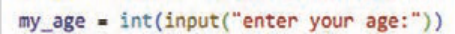

**شکل 27**

مثال: به این مثال دقت کنید.

بعد از اجرا، خطا را مشاهده خواهید کرد. چون عدد مستقیمًا به متن متصل شده است و این امکان‌پذیر نیست (شکل28).

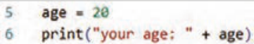


**شکل 28**

برای رفع این خطا لازم است، تبدیل نوع داده عددی به نوع داده رشته‌ای را به صورت زیر انجام دهید. پس از اجرا، کد خطایی مشاهده نخواهید کرد (شکل29).

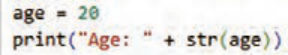

**شکل 29**

مثال: در خط1 کد مقابل سال تولد کاربر دریافت می‌شود، تابع `int` آن را به نوع عددی صحیح تبدیل و در متغیر `year` ذخیره می‌کند. در خط2 تفاضل عدد سال فعلی از سال تولد محاسبه و در متغیر `age` ذخیره می‌شود. در خط 3 با دستور `print` سن کاربر با پیغام `":your` `age` " نمایش داده می‌شود (شکل30).

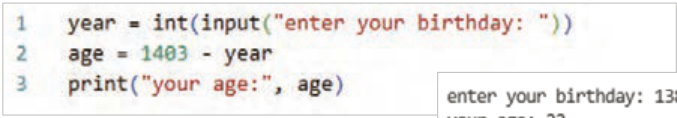

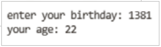

**شکل 30**


---

<!-- pdf-page: 21 | book-page: 15 -->

**صفحه ۱۵**

مثال: مقدار متغیر `price` عددی از نوع صحیح است. در خط 2 برای تبدیل آن به یک عدد اعشاری از تابع `float` استفاده شده است (شکل31).

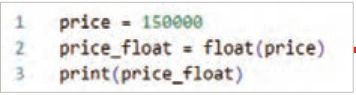

**شکل 31**

مثال: تابع `input` وزن را به‌صورت یک مقدار عددی دریافت می‌کند و خروجی آن یک مقدار متنی است که تابع `float` آن را به نوع عدد اعشاری تبدیل و در متغیر`weight` ذخیره می‌کند. در خط بعد دستور `print` دو رشته را با عملگر " + " به هم الحاق می‌کند (شکل32).

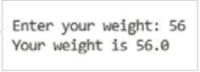

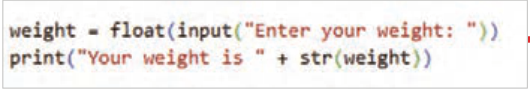

**شکل 32**

مشاهده می‌کنید که در این خط تابع `str` بار دیگر متغیر `weight` را به نوع متنی تبدیل کرده است.

مثال: محاسبه قیمت کالا پس از اعمال ۹درصد مالیات بر ارزش افزوده (شکل33).

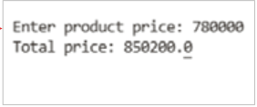

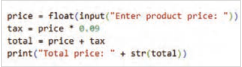

**شکل 33**

### فعالیت

اندازه قد کاربر را به‌صورت یک عدد اعشاری گرفته و مشابه پیام زیر را نمایش دهید.

```
.Your height: 1.75 meters
```

### فعالیت

برای راه‌اندازی یک فروشگاه هوشمند، مراحل زیر را انجام دهید.

دریافت نام مدیر فروشگاه از ورودی دریافت سال شروع فعالیت فروشگاه تبدیل نوع داده ورودی‌ها نمایش پیام خوشامدگویی


---

<!-- pdf-page: 22 | book-page: 16 -->

**صفحه ۱۶**

```
لیست (list):
```

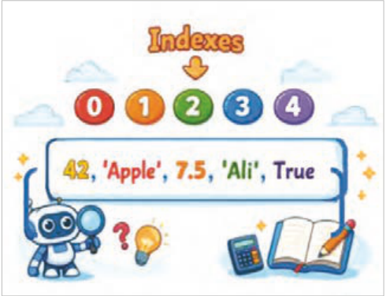

لیست‌ها یکی از ۴ نوع داده در پایتون هستند که برای ذخیرۀ مجموعه‌ای از داده‌ها در یک متغیر واحد استفاده می‌شوند، ۳ نوع دیگر `Set` ، `Tuple` و `Dictionary` هستند که هر کدام کاربردهای متفاوتی دارند.

ایجاد لیست: لیست‌ها با استفاده از

```
کروشه‌ها (Square brackets)"[]" ایجاد
```

می‌شوند.

**شکل 34**

در کد مقابل یک لیست شامل رشته‌ای از نام میوه‌ها ایجاد شده است. `]"fruits` = `["apple"`, `"banana"`, `"cherry` دستور مقابل یک لیست شامل اعداد 1 و 2 و 3 و 4 و 5 را ذخیره می‌کند. `]numbers` = [1, 2, 3, 4, 5

ویژگی‌های لیست: `Mixed` `data` لیست انواع مختلف داده را می‌تواند نگهداری کند. در کد زیر یک لیست که انواع داده متفاوت عددی، رشته‌ای، بولین و اعشاری و حتی لیست دیگر را در خود ذخیره می‌کند، ایجاد شده است (شکل35).

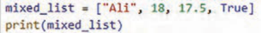

**شکل 35**

`Indexed:` عناصر لیست دارای ایندکس (`Index`) هستند؛ یعنی هر عنصر یک شماره دارد و اولین عنصر لیست دارای اندیس صفر است (شکل36).

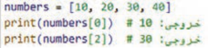

**شکل 36**


---

<!-- pdf-page: 23 | book-page: 17 -->

**صفحه ۱۷**

با ایندکس می‌توان به عناصر لیست دسترسی داشت (شکل37).

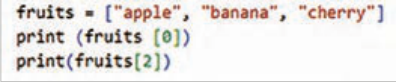

**شکل 37**

`Mutable:` لیست قابلیت تغییر دارد؛ یعنی بعد از ایجاد لیست، می‌توان عناصر آن را ویرایش، حذف یا اضافه کرد.

در این مثال عنصر دوم لیست که اندیس آن[1] و مقدارش `"banana"` است به `"oranges"` تغییر داده شده است.

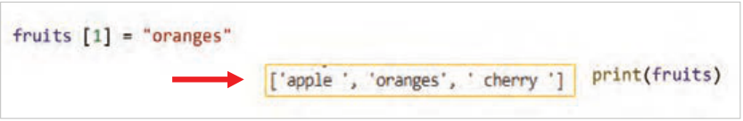

**شکل 38**

`Ordered:` لیست‌ها دارای ترتیب مشخص هستند: عناصر لیست به همان ترتیبی که وارد می‌شوند، ذخیره می‌گردند و این ترتیب تغییر نمی‌کند، مگر برنامه‌نویس آن را تغییر دهد.

عوامل مؤثر در ویژگی `Ordered:`

الف حفظ ترتیب ورود عناصر: همان‌طور که در مثال مشاهده می‌کنید عناصر دقیقًا به همان ترتیبی که وارد شده‌اند، نمایش داده می‌شوند (شکل 39).

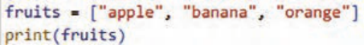


**شکل 39**

ب تأثیر ترتیب در نمایش عناصر لیست: اگر ترتیب تغییر کند، ایندکس‌ها هم تغییر می‌کنند (شکل40).


**شکل 40**


---

<!-- pdf-page: 24 | book-page: 18 -->

**صفحه ۱۸**

ج تغییر ترتیب عناصر: در این مثال فقط عنصر اول تغییر کرد، بقیه سر جای خود ماندند ← یعنی ترتیب مشخص است (شکل41).


**شکل 41**

د مقایسه دو لیست با ترتیب متفاوت: در این مثال با اینکه عناصر یکی هستند، چون ترتیب متفاوت است، دو لیست برابر نیستند (شکل42).


**شکل 42**

### فعالیت

1 لیستی با ۵ عنصر " `headset` ،`book` ،`mouse` ،`phone` ،`book` " ایجاد کنید و آن را نمایش دهید.

سپس به‌جای عنصر شماره 4 یک عنصر به نام " `External` `HDD` " را جایگزین کنید و نتیجه را نمایش دهید.

2 لیستی با ۴ عنصر عددی دلخواه ایجاد کنید و سپس عنصر اول آن را نمایش دهید.

3 لیستی ایجاد کنید که ۶ عنصر داشته باشد که نام ماشین‌های موردعلاقه و سال تولید آنها را ذخیره کند. سپس این لیست را نمایش دهید.

افزودن عنصر جدید به لیست: با استفاده از متد ()`append` می‌توانید عنصر جدیدی را به انتهای لیست اضافه کنید (شکل 43).


**شکل 43**


---

<!-- pdf-page: 25 | book-page: 19 -->

**صفحه ۱۹**

در پایتون برای افزودن یک عنصر بعد از یک عنصر مشخص در لیست، از متد ()`insert` استفاده کنید.

```
list_name. insert (index, value)
```

### نکته

برای شنیدن تلفظ صحیح این کلمه به آدرس زیر مراجعه کنید.

```
https://dictionary.cambridge.org/dictionary/english/insert
```

مثال: لیست وظایف زیر را در نظر بگیرید:

```
]"tasks = ["Study", "Exercise", "Sleep
```

وظیفه `"Break"` را بین `"Exercise"` و `"Sleep"` اضافه کنید. لیست را نمایش دهید (شکل44).


**شکل 44**

### فعالیت

برنامه‌های بنویسید که در لیست `fruit` که شامل 2 نوع میوه است قیمت هر میوه را بعد از نام آن اضافه کرده و آن را نمایش دهد.


حذف عنصر از لیست:

در پایتون برای حذف عناصر از یک لیست (`list`) روش‌های مختلفی وجود دارد. انتخاب روش مناسب به این بستگی دارد که بخواهیم بر اساس مقدار حذف کنیم یا بر اساس موقعیت (اندیس).

**شکل 45**


---

<!-- pdf-page: 26 | book-page: 20 -->

**صفحه ۲۰**

1 حذف عنصر با مقدار: متد ()`remove` برای حذف مقدار یک عنصر از لیست است. اولین عنصری که همان مقدار را داشته باشد، حذف می‌شود.

```
list_name.remove(value)
```

مثال ۱: این برنامه با استفاده از متد ()`remove` مقدار 12 را از لیست `scores` حذف کرده است (شکل46).


**شکل 46**

مثال 2: این برنامه با استفاده از متد ()`remove` مقدار اولین 20 را از لیست `numbers` حذف کرده است (شکل47).


**شکل 47**

2 حذف عنصر با ایندکس (`index`): متد ()`pop` برای حذف عنصر با ایندکس مشخص شده استفاده می‌شود.

```
list_name.pop(index)
```

مثال: در این برنامه ایندکس با شماره یک، یعنی دومین عنصر لیست حذف شده است (شکل48).

### نکته

دقت کنید اولین عضو لیست دارای اندیس صفر می‌باشد.


**شکل 48**


---

<!-- pdf-page: 27 | book-page: 21 -->

**صفحه ۲۱**

اگر داخل متد ()`pop` چیزی نوشته نشود، آخرین عنصر لیست حذف می‌شود. در کد زیر لیست `food` سه عنصر دارد (شکل49).


**شکل 49**

در خط 2 متد ()`pop` چیزی نوشته نشده است؛ پس آخرین عنصر لیست یعنی `"kabab"` حذف می‌شود.

اجرای برنامه این موضوع را تأیید می‌کند.

### فعالیت

لیست کارها شامل `]"tasks` = `["Study"`, `"Exercise"`, `"Rest"`, `"Sleep` است. برنامه‌ای بنویسید که آخرین کار را از لیست حذف کند.

### کنجکاوی

تحقیق کنید اگر درون متد `pop` عدد 1- بیاید کدام عنصر حذف می‌شود؟ سایر اعداد منفی چطور؟

مثلاً:

```
(1-)food.pop
```

### کنجکاوی

متد ()`clear` و دستور `del` نیز برای حذف عناصر لیست کاربرد دارند. در مورد نحوه کاربرد آنها تحقیق کنید و در کلاس ارائه دهید.

ساختارهای شرطی:


ساختار شرطی به برنامه این امکان را می‌دهد که بر اساس برقرار بودن یا نبودن یک شرط، تصمیم‌گیری کند و مسیر اجرای دستورات را تغییر دهد.

در این ساختار، ابتدا یک شرط بررسی می‌شود و سپس، در صورت درست بودن آن، مجموعه‌ای از دستورات اجرا می‌گردد.

**شکل 50**


---

<!-- pdf-page: 28 | book-page: 22 -->

**صفحه ۲۲**

دستور `if` :

در زبان پایتون، دستور `if` ساده‌ترین و پرکاربردترین ابزار برای پیاده‌سازی ساختار شرطی است. این دستور یک عبارت منطقی را ارزیابی می‌کند که نتیجۀ آن می‌تواند `True` یا `False` باشد. اگر نتیجۀ شرط `True` باشد، بلوک کد مربوط به آن اجرا می‌شود و در غیر این صورت، این بلوک کد اجرا نخواهد شد.

### نکته

دستورات مربوط به ساختار شرطی باید با یک `tab` (چند فاصلۀ معادل) نسبت به خط دستور `if` جلوتر نوشته شوند. این تورفتگی مشخص می‌کند که کدام دستورات به‌شرط مربوط هستند.

نوع اول ساختارشرطی`if` :

```
:if condition
statement
```

**جدول 2**

شرط (`condition`): عبارتی منطقی است که نتیجۀ آن

```
True یا False است.
```

عملگر مقایسه‌ای عملگر

### کاربرد

دستورات (`statements`): دستوراتی هستند که فقط در

==

صورت درست بودن شرط اجرا می‌شوند.

مساوی است

= !

مساوی نیست

تورفتگی (`Indentation`): این دستورات باید با یک `tab` نسبت به دستور `if` جلوتر نوشته شوند.

<

بزرگ‌تر از

عملگرهای مقایسه‌ای (`Comparison` `Operators`): این

کوچک‌تر از

>

عملگرها برای مقایسه دو مقدار یا دو متغیر استفاده

= >بزرگ‌تر یا مساوی

می‌شوند و نتیجه آنها همیشه یکی از دو مقدار `True` یا

= <کوچک‌تر یا مساوی

`False` است (جدول2).

عملگر مساوی (==): برای مقایسه دو مقدار یا دو تا متغیر استفاده می‌شود تا مشخص شود برابر هستند یا نه.

مثال: برنامه‌ای بنویسید که نام کاربر را دریافت کند. اگر نام واردشده برابر با مقدار `admin` باشد، پیام "!`welcome` `admin"` را نمایش دهد (شکل 51).


**شکل 51**


---

<!-- pdf-page: 29 | book-page: 23 -->

**صفحه ۲۳**

عملگر (=!): مقایسه می‌کند آیا دو مقدار نامساوی هستند یا نه؟

در برنامه زیر در ابتدا `price` = 120 است و شرط درصورتی‌که مقدار آن نامساوی با ۱۰۰ باشد برقرار شده و پیام `"price` `is` `not` `true"` را چاپ می‌کند (شکل52).


**شکل 52**

عملگرهای منطقی (`Logical` `Operators`)

**جدول 2**

در برنامه‌نویسی، برای بررسی هم‌زمان چند شرط و تصمیم‌گیری

عملگرهای منطقی

دقیق‌تر از عملگرهای منطقی استفاده می‌شود. این عملگرها

عملگر

### کاربرد

امکان ترکیب چند عبارت شرطی را فراهم می‌کنند و نتیجۀ آنها معمولاً یکی از دو مقدار درست (`True`) یا نادرست (`False`)

`and`و

است (جدول3).

`or`یا

عملگرهای منطقی معمولاً در کنار دستورات شرطی مانند `if` به

`not`نقیض

کار می‌روند و به برنامه‌نویس کمک می‌کنند شرایط پیچیده‌تری را بررسی کند.

1 عملگر `and:` این عملگر زمانی نتیجۀ درست (`True`) می‌دهد که تمام شرط‌ها درست باشند.

مثال: در این مثال با استفاده از عملگر منطقی `and` هم زمان دو شرط `"username` == `"admin` و `"password` == "1234 بررسی شده است و اگر کاربر هر دو را درست وارد کند پیام `login` `successful` نمایش داده می‌شود. برنامه را نوشته و اجرا کنید (شکل53).


**شکل 53**


---

<!-- pdf-page: 30 | book-page: 24 -->

**صفحه ۲۴**

2 عملگر `or:` این عملگر زمانی نتیجۀ درست (`True`) می‌دهد که حداقل یکی از شرط‌ها درست باشد.

اگر هر دو شرط نادرست باشند، نتیجه نادرست خواهد بود.

مثال: در این برنامه شرط با عملگر `or` بررسی می‌شود؛ یعنی اگر کاربر نام روز `Friday` یا `Thursday` را وارد کند، پیام `Holiday` نمایش داده می‌شود (شکل54).


**شکل 54**

### فعالیت

با راهنمایی هنرآموز محترم خود کدهای زیر را توضیح دهید.


نوع دوم ساختار شرطی `if` – `else` :

```
: if condition
statements_if
```

`:else`

```
statements_else
```

ساختار `if-else` زمانی استفاده می‌شود که بخواهید در صورت درست بودن شرط، یک کار و در غیر این صورت کار دیگری انجام شود.

`condition:` عبارتی منطقی که نتیجۀ آن `True` یا `False` است.

`statements_if:` دستوراتی که در صورت درست بودن شرط اجرا می‌شوند.

`else:` به معنی در غیر این صورت است. زمانی که شرط درست نباشد، برنامه وارد بخش `else` می‌شود و کدهای آن اجرا می‌گردد.

`statements_else:` دستوراتی که در صورت نادرست بودن شرط اجرا می‌شوند.


---

<!-- pdf-page: 31 | book-page: 25 -->

**صفحه ۲۵**

مثال: برنامه‌ای بنویسید که روزهای هفته را دریافت کرده و درصورتی‌که جمعه باشد، پیام " `you` `are` `off"` و در غیر این صورت `"you` `have` `to` `go` `to` `school"` نمایش داده شود.

به نظر شما اشکال کد شکل55 چیست؟ اگر کاربر عبارتی غیر از روزهای هفته وارد کند چه پیغامی چاپ می‌شود؟


**شکل 55**

مثال: برنامه‌ای بنویسید که اعداد مابین ۰ و ۱۰ را دریافت کند، اگر عدد دریافت شده در این بازه بود، پیام `"The` `number` `is` `valid"` و در غیر این صورت پیام `"The` `number` `is` `not` `valid"` نمایش داده شود.

در این مثال دو شرط به طور هم‌زمان بررسی می‌شود (شکل56).


**شکل 56**

### فعالیت

برنامه‌ای بنویسید که نمره درس ریاضی و زبان کاربر را دریافت و اگر هر دو بزرگ‌تر یا مساوی 17 باشد، پیام " شما می‌توانید در رشته شبکه و نرم‌افزار ثبت‌نام کنید " را نمایش دهد و در غیر این صورت پیام" شما مجاز به انتخاب رشته نیستید " را نمایش دهد.

### فعالیت

برنامه‌ای بنویسید که سن کاربر و وضعیت عضویت او را دریافت کند. اگر سن کاربر بزرگ‌تر یا مساوی 18 باشد و عضو سایت باشد، پیام " `Access` `allowed"` را نمایش دهد: و در غیر این صورت پیام " `Access` `denied"` را نمایش دهد.


---

<!-- pdf-page: 32 | book-page: 26 -->

**صفحه ۲۶**

مثال: برنامه‌ای بنویسید که کاربر وضعیت اتصال اینترنت و سرعت اینترنت را وارد کند، اگر وضعیت اتصال `"yes"` و سرعت " بزرگ‌تر یا مساوی3 " وارد شد، پیام " `Internet` `is` `connected` " چاپ شود و در غیر این صورت پیام `"Internet` `is` `disconnect"` چاپ شود (شکل57).


**شکل 57**

مثال: برنامه‌ای بنویسید که اگر کاربر مهمان `"guest"` نبود، پیام "!`Welcome"` نمایش داده شود و در این صورت پیام `"Access` `denied"` نمایش داده شود.

`not` مقدار `Boolean` شرط را نقض می‌کند (شکل 58).


**شکل 58**

ترکیب دو عملگر `and` و `or:` در برنامه‌نویسی گاهی نیاز است بیش از یک شرط را با هم بررسی کرد.

برای این کار می‌توان عملگرهای منطقی `and` و `or` را با هم ترکیب کرد.

مثال: برنامه‌ای بنویسید که نام کاربری و رمز عبور را دریافت کند و اگر نقش کاربر `"teacher"` یا `"admin"` بود و رمز واردشده برابر با "1234" باشد. پیام `"Access` `allowed"` و در غیر این صورت پیام `"Access` `denied"` چاپ شود (شکل 59).


**شکل 59**


---

<!-- pdf-page: 33 | book-page: 27 -->

**صفحه ۲۷**

### فعالیت

برنامه‌ای بنویسید که یک کاربر تنها در صورتی اجازه ورود داشته باشد که:

نام کاربری وارد شده باشد و (رمز عبور صحیح باشد یا کد تأیید فعال) باشد.

مثال: مطمئن شدن از نامعتبر بودن یک مقدار: در این مثال با عملگر مقایسه‌ای =! به معنای نابرابری، برنامه نوشته شده و اگر نام کاربری وارد شده نامساوی با `"guest"` باشد، از ورود او با پیغام مناسب جلوگیری می‌شود. برنامه را اجرا و نتیجه را با داده‌های مختلف بررسی کنید (شکل60).


**شکل 60**

مثال: در این برنامه عملگر < برای بررسی شرط بیشتر بودن نمره هنرجو در دروس پودمانی از عدد 12 استفاده شده است. برنامه را اجرا و نتیجه را با داده‌های مختلف بررسی کنید (شکل61).


**شکل 61**

مثال: در این برنامه عملگر > برای بررسی محدودیت سنی زیر ۱۸ سال برای ورود به سایت استفاده شده است. برنامه را اجرا و نتیجه را با داده‌های مختلف بررسی کنید (شکل62).


**شکل 62**


---

<!-- pdf-page: 34 | book-page: 28 -->

**صفحه ۲۸**

مثال: در این برنامه محدودیت تعداد سفارش کالا با عملگر => مورد بررسی قرار گرفته است که تنها به تعداد ۵ یا کمتر از ۵ را شامل می‌شود. برنامه را اجرا و نتیجه را با داده‌های مختلف بررسی کنید (شکل63).


**شکل 63**

مثال: در این برنامه محدودیت پایه تحصیلی 11 برای ورود به سیستم پیشرفته با عملگر = < برقرار شده است.

برنامه را اجرا و نتیجه را با داده‌های مختلف بررسی کنید (شکل64).


**شکل 64**

مثال: در این برنامه شرط ورود به مرحله دوم مسابقه سن حداقل ۱۸ و امتیاز حداقل 70 در نظر گرفته شده است. برنامه با عملگرهای مقایسه =< به معنی بزرگ‌تر مساوی و عملگر منطقی `and` به معنی " و " نوشته شده است. نتیجه عملگر `and` زمانی `True` است که هر دو عبارت

و

هر دو

`True` باشند. برنامه را اجرا و نتیجه را با داده‌های مختلف بررسی کنید (شکل65).


**شکل 65**


---

<!-- pdf-page: 35 | book-page: 29 -->

**صفحه ۲۹**

مثال: در این برنامه عملگر منطقی `or` بین دو عبارت قرار گرفته است و شرط را برای برقراری یکی از عبارات بررسی می‌کند. نتیجه آن زمانی `true` است که یکی از عبارات دو طرف `or` درست باشد. برنامه را اجرا و نتیجه را با داده‌های مختلف بررسی کنید (شکل66).


**شکل 66**

### فعالیت

برنامه‌ای بنویسید که سن و نام کشور کاربر را دریافت کند و درصورتی‌که سن بزرگ‌تر یا مساوی ۱۸ باشد و نام کشور ایران بود، پیغام "اجازه ثبت‌نام دارید" نمایش دهد.

نوع سوم ساختار شرطی `if` – `elif`– `else` :

این ساختار زمانی استفاده می‌شود که چند شرط مختلف وجود داشته باشد و برنامه باید یکی از آنها را انتخاب کند. `elif` شرط جدید را در صورت برقرار نبودن شرط‌های قبلی بررسی می‌کند، یعنی اگر یکی از شرط‌های `if` یا `elif`ها برقرار شود و دستور آن اجرا شود دیگر شرط سایر `elif`ها بررسی نخواهد شد. `elif` مخفف `else` `if` است و برای بررسی شرط‌های بعدی استفاده می‌شود. تفاوت بین `else` و `elif` این است که بعد از `else` هیچ شرطی نوشته نمی‌شود.

ساختار کلی `if` – `elif` – `else:`

```
:if condition1
statements1
:elif condition2
statements2
```

`:else`

```
statements_else
```


---

<!-- pdf-page: 36 | book-page: 30 -->

**صفحه ۳۰**

مثال: برنامه‌ای بنویسید که سطح بازی را از ورودی دریافت و سپس بر اساس آن پیامی مناسب نمایش دهد.

برنامه را نوشته، اجرا و نتیجه را با داده‌های مختلف بررسی کنید (شکل67).


**شکل 67**

مثال: برنامه‌ای بنویسید که پس از دریافت نوع غذا و نوشیدنی از کاربر در آن موارد زیر بررسی شود:

اگر پیتزا و نوشیدنی انتخاب شود ← قیمت 140000 اگر پیتزا بدون نوشیدنی← قیمت 120000 در غیر این صورت ← پیام«`Other` `option`» چاپ شود. در این مثال استفاده از عملگر منطقی `and` در شرط، مورداستفاده قرار گرفته است. برنامه را نوشته و اجرا کنید (شکل68).


**شکل 68**

مثال: دستورات زیر وضعیت دستگاه را از کاربر دریافت می‌کند و بر اساس آن پیام مناسب را نمایش می‌دهد.

برنامه زیر را اجرا و نتیجه را بررسی کنید (شکل69).


خروجی

**شکل 69**


---

<!-- pdf-page: 37 | book-page: 31 -->

**صفحه ۳۱**

مزیت استفاده از ساختار `if-elif-else` نسبت به استفاده از چند `if` مجزا این است که اگر شرطی برقرار باشد، دیگر شرط‌های بعدی توسط برنامه بررسی نمی‌شوند. این ویژگی باعث افزایش سرعت اجرای برنامه و بهینه‌تر شدن عملکرد آن می‌شود.

### فعالیت

فروشنده برای خریداران میوۀ سیب تخفیف گذاشته است. برنامه‌ای بنویسید که نام میوه و تعداد خرید را از کاربر بگیرد: اگر میوه `apple` و تعداد حداقل ۵، پیام `"Discount` `applied"` نمایش داده شود.

در غیر این صورت پیام `"No` `discount"` نمایش داده شود.

### فعالیت

برنامه‌ای بنویسید که کاربر سن خود را وارد کند. برنامه باید موارد زیر را بررسی کند:

اگر سن کاربر بین ۱۸ تا ۲۵ سال باشد پیام `"Welcome`, `young` `adult"` نمایش داده شود.

اگر سن کاربر بزرگ‌تر یا برابر ۲۶ باشد پیام `"Welcome`, `adult"` نمایش داده شود.

اگر سن کاربر کمتر از ۱۸ باشد پیام `"You` `are` `underage"` نمایش داده شود.

### فعالیت

برنامه‌ای بنویسید که از دستور `if` , `elif` با دریافت وضعیت سفارش از فروشنده استفاده کند و بر اساس وضعیت سفارش (`Delivered` `/Sent` `/Registered`) در فروشگاه اینترنتی، نحوه ارسال کالا با پیا‌مهایی مناسب اعلام شود:

```
Your order has been successfully delivered - Your order is on the way - Your order
.is being processed - Status unknown
```

### فعالیت

برنامه‌ای بنویسید که امتیاز دانش‌آموز را به‌صورت یک عدد صحیح مابین ۱ تا ۱۰۰ دریافت کند.

اگر امتیاز ≥ ۹۰← پیام `"exelent"` اگر امتیاز بین ۶۹ تا ۹۰← پیام `"good"` اگر امتیاز بین ۵۰ تا ۶۹← پیام `"pass"` اگر امتیاز < ۵۰ ← پیام `"fail"` را نمایش دهد.

مثال: برنامه‌ای بنویسید که اگر مقدار `choice` یکی از گزینه‌های زیر بود، پیام مناسب را چاپ کند و در غیر این صورت پیام `Food` `not` `available` نمایش داده شود (شکل70).

الف) منوی غذا شامل دو گزینه زیر است:


`Pizza`

```
burger
```


**شکل70**


---

<!-- pdf-page: 38 | book-page: 32 -->

**صفحه ۳۲**

ب) برنامه را گسترش دهید که اگر منوی غذا شامل سه گزینه زیر باشد: (شکل71)

`pizza`

```
burger
```

`pasta`


**شکل 71**

در مثال بالا اگر منو 20 غذا داشته باشد چه می‌شود؟ یا اگر فردا غذا جدید اضافه شود چه؟ اولین راه‌حلی که به نظر می‌رسد این‌است که از تعداد بیشتری `if` استفاده شود. ولی این کار، کد را طولانی‌تر و سخت‌تر می‌کند. اما راه حل آن استفاده درست از لیست‌ها و دستورات حلقه‌های تکرار است.

حلقه‌های تکرار (`Loop`):

در هنگام کدنویسی، اگر نیاز باشد یک دستور یا مجموعه‌ای از دستورات چندین بار اجرا شود، از ساختارهای حلقه‌های تکرار استفاده می‌شود. این ساختارها باعث می‌شوند کدها خواناتر، کوتاه‌تر و خواناتر و مدیریت آن آسان‌تر شود.


به‌عنوان‌مثال، اگر لازم باشد برنامه‌ای نوشته شود که کلمۀ `python` را ۱۰ بار چاپ کند، به‌جای آنکه دستور (`'python'`(`print` ده بار به صورت جداگانه نوشته شود، می‌توان این دستور را تنها یک‌بار داخل یک حلقه قرارداد تا اجرای آن به‌صورت خودکار ده بار تکرار شود.

**شکل 72**


---

<!-- pdf-page: 39 | book-page: 33 -->

**صفحه ۳۳**

در زبان برنامه‌نویسی پایتون، برای پیاده‌سازی حلقه‌های تکرار دو ساختار اصلی وجود دارد:

1 حلقۀ `for`

2 حلقۀ `while`

حلقۀ `for` : برای تکرار اجرای دستورات روی یک دنباله (مانند لیست، رشته، توپل، مجموعه و دیکشنری) استفاده می‌شود و معموًلا زمانی به کار می‌رود که تعداد تکرارها از قبل مشخص یا قابل‌تعیین باشد.

ساختار کلی حلقۀ `for` در زبان پایتون به شکل زیر است:

```
:for variable in sequence
statements
```

در این ساختار:

`variable` متغیری است که در هر تکرار، مقدار یکی از عناصر دنباله را دریافت می‌کند.

نام متغیر می‌تواند دلخواه باشد؛ مثلاًً (`i`, `count`, `num`, `student`…) `sequence` یک دنباله مانند لیست، رشته، توپل، مجموعه یا دیکشنری است.

`statements` مجموعه دستوراتی در بدنه حلقه هستند که در هر بار تکرار، اجرا می‌شوند. به این دستورات اصطلاحًا بلاک حلقه گفته می‌شود و بایستی به اندازه یک `tab` تورفتگی داشته باشند.

پیمایش لیست‌ها مثال ۱: کد زیر عناصر یک لیست شامل سه‌رنگ (`red`, `blue`, `green`) را چاپ می‌کند (شکل73).


**شکل 73**

توضیح کد: در خط اول، یک لیست حاوی نام سه‌رنگ به‌صورت رشته‌ای تعریف شده است.

در خط دوم، دستور `for` عناصر لیست را به ترتیب پیمایش کرده و هر عنصر را در متغیر `item` قرار می‌دهد.

مثال 2: نمایش سبد خرید، در این برنامه، ابتدا لیستی با نام `shopping_cart` ایجاد شده و کالاهای خریداری‌شده در آن ذخیره می‌شوند. سپس عناصر موجود در لیست با استفاده از حلقه `for` چاپ می‌شوند.

برنامه را اجرا و نتیجه را مشاهده کنید (شکل74).


**شکل 74**


---

<!-- pdf-page: 40 | book-page: 34 -->

**صفحه ۳۴**

توضیح کد: در خط اول، یک لیست حاوی نام کالاهای خریداری شده به‌صورت رشته‌ای تعریف شده است.

دومین خط، یک پیغام مناسب را قبل از ورود به حلقه چاپ می‌کند.

در خط سوم، دستور `for` عناصر لیست را به ترتیب پیمایش کرده و هر عنصر را در متغیر `item` قرار می‌دهد.

در خط پایانی، یک پیغام حاوی نام تک‌تک عناصر لیست چاپ می‌شود.


پیمایش رشته‌ها مثال: چاپ حروف کلمه `python` (شکل75)


**شکل 75**

توضیح کد: در هر بار اجرای حلقه، یکی از حروف رشتۀ `python` در متغیر `ch` قرار گرفته و همان مقدار در داخل حلقه چاپ می‌شود.

نمونه‌هایی از کاربرد حلقۀ `for` مثال ۱: برنامۀ زیر برای شمارش تعداد عناصر یک لیست با استفاده از حلقۀ `for` نوشته شده است (شکل76).


**شکل 76**

توضیح کد: در خط اول، یک لیست حاوی نام چند میوه به‌صورت رشته‌ای تعریف شده است.

در خط دوم، متغیر `count` با مقدار اولیه صفر ایجاد می‌شود.

در خط سوم، حلقۀ `for` عناصر لیست را به ترتیب پیمایش کرده و هر عنصر را در متغیر `fruit` قرار می‌دهد.

در خط چهارم، به‌ازای هر بار اجرای حلقه، یک واحد به متغیر `count` افزوده می‌شود. دو دستور زیر معادل هستند.

```
count + = 1
count = count + 1
```

در خط پایانی، مقدار نهایی `count` چاپ می‌شود. توجه داشته باشید که این خط خارج از حلقه قرار دارد.


---

<!-- pdf-page: 41 | book-page: 35 -->

**صفحه ۳۵**

### فعالیت

در پایتون یک تابع آماده برای انجام کد صفحه قبل وجود دارد؛ در مورد آن تحقیق کنید.

مثال 2: اگر هدف، شمارش تعداد یک عنصر خاص (برای مثال، تعداد `apple`) درون حلقه باشد، می‌توانید با استفاده از دستور شرطی `if` برنامه را به‌صورت زیر تغییر دهید (شکل77).


**شکل 77**

توضیح کد: در خط چهارم، دستور `if` بررسی می‌کند که آیا مقدار `fruit` با مقدار `apple` برابر است یا خیر؟

درصورتی‌که شرط فوق برقرار باشد، یک واحد به متغیر `count` افزوده می‌شود.

### فعالیت

لیست‌ها دارای یک متد برای انجام کد بالا هستند؛ در مورد آن تحقیق کنید.

استفاده از تابع ()`range:` تا اینجا، از حلقۀ `for` برای پیمایش عناصر موجود در لیست‌ها و رشته‌ها استفاده شده است.

در برخی موارد، لازم است یک دستور به تعداد دفعات مشخصی تکرار شود، بدون آنکه از قبل لیستی از مقادیر در اختیار باشد.

در چنین شرایطی، از تابع `range` استفاده می‌شود.

تابع ()`range` یک دنباله از اعداد تولید می‌کند که از مقدار `start` آغاز شده و با گام‌هایی که در `step` مشخص می‌شود، تا قبل از مقدار `stop` ادامه می‌یابد.

`Start:` (اختیاری و پیش‌فرض)

```
:)start, stop, step( for counter in range
```

`Stop:` (اجباری) است و خود آن انجام نمی‌شود.

دستورات بدنه حلقه

`Step:` (اختیاری) پیش‌فرض آن یک است.

**شکل 78**


---

<!-- pdf-page: 42 | book-page: 36 -->

**صفحه ۳۶**

اولین حالت: در ساده‌ترین حالت، تابع () `range` تنها یک عدد دریافت می‌کند که به‌صورت `range`(`stop`) نوشته می‌شود. به مثال زیر توجه کنید:


مثال: حلقه‌ای برای چاپ اعداد 0 تا ۴ (شکل79).


**شکل 79**

توضیح کد: مقدار شروع (`start`) به طور پیش‌فرض صفر است و گام (`step`) نیز به طور پیش‌فرض مقدار یک را دارد. مقدار پایان (`stop`) عدد ۵ در نظر گرفته شده و خود این عدد در خروجی تولید نمی‌شود.

تابع (5)`range` دنباله‌ای از اعداد ۰ تا ۴ را تولید می‌کند. حلقۀ `for` به تعداد ۵ بار اجرا می‌شود. متغیر `i` در هر تکرار مقدار یکی از این اعداد را دریافت می‌کند. در خط دوم، در هر بار اجرا مقدار متغیر `i` چاپ می‌شود.

دومین حالت: استفاده از تابع به‌صورت `range`(`start`, `stop`) خواهد بود.

مثال: حلقه‌ای برای چاپ اعداد از ۱ تا 6 (شکل80).


**شکل 80**

توضیح کد: مقدار شروع (`start`) درون دستور `range`، یک است.

مقدار پایان حلقه (`stop`) عدد 7 است؛ ولی خود عدد 7 در نظر گرفته نخواهد شد. تابع `range` دنبالۀ اعداِد از ۱ تا 6 را تولید می‌کند.

گام (`step`) نیز به طور پیش‌فرض برابر یک است.

در حالت سوم، تابع `range` سه عدد دریافت می‌کند که به‌صورت `range`(`start`, `stop`, `step`) نوشته می‌شود. به مثال زیر توجه کنید:

مثال: حلقه‌ای برای چاپ اعدادِ زوج کوچک‌تر از 10 (شکل81).


**شکل 81**


---

<!-- pdf-page: 43 | book-page: 37 -->

**صفحه ۳۷**

توضیح کد: مقدار شروع (`start`) در دستور `range` برابر با صفر است.

مقدار پایان (`stop`) عدد ۱۰ در نظر گرفته شده است، اما خود این عدد در خروجی تولید نمی‌شود. مقدار گام (`step`) برابر با 2 است.

تابع `range` دنباله‌ای از اعدادِ زوج از 0 تا ۸ را تولید می‌کند.

### فعالیت

برنامۀ قبل را به‌گونه‌ای تغییر دهید که دنبالۀ اعداد زوج را از بزرگ به کوچک چاپ کند. برای این منظور، لازم است مقدار `step` منفی شود و مقادیر شروع (`start`) و پایان (`stop`) نیز متناسب با آن تغییر داده شوند.

### فعالیت

برنامه‌ای بنویسید که مدت‌زمان انتظار برای دریافت غذا را به‌صورت یک عدد (بر حسب دقیقه) از کاربر دریافت کرده و شمارش معکوس را نمایش دهد.

در هر مرحله، پیام زیر چاپ شود:

```
Time remaining: X minutes
```

که در آن، به‌جای `X` مقدار زمان باقی‌مانده نمایش داده می‌شود.

پس از رسیدن مقدار شمارش به صفر، پیام زیر نمایش داده شود.

```
!Your food is ready
```

### فعالیت

برنامه‌ای بنویسید که قد ۵ نفر را از ورودی دریافت کند و میانگین قد آنها را محاسبه و نمایش دهد.

استفاده از کاراکتر زیرخط (_ ) در نام متغیرها مجاز است؛ بنابراین می‌توان از آن به‌تنهایی نیز به‌عنوان نام یک متغیر استفاده کرد.


کد شکل82 را مشاهده کنید.

**شکل 82**

در این مثال، از متغیر شمارندۀ حلقه در بدنۀ حلقه استفاده نشده است؛ بنابراین می‌توان به‌جای آن از کاراکتر زیرخط (_) استفاده کرد. استفاده از _ نشان می‌دهد که مقدار متغیر موردنظر در ادامۀ برنامه استفاده نخواهد شد.

### کنجکاوی

بررسی کنید که استفاده از _ به‌جای استفاده از نام متغیر چه مزایایی دارد؟


---

<!-- pdf-page: 44 | book-page: 38 -->

**صفحه ۳۸**

معرفی دستورات کنترلی (`break` و `continue`) در حلقه‌ها در زبان پایتون، دستورات کنترلی `break` و `continue` برای کنترل جریان اجرای حلقه‌ها استفاده می‌شوند.

`continue:` برای رد شدن از یک بخش خاص از حلقه و رفتن به تکرار بعدی استفاده می‌شود.

`break:` اجرای حلقه را به طور کامل متوقف کرده و از آن خارج می‌شود.

مثال: برنامه زیر را نوشته و اجرا کنید. در این برنامه، نام تمام غذاهای موجود در یک لیست، هر کدام در یک خط چاپ می‌شوند. (شکل83)


**شکل 83**

حال اگر بخواهید هنگام چاپ، نام یک غذای خاص (برای مثال، `soup`) نمایش داده نشود، می‌توان از دستور `continue` درون حلقه استفاده کرد. کد زیر را با دقت نوشته و اجرا کنید و هنگام نوشتن برنامه به تورفتگی‌ها (`Indentation`) توجه داشته باشید (شکل84).


**شکل 84**

توضیح کد: در خط `"soup"` == `if` `item`، بررسی می‌شود که آیا مقدار متغیر `item` با مقدار `soup` برابر است یا خیر.

در صورت برقرار بودن شرط `if`، دستور `continue` اجرا شده می‌شود و باعث می‌شود حلقه بلافاصله به سراغ عنصر بعدی برود که `"ash"` است. به همین دلیل، در خروجی برنامه نام `soup` چاپ نمی‌شود.

به‌طورکلی، با استفاده از دستور `continue`، حلقه اجرای بخشی از کد درون حلقه را برای تکرارهای خاصی نادیده م‌یگیرد و مستقیماً به ابتدای تکرار بعدی وارد می‌شود.


---

<!-- pdf-page: 45 | book-page: 39 -->

**صفحه ۳۹**

حال اگر بخواهید هنگام چاپ، با رسیدن به نام یک غذای خاص (برای مثال، `soup`) پیغام مشخصی چاپ شده و اجرای حلقه خاتمه یابد، می‌توان از دستور `break` درون حلقه استفاده کرد. کد زیر را بنویسید و اجرا کنید. هنگام نوشتن برنامه به تورفتگی‌ها (`Indentation`) توجه داشته باشید (شکل85).


**شکل 85**

توضیح کد: در خط سوم، بررسی می‌شود که آیا مقدار متغیر `item` با مقدار `soup` برابر است یا خیر.

در صورت برقرار بودن شرط `if`، ابتدا پیام "سوپ که غذا نیست!" چاپ می‌شود و سپس دستور `break` اجرا شده و کنترل اجرای برنامه به بعد از حلقه منتقل می‌شود. در این حالت، اجرای حلقه به طور کامل متوقف شده و تکرارهای بعدی انجام نخواهند شد (شکل86).

حال دو برنامه زیر را نوشته و اجرا کنید.


**شکل 86**

### کنجکاوی

با توجه به خروجی برنامه‌های بالا کاربرد کلمات `break` و `continue` را برای هر یک از برنامه‌ها بیان کنید.


---

<!-- pdf-page: 46 | book-page: 40 -->

**صفحه ۴۰**

حلقه `while` این حلقه مجموعه‌ای از دستورات را تا زمانی که شرط حلقه `True` باشد، اجرا می‌کند و هر زمان که شرط حلقه `False` شود، دیگر حلقه اجرا نمی‌شود و اجرای حلقه پایان می‌یابد. از این نوع حلقه معمولاً زمانی استفاده می‌شود که تعداد دفعات تکرار حلقه از قبل مشخص و معین نباشد.


**شکل 87**

```
: while condition یا : شرط حلقه while
```

`statements` → دستورات بدنه حلقه

مثال: شخصی در ابتدای یک تالار غذاخوری به میهمانان یک مراسم عروسی خوشامد می‌گوید. به او گفته شده که آنجا بایستد و بعد از پرسیدن نام آنها به میهمان وارد شده خوشامد بگوید و برای پایان کار او محدودیتی در نظر گرفته نشده است. برنامه زیر به کمک حلقه `while` این کار را انجام می‌دهد (شکل88).


**شکل 88**

توضیح کدهای برنامه: در جلوی دستور `while` به‌جای‌گذاشتن یک شرط خاص فعلاً از عبارت منطقی `True` استفاده شده است. با این کار حلقه بی‌وقفه تکرار می‌شود و پایانی برای توقف آن تعریف نشده است؛

چرا که شرط جلوی `while` همیشه `True` است و هیچ‌گاه `False` نمی‌شود.

در دو خط بعد نام میهمان پرسیده می‌شود و پیام خوشامدگویی چاپ خواهد شد.

باتوجه به اینکه پایانی برای اجرای برنامه وجود ندارد، برای توقف برنامه یا باید از کلیدی ترکیب `Ctrl` + `C` استفاده نمود و یا باید پنجره برنامۀ در حال اجرا را بست.

مثال: آیا می‌توان برنامه فوق را طوری نوشت که بعد از ورود داماد، وظیفه خوشامدگویی پایان یابد؟


---

<!-- pdf-page: 47 | book-page: 41 -->

**صفحه ۴۱**

توضیح کد: همان‌طور که در خروجی کد شکل89 مشاهده می‌شود، بعد از ورود ناِم داماد، برنامه پایان می‌یابد.


**شکل 89**

درون حلقه پس از دریافت نام میهمان به کمک شرط `if` بررسی می‌شود که آیا نام وارد شده برابر `damad` است یا خیر و اگر برابر باشد به کمک دستور `break`، روند اجرای حلقه خاتمه می‌یابد و اجرای برنامه به بعد از حلقه `while` منتقل می‌شود.

مثال: در این تالار به‌جز میهمانان، کارمندان (`Employee`) نیز در حال رفت و آمدند، حال اگر نخواهید به کارمندان خوشامد گفته شود می‌توان از یک دستور شرطی و دستور `continue` استفاده نمود.

توضیح کد: همان‌طور که در خروجی کد شکل90 مشاهده می‌شود، بعد از ورود نام `Employee`، برنامه دوباره یک نام دیگر از کاربر دریافت می‌کند و به کارمند خوشامد گفته نخواهد شد. خروجی برنامه را به‌دقت ببینید.


**شکل 90**

برنامه با رسیدن به دستور `continue` اجرای مابقی دستورات حلقه را رها کرده و اجرای برنامه را به ابتدای حلقه منتقل می‌کند.

این برنامه گرچه به‌خوبی کار می‌کند؛ اما این ساختار، به خاطر وجود `True` در جلوی `while` برای برنامه‌نویسی خیلی مناسب نیست و می‌توان ساختار حلقه را به‌صورت مثال بعد تغییر داد.

مثال: به مسئول خوشامدگویی گفته شده که این کار را تا زمانی ادامه دهد که داماد نیامده است؛ کد به‌صورت زیر تغییر می‌کند.

دقت کنید که در این مثال شرط ادامه حلقه در جلوی دستور `while` آمده است و نیازی نیست که داخل حلقه چیزی را کنترل کنید.


---

<!-- pdf-page: 48 | book-page: 42 -->

**صفحه ۴۲**

توضیح کد: همان‌طور که در خروجی کد شکل91 مشاهده می‌شود، بعد از ورود نام داماد و خوشامدگویی به او برنامه پایان می‌یابد.


**شکل 91**

در اولین خط یک متغیر به نام `name` ساخته شده است و مقدار آن خالی است تا شرط حلقه در ابتدا برقرار باشد.

مفهوم خط دوم، یعنی تا زمانی که نام وارد شده یعنی مقدار متغیر (`name`) مخالف کلمه `damad` است، دستورات بدنه حلقه ادامه یابد.

وقتی کاربر کلمه `damad` را وارد کند بعد از چاپ پیام، برنامه به ابتدای حلقه بر می‌گردد؛ ولی این بار شرط حلقه `False` است و اجرای حلقه پایان می‌پذیرد. در اینجا نسبت به برنامه قبلی، کد بهتر و منطقی‌تر شده است.

مثال: به مسئول خوشامدگویی گفته شده است که آنجا بایستد و بعد از پرسیدن نام آنها به میهمان وارد شده خوش آمد بگوید و به‌محض ورود داماد وظیفه خوشامدگویی پایان می‌پذیرد؛ اما دیگر نیازی نیست به داماد خوش آمد گفته شود. کد بالا کمی تغییر خواهد کرد.

توضیح کد: در شکل92 در اولین خط به‌جای آنکه یک رشته خالی را درون متغیر `name` قرار دهیم، با کمک دستور `input` یک نام واقعی از کاربر گرفته شده است. بدین ترتیب اگر در اولین خط برنامه نام `damad` وارد شود، شرط حلقه `False` شده و دستورات بدنه حلقه دیگر اجرا نخواهند شد و برنامه پایان می‌یابد.


**شکل 92**

درون حلقه ابتدا خوشامدگویی چاپ شده است و در خط بعدی نامی دیگر دریافت خواهد شد تا در دور بعدی این نام درون شرط حلقه بررسی شود.

### نکته

مثال‌های بالا همگی برای یادگیری نحوه استفاده از حلقه `while` در شرایط مختلف به برنامه‌نویس کمک می‌کند. با نوشتن مجدد کدها و فکرکردن به روند هر یک از برنامه‌های فوق، برنامه‌نویس مطالب آن را دقیق‌تر یاد می‌گیرد. برای یادگیری بهتر به مثال‌های صفحه بعد توجه کنید.


---

<!-- pdf-page: 49 | book-page: 43 -->

**صفحه ۴۳**

مثال: برنامه‌ای بنویسید که از کاربر یک عدد صحیح دریافت و مربع آن عدد را چاپ کند این کار تا زمانی ادامه یابد که کاربر عددی بزرگ‌تر از صفر وارد کند (شکل93).


**شکل 93**

توضیح کد: در اولین خط یک عدد صحیح از کاربر دریافت شده و درون متغیر `number` قرار می‌گیرد.

مفهوم شرط `while:` یعنی تا زمانی که مقدار متغیر `number` بزرگ‌تر از صفر است دستورات حلقه، تکرار خواهد شد.

داخل حلقه ابتدا با یک پیغام مناسب، عدد گرفته شده و مربع (یعنی توان دو) آن چاپ خواهد شد و در ادامه یک عدد دیگر از کاربر گرفته می‌شود.

اگر در اولین خط برنامه مقداری کوچک‌تر یا مساوی صفر وارد شود، شرط حلقه `False` شده و دستورات بدنه حلقه دیگر اجرا نخواهند شد و برنامه پایان می‌یابد. دقت شود که در این مثال، مربع عددِ صفر و یا عدِد منفی چاپ نمی‌شود.

### فعالیت

برنامه بالا را طوری تغییر دهید که علاوه بر مربع عدد، مکعب (`Cube`) عدد (یعنی توان ۳ عدد) نیز چاپ شود.

مثال: برنامه‌ای بنویسید که نام تعدادی غذا را از کاربر گرفته و به یک لیست خالی اضافه (`append`) کند.

این کار تا زمانی ادامه می‌یابد که کاربر کلمه `exit` را وارد کند. پس از اتمام حلقه محتوای لیست به‌صورت یک‌جا چاپ خواهد شد (شکل94).


**شکل 94**


---

<!-- pdf-page: 50 | book-page: 44 -->

**صفحه ۴۴**

توضیح کد: در اولین خط، یک لیست خالی ایجاد شده است.

همانند مثال‌های قبلی ابتدا نام یک غذا را بگیرید درون متغیر `food` ذخیره کنید.

مفهوم شرط `while:` یعنی تا زمانی که مقدار متغیر `food` مخالف رشته `"exit"` است دستورات حلقه، تکرار خواهد شد.

داخل حلقه ابتدا نام غذای گرفته می‌شود؛ به کمک متد `append` به انتهای لیست اضافه می‌شود و در ادامه نام یک غذای دیگر از کاربر گرفته می‌شود.

در آخرین خط و بیرون از بدنه حلقه، محتویات کامل لیست غذا چاپ می‌شود.


دقت کنید که آخرین خط نباید یک `tab` به جلو رود و بایستی دقیقاً زیر ستون `while` نوشته شود.


مثال: به کد زیر دقت کنید. این کد اعداد یک تا پنج را به کمک حلقه `for` زیر هم چاپ می‌کند (شکل95).

**شکل 95**

حال اگر بخواهید همین کار را به کمک حلقه `while` انجام دهید، کد آن می‌تواند به‌صورت کد شکل96 باشد.

توضیح کد: در اولین خط، متغیر `i` با مقدار پیش‌فرض یک، مقداردهی شده است.

همانند مثال‌های قبلی ابتدا نام یک غذا را گرفته درون متغیر `food` ذخیره کنید.


مفهوم شرط `while:` یعنی تا زمانی که مقدار متغیر `i` کوچک‌تر از

6 است دستورات حلقه، تکرار خواهد شد. داخل حلقه ابتدا مقدار متغیر `i` چاپ شده است. در آخرین خط و درون حلقه به متغیر، یک واحد افزوده شده است.

**شکل 96**

همان‌طور که مشاهده می‌شود ساختار حلقه `while` برای حلقه‌های با تعداد تکرار معین پیچیده‌تر و نیازمند دقت بیشتر است. ازاین‌رو به برنامه‌نویسان توصیه می‌شود قبل از شروع به کدنویسی به این موضوع فکر کنند که طبق صورت‌مسئله موجود، بهتر است از کدام نوع حلقه استفاده کنند.

نکات مهمی که از حلقه `while` فرا می‌گیرید:

در این نوع حلقه‌ها از قبل نمی‌دانید چند بار تکرار لازم است؛ یعنی حلقه تا زمانی که شرط برقرار است، ادامه دارد.

تکرار وابسته به یک شرط است که شرط می‌تواند مقایسه، ورودی کاربر یا وضعیت برنامه باشد.

پایان کار را کاربر یا یک اتفاق مشخص، تعیین می‌کند. پس حلقه تا رسیدن به شرط پایان ادامه می‌یابد.

برای کنترل حلقه و پیشگیری از اجرای بی‌نهایت، لازم است قبل از شروع حلقه، متغیر حلقه، مقداردهی اولیه شود.


---

<!-- pdf-page: 51 | book-page: 45 -->

**صفحه ۴۵**

درون حلقه می‌توان از `break` برای خاتمه اجرای حلقه استفاده کرد.

درون حلقه می‌توان از `continue` برای بازگشت به ابتدای حلقه و اجرای دوباره آن استفاده کرد.

دستورات `break` و `continue` باید به همراه یک شرط `if` درون حلقه‌ها استفاده شوند.

برای پیاده‌سازی حلقه‌های با تعداد معین می‌توان از حلقه‌های `while` نیز استفاده نمود؛ اما این کار توصیه نمی‌شود؛ چرا که نوشتن این‌گونه برنامه‌ها با حلقه `for` ساده‌تر و منطقی‌تر است.

### فعالیت

در مثال قبلی و در انتهای برنامۀ بالا به کمک حلقۀ `for` تک‌تک غذاهای لیست را زیر هم چاپ کنید.

### فعالیت

برنامه‌ای بنویسید که کاربر بتواند به‌صورت مکرر سفارش غذا دهد، تا زمانی که `"done"` را وارد کند.

هر بار که غذای جدیدی از کاربر گرفته شد پیام `".Your` `order` `for` `<food>` `has` `been` `added"` نمایش داده شود و غذای جدید به لیست سفارش غذا اضافه (`append`) شود. وقتی کاربر `"done"` را وارد نمود، برنامه تمام سفارش‌ها را نمایش دهد.


---

<!-- pdf-page: 52 | book-page: 46 -->

**صفحه ۴۶**

### ارزشیابی شایستگی مد‌لسازی داده

استاندارد عملکرد: هنرجو بتواند داده‌ها را در پایتون تعریف و مدیریت کند ، عملیات پایه را روی داده‌ها انجام دهد،ازساختارهای شرطی و حلقه‌ها استفاده کند و داده‌ها را به صورت سازمان یافته پردازش کند.

نمره

شرایط انجام کار (ابزار،مواد، تجهیزات،

ابزارهای

نتایج

ردیف

مرا حل کار

استاندارد (شاخص‌ها/داوری/نمره دهی)

کسب

زمان، مکان و ...)

### ارزشیابی

ممکن شده

نصب پایتون و یک محیط توسعه (`IDE`) مناسب روی رایانه شخصی یا استفاده از محیط‌های آنلاین. اجرای برنامه‌های ساده در محیط `IDLE` نوشتن اولین دستور ()`.print` درک تفاوت بین خط فرمان و اجرای فایل.

3

دریافت یک قطعه کد پایتون با خطاهای سینتکسی یا تورفتگی و اصلاح آن.

انجام کار با روش‌های دیگر انجام کنجکاوی‌ها

مقدمات و شروع کار با

رایانه، `vscode` نصب‌شده، مرورگر، 15 دقیقه، مشاهده

۱ اجرای برنامه‌های ساده در محیط `.IDLE`

1

پایتون

کارگاه

عملی

۲ نوشتن اولین دستور ()`.print`

۳ درک تفاوت بین خط فرمان و اجرای فایل.

2

4 دریافت یک قطعه کد پایتون با خطاهای سینتکسی یا تورفتگی و اصلاح آن.

عدم انجام و یا انجام ناقص مرحله کاری1 نوشتن کدی که در آن چند متغیر با انواع داده مختلف (رشته، عدد صحیح، عدد اعشار) تعریف شده و مقادیر آنها در ادامه استفاده شود. نوشتن کدی که یک نوع داده را به نوع دیگری تبدیل کند و از آن در محاسبات استفاده کند.

3

جواب دادن به سوالات تستی یا تشریحی در مورد نام‌گذاری صحیح متغیرها، تفاوت انواع داده، و زمان استفاده از تبدیل نوع.4 انجام کار با روش‌های دیگر انجام کنجکاوی‌ها

متغیرها، انواع داده و

رایانه، `vscode` نصب‌شده، فایل تمرینی،

مشاهده

2

تبدیل نوع

15دقیقه

عملی نوشتن کدی که در آن چند متغیر با انواع داده مختلف (رشته، عدد صحیح، عدد اعشار) تعریف شده و مقادیر آن‌ها در ادامه استفاده شود. نوشتن کدی که یک نوع داده را به نوع دیگری تبدیل کند و از آن در محاسبات استفاده

2

کند. جواب دادن به سوالات تستی یا تشریحی در مورد نام‌گذاری صحیح متغیرها، تفاوت انواع داده، و زمان استفاده از تبدیل نوع.

عدم انجام و یا انجام ناقص مرحله کاری1 نوشتن برنامه‌ای که از عملگرهای ریاضی (جمع، تفریق، ضرب، تقسیم) و شاید مقایسه‌ای استفاده کند.

نوشتن برنامه‌ای که از کاربر اطلاعاتی (دریافت کند و سپس یک خروجی سفارشی نمایش دهد.

3

حل یک مسئله ساده که نیاز به ترکیب ورودی، پردازش با عملگرها و نمایش خروجی دارد (مثلاً محاسبه مساحت مستطیل با دریافت طول و عرض از کاربر).

انجام کارها با روش‌های دیگر انجام کنجکاوی ها مشاهده نوشتن برنامه‌ای که از عملگرهای ریاضی (جمع، تفریق، ضرب، تقسیم) و

3عملگرها و ورودی/خروجی

رایانه، `vscode` نصب‌شده، 15دقیقه

عملی شاید مقایسه‌ای استفاده کند. نوشتن برنامه‌ای که از کاربر اطلاعاتی (دریافت کند و سپس یک خروجی سفارشی نمایش دهد. حل یک مسئله ساده

2

که نیاز به ترکیب ورودی، پردازش با عملگرها و نمایش خروجی دارد (مثًلا محاسبه مساحت مستطیل با دریافت طول و عرض از کاربر).

عدم انجام و یا انجام ناقص مرحله کاری1


---

<!-- pdf-page: 53 | book-page: 47 -->

**صفحه ۴۷**

ایجاد یک لیست، اضافه کردن آیتم جدید به آن، حذف یک آیتم، و نمایش محتوای لیست. نوشتن یک کد با استفاده از `else`، `elif`، `if` یک تصمیم‌گیری انجام شود.

ترکیب شرط‌ها با استفاده از `and`, `or`, `not` برای پیاده‌سازی منطق‌های

3

پیچیده‌تر.

ساخت یک برنامه ساده که لیست و شرط را ترکیب کند انجام کنجکاوی‌ها انجام کارها با روش‌های دیگر

ساختارهای داده پایه

مشاهده

4

رایانه، `vscode` نصب‌شده، 20 دقیقه

(لیست) و شرطی

عملی ایجاد یک لیست، اضافه کردن آیتم جدید به آن، حذف یک آیتم و نمایش محتوای لیست نوشتن یک کد با استفاده از `else`، `elif`، `if` یک تصمیم‌گیری انجام شود.

2

ترکیب شرط‌ها با استفاده از `and`, `or`, `not` برای پیاده‌سازی منطق‌های پیچیده‌تر.

ساخت یک برنامه ساده که لیست و شرط را ترکیب کند.

عدم انجام و یا انجام ناقص مرحله کاری1 نوشتن کدی که روی عناصر یک لیست یا کاراکترهای یک رشته پیمایش کرده و هر کدام را چاپ کند. استفاده از تابع ()`range` در حلقه `for` برای اجرای یک دستور به تعداد مشخص یا پیمایش اعداد در یک بازه.

3

نوشتن برنامه‌ای که با استفاده از حلقه `for` کاری تکراری را انجام دهد انجام کنجکاوی‌ها انجام کار با چند روش مشاهده

5

حلقه‌های تکرار: `for`

رایانه، `vscode` نصب‌شده، 25 دقیقه

عملی نوشتن کدی که روی عناصر یک لیست یا کاراکترهای یک رشته پیمایش کرده و هر کدام را چاپ کند. استفاده از تابع ()`range` در حلقه `for` برای

2

اجرای یک دستور به تعداد مشخص یا پیمایش اعداد در یک بازه.

نوشتن برنامه‌ای که با استفاده از حلقه `for` کاری تکراری را انجام دهد عدم انجام و یا انجام ناقص مرحله کاری1 نوشتن برنامه‌ای که تا زمانی که یک شرط برقرار است، ادامه یابد نوشتن کدی که در آن از `break` برای خروج از حلقه و از `continue` برای رد شدن از یک تکرار خاص استفاده شود. حل یک مسئله که نیاز به ترکیب

3

هوشمندانه حلقه‌ها (`for` یا `while`) و دستورات شرطی دارد. انجام کنجکاوی‌ها انجام کار با چند روش

حلقه‌های تکرار و دستورات

مشاهده

6

رایانه، `vscode` نصب‌شده، 25 دقیقه

کنترلی `while`

عملی

۱ نوشتن برنامه‌ای که تا زمانی که یک شرط برقرار است، ادامه یابد نوشتن کدی که در آن از `break` برای خروج از حلقه و از `continue` برای رد

2

شدن از یک تکرار خاص استفاده شود. حل یک مسئله که نیاز به ترکیب هوشمندانه حلقه‌ها (`for` یا `while`) و دستورات شرطی دارد..

عدم انجام و یا انجام ناقص مرحله کاری1

شایستگی‌های غیر فنی، ایمنی،

احراز همه شایستگی‌های غیرفنی2

بهداشت، توجهات زیست محیطی و نگرش:

عدم احراز هریک از شایستگی‌های غیرفنی1 بلی

ارزشیابی کار (شایستگی انجام کار)

خیر

### توضیحات:

1 معیار شایستگی انجام کار:

کسب حداقل نمره 2 از مراحل 1، 2 و 3 (مراحل بحرانی) کسب حداقل نمره 2 از بخش شایستگی‌های غیر فنی، ایمنی، بهداشت، توجهات زیست‌محیطی و نگرش کسب حداقل میانگین 2 از مراحل کار

2 تعریف سطوح شایستگی: صرف‌نظر از اینکه یک تکلیف کاری در چه سطحی از صلاحیت حرفه‌ای انجام می شود، در هر محیط کاری ممکن است انجام هر کار با کیفیت مشخصی مورد انتظار باشد. سطح شایستگی انجام کار، معیار اساسی ارزشیابی است.

مهارت (سطح سه): ماهر و قادر به آموزش و هدایت دیگران، توانایی برنامه‌ریزی و تحلیل، پاسخ‌گویی در برابر کارهای خود، سروکار داشتن با سطح وسیعی از کارها و فعالیت‌ها تسلط (سطح چهار): خبرگی در انجام کار و آموزش دیگران، ایجاد نوآوری، سازگاری، عیب‌یابی، هدایت و راهنمایی دیگران.
