# کار با توابع و ماژول ها


---

<!-- pdf-page: 54 | book-page: 48 -->

**صفحه ۴۸**

## واحد یادگیری 2

## کار با توابع و ماژول ها

### آیا تابه‌حال اندیشیده‌اید

اگر بخواهید یک مجموعه از اعداد بدون تکرار بسازید، یا ترتیب داده‌ها را حفظ کنید و تغییرناپذیر باشد، از چه نوع داده‌ای استفاده می‌کنید؟

فرض کنید می‌خواهید اطلاعات یک دانش‌آموز مثل نام، سن و نمرات او را ذخیره کنید و سریع به هر مورد دسترسی داشته باشید، چه ساختار داده‌ای مناسب است؟

اگر بخواهید یک عمل خاص را چند بار در برنامه استفاده کنید، بدون اینکه کد را تکرار کنید، چه راهی وجود دارد؟

چگونه می‌توانید در یک تابع تعداد زیادی داده را پردازش کنید یا عملیات تکراری انجام دهید، بدون اینکه کد طولانی شود؟

چگونه می‌توانید از کدهای آماده دیگران استفاده کنید؟ چه تفاوتی بین تابع و متد وجود دارد؟

### در پایان از هنرجو انتظار می‌رود

1 مجموعه‌ها و توپِل‌ها را تعریف کند، عناصر آنها را اضافه یا حذف کند و کاربرد هریک را بداند.

2 دیکشنری بسازد، کلید و مقدار اضافه کند، داده‌ها را با کلیدها بازیابی کند و کاربرد دیکشنری را در ذخیره‌سازی اطلاعات بداند.

3 هنرجو قادر باشد توابع ساده بنویسد، پارامترها و آرگومان‌ها را استفاده کند و مقدار بازگشتی تابع را دریافت و به کار ببرد.

4 هنرجو بتواند توابع پیچیده‌تری بنویسد، از حلقه‌ها در توابع استفاده کند و عملیات تکراری را در توابع مدیریت کند.

5 ماژول‌ها را وارد کند، توابع و کلاس‌های آماده را در برنامه خود استفاده کند و ماژول‌های استاندارد پایتون را شناسایی کند.

6 ماژول‌های محلی را ایجاد و استفاده کند.

### استاندارد عملکرد

هنرجو بتواند توابع و ماژول‌ها را ایجاد و استفاده کند، داده‌ها و عملیات تکراری را با توابع مدیریت کند، از ماژول‌های محلی بهره ببرد و تفاوت بین تابع و متد را تشخیص دهد.


---

<!-- pdf-page: 55 | book-page: 49 -->

**صفحه ۴۹**

در برنامه‌نویسی، هرچه برنامه‌ها بزرگ‌تر و پیچیده‌تر می‌شوند، نیاز به سازماندهی و استفاده مجدد از کد بیشتر حس می‌شود. توابع و ماژول‌ها ابزارهایی هستند که به برنامه‌نویس کمک می‌کنند تا کدهای خود را مرتب، قابل فهم و قابل استفاده دوباره بسازد. در این واحد یادگیری، شما با ساخت توابع، استفاده از پارامترها و مقدار بازگشتی، نوشتن توابع پیشرفته با حلقه‌ها و همچنین استفاده از ماژول‌های آماده و ماژول‌های محلی آشنا می‌شوید. با یادگیری این مفاهیم، می‌توانید برنامه‌های سازمان‌یافته‌تر و حرفه‌ای‌تری ایجاد کنید.

### مجموعه‌ها (set)

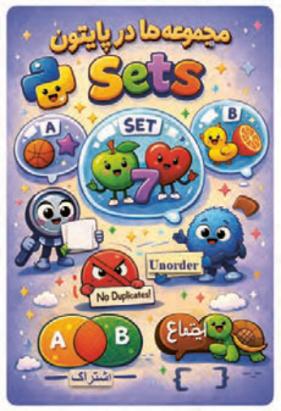

مجموعه‌ها برای ذخیره چند مقدار در یک متغیر استفاده می‌شوند. مجموعه یکی از چهار نوع دادۀ پایتون است که برای ذخیره‌سازی انواع داده‌ها مثل اعداد صحیح، اعداد اعشاری، رشته‌ها، بولین‌ها و توپل‌ها (`tuple`) به‌صورت مجموعه‌ای به‌کار می‌رود.

**شکل 97**

ساخت `set` :

استفاده از آکولاد {}:

این روش معمولاً برای ساختن مجموعه‌ای از عناصر مشخص و از پیش تعیی‌نشده استفاده می‌شود.

پس از هر بار اجرای برنامه مشاهده خواهید کرد که ترتیب نمایش اعضای مجموعه فرق می‌کند (شکل98).

یعنی `set` ترتیب نمایش عناصر را تضمین نمی‌کند و `Unorder` است.

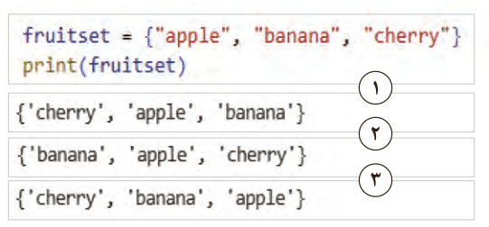

1

2

3

**شکل 98**


---

<!-- pdf-page: 56 | book-page: 50 -->

**صفحه ۵۰**

استفاده از متد (`add`) برای اضافه‌کردن عنصر جدید به `set:`

برنامه را اجرا کنید. مشاهده خواهید کرد که عناصر تکراری به مجموعه اضافه نشده‌اند (شکل99).

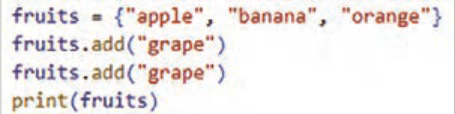

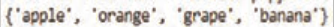

**شکل 99**

استفاده از متد (`remove`) برای حذف عنصر از `set:`

با استفاده از متد `remove` می‌توانید عناصر یک `set` را حذف کنید.

مثال: با استفاده از متد `remove` عنصر `"banana"` از مجموعه حذف شده است (شکل100).

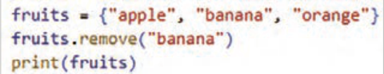

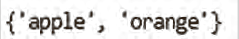

**شکل 100**

درصورتی‌که عضو وجود نداشته باشد در زمان اجرا پیغام خطا نشان داده می‌شود (شکل101).

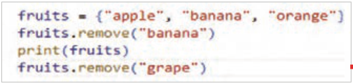

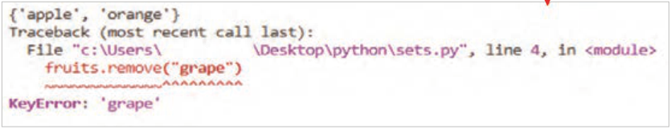

**شکل 101**

### کنجکاوی

در مورد سایر متدهای مربوط به `set` از سایت `www.w3schools.com` تحقیق کنید و در کلاس ارائه دهید.


---

<!-- pdf-page: 57 | book-page: 51 -->

**صفحه ۵۱**

استفاده از `in` برای بررسی وجود عنصر در `set:`

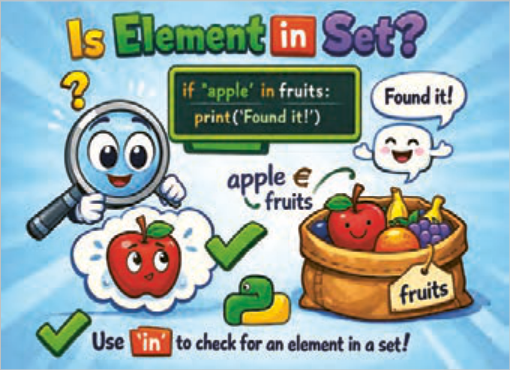

**شکل 102**

مثال: در کد شکل 103 وجود عنصر`"grape"` در مجموعه `fruits` مورد بررسی قرار گرفته است. خروجی کد نشان می دهد این عنصر در مجموعه وجود ندارد.

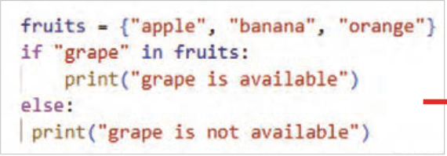


**شکل 103**

### فعالیت

برنامه‌ای بنویسید که یک `set` از اعداد داشته باشد و بررسی کند عدد 10 در `set` وجود دارد یا خیر.

### فعالیت

مجموعه‌ای از میوه‌ها وجود دارد:

```
}"fruits = {"apple", "banana", "orange", "grape
```

برنامه‌ای بنویسید که کاربر نام میوه‌ای وارد کند و اگر در `set` بود، پیغام دهد که آن میوه درون مجموعه موجود است و `set` نهایی را چاپ کنید.


---

<!-- pdf-page: 58 | book-page: 52 -->

**صفحه ۵۲**

### دیکشنری (dictionary)

نوع داده `dictionary` شبیه دفترچه تلفن است که هر نام با یک شماره‌تلفن مرتبط است.

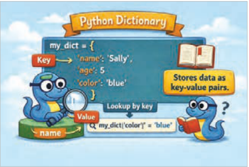

دیکشنری‌ها از تعدادی جفت کلید:

مقدار (`key:value`) تشکیل شده‌اند که به هر یک از آنها `item` گفته می‌شود. هر کلید به یک مقدار خاص اشاره دارد.

برای ایجاد `dictionary` آیتم‌ها درون {} قرار گرفته و با کاما از یکدیگر جدا می‌شوند. همچنین هر کلید و مقدار آن با علامت دونقطه از هم جدا شده است.

**شکل 104**

در مثال شکل105 یک `dictionary` شامل سه آیتم (کلید و مقدار) به نام `cardic` تعریف شده است:

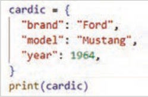

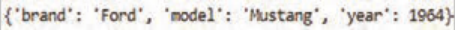

**شکل 105**

برای دسترسی به یک مقدار در `dictionary` بعد از نام `dictionary`، کلید، داخل براکت [] قرار داده می‌شود (شکل106).

مثال: در کد شکل106 یک دیکشنری به نام `person` با 3 آیتم (کلید، مقدار) تعریف شده است. برای نمایش هر یک از عناصر داخل این دیکشنری از براکت [] استفاده شده است.

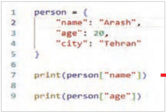

**شکل 106**


---

<!-- pdf-page: 59 | book-page: 53 -->

**صفحه ۵۳**

### نکته

اگر هر عنصر دارای عنوان مشخص باشد (مانند نام دانش‌آموز و نمره او)، استفاده از دیکشنری بهتر از لیست است؛ زیرا در دیکشنری می‌توان مستقیمًا با نام کلید به مقدار معادل آن دسترسی داشت و نیازی به دانستن اندیس عنصر نیست.

### فعالیت

یک دیکشنری به نام `book` بسازید که اطلاعات یک کتاب را نگه دارد:

```
"title": "python Basic"
"author: "Fatemeh
250:pages
```

نام نویسنده (`author`) و تعداد صفحات (`pages`) را چاپ کنید.

کلیدهای متفاوت می‌تواند مقادیر یکسان داشته باشند.

مثال: دیکشنری `status` دارای دو آیتم است (شکل107).

```
آیتم اول: "user1":"active"
```

آیتم دوم: `"user2":"active"` کلیدها یکسان هستند ولی مقادیر هریک از آنها متفاوت است.

در `dictionary` کلیدهای یکسان نمی‌توانند مقادیر یکسان داشته باشند. کلیدهای تکراری باعث بازنویسی مقدار قبلی می‌شوند، نه مقدارهای تکراری.

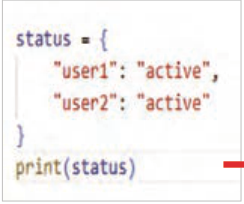

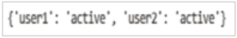

**شکل 107**

در مثال شکل 108 دیکشنری `car_dic` دارای پنج آیتم است که دو تای آنها دارای کلیدهای با نام یکسان هستند. پس مقدار جدید به جای مقدار قبلی جایگزین می‌شود.

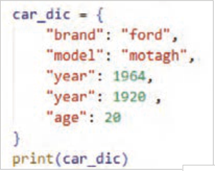

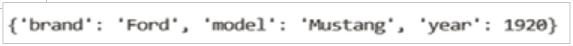

**شکل 108**


---

<!-- pdf-page: 60 | book-page: 54 -->

**صفحه ۵۴**

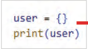

برای ساخت یک `dictionary` خالی از {} استفاده می‌شود (شکل109).

مثال: یک دیکشنری خالی با نام `user` تعریف شده است.

**شکل 109**

اضافه‌کردن `item` جدید به `dictionary:`

برای اضافه‌کردن یک عضو جدید به `dictionary` در پایتون، کافی است یک کلید جدید را مقداردهی کنید (شکل110).

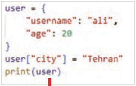

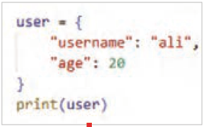

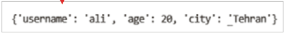

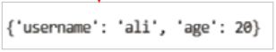

**شکل 110**

### فعالیت

یک `dictionary` به نام `product` با کلیدهای `name` `price` ، بسازید. قیمت محصول درون `dictionary` را تغییر دهید و سپس `dictionary` را چاپ کنید.

مثال: یک `dictionary` خالی به نام `student` بسازید. سپس با استفاده از ورودی `name` و `grade` را به `dictionary` اضافه و در پایان دیکشنری را چاپ کنید (شکل111).

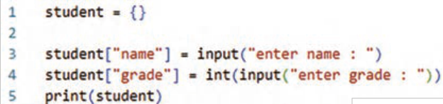

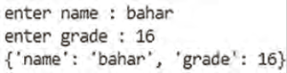

**شکل 111**

### فعالیت

یک `dictionary` خالی به نام `user` بسازید. از ورودی مقادیری برای کلیدهای `username` و `password` و `Age` را بگیرید و داخل `dictionary` ذخیره و در پایان کل اطلاعات کاربر را چاپ کنید.


---

<!-- pdf-page: 61 | book-page: 55 -->

**صفحه ۵۵**

حذف عنصر از `dictionary:`


روش‌های مختلفی برای حذف آیتم از `dictionary` وجود دارد ازآن‌جمله:

در پایتون برای حذف یک آیتم از `dictionary`، از دستور `del` استفاده می‌شود. با این دستور، کلید و مقدار مربوط به آن به طور کامل از `dictionary` حذف می‌شود.

**شکل 112**

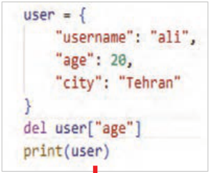

مثال: در مثال کلید `age` و مقدار آن 20، از `dictionary` حذف شده است. برنامه را بنویسید و نتیجه را مشاهده کنید (شکل113).

در برنامه مقابل برای حذف آیتم `age":` 20" از دستور `del` استفاده شده است. مشاهده می‌کنید که با این دستور کلید و مقدار آن حذف شده‌اند.

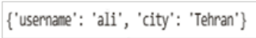

**شکل 113**

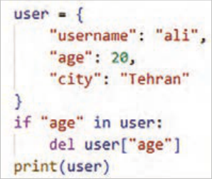

درصورتی‌که قصد حذف کلیدی را دارید که در `dictionary` وجود نداشته باشد، برنامه با خطا مواجه می‌شود؛ بنابراین قبل از حذف، باید وجود کلید بررسی شود. در برنامه مقابل برای جلوگیری از خطا پیش از حذف عنصر از لیست، وجود آن بررسی شده است.

برنامه را وارد کرده و نتیجه را مشاهده کنید (شکل114).

**شکل 114**


---

<!-- pdf-page: 62 | book-page: 56 -->

**صفحه ۵۶**

برای حذف عنصر از `dictionary` می‌توانید از متد `pop`() نیز استفاده کنید. متد `pop`()، عنصری که نام کلید مشخص شده را دارد، حذف می‌کند. (`key`)`dictionary.pop` مثال: در کد (شکل115) عنصر `"price` " از دیکشنری `product` با استفاده از دستور `product.pop`(`"price"`) حذف شده است.

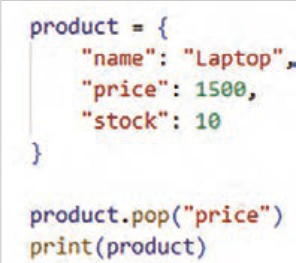

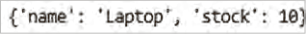

**شکل 115**

متد ()`pop` علاوه بر حذف آیتم، می‌تواند مقدار آیتم حذ‌فشده را برگرداند (شکل116).

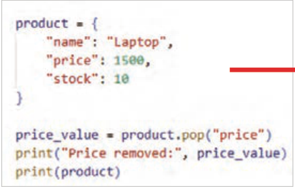

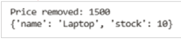

**شکل 116**

### فعالیت

یک دیکشنری به نام `inventory` بسازید که شامل:

```
,inventory = {"Bag": 5, "Ball": 8, "Laptop": 3
}Mouse": 10,  "Flash memory": 14"
```

وجود کالایی با نام `"Bag"` را بررسی و در صورت وجود، پیغام مناسبی چاپ شود که نشان‌دهندۀ وجود کالا باشد و سپس آن آیتم را با متد ()`pop` حذف کنید.

مقدار حذ‌فشده را چاپ کنید.

اگر کالا وجود نداشت، پیغامی مبنی بر عدم وجود آن نمایش داده شود.

سپس `dictionary` جدید را چاپ کنید.


---

<!-- pdf-page: 63 | book-page: 57 -->

**صفحه ۵۷**

### پروژه بازی Quiz

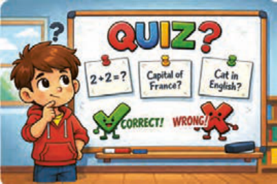

در این بازی ابتدا منویی که شامل انواع سؤالات است نمایش داده می‌شود و کاربر سؤال موردعلاقه‌اش را انتخاب می‌کند و سپس به سؤالات پاسخ می‌دهد، در صورت پاسخ صحیح یک امتیاز دریافت می‌کند و در غیر این صورت پیام پاسخ و در صورت تمام‌شدن سؤالات، امتیاز کاربر نمایش داده می‌شود.

**شکل 117**

مرحله ۱: در این مرحله باید منویی ایجاد کنید که شامل انواع سؤالات باشد. برای شروع دو نوع سؤال در منو قرار دهید. در دیکشنری `menu` به هر عدد یک نوع سؤال اختصاص‌یافته است. در صورت انتخاب عدد ۳، کاربر از بازی خارج می‌شود (شکل118).

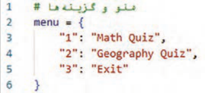

**شکل 118**

مرحله 2: سؤالات مربوط به هر نوع سؤال را بنویسید. دو دیکشنری `math_quiz` برای سؤالات ریاضی و `geo_quiz` برای سؤالات مربوط به مکان‌های جغرافیایی، هر کدام سه عنصر که شامل سؤال و پاسخ آن است (شکل119).

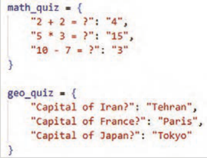

**شکل 119**


---

<!-- pdf-page: 64 | book-page: 58 -->

**صفحه ۵۸**

مرحله ۳: در این مرحله دستوراتی بنویسید که منو‌ها را نمایش دهد.

بعد از نمایش پیام خوشامدگویی و نمایش عنوان `:menu` برای هر یک از عناصر داخل دیکشنری، شماره `menu` و متن آن با یک علامت "-" از هم جدا شده و نمایش داده می‌شود تا کاربر بتواند از میان آنها یکی را انتخاب کند (شکل120).

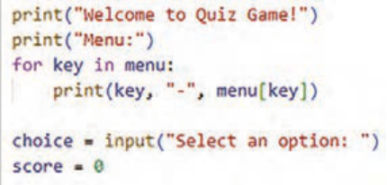

**شکل 120**

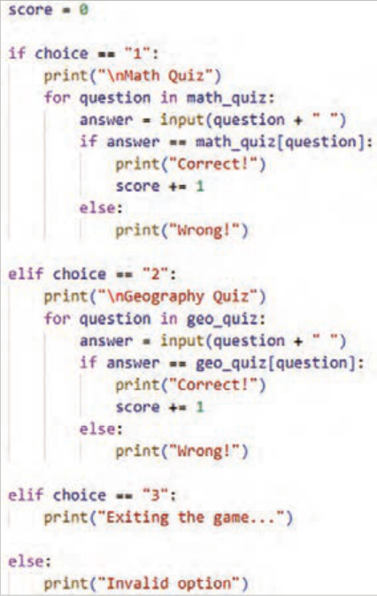

مرحله ۴: در این مرحله دستورات مربوط به انتخاب منو را بنویسید (شکل121).

**شکل 121**


---

<!-- pdf-page: 65 | book-page: 59 -->

**صفحه ۵۹**

### نکته

هر جایی که `n\` نوشته شود، خروجی از آن نقطه به خط بعدی می‌رود.

مرحله 5: در این مرحله دستوراتی بنویسید که امتیازات کس‌بشده را نمایش دهد. امتیاز کاربر در صورت انتخاب گزینه "1" و یا "2" نمایش داده می‌شود (شکل122).

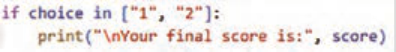

**شکل 122**

مرحله 6: کدها را نوشته و برنامه را اجرا کنید!

### فعالیت

بخش‌های جدید `Quiz` (مثًًلا `Sport` ,`Science`) را اضافه کنید.

برای جواب غلط، یک پیام توضیحی بدهید.

امکان انتخاب چند بخش به‌صورت پشت‌سرهم را اضافه کنید.

### کنجکاوی

با مراجعه به دیکشنری‌های مرجع تلفظ لغات را دقیق یاد بگیرید.

```
https://dictionary.cambridge.org/dictionary/english/tuple
```

### توِپل (Tuple)

توپل در پایتون دنباله‌ای از داده‌های ترتیبی و غیر قابل تغییر است. به کمک توپل‌ها می‌توانید چندین مقدار از نوع‌های داده‌ای مختلف را در یک متغیر ذخیره و روی آنها عملیات انجام دهید. این ساختار داده را زمانی استفاده کنید که بخواهید داده‌ها در طول برنامه، تصادفاً توسط خود شما و یا سایر برنامه‌نویسان هم تیمی شما، تغییر نکنند.

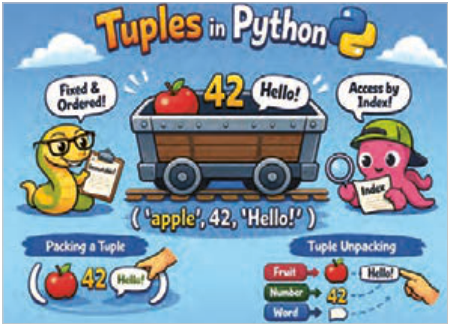

**شکل 123**

ایجاد `Tuple:`

```
tuple_name = (data1, data2, data3,…)
```


---

<!-- pdf-page: 66 | book-page: 60 -->

**صفحه ۶۰**

مثال: یک `tuple` با سه عضو برای نگهداری نام کاربری مدیران ارشد شرکت ایجاد و سپس آن را چاپ کند (شکل124).

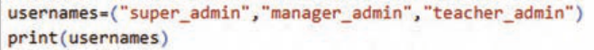


**شکل 124**

مثال: در برنامۀ شکل 125 از یک توِپل برای نگهداری نام روزهای هفته استفاده شده است، زیرا نام روزهای هفته تغییرپذیر نیستند، پس این نوع ساختار داده مناسب نگهداری این مقادیر می‌باشد.

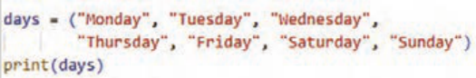


**شکل 125**

دسترسی به عناصر `Tuple:`

مانند لیست‌ها عناصر توپل هم دارای `index` هستند و دسترسی به عنصر با شمارۀ ایندکس آن انجام می‌شود.

مثال: در این برنامه ابتدا یک توپل به نام `port_name` برای نگهداری نام درگاه‌های ورودی یک سیستم رایانه‌ای ایجاد و سپس عنصر سوم آن نمایش داده شده است. دقت کنید ایندکس عناصر از صفر است (شکل126).

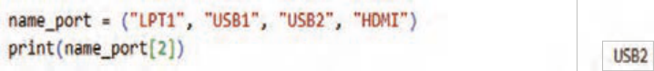

**شکل 126**

عناصر یک توپل تغییرناپذیر (`immutable`) هستند. یعنی اگر بخواهید بعد از مقداردهی اولیه، آنها را تغییر دهید، برنامه پیغام خطا نمایش می‌دهد.


---

<!-- pdf-page: 67 | book-page: 61 -->

**صفحه ۶۱**

مثال: در مثال شکل127 تلاش شده است که مقدار عنصر دوم توپل تغییرکند، ولی اجرای برنامه با خطا مواجه شده است.

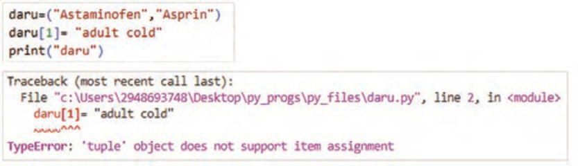

**شکل 127**

### کنجکاوی

تحقیق کنید آیا می‌توانید تعداد عناصر یک توپل را تغییر دهید یا نه؟ برنامه‌ای بنویسید که نتیجه تحقیق شما را نشان دهد.

به نظر شما مزیت اصلی توپل‌ها چیست که برنامه‌نویس را ملزم می‌کند از آن استفاده کند؟

حذف `Tuple:` در پایتون امکان حذف عناصر یک توپل وجود ندارد. ولی می‌توانید کل یک توپل را با استفاده از دستور `del` حذف کنید.

مثال: در این برنامه با دستور `del` توپل `days` حذف شده است. بعد از اجرای آن هم پیغامی مبنی عدم تعریف توپل `days` نمایش داده می‌شود (شکل128).

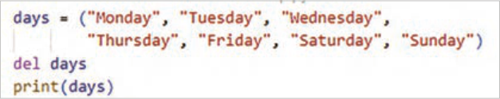

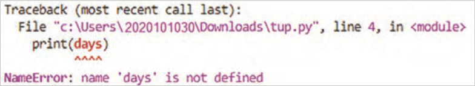

**شکل 128**


---

<!-- pdf-page: 68 | book-page: 62 -->

**صفحه ۶۲**

### تابع (Function)

تابع، بلاک یا قطعه کدی است که یک‌بار آن را تعریف کرده و بارها آن را در چندین مکان برنامه می‌توان فراخوانی کرد.

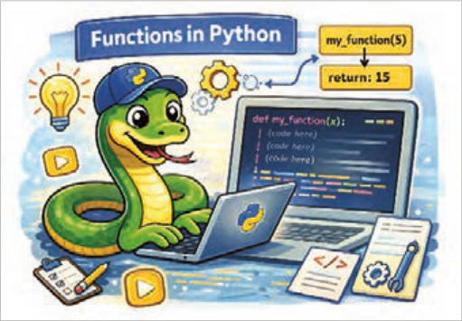

**شکل 129**

مزایای استفاده از تابع:

برنامه‌نویس با تعریف یک تابع، تنها یک بار کد مورد نظر را می‌نویسد و سپس در هر نقطه‌ای از برنامه یا حتی در پروژه‌های دیگر که نیاز باشد، آن را فراخوانی و استفاده می‌کند.

تقسیم کد به توابع کوچک و مشخص، درک و فهم کد را به طور چشمگیری افزایش می‌دهد.

یافتن و رفع اشکالات و اعمال تغییرات در کد بسیار ساد‌هتر می‌شود.

سازماندهی کدها به‌صورت منطقی و مرتب و ساختار کلی برنامه آسان‌تر می‌شود.

تعریف تابع: یک تابع با استفاده از کلمه کلیدی `def` تعریف می‌شود و به دنبال آن نام تابع و پرانتز قرار می‌گیرد.

فرم کلی تعریف تابع با پارامتر ورودی به شکل زیر است:

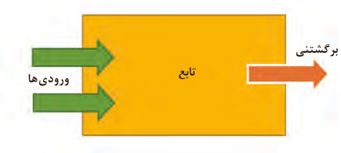

:(پارامترهای تابع) نام تابع `def`

مقدار برگشتنی

دستور یا دستورات بدنه تابع

تابع

ورودی‌ها

مقدار یا مقادیر `return`

**شکل 130**


---

<!-- pdf-page: 69 | book-page: 63 -->

**صفحه ۶۳**

مثال: در این برنامه تابعی به نام `show_store_name` تعریف شده و یک دستور `print` (`"Digital` `Online` `Store"`) در آن نوشته شده است (شکل131).

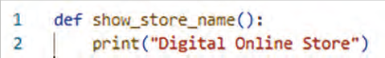

**شکل 131**

مثال: در این برنامه نیز یک تابع به نام `greet` تعریف شده است و دستور `print`(`"Hello`! ") در آن نوشته شده است (شکل132).

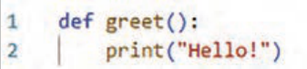

**شکل 132**

مثال: در این برنامه تابع `greet`() بدون پارامتر تعریف شده است، پس در هنگام فراخوانی نیازی به ارسال آرگومان ندارد (شکل133).

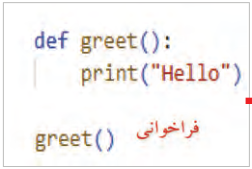

خروجی

**شکل 133**

مثال: در این برنامه نیز تابع بدون پارامتر تعریف شده است. در هنگام فراخوانی نیازی به ارسال آرگومان ندارد (شکل134).


**شکل 134**


---

<!-- pdf-page: 70 | book-page: 64 -->

**صفحه ۶۴**

پارامتر و آرگومان (`Parameters` & `Arguments`) پارامتر چیست؟ تابع می‌تواند ورودی‌هایی را دریافت کند. به ورودی‌های تابع در زمان تعریف تابع، پارامتر (`parameter`) گفته می‌شود.

آرگومان چیست؟ ورودی‌های تابع که هنگام فراخوانی تابع به آن داده می‌شود.

پس از تعریف، تابع باید فراخوانی شود تا اجرا شود. اگر تابع را فقط تعریف کنید ولی فراخوانی نشود هیچ اتفاقی نمی‌افتد. مثل این است که اصلاً تعریف نشده باشد.

برای فراخوانی تابع نام آن را نوشته و به تعداد پارامترها، به آن آرگومان ارسال کنید (در اصطلاح پاس‌دادن گفته می‌شود) یک تابع را بارها می‌توانید فراخوانی کنید.

نحوه فراخوانی تابع به شکل زیر است:

(آرگومان‌های تابع) :نام تابع

مثال: در مثال شکل135 تابع `show_product`(`name`, `price`) با دو پارامتر `name` , `price` تعریف شده است. در زمان فراخوانی هم باید دو مقدار به‌عنوان آرگومان ارسال شود.


خروجی


**شکل 135**

مثال: در مثال شکل136 تابع `print_age`(`age`) دارای یک پارامتر به نام `age` است. در زمان فراخوانی هم یک آرگومان به آن ارسال شود. همان‌طور که مشاهده می‌کنید تابع `print_age`(`age`) دو بار و با دو آرگومان متفاوت فراخوانی شده است.


خروجی


**شکل 136**


---

<!-- pdf-page: 71 | book-page: 65 -->

**صفحه ۶۵**

### نکته

ترتیب، تعداد و نوع پارامترها (در زمان تعریف تابع) با ترتیب، تعداد و نوع آرگومان‌ها (در زمان فراخوانی تابع) باید با هم یکسان باشد.

اگر ترتیب و نوع ارسال آرگومان‌ها رعایت نشود، خروجی اشتباه تولید می‌شود. در هنگام اجرا خطا نمی‌دهد؛

ولی منطق برنامه نادرست است.

راه‌حل، استفاده از آرگومان کلیدی (`keyword` `arguments`) یا همان آرگومان‌های با نام است، یعنی می‌توان در زمان فراخوانی تابع، نام پارامتر را ب‌ههمراه عملگر انتساب نوشت.

مثال: به کدهای شکل 137 دقت کنید. خروجی‌ها را بررسی کنید. فراخوانی بدون رعایت ترتیب آرگومان‌ها، باعث شده اول قیمت و سپس نام کالا چاپ شود و این منطق نادرستی است.


خروجی

فراخوانی بدون رعایت ترتیب فراخوانی با رعایت ترتیب


**شکل 137**

مثال: در مثال شکل 138 برای جلوگیری از خروجی اشتباه با ارسال آرگومان‌ها بدون ترتیب، از آرگومان‌های کلیدی استفاده شده است. برنامه را نوشته و نتیجه را با مثال قبل مقایسه کنید.


**شکل 138**

### نکته

وقتی آرگومان‌ها بدون نام پارامتر به تابع داده شود، ترتیب ارسال آنها مهم است، چون هر آرگومان ب‌هترتیب به پارامترهای تابع نسبت داده می‌شود. به این آرگومان‌ها آرگومان‌های موقعیتی

```
(positional arguments) گفته می‌شود.
```

### فعالیت

یک تابع به نام `square` بنویسید که یک عدد بگیرد و مربع آن را چاپ کند.


---

<!-- pdf-page: 72 | book-page: 66 -->

**صفحه ۶۶**

### نکته

تابعی بنویسید که دو عدد را به‌عنوان پارامتر دریافت و حاصل‌جمع آنها را نشان دهد.

### نکته

تابعی بنویسید که نام ۳ کاربر را از ورودی به‌عنوان پارامتر دریافت و آنها را چاپ کند.

مثال: تعداد آرگومان‌های ارسالی به تابع باید با تعداد پارامترهای آن در زمان تعریف تابع برابر باشد. در غیر این صورت در زمان اجرای پیام خطا نمایش داده می‌شود (شکل139).


تعداد آرگومان ارسال شده کمتر از تعداد پارامترهای تابع است


پیام خطای نمایش داده شده پس از اجرای برنامه

**شکل 139**

### نکته

می‌توان برای پارامتر مقدار پیش‌فرض تعیین کرد. اگر آرگومان داده نشود، مقدار پیش‌فرض استفاده می‌شود.

مثال: در اولین خط کد شکل 140، تابع با یک پارامتر تعریف شده است. در خط ۴ هنگام فراخوانی، آرگومان آن ارسال نشده است، بنابراین از مقدار پیش‌فرض آن `"Tehran"` استفاده می‌شود. در خط ۵ تابع با آرگومان فراخوانی شده است. برنامه را نوشته و نتیجه را بررسی کنید. مقدار پیش‌فرض را تغییر دهید و برنامه را اجرا کنید.


**شکل 140**


---

<!-- pdf-page: 73 | book-page: 67 -->

**صفحه ۶۷**

مثال: در این مثال تابع با دو پارامتر تعریف شده که مقدار پیش‌فرض برای آنها وجود دارد. در هر بار فراخوانی آرگومان‌ها با روش‌های مختلف ارسال شده‌اند. برنامه را نوشته، نتیجه را بررسی کنید. مقدار پیش‌فرض را تغییر دهید و دوباره برنامه را اجرا کنید (شکل141).


**شکل 141**

مقدار بازگشتی تابع (`Return` `Value`) تابع می‌تواند مقداری را محاسبه کند و به برنامه برگرداند تا بعدًا از آن استفاده شود که به آن مقدار بازگشتی ) `Return` `Value`) گفته می‌شود. بدون `return` تابع کار خودش را انجام می‌دهد (مثلاًً چاپ می‌کند) ولی هیچ مقداری به بیرون برنمی‌گرداند و اگر بخواهید نتیجه تابع را در متغیر ذخیره کنید مقدار آن `None` می‌شود (شکل142).


**شکل 142**

مثال: با اجرای برنامه شکل143 مقدار 8 نمایش داده می‌شود. اما عدد8 ذخیره نشده و همچنین جای دیگری نمی‌توان از آن استفاده کرد.


حالا برنامه را با استفاده از `return` تغییر داده و نتیجه را مشاهده کنید.

این بار: تابع عدد 8 را برگردانده و مقدار بازگشتی در متغیر `result` ذخیره می‌شود و می‌توان دوباره از آن استفاده کرد.

**شکل 143**

مثال: بدون استفاده از `return` فقط (`price` * `count`) محاسبه می‌شود و هیچ مقداری را به برنامه برنمی‌گرداند، پس با فراخوانی تابع 200000),2( `total_` `price` در متغیر `x` مقدار `None` ذخیره و با اجرای برنامه مقدار `None` هم چاپ می‌شود


(شکل144).

**شکل 144**


---

<!-- pdf-page: 74 | book-page: 68 -->

**صفحه ۶۸**

مثال: با استفاده از `return` مقدار محاسبه‌شده به برنامه برگردانده می‌شود و می‌توان آن را در متغیر `x` ذخیره کرد و با چاپ متغیر `x` مقدار ذخیره‌شده، نمایش داده می‌شود (شکل145).


**شکل 145**

### فعالیت

یک تابع به نام `avg_numbers` بسازید که سه عدد دریافت کرده و میانگین آنها را برگرداند.

مثال: تابعی بنویسید که قیمت کل خرید را حساب کند و اگر تعداد خرید بیشتر از ۵ بود، 10٪ تخفیف بدهد.

داخل تابع از `if` استفاده شده تا شرطی بررسی شود.

اگر شرط (`count` > 5) برقرار باشد مقدار با تخفیف برگردانده می‌شود.

اگر شرط برقرار نباشد، مقدار بدون تخفیف برگردانده می‌شود.

از `return` استفاده شده است تا نتیجه محاسبه شده به بیرون تابع برگردد و بتوان آن را چاپ یا ذخیره کرد (شکل146).


**شکل 146**

استفاده از حلقه در داخل تابع:

استفاده از حلقه در داخل تابع به این منظور است که بتوانید دستورات مشخصی را چندین بار و به‌صورت خودکار، تا زمانی‌که شرط تعیین‌شده برقرار است یا تعداد دفعات مشخصی تکرار شوند، اجرا کنید. این کار باعث کاهش تکرار کد، افزایش خوانایی و بهینه‌سازی عملکرد تابع می‌شود.


مثال: در این مثال، تابع تعریف شده اعداد طبیعی کوچک‌تر از 6 را چاپ می‌کند. برنامه را اجرا و نتیجه را مشاهده کنید (شکل147).

**شکل 147**


---

<!-- pdf-page: 75 | book-page: 69 -->

**صفحه ۶۹**

مثال: ابتدا تابع تعریف شده یک پارامتر به نام `names` دارد که انتظار می‌رود آرگومان‌های دریافتی آن لیستی از اسامی باشند (شکل148).

با حلقه `for` عناصر لیست را یکی‌یکی دریافت و به متغیر `name` اختصاص می‌دهد.

دستور `print` هم داخل حلقه اجرا شده و اسامی را جداگانه چاپ می‌کند.

قبل از فراخوانی تابع در اولین خط از برنامه، لیست `students` که شامل نام دانش‌آموزان است ایجاد می‌شود.

سپس تابع با آرگومان `students` فراخوانی می‌شود. حلقه داخل تابع یکی‌یکی اسامی داخل لیست را چاپ می‌کند.


**شکل 148**

### فعالیت


تابع نوشته‌شده حاصل جمع تمام اعداد یک لیست را محاسبه می‌کند. برنامه را بنویسید و اجرا کنید. با راهنمایی هنرآموز محترم خود خطوط کد نوشت‌هشده در آن را توضیح دهید. تابع را به نحوی تغییر دهید که عناصر لیست را کاربر از صفحه‌کلید وارد کند.

### فعالیت


تابع نوشته‌شده که طول رشته ورودی کاربر را محاسبه و نمایش می‌دهد. برنامه را اجرا و آن را بررسی و همچنین با راهنمایی هنرآموز محترم خود کدهای برنامه مقابل را توضیح دهید.

### فعالیت


کدهای مقابل بیشترین مقدار را در بین اعداد یک لیست محاسبه کرده و نمایش می‌دهد. کد را اجرا و خطوط آن را توضیح دهید.


---

<!-- pdf-page: 76 | book-page: 70 -->

**صفحه ۷۰**

### فعالیت


تابعی بنویسید که تفاوت نمرۀ دو دانش‌آموز را محاسبه و مقدار آن را برگرداند. با راهنمایی هنرآموز محترم خود کدهای برنامۀ مقابل را توضیح دهید.

انواع توابع در پایتون `User-Defnied` `Function` (توابعی که برنامه‌نویس تعریف می‌کند): توابعی که تاکنون تعریف کردید در این دسته قرار دارند.

`Built-in` `functions` (یا توابع داخلی پایتون): توابعی که در پایتون از قبل تعریف شده‌اند و برنامه‌نویس آنها را در برنامه‌های خود استفاده می‌کند. کارهای رایج و تکراری را سریع، ساده و بدون نوشتن کد طولانی انجام می‌دهد. به کمک توابع داخلی، برنامه‌ها خواناتر، کوتاه‌تر و کم‌خطا می‌شوند.

در بخش‌های پیش با برخی از این توابع آشنا شدید، در ادامه نیز کاربرد برخی دیگر را یاد خواهید گرفت.

توابع ریاضی: این توابع فقط یا عمدتاً روی مقادیر عددی کار می‌کنند (جدول4).

**جدول4**

نام تابع

### کاربرد

### مثال

خروجی

`abs`()محاسبه قدرمطلق عدد`print`(`abs`(-12))

12

```
print(round(3.6))
```

4

```
round()گرد کردن عدد اعشاریprint(round(3.1415, 2))
```

3.14

```
pow()محاسبه توانprint(pow(2, 3))
```

8

`int`()تبدیل به عدد صحیح`print`(`int`(4.8))

4

`float`()تبدیل به عدد اعشاری`print`(`float`(5))

50

```
max()بزرگ‌ترین عددPrint(max(3, 9, 5))
```

9

```
min()کوچک‌ترین عددPrint(min(3, 9, 5))
```

3

```
sum()جمع چند عددPrint(sum([2, 4, 6]))
```

12


---

<!-- pdf-page: 77 | book-page: 71 -->

**صفحه ۷۱**

### فعالیت

یک ماشین‌حساب با استفاده از توابع ریاضی ایجاد کنید. بخش‌هایی از کدهای مربوط به این برنامه نوشته شده است. با راهنمایی هنرآموز خود آنها را تکمیل کنید و برنامه را اجرا کنید.


---

<!-- pdf-page: 78 | book-page: 72 -->

**صفحه ۷۲**


تا این بخش با توابعی مثل `print` ,`len` ,`type` , `input` ,`str` آشنا شده‌اید. در ادامه با برخی از توابع داخلی غیرریاضی پایتون آشنا خواهید شد.

تابع `sorted:` این تابع برای مرتب‌سازی رشته، مجموعه، توپل و دیکشنری مورد استفاده قرار می‌گیرد و نتیجه را در قالب یک لیست جدید برمی‌گرداند.

ساختار کلی تابع:

```
sorted(iterable, reverse=false)
```

`iterable:` داده‌ای که می‌خواهید مرتب کنید (لیست، رشته، توپل، مجموعه، دیکشنری و …) `reverse:` اگر `true` باشد، ترتیب نزولی می‌شود. پیش‌فرض (`false` صعودی)


---

<!-- pdf-page: 79 | book-page: 73 -->

**صفحه ۷۳**

مثال: در این مثال تابع `sorted` رشته‌ای از کاراکترهای ذخیره‌شده در متغیر `data` را به‌صورت صعودی بر اساس کد اسکی کاراکترها مرتب می‌کند.


**شکل 149**

### فعالیت

نام شهرها را از کاربر دریافت و در یک لیست ذخیره کنید. سپس این لیست را به‌صورت نزولی مرتب کنید.

### ماژول (module)

ماژول یک فایل است که می‌تواند شامل چندین تابع، متغیر و کلاس باشد و برای سازمان‌دهی برنامه‌های بزرگ استفاده می‌شود. با استفاده از ماژول می‌توانید کدهای آماده را دوباره استفاده کنید و برنامۀ خود را کوتاه‌تر و مرتب‌تر کنید.


**شکل 150**

انواع ماژول در پایتون:

ماژول استاندارد (`standard`) ماژول‌هایی در پایتون وجود دارند که برنامه‌نویس فقط آنها را در برنامه خودش وارد می‌کند و نیازی به تعریف آنها نیست. مثل `time`، `date`، `random`، `math` و... . به دو روش می‌توان از ماژول‌های استاندارد استفاده کرد.

روش اول: وارد کردن کل ماژول (`import` `mojvle`):

این روش ام‌نترین راه است. چون از تداخل نا‌مها جلوگیری م‌یکند. در این روش باید نام ماژول را قبل از تابع بیاورید.


مثال: `Sqrt` یک تابع آماده در ماژول `math` پایتون است، که برای محاسبه جذر اعداد استفاده می‌شود (شکل151).

**شکل 151**


---

<!-- pdf-page: 80 | book-page: 74 -->

**صفحه ۷۴**

مثال: لیستی از پیام‌های انگیزشی بسازید و با استفاده از ماژول `random` در هر اجرا یک پیام تصادفی چاپ کنید (شکل152).

برنامه را اجرا کنید و نتیجه را بررسی کنید.


**شکل 152**

### فعالیت

برنامه‌ای بنویسید که:

یک عدد تصادفی بین ۱ تا 10 تولید کند. از کاربر بخواهد عدد را حدس بزند.اگر حدس درست بود، پیام شما موفق شدید چاپ کند؛ در غیر این صورت دوباره از کاربر ورودی بگیرد.ضمنًا تعداد دفعات تلاش کاربر را هم چاپ کند.

### فعالیت

برنامه‌ای بنویسید که شرایط زیر را داشته باشد:

چند کلمه ازپیش‌تعیین‌شده در برنامه وجود داشته باشد.

در هر بار اجرای برنامه، یکی از کلمات به‌صورت تصادفی انتخاب شود.

تعداد دفعات مجاز برای حدس‌زدن، برابر با تعداد حروف کلمه انتخاب‌شده باشد.

درصورتی‌که کاربر کلمه را به‌درستی حدس بزند: کلمه نمایش داده شود و پیام تبریک مناسب نمایش داده شود.

در غیر این صورت: پیام پایان بازی نمایش داده شود.

روش دوم: وارد کردن بخ‌شهای خاص (`from` ... `import`):

نام تابع `import` نام ماژول `from` در این روش، فقط توابع یا متغیرهای موردنیاز از یک ماژول وارد می‌شود. در این روش کد کوتاه‌تر و نوشتن ساده‌تر است.

مثال: فقط توابع `sqrt` و `pow` از ماژول `math` وارد برنامه می‌شوند (شکل153).


**شکل 153**


---

<!-- pdf-page: 81 | book-page: 75 -->

**صفحه ۷۵**

بعد از این دستور؛ نیازی به نوشتن `math.sqrt` نیست. مستقیمًا `sqrt` (25) نوشته می‌شود.

جدول5- ماژول‌های پرکاربرد پایتون

ماژول

### کاربرد

`math`توابع ریاضی `random`تولید اعداد تصادفی `turtle`رسم شکل و گرافیک `datetime`تاریخ و زمان `os`کار با سیستم‌عامل

مثال: نمایش تاریخ و زمان فعلی: در این مثال فقط تابع ()`now` مورد استفاده قرار گرفته است (شکل154).


**شکل 154**


مثال: در این مثال، فقط نمایش ساعتِ زمان فعلی، نیاز است. بنابراین از روش دوم واردکردن ماژول استفاده شده است (شکل155).


**شکل 155**


---

<!-- pdf-page: 82 | book-page: 76 -->

**صفحه ۷۶**

### فعالیت

با استفاده از ماژول `datetime` برنامه‌ای بنویسید که سال جاری را نمایش دهد.

### فعالیت

(بازی حدس کلمه)، ماژولی بنویسید که:

یک کلمه مشخص داشته باشد. تعداد دفعات مجاز حدس‌زدن برابر با تعداد حروف کلمه باشد.

اگر کاربر کلمه را درست حدس زد: کلمه چاپ شود و پیام تبریک نمایش داده شود.

اگر کاربر در تعداد مجاز موفق نشد: پیام پایان بازی نمایش داده شود.

این ماژول را در برنامه اصلی استفاده کنید.

ماژول محلی (`local`):

ماژول‌هایی هستندکه توسط برنامه‌نویس نوشته شده است و در برنامه `import` می‌شوند.

ابتدا یک فایل پایتون با پسوند `py` ایجاد کنید. سپس توابع و متغیرها را در آن قرار دهید. سپس می‌توانید آنها را با `import` در برنامه اصلی استفاده کنید.

مثال: فایل `my_module.py` را ایجاد کنید و در آن کدهای زیر را بنویسید (شکل156).


**شکل 156**

سپس در برنامه اصلی `main.py` این کدها را بنویسید (شکل157).


**شکل 157**

مثال: ابتدا یک فایل با نام `math_module.py` بسازید و توابع زیر را داخل آن بنویسید (شکل158).


**شکل 158**


---

<!-- pdf-page: 83 | book-page: 77 -->

**صفحه ۷۷**

سپس در برنامه اصلی از آن استفاده کنید (شکل 159).


**شکل 159**

### فعالیت

یک فایل با نام `random_module.py` بسازید و تابع زیر را داخل آن بنویسید:


`randint` یک تابع آماده در ماژول `random` پایتون است که برای تولید عدد صحیح تصادفی در بازه‌ای خاص استفاده می‌شود.

سپس در برنامه اصلی ماژول ساخته شده را `import` نموده از آن استفاده کنید.


برنامه را اجرا و خطوط کد را توضیح دهید.

ماژول‌های شخص ثالث (`3rd` `party`): ماژول‌هایی که توسط دستور `pip` `install` نصب می‌شوند و در برنامه `import` می‌شوند. مثل `Django` ،`Flask`, `PyGame` و...

### تفاوت تابع و متد

در مطالب قبل، از دستوراتی مانند ،`split`() `append`() و `len`() استفاده کرده‌اید، بدون آنکه تعریف رسمی آنها بیان شود.


این موضوع کاملاً طبیعی است و در برنامه‌نویسی بسیار رایج است؛ زیرا بسیاری از مفاهیم ابتدا با استفاده عملی و سپس با تعریف دقیق معرفی می‌شوند.

**شکل 160**


---

<!-- pdf-page: 84 | book-page: 78 -->

**صفحه ۷۸**

تابع:(`function`) دستوری مستقل است که برای انجام یک کار مشخص به کار می‌رود و به نوع داده خاصی وابسته نیست.

مثال: شمردن تعداد کاربران: تابع `len`() تعداد کاراکترهای یک رشته را برمی‌گرداند (شکل161).


**شکل 161**

مثال: نمایش تعداد کاربران به‌صورت رشته‌ای (شکل162):


**شکل 162**

متد (`Method`): نوعی تابع است که به یک کلاس یا شیء مشخص تعلق دارد و برای انجام عملیات روی داده‌های همان شیء استفاده می‌شود.

تفاوت اصلی تابع و متد در نحوۀ استفاده و وابستگی آنهاست؛ تابع‌ها به‌صورت مستقل فراخوانی می‌شوند، اما متدها از طریق یک شیء یا نوع داده و با استفاده از علامت نقطه (.) اجرا می‌شوند و معمولاً به داده‌های داخلی آن شیء دسترسی دارند.

متد `lower` ,`upper:` با استفاده از متد `lower` ,`upper` می‌توانید همه متن را به حروف بزرگ یا کوچک انگلیسی تبدیل کنید.

### فعالیت

با راهنمایی هنرآموز محترم خطوط کد مقابل را توضیح دهید.


---

<!-- pdf-page: 85 | book-page: 79 -->

**صفحه ۷۹**

متد `split` رشته را به لیستی از کلمات تجزیه می‌کند (شکل163).


**شکل 163**

### فعالیت

تابعی بنویسید که یک‌رشته را از ورودی دریافت کند و تعداد حروف بزرگ، کوچک و اعداد آن را نمایش دهد.


---

<!-- pdf-page: 86 | book-page: 80 -->

**صفحه ۸۰**

### ارزشیابی شایستگی کار با توابع و ماژو‌لها

استاندارد عملکرد: هنرجو بتواند توابع و ماژول‌ها را ایجاد و استفاده کند، داده‌ها و عملیات تکراری را با توابع مدیریت کند، از ماژول‌های محلی بهره ببرد و تفاوت بین تابع و متد را تشخیص دهد.

نمره

شرایط انجام کار (ابزار،مواد، تجهیزات،

ابزارهای

نتایج

ردیف

مرا حل کار

استاندارد (شاخص‌ها/داوری/نمره‌دهی)

کسب

زمان، مکان و ...)

### ارزشیابی

ممکن شده

یک `set` با چند عنصر دلخواه بسازد یک عنصر جدید به `set` اضافه کند.

یک عنصر از `set` حذف کند (هم عنصری که وجود دارد و هم عنصری که وجود ندارد تا خطای احتمالی را ببیند). بررسی کند که آیا عنصر خاصی در `set` وجود دارد یا خیر. یک `dictionary` خالی بسازد. تفاوت اصلی `set` با

3

`list` یا `tuple` را بداند (مثلاً عدم وجود ترتیب و عناصر تکراری).

کاربرد `set` در مواقعی که نیاز به حذف موارد تکراری داریم بداند ویژگی کلید، مقدار (`key` `value`) در `dictionary` را توضیح دهد انجام مشاهده کنجکاوی‌ها عملی،

1

مجموعه‌ها (`Set`)

رایانه، `vscode` نصب‌شده، 15 دقیقه

چک یک `set` با چند عنصر دلخواه بسازد یک عنصر جدید به `set` اضافه کند.

لیست یک عنصر از `set` حذف کند (هم عنصری که وجود دارد و هم عنصری که وجود ندارد تا خطای احتمالی را ببیند). بررسی کند که آیا عنصر خاصی در

2

`set` وجود دارد یا خیر. یک `dictionary` خالی بسازد. تفاوت اصلی `set` با `list` یا `tuple` را بداند (مثلاً عدم وجود ترتیب و عناصر تکراری).

آشنایی با تعاریف در حد توضیح مفاهیم انجام ناقص مراحل1 یک `dictionary` با چند کلید مقدار بسازد. یک زوج کلید مقدار جدید به `dictionary` اضافه یک عنصر را بر اساس کلیدش از `dictionary` حذف کند. سعی کند عنصری را با کلید ناموجود حذف کند تا با خطا مواجه شود و دلیل آن را توضیح دهد. تفاوت بین کلید (`key`) و مقدار (`value`) در

3

`dictionary` را بداند اهمیت منحصربه‌فرد بودن کلیدها در `dictionary` را توضیح دهد. روش‌های دسترسی به مقادیر در `dictionary` (با استفاده از کلید) را شرح دهد. انجام کنجکاو‌یها مشاهده

رایانه، `vscode` نصب‌شده، فایل تمرینی،

عملی،

2

ساختار داده `Dictionary`

یک `dictionary` با چند کلید مقدار بسازد. یک زوج کلید مقدار جدید

15دقیقه

چک به `dictionary` اضافه یک عنصر را بر اساس کلیدش از `dictionary` لیست حذف کند. سعی کند عنصری را با کلید ناموجود حذف کند تا با خطا مواجه

2

شود و دلیل آن را توضیح دهد. تفاوت بین کلید (`key` و مقدار (`value` در `dictionary` را بداند آشنایی با تعاریف و حد توضیح انجام ناقص مراحل1 یک `tuple` با چند عنصر (مثلاً مختصات یک نقطه یا اطلاعات یک شخص) بسازد عناصر `tuple` با استفاده از اندیس دسترسی پیدا کند تلاش کند یک عنصر را به `tuple` اضافه یا حذف کند و نتیجه (خطا) را مشاهده و دلیل آن را بیان کند (اختیاری) تلاش کند یک `tuple` را حذف کند.

3

اصلی‌ترین ویژگی `tuple` که آن را از `list` متمایز می‌کند، بداند؟ اشاره به تغییرناپذیری یا `Immutability` در چه مواردی استفاده از `tuple` به `list` ارجحیت دارد؟ (مثلاً در مواردی که مشاهده داده نباید تغییر کند، یا به عنوان کلید در `dictionary`) انجام کنجکاوی‌ها عملی،

3

ساختار داده `Tuple`

رایانه، `vscode` نصب‌شده، 20دقیقه

پرسش یک `tuple` با چند عنصر (مثلاً مختصات یک نقطه یا اطلاعات یک شخص) شفاهی بسازد عناصر `tuple` با استفاده از اندیس دسترسی پیدا کند تلاش کند یک عنصر را به `tuple` اضافه یا حذف کند و نتیجه (خطا) را مشاهده و تلاش

2

کند یک `tuple` را حذف کند.

اصلی‌ترین ویژگی `tuple` که آن را از `list` متمایز می‌کند، را بداند.

آشنایی با تعاریف در حد توضیح انجام ناقص مراحل1


---

<!-- pdf-page: 87 | book-page: 81 -->

**صفحه ۸۱**

یک تابع ساده بنویسد که فقط یک متن خوشامدگویی را چاپ کند. تابعی بنویسد که دو عدد را به عنوان ورودی (پارامتر) بگیرد و مجموع آنها را چاپ کند. این تابع را با مقادیر مختلف (آرگومان) فراخوانی کند.

3

بداند چرا از توابع در برنامه‌نویسی استفاده می‌شود ؟ تفاوت بین «پارامتر» (تعریف تابع) و «آرگومان» (مقدار ارسالی هنگام فراخوانی) را توضیح دهد مشاهده انجام کنجکاو‌یها

```
توابع (Functions)
```

عملی،

4

رایانه، `vscode` نصب‌شده، 20 دقیقه

مبانی و پارامترها

تحویل یک تابع ساده بنویسد که فقط یک متن خوشامدگویی را چاپ کند. تابعی فایل بنویسد که دو عدد را به عنوان ورودی (پارامتر) بگیرد و مجموع آنها را چاپ

2

کند. این تابع را با مقادیر مختلف (آرگومان) فراخوانی کند.

بداند چرا از توابع در برنامه‌نویسی استفاده می شود؟

آشنایی با تعاریف در حد توضیح انجام ناقص مراحل1 تابعی بنویسد که دو عدد را به عنوان ورودی بگیرد، حاصل ضرب آنها را محاسبه کرده و بازگرداند نتیجه بازگشتی تابع را در یک متغیر ذخیره کرده و سپس آن متغیر را چاپ کند تابعی بنویسد که یک لیست از اعداد را به عنوان ورودی بگیرد و با

3

استفاده از حلقه، مجموع عناصر لیست را محاسبه و بازگرداند از تاب ع�`sort` `ed` برای مرتب‌سازی یک لیست استفاده کند و نتیجه را ببیند تفاوت بین تابعی که مقداری را `print` می‌کند و تابعی که مقداری را `return` می‌کند، مشاهده توضیح دهد نقش دستور `return` در توابع توضیح دهد انجام کنجکاوی‌ها

```
توابع (Functions)
```

عملی،

5

رایانه، `vscode` نصب‌شده، 10 دقیقه

مقدار بازگشتی و کاربردها

پرسش تابعی بنویسد که دو عدد را به عنوان ورودی بگیرد، حاصل ضرب آن‌ها را شفاهی محاسبه کرده و بازگرداند نتیجه بازگشتی تابع را در یک متغیر ذخیره کرده و سپس آن متغیر را چاپ کند تابعی بنویسد که یک لیست از اعداد را به

2

عنوان ورودی بگیرد و با استفاده از حلقه، مجموع عناصر لیست را محاسبه و بازگرداند از تابع `sorted` برای مرتب‌سازی یک لیست استفاده کند و نتیجه را ببیند آشنایی با تعاریف در حد توضیح انجام ناقص مراحل1 یک ماژول ساده (مثلاً یک فایل پایتون با چند تابع) در همان پوشه ایجاد کند فایل اصلی را اجرا کند و تابع تعریف شده در ماژول محلی را با استفاده از `import` فراخوانی کند از یک ماژول استاندارد پایتون مانند `math` استفاده کند (مثًلا `import` `math` و سپس `math` `.sqrt`() یا `math.pi`). (اختیاری)

3

نام یک ماژول شخص ثالث که قبلاً نصب شده را ذکر کند هدف از استفاده از ماژول‌ها را توضیح دهد تفاوت اصلی بین «تابع» و «متد» (`method`) را مشاهده توضیح دهد انجام کنجکاوی‌ها

ماژول‌ها (`Modules`) و

عملی،

6

رایانه، `vscode` نصب‌شده، 20 دقیقه

تفاوت‌ها

پرسش

1 یک ماژول ساده (مثلاً یک فایل پایتون با چند تابع) در همان پوشه شفاهی ایجاد کند. فایل اصلی را اجرا کند و تابع تعریف شده در ماژول محلی را

2

با استفاده از `import` فراخوانی کند از یک ماژول استاندارد پایتون مانند `math` استفاده کند.

آشنایی با تعاریف در حد توضیح انجام ناقص مراحل1

شایستگی‌های غیر فنی، ایمنی،

احراز همه شایستگی‌های غیرفنی2

بهداشت، توجهات زیست محیطی و نگرش:

عدم احراز هریک از شایستگی‌های غیرفنی1 بلی

ارزشیابی کار (شایستگی انجام کار)

خیر

### توضیحات:

1 معیار شایستگی انجام کار:

کسب حداقل نمره 2 از مراحل 1، 2، 3، 4، 5 و 6 (مراحل بحرانی) کسب حداقل نمره 2 از بخش شایستگی‌های غیر فنی، ایمنی، بهداشت، توجهات زیست‌محیطی و نگرش کسب حداقل میانگین 2 از مراحل کار

2 تعریف سطوح شایستگی: صرف‌نظر از اینکه یک تکلیف کاری در چه سطحی از صلاحیت حرفه‌ای انجام می شود، در هر محیط کاری ممکن است انجام هر کار با کیفیت مشخصی مورد انتظار باشد. سطح شایستگی انجام کار، معیار اساسی ارزشیابی است.

مهارت (سطح سه): ماهر و قادر به آموزش و هدایت دیگران، توانایی برنامه‌ریزی و تحلیل، پاسخ‌گویی در برابر کارهای خود، سروکار داشتن با سطح وسیعی از کارها و فعالیت‌ها تسلط (سطح چهار): خبرگی در انجام کار و آموزش دیگران، ایجاد نوآوری، سازگاری، عیب‌یابی، هدایت و راهنمایی دیگران.


---

<!-- pdf-page: 88 | book-page: 82 -->

**صفحه ۸۲**
