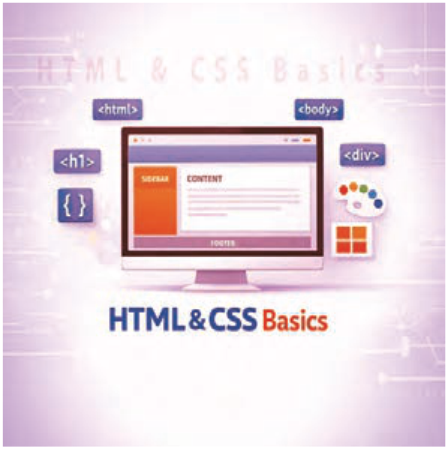

# پودمان دوم

---

<!-- pdf-page: 89 | book-page: 83 -->

**صفحه ۸۳**

# پودمان دوم

## طراحی صفحات وب ایستا

امروزه بخش عمده‌ای از خدمات، آموزش، تجارت، ارتباطات و سرگرمی‌ها از طریق فضای وب قابل دسترسی است. اگرچه وب در ابتدا صرفًا ابزاری برای نمایش متون و تصاویر ساده بود، اما با پیشرفت تکنولوژی به بستری تعاملی، هوشمند و کاربردی تبدیل شده است. این تحول، اهمیت طراحی بصری و تجربه کاربری را دوچندان کرده است، چرا که کاربران امروز به دنبال دریافت تجربه‌ای زیبا، ساده و کارآمد هستند. در همین راستا، طراحی رابط کاربری (`UI`) به عنوان یکی از ارکان کلیدی در توسعه وب‌سایت‌های استاندارد و جذاب شناخته می‌شود. تکامل وب را می‌توان در سه نسل اصلی دسته‌بندی کرد:

وب ۱.۰: حالت فقط خواندنی (`Read-Only`) و فاقد تعامل وب ۲.۰: قابلیت تعامل کاربران و تولید محتوای مشارکتی وب ۳.۰: هوشمند، شخصی‌سازی شده و مبتنی بر داده‌های معنایی در ادامه این مسیر تکاملی، درک عمیق از اصول طراحی رابط کاربری (`UI`) و تجربه کاربری (`UX`) بدون تسلط بر زیرساخت‌های فنی وب امکان‌پذیر نیست؛ بنابراین در این پودمان، به بررسی دو ستون بنیادین توسعه وب یعنی `HTML` و `CSS` پرداخته می‌شود. در اینجا، نحوه پیاده‌سازی معنای محتوا با تگ‌های استاندارد `HTML` و کنترل گرافیکی و چیدمان آنها با `CSS`، به صورت فنی و ساختاریافته مورد تحلیل قرار می‌گیرد تا با ترکیب دقیق این دو تکنولوژی، ساختاری پایدار، واکنش‌گرا و ظاهری متناسب با استانداردهای مدرن وب قابل ارائه باشد.
