# طراحی ساختار صفحات وب با HTML


---

<!-- pdf-page: 90 | book-page: 84 -->

**صفحه ۸۴**

## واحد یادگیری ١

## طراحی ساختار صفحات وب با HTML

### آیا تابه‌حال اندیشیده‌اید

فرایند طراحی یک وب‌سایت دارای چه مراحلی است؟

طرح اولیه وب‌سایت به چه شکلی ارائه می‌شود؟

چگونه می‌توان عناصر مختلفی مانند متن، تصویر، ویدئو، منو و ... را در صفحه وب نمایش داد؟

پیوند بین صفحات چگونه ایجاد می‌شود؟

فرم‌های ورود اطلاعات چگونه طراحی می‌شوند؟

`CSS` چه نقشی در طراحی و زیباسازی صفحات وب ایفا می‌کند؟

طراحی واکنش‌گرای صفحه وب نسبت به پهنای دستگاه به چه شکلی انجام می‌شود؟

### در پایان از هنرجو انتظار می‌رود

1 صفحه اصلی سایت (`index.html`) را با ساختاری استاندارد ایجاد نماید.

2 تگ‌های سطح بالای صفحه را به‌صورت صحیح استفاده نماید.

3 منوی ناوبری صفحه را با استفاده از تگ `<nav>` و عنصر لیست، درون عنصر معنایی `<header>` ایجاد نماید.

4 محتوای اصلی صفحه را درون عنصر معنایی `<main>` ایجاد نماید و توانایی به‌کارگیری تگ `<section>` را برای ایجاد بخش‌هایی از صفحه داشته باشد.

5 برای نگهداری محتوای بخش‌هایی از صفحه از عنصر `<div>` استفاده نماید.

6 تگ کامنت (>-- --!<) را برای مستندسازی برخی کدها استفاده نماید.

### استاندارد عملکرد

توانایی ایجاد یک ساختار استاندارد برای صفحه وب با به‌کارگیری صحیح تگ‌های `HTML5`، به‌گونه‌ای که ساختار و محتوای صفحه برای موتورهای جس‌توجو و ابزارهای صفحه‌خوان (`Screen` `reader`) قابل درک باشد، همچنین تنظیمات زبان صفحه و جهت نمایش محتوا در مرور‌گر به‌درستی انجام شود.


---

<!-- pdf-page: 91 | book-page: 85 -->

**صفحه ۸۵**

### نحوه کار وب

وب (`World` `Wide` `Web`) در سال 1989 توسط تیم برنرزلی در سازمان پژوهش‌های هسته‌ای اروپا (`CERN`) ایجاد شد. هدف اولیه آن تسهیل به اشتراک‌گذاری اطلاعات بین محققان بود. اولین وب‌سایت در سال 1991 راه‌اندازی شد و از آن زمان به سرعت گسترش یافت و به بخشی اساسی از زندگی روزمره انسان‌ها تبدیل شد.

وب ب‌هوسیله پروتکل‌های خاصی مانند `HTTP` و `HTTPS` کار می‌کند. این پروتکل‌ها روش‌هایی را برای ارسال و دریافت اطلاعات بین مرورگرها و سرورها مشخص می‌کنند.

زمانی که کاربر یک آدرس وب را در مرورگر خود وارد می‌کند، مراحل زیر رخ می‌دهد:

1 ترجمه نام دامنه: مرورگر به یک سیستم 1 `DNS` متصل می‌شود تا نام دامنه (مثلاً `www.chap.sch.ir`) را به یک آدرس `IP` تبدیل کند. آدرس `IP` دریافتی متعلق به وب‌سرور2 مورد نظر خواهد بود.

2 ارسال درخواست (`HTTP` `Request`): پس از دریافت آدرس `IP`، مرورگر یک درخواست `HTTP` به وب‌سرور مقصد ارسال می‌کند که شامل اطلاعاتی درباره نوع محتوا و درخواست کاربر است.

3 پاسخ‌دهی سرور (`HTTP` `Response`): سرور درخواست را پردازش می‌کند، در صورت لزوم اطلاعاتی را از پایگاه داده (`Database`) دریافت می‌کند و سپس محتوا را به صورت یک پاسخ `HTTP` به مرورگر کاربر ارسال می‌کند. این محتوا می‌تواند شامل فایل‌های `HTML`، `CSS`، `JavaScript` و تصاویر باشد.

4 نمایش محتوا: مرورگر محتوای دریافت شده را تفسیر می‌کند و آن را به‌صورت یک صفحه وب برای کاربر نمایش می‌دهد (شکل1).

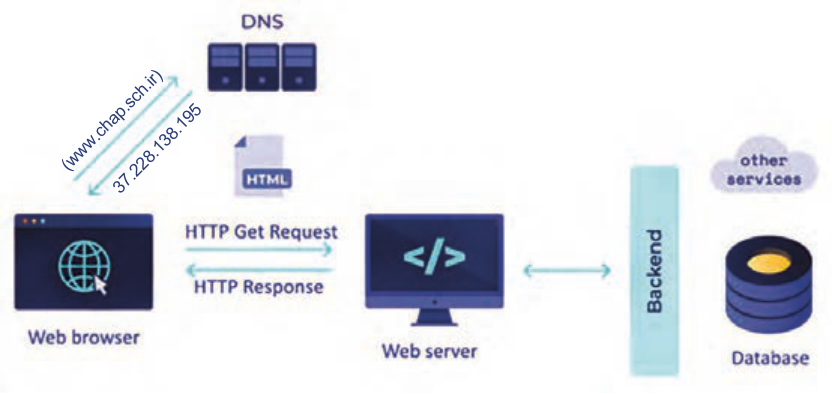

```
(www.chap.sch.ir)
```

37.228.138.195

**شکل 1**

1 `DNS` وظیفه تبدیل نام دامنه وب‌سایت به آدرس عددی `IP` را دارد. مرورگرها برای ارسال درخواست کاربر به و‌بسرور مقصد نیازمند آدرس `IP` آن سرور هستند. از آنجایی که به خاطر سپردن آدرس `IP` وب سایت‌ها برای کاربران دشوار است، بنابراین کاربران در هنگام ارتباط با مرورگر، از نام دامنه استفاده می‌کنند (مانند `chap.sch.ir`)، اما مرورگر آدرس دامنه را برای `DNS` ارسال می‌کند تا آدرس `IP` مربوط به وب سرور مقصد را به‌دست آورد.

2 و‌بسرور یک سیستم سخت‌افزاری است که میزبان اسناد وب سایت (مانند فایل‌های `HTML`، تصاویر، ویدئوها، پایگاه داده‌ها و ...) است، این سخت افزار با استفاده از نرم‌افزارهای مشخصی وظیفه نگهداری و مدیریت اطلاعات وب‌سایت را به عهده دارد. و‌بسرورها درخواست کاربران را با واسطه از طریق مرورگر دریافت می‌کنند و سپس صفحات پاسخ را برای مرورگر کاربر ارسال می‌کنند.


---

<!-- pdf-page: 92 | book-page: 86 -->

**صفحه ۸۶**

### برخی از مفاهیم اصلی طراحی وب

وب دارای مفاهیم کلیدی مختلفی است که آگاهی نسبت به آنها برای هر توسعه‌دهندۀ وب (`Web` `developer`) ضروری است. در ادامه، به شرح این مفاهیم پرداخته می‌شود:

طراح وب (`Web` `designer`): فرد یا تیمی که مسئول طراحی ظاهر نمایشی و‌ب‌سایت است. این حرفه ترکیبی از طراحی گرافیکی، طراحی تجربه کاربری (`UX`) و طراحی رابط کاربری (`UI`)، ایجاد `wire` `frame` و نمونه اولیه است.

تجربه کاربری (`UX`): تجربه‌ای که کاربر بعد از بازدید از وب‌سایت برای دسترسی به اطلاعات، محصولات و خدمات کسب می‌کند.

رابط کاربری (`UI`): عناصر تعاملی صفحه مانند دکمه‌ها، فرم‌ها و منوها که کاربران ب‌هوسیله آنها با وب‌سایت تعامل دارند.

`Front-end:` بخشی از وب‌سایت که ارتباط مستقیمی با کاربر دارد. مباحث بخش فرانت‌اند شامل ظاهر صفحه وب، رابط کاربری (`UI`) و تجربه کاربری (`UX`) می‌شود.

`Back-end:` بخش پش‌تصحنۀ وب‌سایت یا اپلیکیشن که شامل منطق اصلی برنامه، پردازش داده‌ها و ارتباط با پایگاه داده است و کاربر تعامل مستقیمی با آن ندارد.

توسعه‌دهندۀ وب (`Web` `developer`): فرد یا تیمی که طرح اولیۀ وب‌سایت را با استفاده از زبان‌های برنام‌هنویسی، به صفحات وب قابل استفاده تبدیل می‌کند. توسعه‌دهندۀ وب می‌تواند نقش طراح وب را نیز داشته باشد. وظایف اصلی توسعه دهندۀ وب شامل موارد زیرمی‌باشد:

1 توسعه‌دهندۀ سمت کاربر (`Front-end-developer`): روی ظاهر سایت و عناصری تمرکز دارد که کاربر مستقیمًا با آنها سروکار دارد.

2 توسعه‌دهندۀ سمت سرور (`Back-end-developer`): روی مباحث سمت سرور مانند مدیریت پایگاه داده و پردازش داده‌های کاربران تمرکز دارد.

دامنه (`Domain`): نامی منحصر‌به‌فرد که برای دسترسی به یک وب‌سایت استفاده می‌شود، مانند `.google.com` کاربران با استفاده از نام دامنه وارد یک سایت می‌شوند. نام دامنه، جایگزینی قابل فهم برای آدرس‌های عددی `IP` است که به‌خاطر سپردن آدرس سایت را برای کاربران سهولت می‌بخشد.

`URL:` آدرس منحصربه‌فردی که برای پیدا کردن و شناسایی یک منبع خاص (مثل صفحه وب، عکس، ویدئو یا فایل) در اینترنت استفاده می‌شود. `URL` مخفف `Uniform` `Resource` `Locator` است (شکل2).


---

<!-- pdf-page: 93 | book-page: 87 -->

**صفحه ۸۷**

`Host:` فضایی برای ذخیره‌سازی اسناد وب‌سایت است، به‌طوری‌که امکان دسترسی به منابع سایت از طریق اینترنت فراهم گردد. تمام فایل‌های یک سایت (شامل فایل های `HTML`، `CSS`، اسکریپ‌تها، تصاویر و ...) باید روی یک رایانه و‌بسرور ذخیره گردند تا کاربران بتوانند با وارد کردن آدرس سایت به محتوای آن دسترسی پیدا کنند.

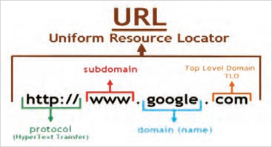

**شکل 2**

`Localhost` (هاست محلی): یک سیستم رایانه‌ای مجهز به نر‌مافزار و‌بسرور است که برای اجرای کدهای سمت سرور (`Back-End`)، ایجاد و مدیریت پایگاه داده‌ها استفاده می‌شود. هاست محلی صرفًا برای تمرین، آزمایش و رفع اشکال صفحات وب‌سایت کاربرد دارد. نرم‌افزارهای وب‌سرور مختلفی وجود دارند که می‌توانند یک سیستم خانگی را به و‌بسرور تبدیل کنند، اما نکته مهم این است که تمام و‌بسرورهایی که در سطح اینترنت پاسخگوی کاربران هستند، دارای `IP` اینترنتی هستند؛ بنابراین سیستم‌های خانگی و کلاس درس که فاقد `IP` اینترنت هستند، امکان پاسخ‌دهی به کاربران راه دور را ندارند.

### نکته

پس از طراحی و آزمایش صفحات سایت روی لوکال هاست، می‌توانید محتوای سایت خود را به یک وب هاست یا وب سرور انتقال دهید. دسترسی به یک وب سرور نیازمند پرداخت هزینه است، اما برخی شرکت‌ها امکان استفاده از هاست‌های رایگان را با امکانات و منابع محدود فراهم می‌کنند که برای یک پروژه واقعی مناسب نیستند. مناسب‌ترین‌هاست برای سایت‌هایی که منابع سخت افزاری قدرتمندی نیاز ندارند هاست‌های اشتراکی هستند.

هاست اشتراکی:

شرکت‌های هاستینگ طرح‌های مختلفی را برای ارائه خدمات خود دارند که هر طرح (`Plan`) دارای امکانات سخت‌افزاری و پهنای باند متفاوتی است. از جمله این طرح‌ها می‌توان به هاست اشتراکی، سرور مجازی، سرور اختصاصی و سرور ابری اشاره نمود. در طرح هاست اشتراکی امکانات سخت‌افزاری هاست مانند فضای دیسک، پهنای باند، `CPU` و حافظه `RAM` بین چندین وب سایت تقسیم می‌شود. به این ترتیب تمام توان سخت‌افزاری و‌بسرور صرف پاسخ‌دهی به درخواست‌های کاربران یک سایت نمی‌شود. به همین دلیل چنین هاس‌تهایی برای سایت‌های کوچک با ترافیک محدود مناسب هستند.


---

<!-- pdf-page: 94 | book-page: 88 -->

**صفحه ۸۸**

طراحی واکنش‌گرا (`Responsive` `Design`): یک روش طراحی صفحه که امکان تطبیق‌پذیری خودکار صفحه را بر اساس اندازه صفحه نمایش (دستگاه‌های مختلف مانند موبایل، تبلت و دسکتاپ) فراهم می‌کند.

سئو (`SEO`): مجموعه‌ای از تکنیک‌ها برای بهبود رتبه وب‌سایت در نتایج موتورهای جس‌توجو است. سئو شامل بهینه‌سازی محتوا، ساختار `URL` و استفاده از متاتگ‌ها و ... است.

دسترس‌پذیری (`Accessibility`): طراحی وب‌سایت به گونه‌ای که برای همه کاربران (از جمله افراد دارای ناتوانی‌های جسمی یا بینایی) قابل دسترسی باشد.

پایگاه‌داده: بسیاری از وب‌سایت‌ها برای ذخیره و مدیریت اطلاعات از پایگاه‌داده‌ها (`Database`) استفاده می‌کنند. پایگاه‌داده‌ها می‌تواند شامل اطلاعات کاربران، محصولات، مقالات و محتواهای دیگر باشند.

کنترل نسخه: سیستم‌های کنترل نسخه امکان مدیریت تغییرات کد را فراهم می‌کنند، به‌گونه‌ای که بازگشت به نسخه‌های قبلی به‌راحتی امکان‌پذیر باشد.

### کنجکاوی

1 در مورد پروتکل `SSL` تحقیق کنید و نتیجه آن را در کلاس ارائه دهید.

2 درباره انواع وب‌سایت و کاربرد آنها تحقیق کنید و نتیجه آن را در کلاس ارائه دهید.

فرایند طراحی سایت طراحی و پیاده‌سازی یک وب‌سایت، فرایندی مرحله‌به‌مرحله است که هر مرحله نقش مهمی در موفقیت نهایی پروژه دارد. اگر این مراحل به‌درستی و با ترتیب مناسب انجام شوند، نتیجۀ کار سایتی کاربردی، زیبا و قابل گسترش خواهد بود.

مراحل کلی طراحی سایت فرایند طراحی سایت به‌صورت خلاصه شامل مراحل زیر است:

تعریف هدف و نیازمندی‌ها طراحی نقشه سایت (`site` `map`) ایجاد وایر فریم (`wire` `frame`) ایجاد ساختار صفحات با `HTML` طراحی ظاهر صفحات با `CSS` افزودن تعاملات کاربر با `JavaScript` طراحی پایگاه داده (مانند جدول کاربران، محصولات و سفارش‌ها) ایجاد ارتباط بین صفحات و پایگاه داده افزودن قابلیت ورود و ثبت‌نام کاربران پیاده‌سازی سبد خرید و پرداخت تست عملکرد سایت رفع خطاها و بهینه‌سازی انتشار سایت روی سرور


---

<!-- pdf-page: 95 | book-page: 89 -->

**صفحه ۸۹**

تعریف هدف و نیازمندی‌ها: پیش از شروع طراحی یا نوشتن کد صفحات سایت، باید مشخص شود که و‌بسایت به چه منظور و برای چه گروهی از کاربران طراحی می‌شود. شروع طراحی بدون شناخت نیازها و تعیین مأموریت وب‌سایت، معموًلا باعث بروز مشکلات اساسی در حین پیاده‌سازی پروژه و نیاز به طراحی مجدد می‌شود. به همین دلیل، اولین و مهم‌ترین گام در طراحی هر وب‌سایت، تعریف هدف و نیازمندی‌های آن است.

تعیین هدف پروژه: در این مرحله باید به پرسش‌های زیر پاسخ داده شود:

هدف از ایجاد سایت چیست؟

چه نوع کالا یا خدماتی در سایت ارائه می‌شود؟

کاربران اصلی سایت چه کسانی هستند؟

چه امکاناتی باید در سایت وجود داشته باشد؟

### مثال

یک تیم طراح و توسع‌هدهندۀ وب قصد دارد وب سایتی را برای فروش کتاب‌های درسی ایجاد نماید.

اغلب کاربران این سایت هنرآموزان و هنرجویان هستند. امکانات مورد نیاز شامل ثبت نام کاربران، نمایش کالاها، سبد خرید و پرداخت آنلاین است.

تحلیل نیازمندی‌ها: در این مرحله، نیازهای سایت از دو جنبه بررسی می‌شود:

الف) نیازمندی‌های کاربر (`User` `Requirements`): این نیازمندی‌ها شامل ویژگی‌ها و امکاناتی است که کاربران در هنگام استفاده از سایت به آنها نیاز دارند (جدول1).

**جدول 1**

توضیح

نیاز کاربر

کاربر بتواند حساب کاربری ایجاد کرده و وارد سایت شود.

ثبت‌نام و ورود جس‌توجوی

امکان جست‌وجو براساس نام یا دسته‌بندی کالا وجود داشته باشد.

محصول

کاربر بتواند محصولات را به سبد خرید اضافه کند.

سبد خرید

فرایند خرید از طریق درگاه پرداخت انجام شود.

پرداخت اینترنتی

کاربر بتواند سفارش‌های قبلی خود را مشاهده کند.

مشاهده سفارش‌ها


---

<!-- pdf-page: 96 | book-page: 90 -->

**صفحه ۹۰**

ب) نیازمندی‌های فنی (`Technical` `Requirements`): این نیازمندی‌ها شامل زبان‌های نشانه‌گذاری و برنامه‌نویسی، سیستم مدیریت پایگاه‌ها و توجه به امنیت و گسترش‌پذیری وب‌سایت است (جدول 2).

**جدول 2**

توضیح

مورد `Python` (`Django`)زبان برنامه‌نویسی `SQLite` یا `MySQL`پایگاه داده `HTML`، `CSS`، `Bootstrap`طراحی ظاهر رمزنگاری رمز عبور کاربران امنیت

امکان افزودن محصولات و امکانات جدید در آینده

قابلیت گسترش

طراحی نقشۀ سایت (`Site` `Map`): پس از مشخص شدن هدف و نیازهای وب‌سایت، طراحی نقشۀ سایت امری ضروری است. نقشۀ سایت ساختار صفحات، ارتباطات میان آنها و مسیر حرکت کاربر را درون سایت مشخص می‌کند. طراحی صحیح نقشۀ سایت موجب درک بهتر ساختار سایت و ساده شدن فرایند طراحی و پیاده‌سازی آن می‌گردد.

مراحل طراحی نقشۀ سایت

### کار کارگاهی

مرحلۀ ۱: مشاهده و بررسی سایت‌های فروشگاهی با راهنمایی هنرآموز خود، دو یا سه سایت فروشگاهی ساده را بررسی کنید.

به‌عنوان نمونه: فروشگاه موبایل، فروشگاه لباس، فروشگاه لوازم دیجیتال مواردی که باید بررسی شود: چه صفحاتی در منوی سایت وجود دارد؟ کاربر از صفحۀ اصلی به کدام صفحات هدایت می‌شود؟ فرایند ورود کاربر، انتخاب کالا و استفاده از سبد خرید چگونه انجام می‌شود؟

ظاهر سایت ساده است یا شلوغ؟

مرحلۀ ۲: شناسایی صفحات اصلی سایت در این مرحله، لازم است صفحات مشترک میان سایت‌ها بررسی‌شده را شناسایی و یادداشت نمایید.

نمونه‌ای از صفحات رایج در یک فروشگاه اینترنتی عبارت‌اند از:

`Home`

```
Products
Product Details
```

`Cart`

```
Login / Register
User Profile
About / Contact
```


---

<!-- pdf-page: 97 | book-page: 91 -->

**صفحه ۹۱**

مرحله ۳: ترسیم نقشۀ سایت (`Site` `Map`) درا ین مرحله نقشه سایت را به‌صورت نوشتاری یا گرافیکی

`Home`

طراحی کنید. یک روش ساده برای ترسیم نقشه این است که صفحۀ اصلی در بالای نقشه و سایر صفحات

```
Products details
Products
```

به‌صورت زیر شاخه در زیر صفحۀ اصلی قرار گیرند.

`Cart`

```
User proflie
Login/Register
```

شکل روبه‌رو یک نقشۀ نوشتاری محسوب می‌شود:

علاوه بر روش نوشتاری، نقشه سایت می‌تواند به‌صورت

```
Contact us
```

ترسیمی با استفاده از کادرها و فلش‌ها نمایش داده شود.

مرحله ۴: بیان مسیر حرکت کاربر در این مرحله، مسیر حرکت کاربر در سایت توضیح داده می‌شود. برای توصیف مسیر به موارد زیر توجه کنید:

کاربر از چه صفحه‌ای وارد سایت می‌شود؟ چگونه محصول موردنظر را انتخاب می‌کند؟ از چه مسیری به سبد خرید می‌رسد؟

در چه مرحله‌ای وارد حساب کاربری می‌شود؟

مثال زیر یک نمونه از توصیف مسیر حرکت کاربر است:

کاربر ابتدا وارد صفحۀ اصلی سایت می‌شود، سپس به صفحۀ محصولات مراجعه کرده و یک محصول را انتخاب می‌کند. پس از مشاهدۀ جزئیات محصول، آن را به سبد خرید اضافه کرده و در نهایت برای ثبت سفارش وارد حساب کاربری می‌شود.

طراحی ظاهر صفحات

**جدول3**

پس از مشخص شدن هدف و نیازمندی‌ها، نوبت آن

ابزارهای طراحی ظاهر سایت (فرانت‌اند)

است که ظاهر صفحات وب سایت طراحی شود.

هرچقدر ظاهر سایت زیباتر و منظم‌تر باشد، کاربران

### کاربرد

زبان

بیشتری جذب سایت خواهند شد. در یک سایت

ساختار و عناصر صفحه (مثل متن،

فروشگاهی، زیبایی سایت می‌تواند منجر به جذب

`HTML`

تصویر، جدول، دکمه)

مشتری و فروش بیشتر شود.

زیباسازی وکنترل ظاهر عناصر شامل

برای ایجاد عناصر درون صفحات وب از فرازبان

`CSS`

تنظیم رنگ‌ها، فونت‌ها ، اندازه‌ها،

`HTML` و برای سب‌کدهی به عناصر صفحه از زبان

چیدمان و ...

توصیفی `CSS` استفاده می‌شود (جدول3).


---

<!-- pdf-page: 98 | book-page: 92 -->

**صفحه ۹۲**

طراحی سایت به‌صورت تیمی: فرایند طراحی سایت شامل مراحل متعددی است که هر کدام نیازمند مهارت‌های تخصصی هستند. به همین دلیل، طراحی سایت معمولاً به‌صورت تیمی انجام می‌شود و هر عضو مسئولیت مشخصی دارد.

نقش‌های اصلی در تیم طراحی سایت

1 طراح تجربه کاربری (`UX` `Designer`): تحلیل نیاز کاربران و بهینه‌سازی تجربه استفاده از سایت

2 طراح رابط کاربری (`UI` `Designer`): طراحی عناصر بصری مانند رنگ‌ها، فونت‌ها، دکمه‌ها و فرم‌ها

3 توسعه‌دهندۀ فرانت‌اند (`Front-End` `Developer`): پیاده‌سازی بخش ظاهری و تعاملی سایت

4 توسعه‌دهندۀ بک‌اند (`Back-End` `Developer`): برنامه‌نویسی سمت سرور، مدیریت پایگاه داده و امنیت

5 متخصص محتوا (`Content` `Specialist`): تحقیق کلمات کلیدی و تولید محتوای متنی جذاب

6 متخصص سئو (`SEO` `Specialist`): بهینه‌سازی سایت برای موتورهای جس‌توجو

بسته به حجم کار پروژه، بودجه و تعداد نفرات تیم طراح و توسعه‌دهنده وب‌سایت، هر نقش می‌تواند به یک یا چند نفر اختصاص داده شود. در پروژه‌های کوچک ممکن است یک فرد چندین نقش را بر عهده داشته باشد. در جدول 4 ابزارهای متداول مورد استفاده توسط هر یک از نقش‌های تیم طراحی سایت معرفی شده است. این ابزارها به بهبود کیفیت پروژه و تسهیل همکاری بین اعضای تیم کمک می‌کنند.

جدول 4 ابزارهای متداول در طراحی سایت

نقش

ابزارها

```
Photoshop ،InVision ،Sketch ،Adobe XD ،Figma
```

طراح `UX` و `UI` توسعه‌دهندۀ فرانت‌اند`Bootstrap` ،`JavaScript` ،`CSS` ،`HTML`

```
توسعه‌دهندۀ بک‌اندDjango) ،Python ،Flask( ،JavaScript (Node.js)
ویرایشگر کدAtom ،Sublime Text ،Visual Studio Code
مرورگر و ابزار توسعهMicrosoft Edge ،Mozilla Firefox ،Google Chrome
```

پلتفرم‌های مدیریت محتوا و تولید محتوای

```
Grammarly ،Google Docs ،WordPress
```

تحت وب

```
Yoast SEO ،Moz ،SEMrush ،Google Analytics
```

متخصص سئو

سایر ابزار مورد استفاده تیم طراحی`Cyberduck` ،`FileZilla`

```
GitHub ،Git
```

کنترل نسخه


---

<!-- pdf-page: 99 | book-page: 93 -->

**صفحه ۹۳**

طراحی ساختار صفحه با `HTML` در یک وب‌سایت، صفحات وب متعددی مانند موارد زیر وجود دارد:

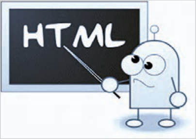

صفحۀ اصلی (`index.html`) صفحۀ محصولات (`products.html`) صفحۀ سبد خرید (`cart.html`) صفحۀ ورود/ثبت‌نام (`login.html`)

**شکل 3**

گام اول در طراحی این صفحات، ایجاد ساختار اولیه صفحات و قرار دادن عناصر صفحه درون آنهاست. این بخش به معرفی نحوه درج عناصر درون صفحات وب می‌پردازد.

نشانه‌گذاری عناصر در سند `HTML` `:HTML` مخفف `Hypertext` `Markup` `Language` به معنای زبان نشانه‌گذاری ابرمتن است. `HTML` یک زبان برنامه‌نویسی نیست، بلکه یک زبان نشانه‌گذاری برای ایجاد و ساختاردهی عناصر مختلف در صفحات وب به شمار می‌آید. جانمایی بخش‌های مختلف صفحه مانند سرصفحه، منو، ناحیه محتوای اصلی، ستون کناری و پاصفحه توسط `HTML` انجام می‌شود.

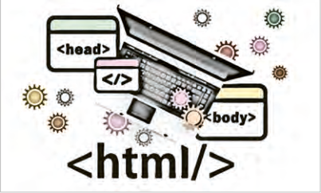

علاوه‌براین عناصر مختلفی همچون متن، تصویر، ویدئو، صوت و ... توسط کدهای `HTML` درون بخش‌های مختلف صفحه درج می‌شود.

**شکل 4**

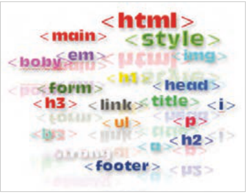

معرفی تگ (`Tag`): یک صفحۀ وب شامل عناصر مختلفی مانند تیترها، پاراگراف‌ها، پیوندها، تصاویر، لیست و غیره است. هر یک از عناصر موجود در صفحات وب توسط تگ‌ها یا تگ‌های تعری‌فشده در زبان نشانه‌گذاری `HTML` ایجاد می‌شود. تگ‌های `HTML` در موضوعات مختلف قابل استفاده هستند.

**شکل 5**


---

<!-- pdf-page: 100 | book-page: 94 -->

**صفحه ۹۴**

شکل کلی یک تگ به صورت زیر است:

```
<TagName Attribute=""> Content </TagName>
```

اغلب تگ‌های `HTML` به‌صورت جفتی هستند. یعنی دارای تگ آغازین و پایانی هستند. تگ پایانی با علامت اسلش (/) شروع می‌شود. برخی تگ‌ها نیز به‌صورت خود بسته یا `self-closing` هستند و دارای تگ پایانی نیستند.

### مثال

به‌طور مثال تگ `p` به‌صورت جفتی نوشته می‌شود و تگ `img` به‌صورت خودبسته:

```
<p> This is a paragraph </p>

```

عبارت `Content` به محتوای داخل تگ `HTML` اشاره دارد. مجموعه تگ‌های آغازین، پایانی و محتوای بین آنها، یک عنصر وب را تشکیل می‌دهد.

عبارت `Attribute` به ویژگی یک عنصر اشاره می‌کند. به طور مثال تگ `` دارای ویژگی `width`، `height` و `src` برای تعیین پهنا، ارتفاع و آدرس تصویر است:

```

```

ایجاد یک صفحه وب ساده

### کار کارگاهی

برای ایجاد یک صفحه وب، باید از یک ساختار استاندارد استفاده شود، در غیراین‌صورت مشکلات مختلفی در زمینه نمایش صفحه توسط مرورگرهای مختلف، دستر‌سپذیری محتوا برای افراد نابینا، سرعت بارگذاری و .... ایجاد می‌شود. ساختار اولیه یک صفحه وب شامل تگ‌ها (برچسب‌های) تصویر روبه‌رو است:

```
<DOCTYPE html!>
<html lang="fa">
```

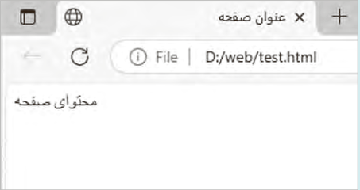

```
<head>
<meta charset="UTF-8">
</title> عنوان صفحه <title>
</head>
<body>
</body>
</html>
```


---

<!-- pdf-page: 101 | book-page: 95 -->

**صفحه ۹۵**

تگ `<Doctype` `html`!>: در ابتدای یک صفحه وب از تگ `<Doctype`!

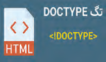

`html>` استفاده می‌شود. این تگ به مرورگرها و موتورهای جس‌توجو اعلام می‌کند که این سند از نوع `html5` است.

**شکل 6**

تگ `<html<` `:>html>` تگ ریشه سند `HTML` است. تمام محتوای یک صفحه وب درون این تگ قرار می‌گیرد. این تگ دارای یک ویژگی مهم به‌نام `lang` است که زبان صفحه را برای مرورگر، ابزارهای صفح‌هخوان و موتورهای جس‌توجو مشخص می‌کند. تگ `<html>` دارای ویژگی دیگری با نام `dir` است که جهت نمایش محتوا را مشخص می‌کند و دارای دو مقدار `rtl` و `ltr` به معنای راست به چپ و چپ به راست است.

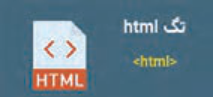

**شکل 7**

تگ `<head>:` این برچسب باید قبل از تگ `<body>` نوشته شود. در این بخش اطلاعات متا، عنوان صفحه، الحاق فایل‌های `CSS` و دیگر منابع غیرنمایشی قرار می‌گیرد. این اطلاعات برای مرورگر و موتورهای جس‌توجو مهم هستند.

تگ `<title>:` این تگ عنوان صفحه را مشخص می‌کند که در نوار عنوان مرورگر و نتایج جس‌توجو نمایش داده می‌شود.

تگ‌های `<meta>:` این تگ‌ها اطلاعاتی را درباره صفحه وب فراهم می‌کنند. برخی از متداول‌ترین تگ‌های متا عبارت‌انداز:

متاتگ `Charset:` نوع رمزگذاری کاراکترهای صفحه وب را برای مرورگر مشخص می‌کند. این تگ به مرورگرها اعلام می‌کند که کاراکترهای صفحه را چگونه تفسیر کنند تا محتوای صفحه به درستی نمایش داده شود.

متاتگ `viewport:` برای بهینه‌سازی نمایش صفحه وب بر روی دستگاه‌های موبایل و تبلت استفاده می‌شود:

```
<meta name="viewport" content="width=device-width, initial-scale=1.0">
```

### کنجکاوی

درباره این متا‌تگ تحقیق کنید و نتیجه را توسط چند تصویر درباره تأثیر ب‌هکارگیری این تگ بر چیدمان عناصر صفحه در دستگاه‌های مختلف نمایش دهید.

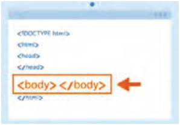

تگ `<body>:` شامل محتوای قابل مشاهده برای کاربران است.

تمام عناصر نمایشی مانند متن، تصاویر، ویدئوها و غیره در این بخش قرار می‌گیرند.

**شکل 8**


---

<!-- pdf-page: 102 | book-page: 96 -->

**صفحه ۹۶**

ایجاد یک صفحه وب ساده

### کار کارگاهی

کدهای `HTML` درون یک فایل متنی با پسوند `html` ذخیره می‌شوند. برای نوشتن این کدها می‌توان از ویرایشگرهای متنی ساده مانند `Notepad` یا ویرایشگرهای حرفه‌ای همچون `VScode` استفاده نمود.

از قابلیت‌های برنامه `VScode` می‌توان به نمایش رنگی کدها، تکمیل خودکار کد، امکان اجرای سریع کد برنامه و اضافه کردن انواع افزونه‌ها اشاره کرد.

ایجاد فایل `HTML` برای مجموعه تمرین‌ها یک پوشه با نام `Web` در مسیر `Document` یا یکی از درایوها ایجاد کنید تا فایل‌های `HTML` درون آن پوشه ذخیره گردد. در برنامه `VScode` از منوی `file` گزینه `Open` `folder` را انتخاب کنید و سپس پوشه `Web` را انتخاب کنید تا در مدت زمان کار روی پروژه محتوای پوشه در سمت چپ پنجره قابل مشاهده و در دسترس باشد.

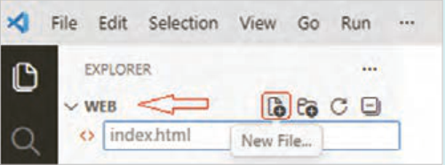

سپس روی دکمه `New` `file` کلیک کنید، نام فایل را مطابق تصویر بالا درون کادر متنی بنویسید و کلید `Enter` را بفشارید تا فایل ایجاد شود.

کدهای اولیه `HTML` را به همراه یک متن ساده، مطابق تصویر زیر بنویسید و با فشردن کلید `Ctrl+S` آن را ذخیره کنید.

نمایش صفحه وب در مرورگر:

روش اول: برای مشاهده خروجی کدها این است که کلیدهای `Win+E` را بفشارید و پوشه `Web` را از مسیر مورد نظر خود باز کنید. سپس فایل `index.html` را با مرورگر دلخواه باز کنید. بعد از انجام هر تغییر در فایل `Html` لازم است که محتوای صفحه را در مرورگر تازه‌سازی (`Refresh`) کنید. این کار از طریق دکمه `F5` یا کلیک روی دکمه در بالای صفحه امکان‌پذیر است.

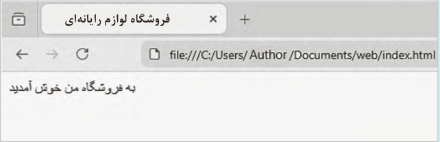

فروشگاه لوازم رایانه‌ای


---

<!-- pdf-page: 103 | book-page: 97 -->

**صفحه ۹۷**

روش دوم: برای مشاهده خروجی استفاده از قابلیت `Go` `Live` در برنامه `VScode` است که در این حالت، مشاهده خروجی نیازی به تازه‌سازی صفحه ندارد. برای استفاده از قابلیت `Go` `Live` لازم است که افزونه `Live` `Server` را در برنامه `Vscode` نصب کنید.

بدین منظور روی دکمه `Extensions` در سمت چپ پنجره برنامه کلیک کنید و سپس افزونه `live` `server` را جس‌توجو و نصب کنید.

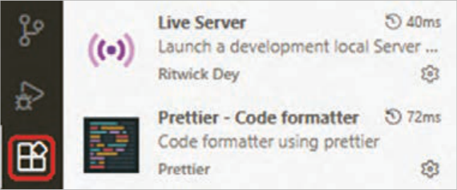

بعد از نصب افزونه، برای مشاهده خروجی برنامه کافیست رو دکمه `Go` `live` در پایین پنجره کلیک کنید.


به این ترتیب صفحه مرورگر به شکل زیر ظاهر می‌گردد:

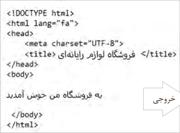

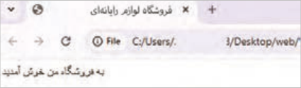

خروجی

بعد از انجام هر تغییر جدید در کد صفحه، فایل را توسط کلید `Ctrl+S` ذخیره کنید، سپس توسط کلید ترکیبی `Alt+Tab` به صفحه مرورگر مراجعه کنید. خروجی جدید بدون نیاز به تازه‌سازی ظاهر می‌شود.


---

<!-- pdf-page: 104 | book-page: 98 -->

**صفحه ۹۸**

### فعالیت

به محتوای نوار آدرس در دو روش نمایش خروجی توجه کنید. چه تفاوتی بین آنها وجود دارد؟ درباره آن در کلاس گف‌توگو کنید.

### عناصر متنی در صفحه وب

در یک صفحه وب انواع مختلفی از عناصر متنی وجود دارد که نشانه‌گذاری هر یک از آنها توسط تگ مشخصی صورت می‌پذیرد. این بخش به معرفی عناصر متنی صفحه وب می‌پردازد.

تیتربندی تگ‌های `<h1>` …`<h6>:`

صفحات وب دارای انواع متفاوتی از محتوا هستند. در یک صفحه وب که حاوی یک مقاله علمی یا ادبی باشد، برای سازمان‌دهی محتوا از تیترهای مختلف استفاده می‌شود. چنین تیترهایی در یک صفحه فروشگاهی کمتر به چشم می‌خورند، اما برای بخش‌های خاصی از صفحه کاربرد دارند.


برای نشانه‌گذاری تیترهای صفحه وب از تگ `<h1>` تا `<h6>` استفاده می‌شود. تگ `<h1>` برای موضوع اصلی صفحه استفاده می‌شود. تگ `<h2>` برای تیترهای زیر‌مجموعه موضوع اصلی به کار می‌رود که این تیترها دسته‌بندی موضوعات مطرح شده در صفحه را مشخص می‌کنند؛ بنابراین دارای اهمیت بالایی هستند. تگ‌های `<h3>` تا `<h6>` برای تیترهایی با موضوعات جزئی‌تر استفاده می‌شوند.

**شکل 9**

شکل کلی تگ‌های تیترگذاری

`</h1>` تیتر اصلی صفحه `<h1>` `</h2>` تیتر درجه `h2>` 2< `</h3>` تیتر درجه `h3>` 3< تیتر `<h1>` برای موتورهای جست‌وجو دارای اهمیت بالایی است چرا که موضوع صفحه را برای آنها مشخص می‌کند. این تیتر باید حاوی کلمات کلیدی موضوع صفحه باشد. توصیه می‌شود که این تیتر فقط یک‌بار در صفحه به کار برده شود.

به‌طور کلی تگ‌های `<h1>` تا `<h6>` سلسله مراتب موضوعات صفحه را مشخص می‌کنند. با استفاده درست این عناصر، کاربران می‌توانند محتوای صفحه را راحت‌تر مطالعه کنند و موضوعات مورد نظر خود را در میان محتواهای موجود پیدا کنند. علاوه بر این موتورهای جس‌توجو به راحتی متوجه موضوعات مطرح شده در صفحه می‌شوند و می‌توانند اطلاعات صفحه وب را به شکل بهتری در پایگاه داده خود ذخیره نمایند.

تیترگذاری مناسب محتوا تأثیر قابل توجهی در رتبه صفحه وب در نتایج جس‌توجو دارد.


---

<!-- pdf-page: 105 | book-page: 99 -->

**صفحه ۹۹**

به‌کارگیری تگ‌های تیترگذاری در صفحه `test.html` مطابق شکل زیر، تگ‌های تیتربندی را اعمال و

### کار کارگاهی

نتیجه را در مرورگر مشاهده کنید.

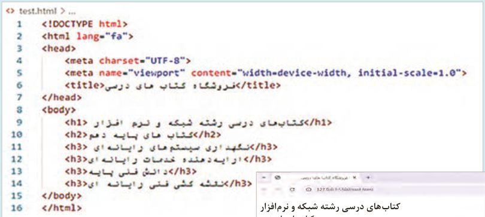

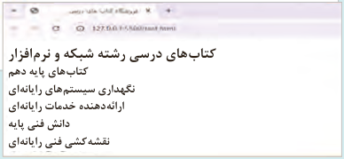

کتاب‌های درسی رشته شبکه و نرم‌افزار کتاب‌های پایه دهم نگهداری سیستم‌های رایانه‌ای ارائه‌دهنده خدمات رایانه‌ای دانش فنی پایه نقشه‌کشی فنی رایانه‌ای

تگ `<p>:` این تگ برای نشانه‌گذاری پاراگراف‌ها مورد استفاده قرار می‌گیرد. محتوایی که بین `<p>` و `<p/>` قرار می‌گیرد، از محتوای قبل و بعد خود جدا شده و در یک سطر جدید نمایش داده می‌شود. می‌توان درون `<p>` از متن ساده، لینک `<a>`، برجسته‌سازی `<b>` یا `<strong>`


**شکل 10**

و ... استفاده کرد.

تگ‌های `<strong>` و `<b>:` برای نمایش یک کلمه به‌صورت ضخیم، می‌توان از دو تگ `<b>` و `<strong>` استفاده نمود. مرورگر وب محتوای این دو تگ را به‌صورت یکسان نمایش می‌دهد، اما موتورهای جست‌وجو در برخورد با آنها تفسیر متفاوتی دارند. اگر عبارتی با تگ `<strong>` نشانه‌گذاری شود، به معنای آن است که محتوای این عنصر دارای اهمیت بالایی است و با موضوع صفحه ارتباط دارد. ابزارهای صفحه‌خوان (`Screen` `reader`) نیز محتوای تگ `<strong>` را با صدای بلندتری می‌خوانند، درحالی‌که در برخورد با تگ `<b>` تغییری در لحن خود ایجاد نمی‌کنند، چرا که تگ `<b>` مفهوم خاصی را منتقل نمی‌کند.

تگ‌های `<em>` و `<i>:` برای نمایش یک کلمه به صورت کج، از دو تگ `<em>` و `<i>` استفاده می‌شود.

هرچند که مرورگرهای وب محتوای این دو تگ را به صورت مشابه نمایش می‌دهند، اما معنای آنها در `HTML` و تأثیرشان بر روی موتورهای جس‌توجو و دسترسی به محتوا متفاوت است.


---

<!-- pdf-page: 106 | book-page: 100 -->

**صفحه ۱۰۰**

تگ `<em>` : مخفف عبارت `Emphasis` و به معنای تأکید است. استفاده از برچسب `<em>` باعث نمایش متفاوت یک عبارت و افزایش خوانایی متن می‌گردد. این امر به بهبود تجربه کاربری کمک می‌کند و در نتیجه تأثیر مثبتی بر سئوی صفحه خواهد داشت. ابزارهای صفحه‌خوان نیز در برخورد با تگ `<em>` با تغییر لحن صدای خود، اهمیت محتوای تگ را به کاربران نابینا اعلام می‌کنند.

تگ `<i>:` که مخفف عبارت `italic` است، بیشتر برای اهداف ظاهری و زیبایی‌شناسی به کار می‌رود و موتورهای جس‌توجو به آن توجه خاصی ندارند. همچنین دستگاه‌های صفحه‌خوان هنگام مواجه شدن با تگ `<i>` تغییری در لحن خود ایجاد نمی‌کنند.

به‌کارگیری تگ‌های `<i>` و `<em>:`

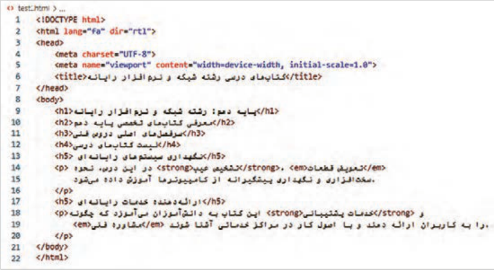

شکل ١١

عبارت`"dir` `="trl` در تگ `<html>` برای تعیین جهت نمایش محتوا از راست به چپ استفاده شده است.

خروجی کد به‌صورت شکل ٢١ خواهد بود:

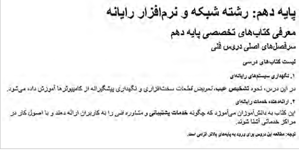

شکل ٢١


---

<!-- pdf-page: 107 | book-page: 101 -->

**صفحه ۱۰۱**

تگ‌های لیست: تگ‌های لیست برای سازمان‌دهی و نمایش اطلاعات استفاده می‌شوند. این تگ‌ها امکان مشاهده محتوا را ب‌هصورت منظم و قابل فهم فراهم می‌کنند. استفاده از لیست‌ها برای سازماندهی محتوا باعث خوانایی و جذابیت محتوا برای کاربران و در نتیجه بهبود تجربه کاربری و رتبه بهتر در نتایج جس‌توجو می‌شود.

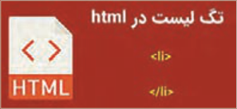

شکل ٣١

سه نوع لیست در `HTML` قابل نشانه‌گذاری است: لیست‌های مرتب، نامرتب و توضیحی.

این لیست‌ها توسط تگ‌های `<ul>`، `<ol>` و `<dl>` ایجاد می‌شوند.

تگ `<ul>:` مخفف عبارت `Unordered` `list` است. این تگ برای ایجاد یک لیست گلوله‌دار به‌کار می‌رود.

برای علامت‌گذاری عناصر لیست از تگ `<li>` استفاده می‌شود.

استفاده از تگ لیست:

### کار کارگاهی

فایل جدیدی به نام `services.html` ایجاد کنید. کدهای زی‌ر را در بخش `<body>` وارد کنید و نتیجه را در مرورگر مشاهده کنید.

فایل `products.html` را ایجاد کنید تگ `<ol>` را جایگزین تگ `<ul>` نمایید و عبارات لیست شکل زیر را درون آن بنویسید. فایل را ذخیره کنید و نتیجه را در مرورگر مشاهده کنید.

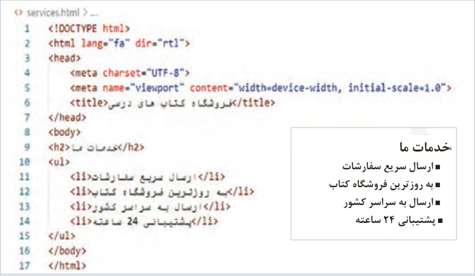

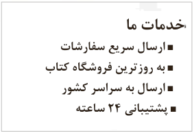

خدمات ما

ارسال سریع سفارشات به روزترین فروشگاه کتاب ارسال به سراسر کشور پشتیبانی 24 ساعته

تگ `<ol>:` مخفف عبارت `Ordered` `list` است. برای ایجاد لیست‌های شماره دار تگ `<ol>` استفاده می‌شود.


---

<!-- pdf-page: 108 | book-page: 102 -->

**صفحه ۱۰۲**

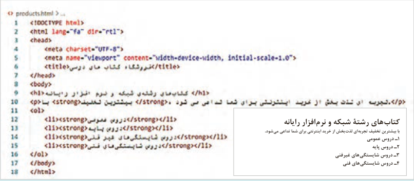

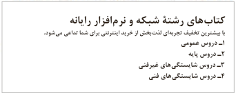

کتاب‌های رشتۀ شبکه و نرم‌افزار رایانه

با بیشترین تخفیف تجربه‌ای لذت‌بخش از خرید اینترنتی برای شما تداعی می‌شود.

1 دروس عمومی

2 دروس پایه

3 دروس شایستگی‌های غیرفنی

4 دروس شایستگی‌های فنی

پیوندها (`links`): پیوندها همانند پل ارتباطی میان صفحات هستند که کاربران را به صفحات و منابع مورد نظرشان هدایت می‌کنند.

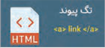

برای ایجاد ارتباط بین صفحات از تگ `<a>` استفاده می‌شود. این تگ مخفف `anchor` و به معنای «لنگر» است. تگ `<a>` می‌تواند کاربر را به یک صفحه وب، تصویر، فایل `pdf` و موارد دیگر هدایت کند.

شکل ٤١

برای ایجاد پیوند از ساختار کلی زیر استفاده می‌شود:

```
<a href="Resource address" target="target" title=" description"> anchor Text </a>
```

در ویژگی `href` آدرس صفحه یا فایل مقصد نوشته می‌شود. عبارت `href` مخفف `Hypertext` `reference` است.

عبارت `anchor` `text` به متن پیوند؛ همان چیزی که کاربر می‌بیند و روی آن کلیک می‌کند؛ اشاره دارد.

چنانچه کاربر روی متن پیوند کلیک نماید به آدرس منبع مشخص شده در ویژگی `href` هدایت می‌شود.

صفحه مقصد پیوندها به‌صورت پیش‌فرض در صفحه وب جاری باز می‌شود؛ در نتیجه محتوای قبلی صفحه ناپدید می‌گردد.

برای باز شدن صفحه مقصد در برگه جدیدی از مرورگر، از ویژگی `target` با مقدار `_blank` استفاده می‌شود.

مقدار پیش‌فرض ویژگی `target` برابر `_self` است؛ به این معنی که اگر ویژگی `target` در تگ `<a>` مشخص نشود، مقصد لینک در همان صفحه باز شود.

ویژگی `title` حاوی توضیحی درباره لینک است. این ویژگی اختیاری است.

### مثال

مثال‌های زیر نمونه‌هایی از پیوند به منابع مختلف است:

`</a>` تارنمای وزارت آموزش و پرورش `<a` `href` = `"https://medu.ir">`

```
دانلود کتاب طراحی صفحات >"target="_blank "a href = "./pdfs/books/web-design.pdf<
```

`</a>` وب


---

<!-- pdf-page: 109 | book-page: 103 -->

**صفحه ۱۰۳**

مقصد یک لینک می‌تواند نقطه دیگری از صفحه جاری باشد. در این حالت شناسه (`ID`) عنصر مقصد در ویژگی `href` نوشته می‌شود.

در صفحه `test.html` تغییرات زیر را ایجاد کنید و نتیجه را در مرورگر مشاهده نمایید.

### کار کارگاهی

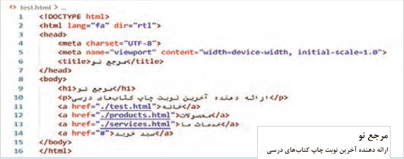

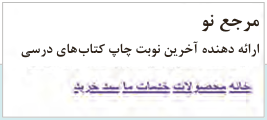

مرجع نو

ارائه دهنده آخرین نوبت چاپ کتاب‌های درسی

### افزودن تصاویر به صفحه وب

تصاویر یکی از عناصر مهم در محتوای یک صفحه هستند که می‌توانند تأثیرات عمیقی بر جذابیت، ارتباط‌پذیری و اثربخشی محتوای صفحه داشته باشند. استفاده از تصاویر در صفحات وب می‌تواند باعث جلب توجه کاربران شود به‌گونه‌ای که مدت زمان توقف آنها در صفحه بیشتر شود. به‌علاوه تصاویر نقش مهمی در توضیح و تبیین محتوای متنی دارند، چرا که می‌توانند اطلاعات را به صورت بصری منتقل کنند.


شکل ٥١

برای نمایش یک تصویر در صفحه وب از تگ `` استفاده می‌شود. شکل کلی این تگ به‌صورت زیر است:

```

```

`src:` این ویژگی آدرس تصویر را تعیین می‌کند.

`alt:` کلمه `alt` مخفف `Alternative` `text` است. مقدار این ویژگی، متن جایگزین تصویر را مشخص می‌کند.

این متن در صورت عدم بارگذاری تصویر نمایش داده می‌شود. به‌علاوه مقدار `Alt` بیانگر مفهوم و محتوای تصویر برای کاربر و موتورهای جست‌وجو است.


---

<!-- pdf-page: 110 | book-page: 104 -->

**صفحه ۱۰۴**

`width` و `height:` این دو ویژگی پهنا و ارتفاع عناصر صفحه مانند تصویر را مشخص می‌کنند. مقدار این ویژگی‌ها می‌تواند برحسب پیکسل یا درصد باشد. مرورگر با مشاهده عبارت `"width="100` پهنای عنصر را برای 100 پیکسل قرار می‌دهد. بنابراین برای تعیین واحد بر حسب درصد باید از عبارتی مشابه `"width="100` استفاده شود. بهتر است که برای تنظیم پهنا و ارتفاع بر حسب درصد از `CSS` استفاده شود.

`title:` یک متن توضیحی است که در صورت قرارگیری نشانگر ماوس روی تصویر ظاهر می‌شود.

استفاده از تگ `img`

### کار کارگاهی

در فایل `products.html` برای هر یک از کتا‌ب‌ها تصویری را نمایش دهید.

برای انجام این‌کار در پوشه `web` پوشه به نام `images` بسازید و تصاویر کتب را درون آن قرار دهید.

توسط نر‌مافزار `paint`، ابعاد تصاویر را در اندازه 00٢×280 تنظیم کنید. در صورت لزوم فضای خالی اطراف محصول را افزایش دهید.

سپس تصاویر را بعد از تیتر کتب نمایش دهید.

هر تصویر را تبدیل به پیوند کنید. با توجه به اینکه صفحه مقصد پیوندها موجود نیست، برای مقصد پیوند از علامت # استفاده کنید. سپس صفحه را با فشردن کلید (`F5`) تازه‌سازی کنید.

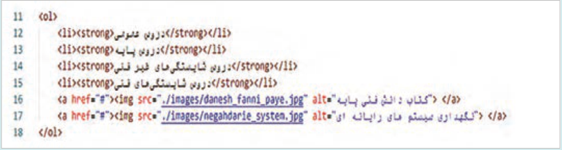

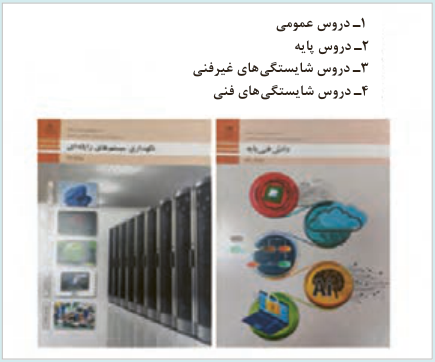

1 دروس عمومی

2 دروس پایه

3 دروس شایستگی‌های غیرفنی

4 دروس شایستگی‌های فنی


---

<!-- pdf-page: 111 | book-page: 105 -->

**صفحه ۱۰۵**

### بیشتر بدانید

طراحی جدول (`table`) جدول یکی از ابزارها در نمایش داده‌ها است؛ چرا که امکان نمایش منظم و قابل فهم اطلاعات را فراهم می‌کند. امروزه جداول برای نمایش داده‌های مختلف مانند لیست محصولات، قیمت‌ها، یا هر نوع اطلاعات نیازمند سازماندهی استفاده می‌شود.

برای ایجاد یک جدول در `HTML`، از تگ `<table>` و تگ‌های زیرمجموعه آن، به شرح زیر استفاده می‌شود:

`<table>:` این تگ شروع و پایان جدول را مشخص می‌کند.

`<caption>:` برای تعیین عنوان جدول به‌کار می‌رود. این تگ موضوع جدول را برای کاربران و موتورهای جس‌توجو مشخص می‌کند.

`<tr>:` برای تعریف یک ردیف (`Row`) در جدول به‌کار می‌رود.

`<th>:` برای ایجاد یک سلول عنوان (`Header`) در ردیف عنوان استفاده می‌شود. این تگ تجربه کاربری را بهبود می‌دهد.

`<td>:` برای تعریف یک سلول داده (`Data` `Cell`) در جدول کاربرد دارد.

تگ `<table>` دارای ویژگی‌های مختلفی برای تعیین ظاهر جدول است که در ادامه به آنها اشاره می‌شود.

`rowspan:` برای ادغام سلول‌ها در راستای عمود.

`colspan:` برای ادغام سلول‌ها در راستای افقی.

`thead` ،`tbody` ،`tfoot:` برای ساختاردهی معنایی.

### کنجکاوی

درباره ویژگی `rowspan`، `colspan` و کاربرد آن در جدول تحقیق کنید و با یک پروژه نتیجه را در کلاس ارائه کنید.

### نکته

در `HTML5` استفاده از ویژگی `border` در برچسب `<table>` غیرمجاز است و تعیین سبک نمایش خطوط جدول باید توسط `CSS` صورت گیرد. با توجه به اینکه مبحث `CSS` در واحد کار دوم مطرح می‌شود، از ویژگی `border` صرفًا برای نمایش موقت خطوط استفاده می‌شود.


---

<!-- pdf-page: 112 | book-page: 106 -->

**صفحه ۱۰۶**

به‌کارگیری تگ جدول

### کار کارگاهی

مطابق تصویر، تگ‌های مورد نیاز را برای ایجاد جدول بنویسید و نتیجه را در مرورگر مشاهده کنید.

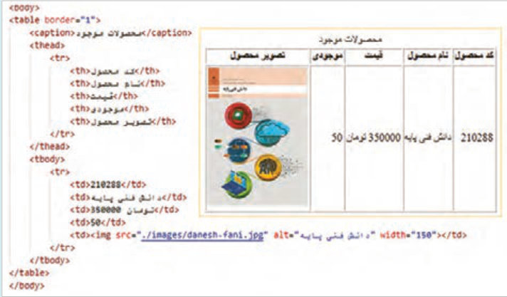

### طراحی فرم

فرم‌های ورود اطلاعات فرم‌ها ابزارهای قدرتمندی برای جمع‌آوری اطلاعات از کاربران هستند. یک فرم ورود داده، اطلاعات کاربران را دریافت می‌کند و سپس آنها را برای پردازش و ذخیره‌سازی به یک و‌بسرور ارسال می‌نماید. پردازش و ذخیره‌سازی در


**شکل 16**

سمت سرور انجام می‌شود. یک فرم اطلاعاتی شامل تگ‌های مختلفی برای دریافت داده‌های کاربران است.

این تگ‌ها به شرح زیر هستند:

`<form>:` برای تعریف یک فرم استفاده می‌شود.

شکل کلی این تگ به‌صورت زیر است:

```
<form action="URL" method="http_method" enctype="encoding_type">
```

ویژگی‌های عنصر فرم به شرح زیر است:

`action:` این ویژگی مشخص می‌کند که داده‌های فرم برای پردازش به چه آدرسی (`URL`) در سمت سرور ارسال شوند.

`method:` روش ارسال داده های فرم را به سرور مشخص می‌کند. این ویژگی دارای دو مقدار `get` و `post` است. در روش `get` داده‌های فرم به عنوان پارامترهای `URL` به سرور ارسال می‌شوند. این روش برای ارسال داده‌های حساس کاربر مناسب نیست. در روش `post` اطلاعات فرم به‌صورت پنهانی به سرور ارسال می‌شوند، این روش برای ارسال داده‌های حساس مناسب است. درجدول صفحۀ بعد مقایسه دو روش ارسال اطلاعات به در فرم‌ها را مشاهده کنید (جدول 5).


---

<!-- pdf-page: 113 | book-page: 107 -->

**صفحه ۱۰۷**

جدول 5 مقایسه دو روش ارسال اطلاعات به در فرم‌ها

عملیاتروش `GET`روش `POST`

داده‌ها در بدنه درخواست `HTTP` ارسال می‌شوند و

نحوه ارسال

داده‌ها از طریق نوار آدرس مرورگر ارسال می‌شوند و در

در `URL` مشاهده نمی‌شوند.

داده‌ها

نتیجه توسط کاربر مشاهده می‌شوند.

مرورگرها در هنگام ارسال درخواست توسط روش `GET`

محدودیت

دارای محدودیت هستند. بسته به نوع مرورگر و تنظیمات

محدودیت کمی دارد و می‌تواند برای ارسال فایل و

حجم داده

سرور، طول رشته قابل ارسال از طریق نوار آدرس بین

متن‌های طولانی استفاده شود.

2000 تا 8000 کاراکتر است.

امنیت پایینی دارد، علاوه بر نمایش داده‌های کاربران

امن‌تر از روش `GET` است اما امنیت کامل ندارد،

امنیت

در نوار آدرس، امکان ذخیره شدن محتوای آدرس (کش

مگر اینکه از پروتکل `HTTPS` استفاده شود.

شدن) در حافظه مرورگر موجود است.

برای دریافت اطلاعات از سرور (مانند جس‌توجو و فیلتر

برای ارسال اطلاعات به سرور جهت پردازش یا

کاربردها

کردن). در این حالت کاربر قصد تغییر داده‌های سرور

ذخیره‌سازی (مانند ثبت‌نام، ورود، آپلود فایل)

را ندارد.

### مثال

مثالی از به‌کارگیری متد `GET`

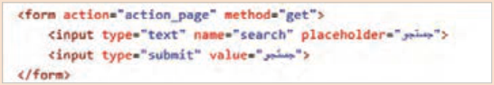

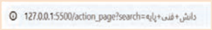

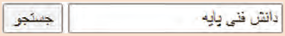

خروجی

### مثال

مثالی از به‌کارگیری متد `POST`

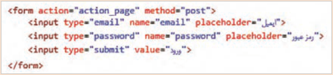

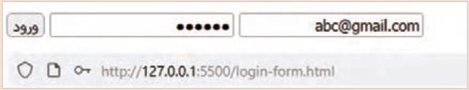


---

<!-- pdf-page: 114 | book-page: 108 -->

**صفحه ۱۰۸**

یک فرم حاوی مجموعه‌ای از عناصر برای دریافت اطلاعات مختلف از کاربران است که در جدول ٦ نمایش داده شده است:

جدول 6 عناصر فرم (تگ هایی که در عنصر فرم مورد استفاده قرار می‌گیرند) و کاربرد آنها عنصر فرم

کاربرد و شکل کلی عنصر

تعیین برچسب عناصر فرم.

```
<label>
<label for=" "> </label>
```

دریافت اطلاعات مختلف از کاربر. نوع ورودی توسط ویژگی `type` مشخص می‌شود.

```
<input>
<input type="" name="" id="" value="" placeholder="" required >
<feildset>
```

گروه‌بندی عناصر فرم، این تگ باعث نمایش یک کادر دور گروه فیلدها می‌شود.

```
<fieldset> <legend> </legend> </fieldset>
<legend>
```

برچسب `legend` عنوان گروه را مشخص می‌کند.

دریافت عبارات طولانی از کاربران، اندازه کادر متنی با ویژگی‌های `rows` و `cols` مشخص می‌شود.

```
<textarea>
<textarea id="" name=" " rows="" cols="" required> </textarea>
```

ایجاد فهرست یا لیست کشویی. گزینه‌های لیست توسط تگ `<option>` مشخص می‌شود.

```
<select id="" name="" required>
<select>
<option value=""> </option>
</select>
```

ویژگی `type` در عنصر `<input>` نوع داده ورودی کاربر را تعیین می‌کند. مقدار این ویژگی در جدول 7 تشریح شده است:

جدول 7 مقادیر ویژگی `type` در عنصر `<input>`

مقدار ویژگی `type`

### کاربرد

```
text, password, email
```

دریافت مقادیر متنی کوتاه مانند نام کاربری، کلمه عبور و ایمیل.

```
tel, number
```

دریافت شماره تلفن و مقادیر عددی.

`radio`

ایجاد لیستی از گزینه‌ها که کاربر تنها مجاز به انتخاب یک گزینه باشد.

ایجاد لیستی از گزینه‌ها به‌کار می‌رود که کاربر امکان انتخاب صفر، یک یا چند گزینه

```
checkbox
```

را دارد.

`file`

دریافت فایل از کاربران (آپلود).

`submit`ایجاد دکمه ارسال اطلاعات

`reset`

محتوای فرم را پاک می‌کند.


---

<!-- pdf-page: 115 | book-page: 109 -->

**صفحه ۱۰۹**

برای ایجاد یک گروه دکمه رادیویی باید ویژگی `name` برای تمام دکمه‌های رادیویی گروه یکسان باشد، در غیراین‌صورت امکان انتخاب چند عنصر وجود دارد. دکمه‌های رادیویی معمولاً زمانی به کار می‌روند که انتخاب یک گزینه از میان چند گزینه مطرح باشد.

### مثال

### مثال:

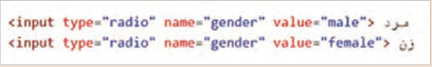

```
مرد<input type="radio" name="gender" value="male">
زن<input type="radio" name="gender" value="female">
```

ایجاد فرم ثبت سفارش

### کار کارگاهی

یک صفحه جدید با نام `order_form.html` ایجاد کنید و فرم ثبت سفارش را به صورت شکل زیر درون آن بنویسید. سپس نتیجه را در مرورگر بررسی کنید.

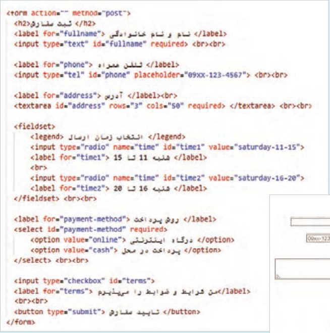

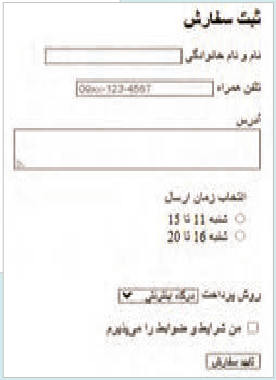

خروجی


---

<!-- pdf-page: 116 | book-page: 110 -->

**صفحه ۱۱۰**

`name:` نام عنصر را تعیین می‌کند که در کدنویسی سمت سرور کاربرد دارد.

`id:` شناسه عنصر فرم را تعیین می‌کند که باید مقداری منحصر به‌فرد باشد.

`value:` مقدار پیش‌فرض عنصر فرم را تعیین می‌کند.

`required:` استفاده از این ویژگی در عناصر فرم باعث می‌شود که در صورت خالی رها شدن یک فیلد پیغام خطا ظاهر شود.

### فعالیت

یک فرم بازگشت کالا حاوی نام و نام خانوادگی، شماره سفارش، نام کالا، علت مرجوع کالا و تصویر کالا ایجاد کنید.

### ساختاردهی به صفحه با عناصر معنایی (Semantic Elements)

عناصر معنایی در `HTML` به عناصری اطلاق می‌شود که محتوای درون خود را به وضوح توصیف می‌کنند.

استفاده از این عناصر باعث می‌شود که ابزارهای صفح‌هخوان و موتورهای جس‌توجو درک بهتری از ساختار و محتوای صفحه داشته باشند. عناصر معنایی نه تنها سئوی صفحه را بهبود می‌دهند، بلکه سازمان‌دهی و نگهداری کد را ساده‌تر می‌کنند. این عناصر به شرح زیر هستند:

`<main>:` برای نمایش محتوای اصلی صفحه به‌کار می‌رود. هر صفحه باید تنها یک عنصر `<main>` داشته باشد.

`<header>:` برای تعریف سرصفحه یک سند استفاده می‌شود. درون این تگ امکان استفاده از تگ‌های مختلفی مانند `<h1>`، `<p>`، `<nav>`، `<ul>`، `` و `<form>` وجود دارد.

`<nav>:` در هنگام ایجاد منوهای ناوبری1 استفاده می‌شود (شکل17).

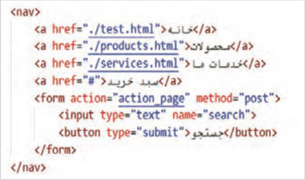

**شکل 17**

1 منوی ناوبری (`Navigation` `Menu`) شامل مجموعه‌ای از پیوندهاست که به کاربران اجازه می‌دهد در صفحات یا بخش‌های مختلف داخل یک وب‌سایت حرکت کنند. منوی ناوبری سایت معمولاً در بالا یا کنار یک صفحه وب قرار می‌گیرد.


---

<!-- pdf-page: 117 | book-page: 111 -->

**صفحه ۱۱۱**

`<section>:` برای تقسیم‌بندی محتوای صفحه به بخش‌های مختلف استفاده می‌شود (شکل18).

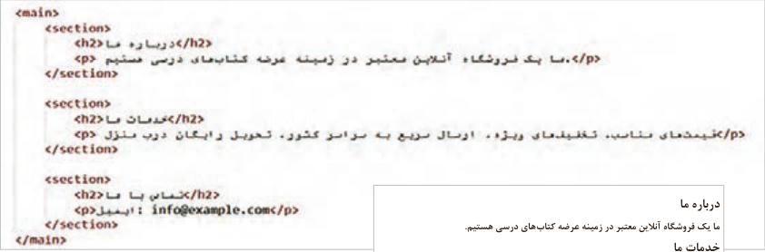

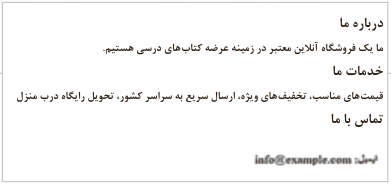

درباره ما ما یک فروشگاه آنلاین معتبر در زمینه عرضه کتاب‌های درسی هستیم.

خدمات ما قیمت‌های مناسب، تخفیف‌های ویژه، ارسال سریع به سراسر کشور، تحویل رایگاه درب منزل تماس با ما

خروجی

**شکل18**

`<article>:` این برچسب برای نگهداری یک محتوای مستقل و کامل قابل استفاده است، مانند پست‌های وبلاگ (هر پست درون یک برچسب `article`) اخبار، (هر خبر درون یک برچسب `article`)، نظرات کاربران (هر نظر درون یک `article` مجزا) و کارت محصول (شامل تصویر، عنوان و قیمت).

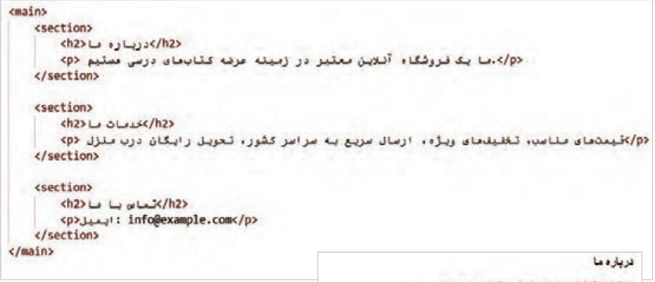

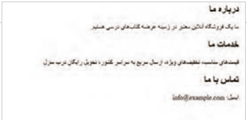

خروجی

**شکل19**


---

<!-- pdf-page: 118 | book-page: 112 -->

**صفحه ۱۱۲**

`<aside>:` برای نگهداری محتواهای جانبی که به محتوای اصلی صفحه ارتباط دارند، مانند پیوندها، نظرات و تبلیغات (شکل 20).

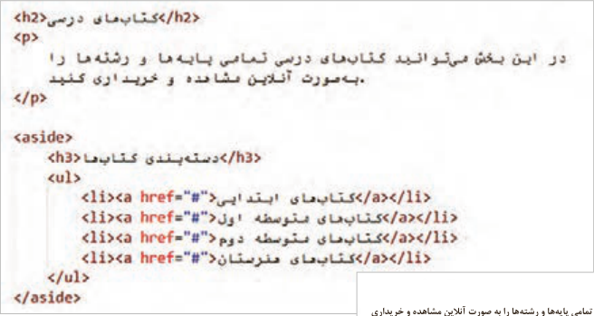

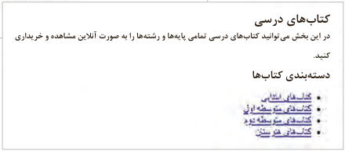

کتا‌بهای درسی

در این بخش م‌یتوانید کتا‌بهای درسی تمامی پای‌هها و رشته‌ها را به صورت آنلاین مشاهده و خریداری کنید.

دسته‌بندی کتا‌بها

**شکل 20**

`<footer>:` برای تعریف بخش پایانی یک سند یا بخش استفاده می‌شود. برای تعیین ظاهر این عناصر از `CSS` استفاده می‌شود. در این قسمت اطلاعاتی مانند حق کپ‌یرایت، نام نویسنده و طراح، لینک‌های تماس، سیاست‌های سایت و لینک شبکه‌های اجتماعی قرار می‌گیرد. (شکل21)

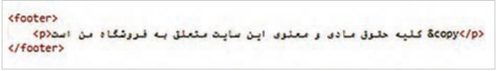

**شکل 21**

عناصر غیرمعنایی عناصر غیرمعنایی در `HTML` عناصری هستند که فقط برای گروه‌بندی و نگه‌داشتن محتوا استفاده می‌شوند و مفهوم خاصی دربارۀ محتوای خود انتقال نمی‌دهند. دو نمونه مهم از این عناصر، توسط تگ‌های `<div>` و `<span>` ایجاد می‌شوند. این عناصر برای سازماندهی بخش‌های مختلف صفحه به‌کار می‌روند، اما چون معنای مشخصی ندارند، استفاده بی‌رویه از آنها می‌تواند درک صفحه را برای موتورهای جست‌وجو و ابزارهای دسترسی دشوار نماید.

تگ `<div>` یک عنصر `block-level` ایجاد می‌کند؛ به این معنی که محتوای این عنصر در یک خط جدید قرار می‌گیرد. این تگ برای ایجاد ساختارهای پیچیده در صفحات و تقسیم‌بندی محتوا به بخش‌های مختلف به کار می‌رود.

تگ `<span>` یک عنصر `inline` ایجاد می‌کند و محتوای آن در یک خط جدید قرار نمی‌گیرد. این تگ برای گرو‌هبندی و استایل‌دهی بخش‌های کوچکی از متن در درون یک خط استفاده می‌شود.

تگ‌های `<div>` و `<span>` جلوه بصری ندارند و برای تنظیمات ظاهری آنها از `CSS` استفاده می‌شود.


---

<!-- pdf-page: 119 | book-page: 113 -->

**صفحه ۱۱۳**

به‌کارگیری عناصر معنایی و غیرمعنایی

### کار کارگاهی

فایل `test.html` را باز کنید و عناصر معنایی را مطابق تصویر زیر به‌کار ببرید:

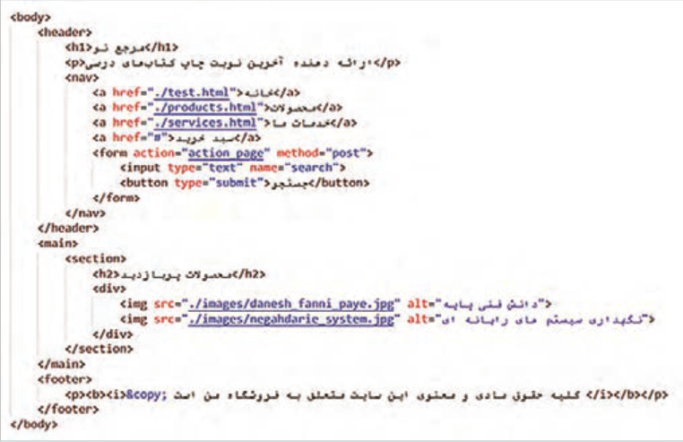

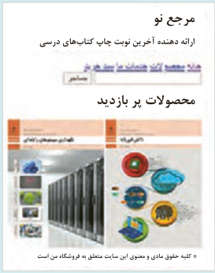

مرجع نو

فایل را ذخیره کنید و نتیجه را در مرورگر مشاهده

ارائه دهنده آخرین نوبت چاپ کتا‌بهای درسی

کنید.

محصولات پر بازدید

* کلیه حقوق مادی و معنوی این سایت متعلق به فروشگاه من است

```
توضیحات (Comments)
```

کامنت یا توضیحات در `HTML` ابزاری مفید برای مستندسازی و یادداشت‌برداری در کد `HTML` هستند. کامنت‌ها امکان اضافه کردن توضیحات، یادداشت‌ها یا اطلاعات اضافی را برای توسع‌هدهنده فراهم می‌کنند. توضیحات توسط مرورگر تفسیر نمی‌شوند؛ در نتیجه کاربران محتوای توضیحات را نمی‌بینند.

از کامنت‌ها برای خطایابی کد (`Debugging`) نیز استفاده می‌شود، به این صورت که با غیرفعال کردن موقت بخشی از کدها، می‌توان تأثیر آنها را بر روی اجرای برنامه بررسی نمود.

برای ایجاد کامنت در `HTML` از علامت >-- --!< استفاده می‌شود:

```
<!-- this is a comment -->
<p> This is a paragraph </p>
```


---

<!-- pdf-page: 120 | book-page: 114 -->

**صفحه ۱۱۴**

ارزشیابی شایستگی طراحی ساختار صفحات وب با `html`

استاندارد عملکرد کار: هنرجو بتواند با تحلیل نیازمندی‌ها، یک صفحه وب استاندارد `HTML5` را با ساختار معنایی صحیح، سازمان‌دهی منطقی محتوا و بدون خطای ساختاری طراحی و پیاده‌سازی کند به‌گونه‌ای که در مرورگر به‌درستی نمایش داده شود.

نمره

شرایط انجام کار (ابزار،مواد، تجهیزات،

ابزارهای

نتایج

ردیف

### مراحل کار

استاندارد (شاخص‌ها/داوری/نمره‌دهی)

کسب

زمان، مکان و ...)

### ارزشیابی

ممکن شده

تفاوت بین وب جهان‌گستر (`WWW`) و اینترنت، و نقش مرورگرها را تشریح کند.

یک نقشه سایت ساده برای یک وب‌سایت فرضی (مثًلا وب‌سایت یک فروشگاه کوچک یا وبلاگ شخصی) طراحی کنند.

3

لیست نیازمندی‌های کلیدی (مثلاً: نمایش محصولات، فرم تماس، درباره ما) برای همان وب‌سایت فرضی تهیه کنند. توضیح مختصر در مورد اهمیت تعیین هدف پروژه در ابتدای طراحی. انجام کنجکاوی‌ها

رایانه یا لپ‌تاپ

پرسش و

تحلیل نیازمندی‌ها و

مرورگر وب

پاسخ شفاهی

تفاوت بین وب جهان‌گستر (`WWW`) و اینترنت، و نقش مرورگرها را بداند.

1

طراحی اولیه

نرم‌افزار طراحی یا کاغذ و قلم 25دقیقه فضای

درباره یک نقشه سایت ساده برای یک وب‌سایت فرضی (مثًلا وب‌سایت یک فروشگاه

کارگاه یا کلاس مجهز به میز و نور مناسب

طراحی کوچک یا وبلاگ شخصی) طراحی کنند.

2

لیست نیازمندی‌های کلیدی (مثًلا: نمایش محصولات، فرم تماس، درباره ما) برای همان وب‌سایت فرضی تهیه کنند. توضیح مختصر در مورد اهمیت تعیین هدف پروژه در ابتدای طراحی.

توضیح ناقص هریک از موارد شرح کار 1

ایجاد یک فا یل`HTML` پایه با استفاده از ویرایشگر متن (مانند �`Note` `pad` یا `VS` `Code`) که شامل تگ‌های اصلی `<!,``>DOCTYPE` `html`

```
html>`, `<head<`>`, و `<body>` باشد.
```

اضافه کردن یک عنوان (``<title>``) به بخش ``<head>`` و یک متن ساده

3

در بخش ``<body>``. نحوه اجرای فایل `HTML` در مرورگر را نشان دهند.

تشریح نقش هر یک از تگ‌های اصلی (``html``, ``head``, ``body``, ``title``) در یک سند `.HTML`انجام کنجکاوی‌ها

رایانه یا لپ‌تاپ

انجام کار با روش‌های دیگر

ویرایشگر متن (`++VS` `Code`, `Notepad`)

آزمون کوتاه

پیاده‌سازی ساختار پایه سند

مرورگر وب برای تست صفحه

عملی برای

2

`HTML`

فایل نمونه `HTML`

ایجاد اسکلت

ایجاد اولین صفحه

ایجاد یک فایل `HTML` پایه با استفاده از ویرایشگر متن (مانند `Notepad` یا

15 دقیقه

`HTML`

```
VS Code) که شامل تگ‌های اصلی `<!,`>DOCTYPE html>`, `<html
head<`>`, و `<body>` باشد.
```

2

اضافه کردن یک عنوان (``<title>``) به بخش ``<head>`` و یک متن ساده در بخش ``<body>``. نحوه اجرای فایل `HTML` در مرورگر را نشان دهند.

انجام ناقص هریک از مراحل عملی فقط توضیح نقش هر یک از تگ‌های

```
اصلی (`html`, `head`, `body`, `title`) در یک سند 1.HTML
```

ایجاد یک صفحه `HTML` که شامل: یک تیتر اصلی (``<h1>``) , تیتر فرعی `<h2>` تا `<h6>` و یک پاراگراف (``<p>``) یک لیست نامرتب (``<ul>``) شامل ۳ ۴ مورد یک لینک (``<a>``) که به یک وب‌سایت دیگر (مثًلا `.oerp`

3

`ir`) اشاره کند. تفاوت بین تگ‌های ``<strong>`` و ``<b>`` و کاربرد هر کدام را توضیح دهند. تفاوت بین لیست مرتب (``<ol>``) و نامرتب (``<ul>``) را شرح دهند انجام کنجکاو‌یها انجام کار با روش‌های دیگر

همان ابزار مرحله قبل

عناصر اصلی محتوایی در

منابع نمونه برای محتوا و لینک‌ها

پرسش و ایجاد یک صفحه `HTML` که شامل: یک تیتر اصلی (``<h1>``) و یک

3

`HTML`

مرورگر وب

پاسخ عملی

پاراگراف (``<p>``) یک لیست نامرتب (``<ul>``) شامل ۳ ۴ مورد یک لینک

2

(``<a>``) که به یک وب‌سایت دیگر (مثًلا `oerp.ir`) اشاره کند.

تفاوت بین تگ‌های ``<strong>`` و ``<b>`` و کاربرد هر کدام را توضیح دهند.

تفاوت بین لیست مرتب (``<ol>``) و نامرتب (``<ul>``) را شرح دهند ایجاد یک صفحه `HTML` که شامل: یک تیتر اصلی (``<h1>``) و یک پاراگراف (``<p>``) یک لیست نامرتب (``<ul>``) شامل ۳۴ مورد1


---

<!-- pdf-page: 121 | book-page: 115 -->

**صفحه ۱۱۵**

بررسی فایل

```
عناصر معنایی (header, main, footer, section, article, nav) درست
```

`HTML`

استفاده شده باشند صفحه استاندارد `HTML5` داشته باشد.

3

با عناصر انجام کنجکاوی‌ها انجام کار با روش‌های دیگر معنایی

رایانه با ویرایشگر و مرورگر

استفاده از ساختارهای

مشاهده

```
عناصر معنایی (header, main, footer, section, article, nav) درست
```

4

منابع مستندات `HTML5`

استفاده شده باشند2صفحه استاندارد `HTML5` داشته باشد.2

معنایی اصلی

عملکرد و

20 دقیقه

سازمان‌دهی صحیح محتوا در

انجام ناقص هریک ازمراحل1 مرورگر عناصر جانبی (`aside-caption`) به درستی اضافه شده باشند تصاویر همراه با توضیحات درست نمایش داده شوند ایجاد جدول با 2 سطر و 2 ستون پرسش

3

ایجاد فرم های ورود اطلاعات انجام کنجکاوی‌ها انجام کار با روش‌های کتبی

همان ابزارهای مرحله قبل

دیگر

ایجاد بخش‌بندی‌های

آزمون عملی

5

تصاویر و محتوای جانبی

تفصیلی و جانبی

مشاهده

25 دقیقه

عناصر جانبی (`aside-caption`) به‌درستی اضافه شده باشند تصاویر همراه با عملکرد توضیحات درست نمایش داده شوند ایجاد فرم‌های ورود اطلاعات 2 هنرآموز انجام ناقص هریک از مراحل1 استفاده مناسب از `div` و `span` برای ساختاردهی کامنت‌ها و مستندسازی مشاهده کد کامل باشد مزایای استفاده از تگ‌های معنایی (مانند `article`, `section`)

3

مستندسازی

را برای سئو و دسترسی‌پذیری توضیح دهند. انجام کنجکاوی‌ها انجام کار

همان ابزارهای قبلی

و کامنت‌های

با روش‌های دیگر

6تکمیل ساختار با عناصر

منابع راهنما برای مستندسازی کد

نوشته‌شده

غیرمعنایی و مستندسازی

15 دقیقه

اجرای استفاده مناسب از `div` و `span` برای ساختاردهی کامنت‌ها و مستندسازی کد کامل باشد.2 صفحه و صحت نمایش نهایی انجام ناقص هریک از مراحل مزایای استفاده از تگ‌های معنایی (مانند

1

`article`, `section`) را برای سئو و دسترسی‌پذیری توضیح دهند.

شایستگی‌های غیر فنی، ایمنی،

احراز همه شایستگی‌های غیرفنی2

بهداشت، توجهات زیست محیطی و نگرش:

عدم احراز هر‌یک از شایستگی‌های غیرفنی1 بلی

ارزشیابی کار (شایستگی انجام کار)

خیر

### توضیحات:

1 معیار شایستگی انجام کار:

کسب حداقل نمره 2 از مراحل 1، 2، 3 و 4 (مراحل بحرانی) کسب حداقل نمره 2 از بخش شایستگی‌های غیرفنی، ایمنی، بهداشت، توجهات زیست‌محیطی و نگرش کسب حداقل میانگین 2 از مراحل کار

2 تعریف سطوح شایستگی: صرف‌نظر از اینکه یک تکلیف کاری در چه سطحی از صلاحیت حرفه‌ای انجام می‌شود، در هر محیط کاری ممکن است انجام هر کار با کیفیت مشخصی مورد انتظار باشد. سطح شایستگی انجام کار، معیار اساسی ارزشیابی است.

مهارت (سطح سه): ماهر و قادر به آموزش و هدایت دیگران، توانایی برنامه‌ریزی و تحلیل، پاسخ‌گویی در برابر کارهای خود، سروکار داشتن با سطح وسیعی از کارها و فعالیت‌ها تسلط (سطح چهار): خبرگی در انجام کار و آموزش دیگران، ایجاد نوآوری، سازگاری، عیب‌یابی، هدایت و راهنمایی دیگران.
