# طراحی ظاهر صفحات وب با CSS


---

<!-- pdf-page: 122 | book-page: 116 -->

**صفحه ۱۱۶**

## واحد یادگیری 2

## طراحی ظاهر صفحات وب با CSS

### آیا تابه‌حال اندیشیده‌اید

چگونه می‌توان رنگ متن و زمینه عناصر صفحه وب را مشخص نمود؟

چگونه می‌توان چیدمان عناصر صفحه را با فواصل مناسب انجام داد؟

آیا می‌توان بدون تغییر در ساختار `HTML`، ظاهر یک سایت را دگرگون نمود؟

چگونه می‌توان چیدمان و استایل عناصر صفحه را در دستگاه‌های مختلف تغییر داد؟

جذابیت بصری صفحه وب چه تأثیری روی تجربه کاربری دارد؟

### در پایان از هنرجو انتظار می‌رود

1 شیوه‌های مختلف تعریف `CSS` و اولویت اجرای آنها را بداند.

2 توانایی تنظیم استایل عناصر متنی شامل نوع قلم، اندازه، رنگ، وزن و تراز آنها را داشته باشد.

3 توانایی تنظیم ویژگی‌های ظاهری عناصر شامل رنگ، پس‌زمینه، شفافیت، خط دور و سایه را داشته باشد.

4 انواع انتخاب‌گرهای ساده، ترکیبی، شب‌هکلاس و ویژگی را بشناسد و از آنها برای انتخاب دقیق عناصر به‌شکل بهینه استفاده نماید.

5 با مفهوم مدل جعبه‌ای آشنا باشد و توانایی تنظیم فواصل داخلی (`margin`) و خارجی (`padding`) عناصر را داشته باشد.

6 کاربرد ویژگی `Display` را بداند و از آن برای کنترل نحوه نمایش عناصر استفاده نماید.

7 توانایی چیدمان واکنش‌گرای عناصر صفحه را توسط قابلیت‌های `Flex` و `Grid` داشته باشد.

8 کدهای `CSS` را به شکل خوانا و با رعایت تورفتگی به‌کار ببرد و برای هر یک از استایل‌های صفحه از کامنت‌های مناسب و قابل درک استفاده نماید.

### استاندارد عملکرد

با استفاده از قابلیت‌های `CSS`، ظاهر و چیدمان عناصر صفحه وب را مطابق با اصول و استانداردهای نوین طراحی وب، پیاده‌سازی و تنظیم نماید.


---

<!-- pdf-page: 123 | book-page: 117 -->

**صفحه ۱۱۷**

### زیباسازی صفحه با CSS

در واحدکار قبل نحوه طراحی ساختار صفحات وب با استفاده از برچسب‌های `HTML` آموزش داده شد.

صفحاتی که صرفاً توسط `HTML` ایجاد شده باشند، دارای متون ساده، پس زمینه سفید، فواصل و چیدمان پی‌شفرض می‌باشند و در نتیجه فاقد جذابیت بصری هستند. برای ایجاد ظاهری زیبا و کاربرپسند استفاده از `CSS` جهت استای‌لدهی به عناصر ضروری است. این ابزار به توسعه‌دهندگان وب امکان می‌دهد که ظاهر و چیدمان عناصر صفحه را به سادگی و با انعطاف بالا مدیریت کنند.

`CSS` مخفف عبارت `Cascading` `Style` `Sheets` و زبانی برای استایل‌دهی و کنترل ظاهر صفحات وب است.

این زبان به توسعه‌دهندگان وب امکان می‌دهد که ظاهر و چیدمان عناصر را کاملاً جدا از ساختار اصلی صفحه مدیریت کنند. این موضوع باعث آسان‌تر شدن نگهداری و به‌روزرسانی سایت می‌شود. با استفاده از `CSS` می‌توان استایل‌های متنوعی را برای عناصر مختلف وب‌سایت تنظیم نمود؛ مانند تعیین رنگ متن و زمینه عناصر، ایجاد سایه، خط دور، تغییرات ظاهری در هنگام قرارگیری ماوس روی عناصر و ...

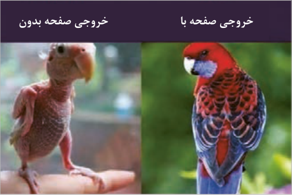

خروجی صفحه با

خروجی صفحه بدون

**شکل 22**

ساختار `CSS` `CSS` ب‌هشکل مجموعه‌ای از قوانین است که توسط انتخاب‌گرها (`selectors`) و ویژگی‌ها (`properties`) ایجاد می‌شوند. هر قانون معمولاً به صورت زیر نوشته می‌شود:

```
{ selector
;property: value
```

}

عبارت `Selector` به معنای انتخاب‌گر است و برای انتخاب عناصر صفحه استفاده می‌شود. به عنوان مثال برای تعیین استایل عناصر پاراگراف، از انتخاب‌گر `p` و برای انتخاب همه عناصر صفحه از علامت * استفاده می‌شود. عبارت `Property` به ویژگی‌های قابل مقداردهی در `CSS` گفته می‌شود، مانند `color`، `font-size` و `.border` عبارت `Value` به مقدار ویژگی عنصر اشاره دارد.


---

<!-- pdf-page: 124 | book-page: 118 -->

**صفحه ۱۱۸**

### مثال

در مثال زیر رنگ زمینه عنصر `h1` با مقدار `orange` تنظیم شده است.

{ `h1`

```
;background-color: orange
```

}

نحوه به‌کارگیری `CSS` در صفحات برای ایجاد و به‌کارگیری استایل‌های سفارشی روی عناصر صفحه از سه روش به شرح زیر استفاده می‌شود:

`CSS` 1 درون خطی(`Inline`): استایل عناصر درون تگ‌های `HTML` نوشته می‌شود.

### مثال

در مثال زیر رنگ متن و پس زمینه عنصر `h1` به‌صورت درون خطی تعیین شده است:


```
</h1> سلام دنیا! >”h1 style=”color:blue; background-color:orange<
CSS 2 داخلی (Internal):
```

استایل عناصر درون تگ `<style>` در بخش `<head>` نوشته می‌شود.

در سبک درون خطی در صورتی‌که تعداد ویژگی‌های اختصاص داده شده به عنصر زیاد باشد، کد عنصر شلوغ و ناخوانا می‌شود. بنابراین از `CSS` داخلی یا خارجی برای مدیریت بهتر استایل‌ها استفاده می‌شود.

### مثال

مثال زیر نمونه‌ای از `CSS` داخلی برای تعیین ویژگی‌های عنصر `h1` است:

```
<head>
<style>
```

{ `h1`

```
;color: blue
;background-color: pink
```

}

```
</style>
</head>
CSS 3 خارجی (External):
```

در روش `CSS` خارجی، استایل عناصر، درون فایلی با پسوند `CSS` قرار می‌گیرد. محتوای این فایل نیازی به تگ `<style>` ندارد و صرفًا سبک عناصر درون آن تعیین می‌شود. فایل `CSS` باید توسط تگ `<link>` به صفحه وب الحاق شود تا قوانین این فایل روی عناصر صفحه وب اعمال شود. الحاق فایل `CSS` به فایل `HTML` در بخش `<head>` انجام می‌شود:

```
<head>
<link rel=”stylesheet” href=”./styles.css”>
</head>
```


---

<!-- pdf-page: 125 | book-page: 119 -->

**صفحه ۱۱۹**

استفاده از فایل‌های `CSS` خارجی، بهترین روش استایل‌دهی در پروژه‌های متوسط و بزرگ است. مهم‌ترین مزایای روش خارجی عبارت‌اند از:

1 فایل `CSS` قابلیت استفاده مجدد دارد، یعنی می‌تواند به صفحات مختلف سایت الحاق شود.

2 با جدا شدن کدهای `CSS` و `HTML`، نگهداری، به‌روزرسانی واشکال‌زدایی (`Debug`) استایل و کدهای `HTML` آسان‌تر می‌شود.

3 مرورگرها می‌توانند فایل‌های `CSS` خارجی را در حافظه پنهان (`cache`) خود ذخیره کنند، این موضوع به بارگذاری سریع‌تر صفحات در دفعات بعدی ورود به سایت کمک می‌کند.

عیب این روش این است که فایل `CSS` باید به‌صورت مجزا بارگذاری شود و این کار ممکن است سرعت بارگذاری سبک عناصر صفحه وب را در اولین بارگذاری پایین بیاورد.

برای تمرین‌های کوچک در حد سبک‌دهی به یک عنصر می‌توان از `CSS` خطی استفاده نمود. سبک داخلی برای پروژه‌های کوچک و سبک خارجی برای پروژه‌های متوسط، بزرگ و پیچیده مناسب است.

### اولویت اعمال انواع استایل‌ها

چنانچه سبک‌های مختلفی برای یک عنصر نوشته شده باشد، اولویت اعمال سبک‌ها به ترتیب درون خطی، داخلی و خارجی خواهد بود. اگر عنصری دارای هیچ یک از این سبک‌ها نباشد، از سبک عنصر والد خود استفاده می‌کند.

بررسی اولویت اعمال سبک روی عناصر صفحه

### کار کارگاهی

یک صفحه وب با نام `test-style.html` ایجاد کنید.

یک فایل `CSS` با نام `styles.css` ایجاد کنید.

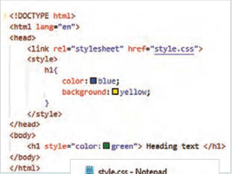

محتوای فایل‌های `HTML` و `CSS` را مطابق تصویر مقابل تنظیم کنید.

فایل‌ها را ذخیره و نتیجه را در مرورگر بررسی کنید.

در هر سه سبک رنگ متن مشخص شده است، اما رنگ سبک درون‌خطی (سبز) روی متن اعمال می‌شود.

رنگ زمینه فقط در سبک داخلی تعیین شده است، بنابراین رنگ زمینه زرد به عنصر `h1` اعمال می‌شود.

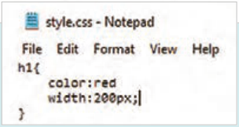

پهنای عنصر فقط در سبک خارجی

خروجی

مشخص شده است، در نتیجه پهنای عنصر `h1` برابر 200 پیکسل خواهد بود.

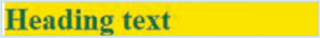


---

<!-- pdf-page: 126 | book-page: 120 -->

**صفحه ۱۲۰**

توضیحات (`Comment`) در `CSS` برای افزودن توضیحات در `CSS` به صورت تک‌خطی یا چند‌خطی از علائم /* */ از شکل ٣٢ استفاده می‌شود.

```
/* this is a comment */
```

**شکل23**

نحوه قالب‌بندی متن در `CSS` `CSS` دارای مجموعه‌ای از ویژگی‌ها برای قالب‌بندی متون است. این ویژگی‌ها امکان تعیین فونت، اندازه فونت، ارتفاع خطوط، تزئینات متن و ... را فراهم می‌کنند. ویژگی‌های عناصر متنی به شرح زیر است:

`font-family` و `font-size:` تعیین نوع و اندازه فونت

`text-align:` تعیین تراز متن شامل مقادیر `left`، `right`، `center` و `justify`

`text-shadow:` ایجاد سایه با رنگ و اندازه دلخواه. ساختار کلی این ویژگی به شکل زیر است:

```
;text-shadow: offset-x offset-y blur-radius color
```

**شکل24**

مقادیر این ویژگی به ترتیب مقدار جابه‌جایی افقی و عمودی سایه، میزان محو شدگی و رنگ سایه است.

`text-transform:` تغییر شکل حروف به صورت بزرگ،کوچک و... شامل مقادیر `lowercase`، �`upper`

```
cas، capitalize none،…
```

`direction:` تعیین جهت نمایش متن، شامل مقادیر `ltr` و `rtl` برای چپ به راست و راست به چپ

`line-height:` تعیین فاصلۀ عمودی بین خطوط متنی. این ویژگی فاصلۀ عمودی خط متن را تعیین می‌کند. مقدار این ویژگی شامل ارتفاع حروف به‌علاوه فضای خالی قبل و بعد آنهاست. شامل ارتفاع حروف (فونت) به‌اضافه فضای خالی قبل و بعد از آنهاست.

```
text-decoration: تعیین تزیینات متن، شامل مقادیر none، underline، overline، .line-through
```

ویژگی `text-decoration` با مقدار `none` موجب حذف زیرخط لینک می‌شود.

`vertical-align:` تراز متن در راستای عمودی، شامل مقادیر `top`، `bottom`، `baseline` و...


---

<!-- pdf-page: 127 | book-page: 121 -->

**صفحه ۱۲۱**

### فعالیت

ویژگی‌های قالب بندی متن را برای عناصر فایل `test.html` به کار بگیرید و نتیجه را در مرورگر مشاهده کنید.

### طراحی ظاهر عناصر (رنگ ها، پس زمینه‌ها، شفافیت و خط دور)

`CSS` دارای ویژگی‌های مختلفی در زمینه تنظیم ظاهر عناصر است. این ویژگی‌ها برای تعیین رنگ متن، رنگ زمینه، تصویر پس‌زمینه،کنترل تصویر پس‌زمینه، شفافیت و خط دور عناصر به‌کار می‌روند. در ادامه به برخی از این ویژگی‌ها اشاره می‌شود.

`color` و `background-color:` برای تعیین رنگ متن و زمینه عناصر به‌کار می‌رود. برای هر دو ویژگی فوق می‌توان از نام رنگ، کد هگزادسیمال رنگ یا کد `RGB` استفاده نمود.

### مثال

در مثال روبه‌رو از هر سه روش تعیین مقدار رنگ استفاده شده است.

```
;color: blue
;background-color: #0000FF
;)0,0,255(background-color: rgb
```

`opacity:` شفافیت عناصر توسط این ویژگی تعیین می‌شود. مقدار `opacity` با عددی بین 0 و 1 تعیین می‌شود.

مقادیر پایین این ویژگی باعث کاهش شفافیت عنصر و مقادیر نزدیک 1 باعث افزایش شفافیت عنصر می‌شود.

`background-image:` برای تعیین تصویر پس‌زمینه به‌کار می‌رود. برای مقداردهی به این ویژگی ابتدا عبارت `url` و سپس نام تصویر داخل پرانتز نوشته می‌شود.

### مثال

مانند مثال روبه‌رو:

```
;)images/background.jpg/.(background-image:url
```

`background-repeat:` تصاویری که پهنای صفحه را پوشش ندهند، تکرار می‌شوند. برای تنظیم نحوه تکرار یا عدم تکرار تصویر از این ویژگی استفاده می‌شود که دارای مقادیر مختلفی مانند `no-repeat`، `repeat-x`،

```
repeat-y و ... است.
```

`background-size:` اندازه تصویر پس زمینه را تعیین می‌کند. این ویژگی مشخص می‌کند که تصویر پ‌سزمینه با چه ابعادی داخل عنصر نمایش داده شود. برای پوشش پهنای صفحه، بدون تکرار تصویر، از این ویژگی با مقدار `cover` استفاده می‌شود.

`background-position:` برای تنظیم محل نمایش تصویر پس‌زمینه به‌کار می‌رود و دارای مقادیر مختلفی مانند `center`، `left`، `right`، `left` `top`، `right` `bottom` و غیره است.


---

<!-- pdf-page: 128 | book-page: 122 -->

**صفحه ۱۲۲**

`background-attachment:` اگر تصویر زمینه بزرگ‌تر از محدوده نمایش باشد، می‌توان با اسکرول کردن، بخش‌های پایین‌تر تصویر را به نمایش گذاشت. برای ثابت نگه داشتن تصویر در هنگام اسکرول صفحه، از این ویژگی با مقدار `fixed` استفاده می‌شود.

`border:` عناصر صفحه می‌توانند همراه با یک خط دور نمایش داده شوند. ایجاد خط دور توسط ویژگی `border` صورت می‌گیرد. مقادیر این ویژگی به ترتیب ضخامت خط دور، نوع خط دور و رنگ آن را تعیین می‌کنند.

```
;border: 1px solid gray
```

`border-radius:` برای گرد شدن گوشه‌ها از این ویژگی استفاده می‌شود و مقدار آن می‌تواند برحسب پیکسل یا درصد باشد:

```
;border-radius:10px
```

طراحی ظاهر عناصر (رنگ‌ها، پس‌زمینه‌ها، شفافیت و خط دور)

### کار کارگاهی

در فایل `test.html` کد `HTML` زیر را بنویسید و نتیجه را در مرورگر مشاهده کنید. سپس استایل‌ها را به‌صورت مرحله به مرحله اضافه کنید تا تأثیر هر یک را بر عناصر صفحه درک کنید.

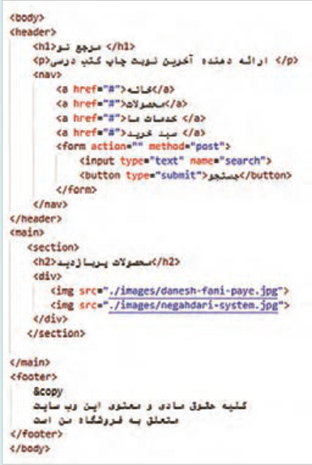

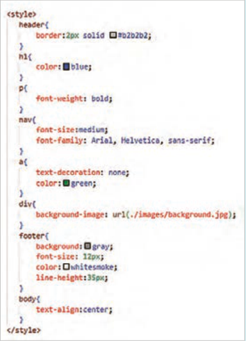

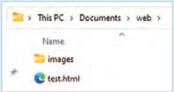


---

<!-- pdf-page: 129 | book-page: 123 -->

**صفحه ۱۲۳**

در نرم‌افزار `Paint` یک فایل جدید با نام `background.jpg` ایجاد کنید و آن را درون پوشه `images` در مسیر فایل `test.html` ذخیره کنید. ابعاد آن را 50×50 پیکسل تنظیم کنید. درون آن دو دایره توخالی با رنگ ملایم ایجاد کنید (مانند تصویر روبه‌رو) و فایل را ذخیره کنید. این تصویر به پس زمینه عنصر `div` اعمال می‌گردد.

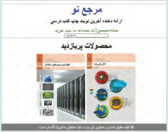

خروجی

انتخاب‌گرهای `CSS` عنصر یا مجموعه عناصری که استایل `CSS` برای آنها نوشته می‌شود، انتخاب‌گر نامیده می‌شوند. `CSS` دارای انواع مختلفی از انتخاب‌گرها شامل انتخاب‌گرهای ساده، ترکیبی، شبه‌کلاس، شبه عنصر و ویژگی است که در این بخش به آنها پرداخته می‌شود.

انتخاب‌گرهای ساده (`Simple`):

این انتخاب‌گرها از اسامی تگ‌ها، شناسه‌ها، کلاس‌ها و علامت * برای انتخاب عناصر استفاده می‌کنند. انواع انتخاب‌گرهای ساده در جدول ٨ آمده است:

جدول ٨ انواع انتخاب‌گرهای ساده

نوع انتخاب‌گر

عملکرد

انتخاب عناصر صفحه بر اساس نام تگ، مانند `h2`، `p`، `table`، `body` و ...

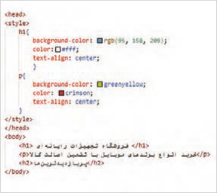

```
عنصر (Element)
```

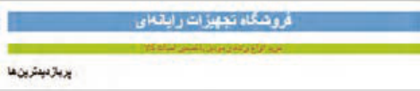


---

<!-- pdf-page: 130 | book-page: 124 -->

**صفحه ۱۲۴**

انتخاب عناصر صفحه براساس شناسه آنها: انتخاب‌گرهای شناسه با علامت # شروع می‌شوند. این انتخاب‌گرها عناصر را با استفاده از شناسه (`id`) آنها انتخاب می‌کنند. به عنوان مثال برای انتخاب عنصری با شناسه `test` از عبارت `test#` استفاده می‌شود. مقدار شناسه یک عنصر درون ویژگی `id` مشخص می‌شود. هر شناسه فقط مربوط به یک عنصر است و نباید برای سایر عناصر صفحه تکرار گردد. در مثال زیر انتخاب‌گر `test` متعلق به عنصر `<h2>` است.

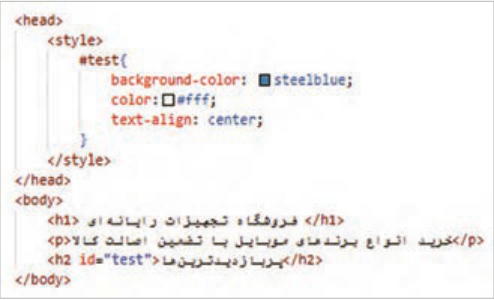

شناسه (`Id`)

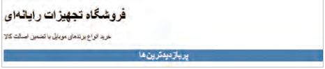

انتخاب عناصر صفحه براساس نام کلاس: انتخاب‌گرهای کلاس با علامت . شروع می‌شوند. این انتخاب‌گرها عناصر را با استفاده از نام کلاس (`class`) آنها انتخاب می‌کنند. ویژگی انتخاب‌گر کلاس این است که می‌تواند مجموعه‌ای از عناصر با نام کلاس یکسان را انتخاب نماید. به‌طور مثال انتخاب‌گر`.class1` تمام عناصر صفحه با ویژگی `"class="class1` را انتخاب می‌کند. در مثال زیر دو عنصر `<h1>` و `<p>` دارای نام کلاس یکسان هستند، پس رنگ متن هر دو آبی و اندازه فونت آنها 18 پیکسل می‌گردد.

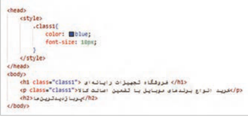

```
کلاس (Class)
```

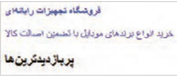


---

<!-- pdf-page: 131 | book-page: 125 -->

**صفحه ۱۲۵**

انتخاب گروهی از عناصر: انتخاب‌گرهای گروهی مجموعه‌ای از قوانین `CSS` را به چند عنصر اختصاص می‌دهند. در یک انتخابگر گروهی، نام عناصر به همراه کاما نوشته می‌شود. در مثال زیر عبارت `h1`, `h2`,`p` یک انتخاب‌گر گروهی محسوب می‌شود.

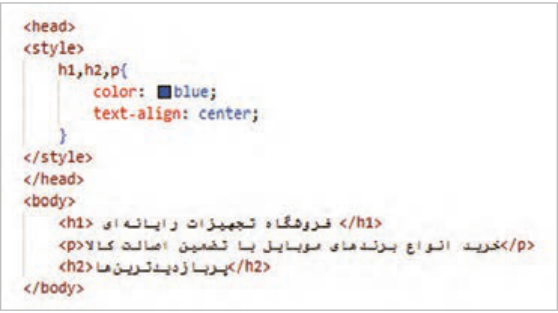

```
گروهی(Group)
```

قوانین بالا به تگ‌های `<h2<`، `>h1>` و `<p>` اعمال می‌شود. درنتیجه همۀ آنها، آبی و وسط‌چین می‌شوند.

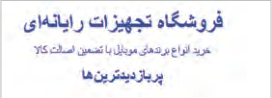

انتخاب تمام عناصر صفحه توسط علامت *:

در مثال زیر، مقدار حاشیه خارجی (`margin`) و فاصله داخلی (`padding`) در تمام عناصر صفحه برابر با صفر تنظیم شده است.

```
سراسری (universal)
```

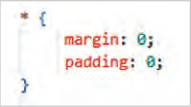

انتخاب‌گر ترکیبی(`Combinator`):

انتخاب‌گرهای ترکیبی در `CSS` برای تعریف رابطه ساختاری و موقعیتی میان دو یا چند انتخاب‌گر به‌کار می‌روند. مانند انتخاب‌گر فرزند با نماد < و انتخاب‌گر نوادگان با استفاده از فاصله، عناصری که به‌صورت تودرتو نوشته می‌شوند، رابطه والد و فرزندی پیدا می‌کنند. به‌عنوان مثال عنصر `li` فرزند عنصر `ul` است.

درنتیجه برای انتخاب عناصر `li` عبارت `ul` `li` یا `ul` > `li` استفاده می‌شود. استفاده از علامت < باعث می‌شود که محدودۀ تأثیرگذاری به فرزندان مستقیم یک عنصر کاهش یابد.


---

<!-- pdf-page: 132 | book-page: 126 -->

**صفحه ۱۲۶**

### مثال

تصویر زیر مثالی را درباره به‌کارگیری انتخاب‌گر ترکیبی نمایش می‌دهد.

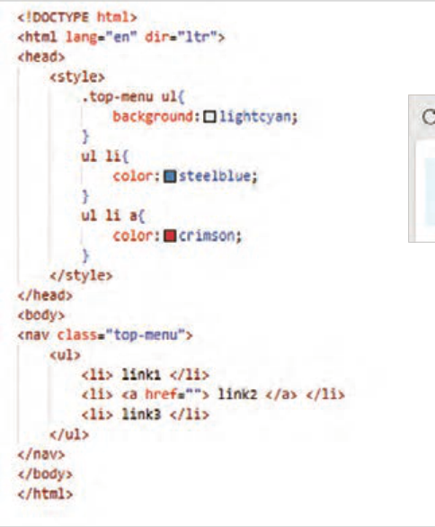

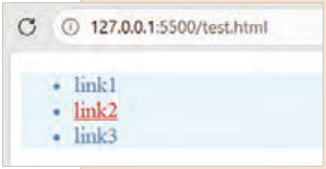

خروجی

انتخاب‌گرهای شبه‌کلاس (`Pseudo-class` `Selectors`) انتخاب‌گرهای شب‌هکلاس امکان تعیین استایل عناصر را براساس وضعیت، موقعیت یا ویژگی‌های پویای آنها فراهم می‌کند. برخی از این انتخاب‌گرها وابسته به عملکرد کاربر فعال می‌شوند. شبه‌کلاس‌ها با علامت : بعد از نام عنصر نوشته می‌شوند. انتخاب‌گرهای شبه‌کلاس به شرح زیر هستند:

`hover:` زمانی فعال م‌یشود که کاربر اشار‌هگر ماوس خود را بر روی یک عنصر ببرد.

`focus:` این رویداد زمانی اتفاق می‌افتد که یک عنصر (معمولاً عناصر فرم) فعال شود و کار امکان تعامل با آن را داشته باشد.

`active:` زمانی فعال می‌شود که یک عنصر در حالت فعال قرار گیرد. مانند زمانی که کاربر روی یک دکمه کلیک می‌کند.

`:nth-child`() امکان انتخاب فرزندان یک عنصر را بر اساس موقعیت آنها فراهم می‌کند.

`:frist-child` () امکان انتخاب اولین فرزند یک عنصر را برای انتخاب اولین فرزند یک عنصر به‌کار می‌رود.

`:last-child`() برای انتخاب آخرین فرزند یک عنصر به‌کار می‌رود.


---

<!-- pdf-page: 133 | book-page: 127 -->

**صفحه ۱۲۷**

انتخاب‌گر ویژگی (`Attribute` `selector`) انتخاب‌گر ویژگی، انتخاب عناصر را بر اساس ویژگی‌های آنها انجام می‌دهد. به‌طور مثال برای انتخاب عناصر متنی فرم از انتخاب‌گر `]"input[type="text` و برای انتخاب عناصری که دارای ویژگی `href` باشند از انتخاب‌گر `[href]` استفاده می‌شود.

کار با انواع انتخاب‌گرهای `CSS` (طراحی منو)

### کار کارگاهی

یک فایل با نام `index.html` ایجاد کنید و درون آن کدهای `HTML` زیر را بنویسید. فایل را ذخیره کنید و نتیجه را در مرورگر مشاهده کنید. سپس سبک عناصر را به‌صورت تدریجی به بخش `head` اضافه کنید و نتیجه هر سبک را بررسی کنید.

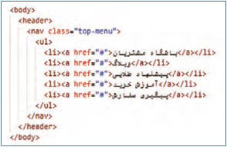

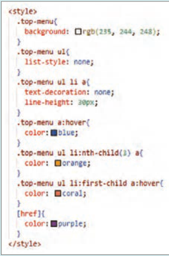

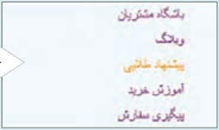

خروجی

### فعالیت

1 در مقابل هر انتخاب‌گر، نوع آن را به‌صورت `comment` بنویسید. محتوای کامنت را درون علامت /* */ قرار دهید.

2 ویژگی `list-style` با مقدار `none` چه نتیجه‌ای دارد؟


---

<!-- pdf-page: 134 | book-page: 128 -->

**صفحه ۱۲۸**

مدل جعبه‌ای (`Box` `Model`) مدل جعبه‌ای (`Box` `Model`) در `CSS` برای طراحی و چیدمان عناصر در صفحات وب استفاده می‌شود. هر عنصر `HTML` به‌عنوان یک «جعبه» در نظر گرفته می‌شود که شامل چهار قسمت محتوا (`content`)، فضای اضافی داخل عنصر (`padding`)، خط دور (`border`) و فاصله عنصر تا عناصر مجاور (`margin`) است. در مثال زیر این تنظیمات قابل مشاهده و بررسی است: (شکل25) .

ویژگی‌های `width` و `height` صرفاً پهنا و ارتفاع ناحیه محتوا (`content`) را مشخص می‌کنند. بنابراین مقداردهی به ویژگی‌های `padding`، `margin` و `border` باعث افزایش ابعاد نهایی جعبه می‌شود. این مقادیر باید در محاسبات ابعاد جعبه لحاظ شود. برای

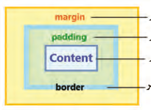

فاصله تا عناصر دیگر

جلوگیری از تأثیر دو ویژگی `border` و `padding`

فاصله بین محتوا و خط دور

روی پهنا و ارتفاع عنصر از ویژگی `box-sizing` با

محتوای عنصر

مقدار `border-box` استفاده می‌شود. با انجام این کار، مجموع ابعاد محتوا، `padding` و `border` در

خط دور عنصر

راستای افقی و عمودی برابر با مقادیر `width` و `height` خواهد بود.

**شکل24**

بررسی عملکرد مدل جعبه‌ای

### کار کارگاهی

فایلی با نام `box-model.html` ایجاد کنید و دو عنصر `<div>` و `` را به همراه سبک آنها درون فایل وارد کنید:

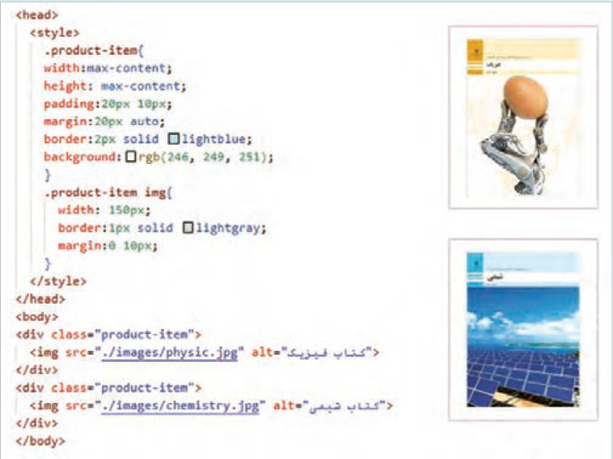


---

<!-- pdf-page: 135 | book-page: 129 -->

**صفحه ۱۲۹**

در فایل `index.html` (کارگاه قبل) ویژگی‌های مارجین و پدینگ عنصر `ul` را برابر صفر قرار دهید (`margin:0`;`padding:0`) و برای عنصر `header` مقداری پدینگ تنظیم کنید (`padding:10px20.px`) سپس تغییرات منو را در مرورگر بررسی کنید.

```
مدل نمایش (Display Model)
```

مدل نمایش در `CSS` به نحوه نمایش و رفتار عناصر در صفحه وب اشاره دارد. این مدل تعیین می‌کند که عناصر چگونه در کنار یکدیگر قرار بگیرند و چگونه با هم تعامل کنند. مدل نمایش توسط ویژگی `display` با مقادیر مختلف تعیین می‌شود. در ادامه به شرح مقادیر این ویژگی پرداخته می‌شود:

`block:` عناصری با ویژگی `display:` `block` به صورت بلوکی نمایش داده می‌شوند و فضای کامل خط را اشغال می‌کنند. این عناصر به طور پیش‌فرض در یک خط جدید شروع می‌شوند و امکان تعیین `width` و `height` برای آنها فراهم است.

`Inline:` عناصر `inline` مانند کلمات رفتار می‌کنند، یعنی عناصر پشت سر هم قرار می‌گیرند و خط جدید ایجاد نمی‌کنند. این عناصر تنها ب‌هاندازۀ محتوای خود فضا اشغال می‌کنند؛ در نتیجه تعیین `width` و `height` برای آنها بی اثر است. به‌علاوه اختصاص ویژگی‌های `margin` برای قسمت‌های بالا و پایین عنصر اثرگذار نخواهد بود.

`Inline-block:` این حالت ترکیبی از `block` و `inline` است. عناصر `inline-block` می‌توانند به صورت بلوکی رفتار کنند، اما درون خط جاری قرار می‌گیرند. این عناصر می‌توانند پهنا و ارتفاع داشته باشند و به اندازه محتوای خود فضا اشغال می‌کنند.

جدول 9 مقایسه عناصر `Block` و `Inline` در `CSS`

عناصر `Inline`عناصر `Block`

ویژگی

در همان سطر ادامه پیدا می‌کنند.

همیشه در سطر جدید شروع می‌شوند.

شروع در سطر جدید

فقط به اندازۀ محتوای عنصر است. حتی با تعیین پهنا، کل سطر را به خود اختصاص می‌دهد.

```
پهنا (width)
```

معمولاً فقط به اندازۀ محتوا است.

می‌توان تنظیم کرد.

ارتفاع (`height`)

```
<span>, <a>, <b>, <i>
<div>, <p>, <h1>, <section>
```

نمونه عناصر

چند عنصر کنار هم قرار می‌گیرند.

هرکدام در خط جدا قرار می‌گیرند.

رفتار در کنار هم


---

<!-- pdf-page: 136 | book-page: 130 -->

**صفحه ۱۳۰**

به‌کارگیری ویژگی `display` با مقادیر `block` ، `Inline` و `Inline-block` .

### کار کارگاهی

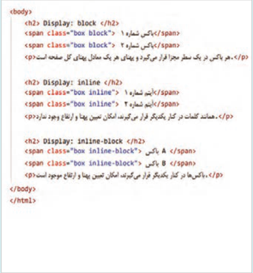

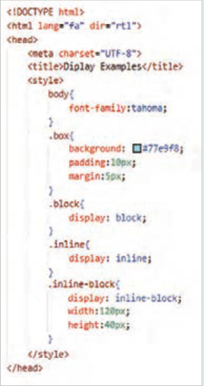

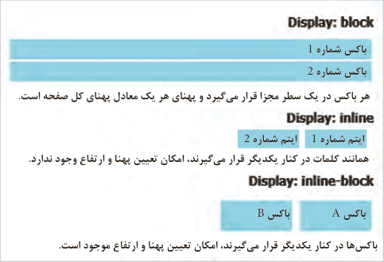

باکس شماره 1 باکس شماره 2 هر باکس در یک سطر مجزا قرار می‌گیرد و پهنای هر یک معادل پهنای کل صفحه است.

ایتم شماره 1 ایتم شماره 2 همانند کلمات در کنار یکدیگر قرار م‌یگیرند، امکان تعیین پهنا و ارتفاع وجود ندارد.

باکس `A`

باکس `B`

باک‌سها در کنار یکدیگر قرار م‌یگیرند، امکان تعیین پهنا و ارتفاع موجود است.


---

<!-- pdf-page: 137 | book-page: 131 -->

**صفحه ۱۳۱**

به‌کارگیری ویژگی `display` در طراحی فرم ورود به سایت

### کار کارگاهی

فایل `login.html` را در پوشه `web` برای ورود کاربر به سایت ایجاد کنید.

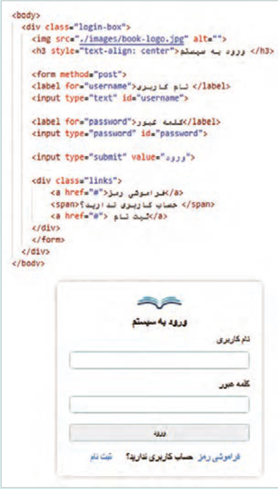

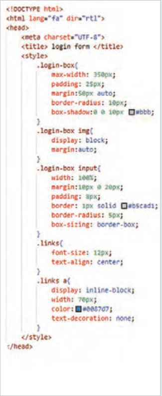


---

<!-- pdf-page: 138 | book-page: 132 -->

**صفحه ۱۳۲**

چیدمان `Flexbox` فلکس یک مدل طرح‌بندی در `CSS` است که برای ایجاد طرح‌های منعطف، واکنش‌گرا و یک بعدی استفاده می‌شود. فلکس توانایی ایجاد یک چیدمان افقی یا عمودی را برای عناصر صفحه دارد؛ به‌علاوه امکان تراز کردن عناصر و توزیع خودکار فضا را به توسعه‌دهنده می‌دهد. طرح‌هایی که توسط `flexbox` ایجاد می‌شوند، با اندازه‌های مختلف صفحه نمایش سازگاری خواهند داشت (جدول 10).

تنظیم ویژگی‌های عنصر والد برای چینش افقی یا عمودی عناصر فرزند در یک عنصر مشخص، از مدل فلکس استفاده می‌شود. بدین منظور ویژگی `display` با مقدار `Flex` برای عنصر والد به‌کار می‌رود. در حالت پیش‌فرض این کار باعث ایجاد چیدمان افقی برای فرزندان عنصر والد می‌گردد.

برای فعال‌کردن `Flexbox` کافی است ویژگی زیر را به عنصر والد اضافه کنید:

```
;display: flex
```

`felx-direction:` این ویژگی برای تعیین جهت چینش عناصر، به‌صورت افقی یا عمودی استفاده می‌شود.

مقادیر این ویژگی در جدول 10 مشخص شده است.

جدول 10 مقادیر ویژگی `flex-direction` و تأثیر آنها روی نحوه چینش عناصر

مقدار`row`

```
Row-reverse
```

افقی (پیش فرض)

افقی (راست به چپ)

```
flex-direction:row
flex-direction:row-reverse
```

توضیح

`box3`

`box2`

`box1`

`box1`

`box2`

`box3`

مقدار`column`

```
Column-reverse
```

عمودی از بالا به پایین

عمودی از پایین به بالا

```
flex-direction:column
flex-direction:column-reverse
```

`box1`

`box3`

توضیح

`box2`

`box2`

`box3`

`box1`


---

<!-- pdf-page: 139 | book-page: 133 -->

**صفحه ۱۳۳**

`felx-wrap:` گاهی پهنای صفحه به اندازه‌ای نیست که همه عناصر در کنار یکدیگر قرار بگیرند. ویژگی `flex-wrap` مشخص می‌کند که عناصر اضافی به سطر بعد منتقل شوند یا همگی در همان سطر فشرده شوند (جدول11).

جدول 11 مقادیر ویژگی `felx-wrap`

مقدار`wrap`

```
nowrap
```

توضیح

انتقال به سطر بعد

عدم انتقال به سطر بعد

`felx-folw:` ویژگی `flex-flow` ترکیب `flex-direction` و `flex-wrap` است. به‌جای نوشتن دو خط کد می‌توان هر دو ویژگی را در یک خط تنظیم نمود. مانند زیر:

```
{.container
;flex-flow: row wrap
```

}

`justify-content:` این ویژگی تراز عناصر و نحوه توزیع فضای خالی بین عناصر را در راستای محور اصلی کنترل می‌کند (جدول 12).

جدول 12 مقادیر ویژگی `justify-content`

مقدار

### توضیحات

مقدار

### توضیحات

چینش عناصر در سمت

ایجاد فضای خالی به میزان برابر در اطراف هر

```
Flex-start
Space-around
```

چپ

عنصر

چینش عناصر در سمت

فضای خالی برابر بین عناصر (عنصر اول و آخر

```
Flex-end
Space-between
```

راست

به لبه‌ها می‌چسبند)

فضای خالی برابر در بین عناصر و همچنین بین

```
Center
```

چینش عناصر در مرکز `Space-evenly`

عناصر و لبه‌ها


---

<!-- pdf-page: 140 | book-page: 134 -->

**صفحه ۱۳۴**

`align-items:` ویژگی`align-items` در `Flexbox` برای تراز‌کردن عناصر در راستای محور متقاطع (عمود بر محور اصلی) استفاده می‌شود. به کمک این ویژگی می‌توان عناصر را در بالا، پایین و وسط یک سطر قرار داد (شکل 26).

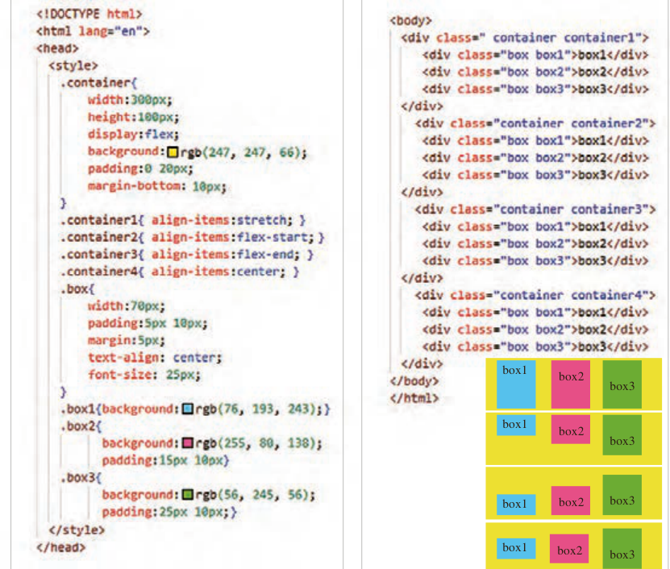

`box1`

`box2`

`box3`

`box1`

`box2`

`box3`

`box3`

`box2`

`box1`

`box1`

`box2`

`box3`

**شکل 26**

جدول 13 مقادیر ویژگی `align-items`

```
مقدارStretch
flex-start
flex-end
center
```

به‌صورت کشیده درون

در بالای عنصر والد قرار

در پایین عنصر والد قرار

در وسط عنصر والد

توضیح

عنصر والد قرار می‌گیرد

می‌گیرد.

می‌گیرد.

قرار می‌گیرد.

(پیش‌فرض)


---

<!-- pdf-page: 141 | book-page: 135 -->

**صفحه ۱۳۵**

طرح بندی صفحات با `Flexbox` تعیین چیدمان عناصر منوی ناوبری با استفاده از `Flexbox`

### کار کارگاهی

فایل `index.html` را باز کنید و تغییرات زیر را درون آن انجام دهید:

1 عناصر زیر را درون برچسب `<nav>` بعد از برچسب `<ul/>` اضافه کنید و درون آن آیکن سبد خرید و عبارت «ورود | ثبت نام» را قرار دهید:

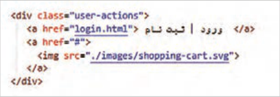

برای تهیه آیکن سبد خرید به سایت `svgrepo.com` مراجعه کنید و عبارت `shopping-cart` را جست‌وجو کنید. یک سبد خرید دلخواه را انتخاب کرده و سپس با کلیک روی گزینه `Edit` `vector`، تصویر را ویرایش نمایید. اندازه آیکن را روی مقدار حداقل تنظیم کنید. سپس روی دکمه `Export` کلیک کنید. یک فایل `svg` دانلود می‌شود. این فایل را با نام `shopping-cart.svg` در پوشه تصاویر ذخیره کنید.

2 استایل نوار ناوبری (`.top-menu`) را به‌صورت شکل زیر تنظیم کنید:

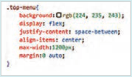

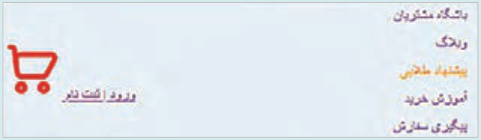

ویژگی `flex:` `display`، نوار ناوبری را به یک نگهدارنده فلکس تبدیل می‌کند تا آیتم‌های درون آن (لیست منو در سمت راست و بخش `user-action` در سمت چپ) به صورت افقی چیده شوند.

ویژگی ;`space-between:` `justify-content`، لیست منو و بخش `user-actions` را به صورت افقی در دو انتهای نگهدارنده قرار می‌دهد.

ویژگی `align-items:` `center` باعث می‌شود که عناصر درون نگهدارنده فلکس در راستای عمودی در مرکز قرار گیرند.

ویژگی `max-width:` `1200px`، حداکثر پهنای نوار ناوبری را برابر ۱۲۰۰ پیکسل قرار می‌دهد.

این مقداردهی باعث می‌شود که نوار ناوبری در صفحه نمایش‌های بزرگ، بیش از حد کشیده نشود.

ویژگی `margin:0` `auto` برای قرار گرفتن محدوده نوار منو در وسط صفحه استفاده می‌شود.


---

<!-- pdf-page: 142 | book-page: 136 -->

**صفحه ۱۳۶**

3 استایل عناصر درون برچسب `<ul>` را به شکل زیر تنظیم کنید:

ویژگی `display:flex` برای چیدمان افقی عناصر درون برچسب `<ul>` استفاده شده است و ویژگی `justify-content` فضای بین عناصر را به شکل مناسب توزیع می‌نماید.

ویژگی `margin-left:25px` فاصله هر عنصر منو را از عنصر سمت چپ مشخص می نماید.

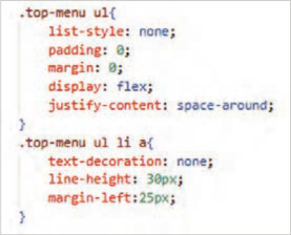

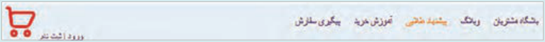

4 استایل بخش `user-actions` را به شکل زیر تنظیم کنید:

به‌کارگیری ویژگی `display:flex` موجب نمایش دو عنصر «ورود|ثبت نام» و سبد خرید به صورت افقی می‌شود و ویژگی `align-items:Center` این عناصر را در راستای محور عمودی در وسط ناحیه `user-actions` نمایش می‌دهد.

پهنای تصویر سبد خرید باید به اندازه 25 پیکسل و فاصله آن از سمت چپ (`margin-left`) باید با مقدار صفر تنظیم شود.

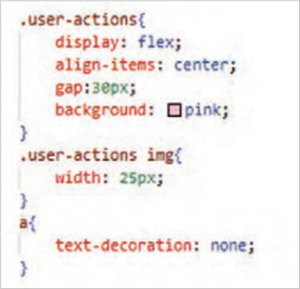

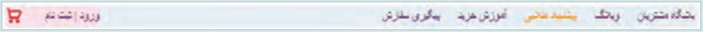


---

<!-- pdf-page: 143 | book-page: 137 -->

**صفحه ۱۳۷**

رنگ‌های پس زمینه را از کلاس‌های `top-menu`، `user-actions` حذف کنید تا نتیجه زیر حاصل شود


ایجاد بخش اصلی صفحه بعد از طراحی بخش هدر سایت، نوبت به طراحی محتوای اصلی صفحه، شامل بخش‌های «جدیدترین محصولات» و «خدمات ویژه» می‌رسد.

برای طراحی بخش اصلی صفحه از برچسب `<main>` استفاده می‌شود. این برچسب باید بعد از برچسب `<header/>` و قبل از `<body/>` قرار گیرد.

محتوای نواحی «جدیدترین محصولات» و «خدمات ویژه» باید درون عنصر `<main>` واقع شود.

طراحی بخش «جدیدترین محصولات» با استفاده از `Flexbox`

### کار کارگاهی

1 یک برچسب `<main>` بعد از برچسب `<header/>` درج کنید و درون آن یک عنصر `<section>` قرار دهید. یک عنصر `<section>` با کلاس `container` درون عنصر `<main>` ایجاد کنید. این عنصر باید حاوی یک عنوان (`h2`) و یک عنصر نگهدارنده (`div`) برای نگهداری کارت محصولات باشد. عنوان «جدیدترین محصولات» را درون تگ `<h2>` بنویسید.

2 یک کلاس با عنوان `products` به عنصر `<div>` اختصاص دهید و درون عنصر `products` کارت محصولات را قرار دهید. کارت محصول را توسط یک عنصر با کلاس `product-card` ایجاد کنید. هر کارت حاوی تصویر، عنوان و قیمت محصول است.

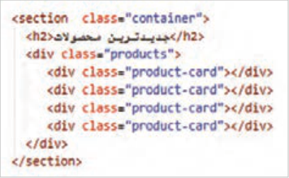

3 برای آنکه مجموعه تصویر، عنوان و قیمت قابل کلیک باشد، کل محتوای کارت را درون برچسب `<a>` قرار دهید. تصمیم‌گیری در خصوص چیدمان ستونی تصویر، عنوان و قیمت محصول در تنظیمات عنصر `<a>` انجام می‌شود.

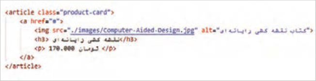

کارت محصول


---

<!-- pdf-page: 144 | book-page: 138 -->

**صفحه ۱۳۸**

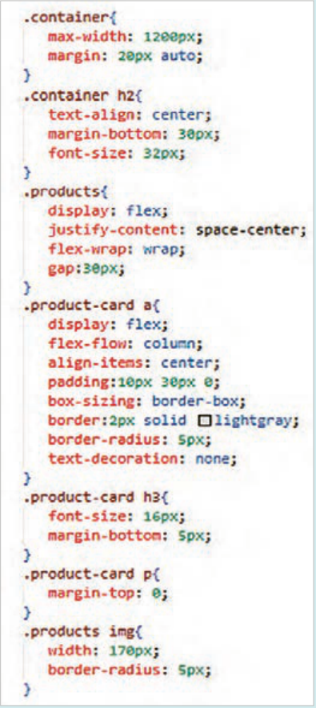

محتوای سه کارت دیگر را نیز مشابه کد صفحه قبل بنویسید. ویژگی عناصر را به‌صورت تدریجی به صفحه اضافه کنید و نتیجه هر تغییر را در مرورگر بررسی کنید.

ویژگی `max-width` حداکثر پهنای ناحیه نگهدارنده را مشخص می‌کند.

ویژگی `margin:20px` `auto` عنصر نگهدارنده را در راستای افقی در وسط صفحه قرار می‌دهد.

ویژگی `display:flex` توزیع کارت‌های موجود در عنصر `products` را توسط تکنیک فلکس انجام می‌دهد.

ویژگی `justify-content:center` کارت‌ها را در وسط ناحیۀ نگهدارنده توزیع می‌کند.

ویژگی `flex-wrap:wrap` باعث تغییر چیدمان عناصر در هنگام کوچک‌تر شدن پهنای دستگاه می‌گردد. به‌طوری‌که کارت محصولات به سطر بعدی منتقل شوند.

ویژگی `gap` فاصله بین کارت محصولات را مشخص می‌کند.

با توجه به اینکه مجموعه «تصویر، عنوان و قیمت محصول» درون عنصر `<a>` قرار گرفته است، پس تنظیم چیدمان ستونی این عناصر توسط انتخاب‌گر `.product-card` `a` انجام می‌شود.

ویژگی `flex-direction:column` چیدمان عناصر را به‌صورت ستونی انجام می‌دهد.

ویژگی `align-items:center` تراز عناصر را در راستای محور عمودی تنظیم می‌کند.

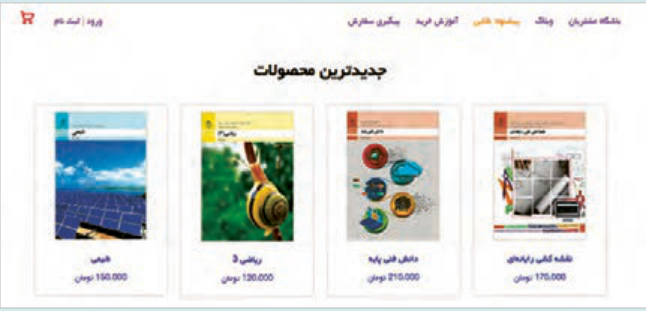


---

<!-- pdf-page: 145 | book-page: 139 -->

**صفحه ۱۳۹**

### فعالیت

رنگ زمینه کارت‌ها را با مقدار `rgb`(251, 248, 249) تنظیم کنید و نتیجه را بررسی کنید.

چند کارت دیگر به مجموعه کارت‌ها اضافه کنید و نحوۀ چیدمان کارت‌ها را مشاهده کنید.

پهنای مرورگر را تا حد امکان کم کنید و وضعیت چیدمان کارت‌ها را بررسی کنید. آیا با کم شدن فضا، کارت‌ها به سطر بعد منتقل می‌شوند؟ ویژگی `flex-wrap:wrap` را حذف کنید و مجددًا نتیجۀ کوچک شدن پهنای صفحه را بررسی کنید.

مقدار ویژگی `justify-content` را با مقادیر `space-around` و `space-evenly` جایگزین کنید و نتیجۀ چینش محصولات را بررسی کنید.

### بیشتر بدانید

طرح‌بندی صفحه با چیدمان شبکه‌ای (`Grid`) برخلاف مدل `flex` که تنها در یک بعد (سطر یا ستون) عمل می‌کند، مدل `Grid` امکان ایجاد سطرها و ستون‌های حاوی محتوا را به‌صورت هم‌زمان فراهم می‌آورد. با استفاده از سیستم `grid`، می‌توان کنترل دقیقی بر روی فاصله‌ها و اندازه‌ها داشت. این روش انعطاف‌پذیر است و برای ایجاد ساختارهای شبکه‌ای منظم و واکنش‌گرا بسیار مفید است. برای ایجاد یک چیدمان شبکه‌ای از ویژگی `display` با مقدار `grid` استفاده می‌شود. تعداد ستون‌های شبکه توسط ویژگی `grid-template-columns` و فاصلۀ بین ستون‌ها توسط ویژگی `gap` تعیین می‌شود.

طراحی بخش «خدمات ویژه» با استفاده از مدل `Grid`

### کار کارگاهی

در فایل `index.html` تغییرات زیر را به‌صورت تدریجی اعمال کنید.

1 پنج تصویر لوگو، مطابق شکل زیر دانلود کنید و درون پوشه تصاویر سایت (`images`) ذخیره کنید.

2 یک عنصر `<section>` با کلاس `services-area` برای بخش «خدمات ویژه» ایجاد کنید. این عنصر باید حاوی یک عنصر `<h2>` و یک نگهدارنده `<div>` با کلاس `services-grid` باشد. عنصر `<div>` آیتم‌های خدمات ویژه را درون خود جای می‌دهد.

3 هر یک از آیتم‌های خدمات ویژه را توسط یک عنصر `<div>` با کلاس `service-item` ایجاد کنید.

این آیتم‌ها با استفاده از مدل گرید در چند ستون کنار هم قرار می‌گیرند.

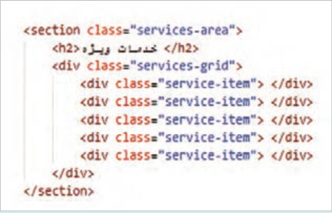


---

<!-- pdf-page: 146 | book-page: 140 -->

**صفحه ۱۴۰**

4 هر آیتم خدمات ویژه شامل یک تصویر لوگو (`img`) و عنوان آن (`p`) است. کد `HTML` بخش خدمات ویژه را مشابه کد شکل زیر تکمیل کنید:

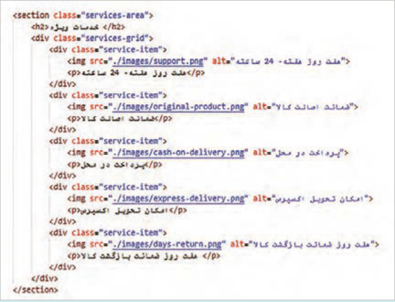

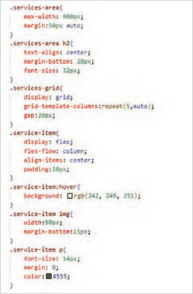

5 استایل عناصر را ب‌هصورت تدریجی به صفحه اضافه کنید و نتیجه را در مرورگر مشاهده کنید.

```
ویژگی display: grid عنصر services-grid را
```

به یک نگهدارنده گرید تبدیل می‌کند. در نتیجه تمام فرزندان مستقیم آن (`service-item`) به آیتم‌های گرید تبدیل شده و می‌توان آنها را در ردیف‌ها و ستون‌ها توزیع نمود.

```
ویژگی grid-template-columns با پنج
```

مقدار `auto` پنج ستون ایجاد می‌کند که پهنای آنها وابسته به محتوای هر ستون خواهد بود. به کمک این ویژگی تصاویر لوگو در پنج ستون ظاهر می‌شوند.

ویژگی `gap:20px` فاصلۀ میان ستون‌ها را برابر 20 پیکسل قرار می‌دهد.


---

<!-- pdf-page: 147 | book-page: 141 -->

**صفحه ۱۴۱**

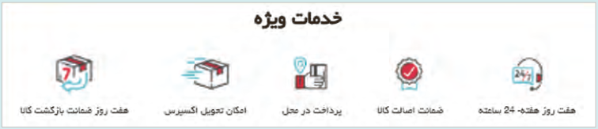

### بیشتر بدانید

موقعیت‌دهی به عناصر صفحه توسط ویژگی `position` ویژگی `position` یکی از مهم‌ترین ویژگی‌ها برای کنترل نحوه قرارگیری عناصر در صفحه است. این ویژگی برای تنظیم جایگاه یک عنصر نسبت به عناصر والد یا عناصر دیگر کاربرد دارد. ویژگی `position` دارای مقادیر `static`، `relative`، `absolute`، `fixed` و `sticky` به شرح زیر است:

`static:` تمام عناصر صفحه دارای مقدار پیش فرض `static` هستند.

`relative:` جایگاه یک عنصر را نسبت به موقعیت اولیه آن مشخص می‌کند. برای جابه‌جایی عنصر نسبت به موقعیت اولیه، از ویژگی‌های `top`، `left`، `right` و `bottom` استفاده می‌شود.

`absolute:` موقعیت عنصر را نسبت به عنصر والد مشخص می‌کند.

`fxied:` جایگاه یک عنصر را به‌صورت ثابت حفظ می‌کند.

تصویر یک دکمه `chat-widget` را در موقعیت (30، 600) به‌صورت ثابت نمایش دهید. برای این‌کار تصویر دکمه چت ویجت را در ابعاد 45×45 به صفحه اضافه کنید. برای تنظیم اندازه تصویر از برنامه `paint` استفاده کنید. تصویر را قبل از برچسب `<main/>` قرار دهید:

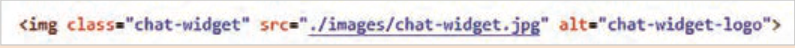

استایل تصویر را مانند کدهای روبه‌رو تنظیم کنید.

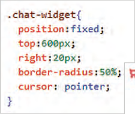

تصویر این دکمه در گوشه پایین سمت راست صفحه نمایش داده خواهد شد.

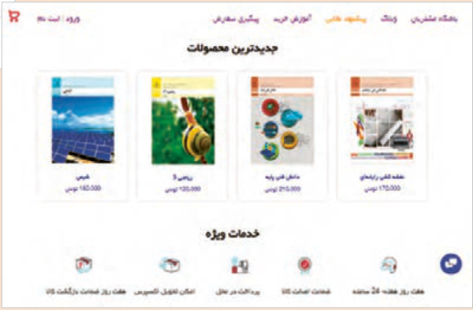


---

<!-- pdf-page: 148 | book-page: 142 -->

**صفحه ۱۴۲**

### مدیا کوئری (Media query)

مدیا کوئری یک تکنیک `CSS` است که امکان تعیین ویژگی‌های عناصر را بر اساس ویژگی‌های مختلف دستگاه‌ها (مانند اندازه صفحه‌نمایش، وضوح، جهت‌گیری و غیره) فراهم می‌کند. این قابلیت شرایطی را فراهم می‌کند که توسعه دهنده بتواند وب‌سایت‌ها و اپلیکیشن‌های وب خود را برای انواع دستگاه‌ها (مانند موبایل، تبلت و دسکتاپ) بهینه‌سازی نماید.

مدیا کوئری‌ها با استفاده از دستور `media@` در `CSS` نوشته می‌شوند و دارای ساختار زیر هستند:

```
{ (condition) media media-type and@
CSS rules
```

}

استفاده از مدیاکوئری برای تغییر وضعیت عناصر در نمای موبایل

### کار کارگاهی

استایل‌های زیر را به انتهای سبک‌های فایل `index.html` اضافه کنید. فایل را ذخیره کنید و نتیجه را در مرورگر بررسی کنید.

```
{)max-width:600px( media@
```

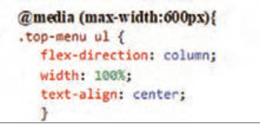

```
{ .top-menu ul
```

تغییر چیدمان عناصر منو از حالت افقی به

```
;flex-direction: column
```

حالت عمودی

```
;%width: 100
```

اشغال پهنای کامل برای هر عنصر لیست

```
;text-align: center
```

وسط چین کردن متن گزینه‌ها

}

```
{ .top-menu ul li
```

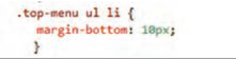

```
;margin-bottom: 10px
```

تنظیم فاصلۀ عمودی بین گزینه‌های منو

}


```
{ .user-actions
```

مخفی کردن ناحیه `user-action`

```
;display: none
```

}

```
{ .services-grid
```


```
;grid-template-columns: 1fr
```

ایجاد یک ستون واحد

```
;gap: 30px
```

افزایش فاصله عمودی بین گزینه‌ها

}

```
{ .service-item
```


```
;max-width: 300px
```

قرار دادن آیتم‌های خدمات در وسط سطر

```
;margin: 0 auto
```

}

```
{.chat-widget
```


```
;display: none
```

پنهان‌سازی لوگوی چت ویجت

}

{

### فعالیت

برای بررسی عملکرد مدیا کوئری، لبۀ سمت راست مرورگر را تا حد امکان به سمت چپ جابه‌جا کنید.

با کوچک شدن پهنای پنجره، گزینه‌های منو به‌صورت عمودی چیده می‌شوند. ناحیۀ `user-actions` ناپدید می‌گردد و تصاویر خدمت ویژه به‌صورت ستونی چیده می‌شوند.


---

<!-- pdf-page: 149 | book-page: 143 -->

**صفحه ۱۴۳**

ارزشیابی شایستگی طراحی ظاهر صفحات وب با `CSS`

استاندارد عملکرد کار: با استفاده از شیوه‌های `CSS`، ظاهر و چیدمان‌های پیچیده وب‌سایت‌ها را مطابق با استانداردها و طراحی‌های بصری مشخص پیاده‌سازی نماید.

نمره

شرایط انجام کار (ابزار،مواد، تجهیزات،

ابزارهای

نتایج

ردیف

مرا حل کار

استاندارد (شاخص‌ها/داوری/نمره‌دهی)

کسب

زمان، مکان و ...)

### ارزشیابی

ممکن شده

استفاده صحیح از هر سه روش (`External` ،`Internal` ،`Inline` تشخیص و اصلاح

3

تداخل استایل‌ها رعایت ترتیب و اولویت استاندارد اعمال صحیح تغییر ظاهری روی عنصر مورد نظر اجرای کارها به چند روش اجرای کنجکاوی‌ها مشاهده نصب توسط

آشنایی با روش‌های افزودن

رایانه یا لپ‌تاپ سالم، ویرایشگر کد (`VS` `Code` یا هنرجو،

استفاده صحیح از هر سه روش (`External` ،`Internal` ،`Inline` تشخیص و

1

`CSS`، مدیریت آنها

مشابه)، مرورگر وب به‌روز، زمان 25 دقیقه،

تمرین عملی

اصلاح تداخل استایل‌ها رعایت ترتیب و اولویت استاندارد اعمال صحیح تغییر

2

مشاهده ظاهری روی عنصر موردنظر کدنویسی انجام نادرست یا ناقص هر یک از مراحل کاری1 با استفاده از ویژگی مربوط به قالب‌بندی متن را به درستی انجام دهد.

از ویژگی‌های مربوط به تعیین ظاهر عناصر برای تعیین رنگ متن، رنگ

3

زمینه، تصویر پس‌زمینه، کنترل تصویر پس‌زمینه، شفافیت و خط دور عناصر به‌درستی استفاده کند اجرای کارها با چند روش اجرای کنجکاوی‌ها

رایانه یا لپ‌تاپرایانه یا لپ‌تاپ سالم، ویرایشگر

مشاهده کد

2قالب‌دهی به متن

کد (`VS` `Code` یا مشابه)، مرورگر وب به‌روز،

نوشته شده

با استفاده از ویژگی مربوط به قالب‌بندی متن را به‌درستی انجام دهد.

زمان 25 دقیقه

کد نویسی

از ویژگی‌های مربوط به تعیین ظاهر عناصر برای تعیین رنگ متن، رنگ

2

زمینه، تصویر پس‌زمینه، کنترل تصویر پس‌زمینه، شفافیت و خط دور عناصر به‌درستی استفاده کند.

اجرای نادرست و یا ناقص هر یک از مراحل کاری1 تعیین استایل عناصر صفحه براساس رابطۀ والد و فرزندی بین آنها با استفاده درست از انتخاب‌گرهای ساده تعیین استایل عناصر براساس حالات و ویژگی‌های خاص آنها با استفاده از انتخاب‌گرهای شبه کلاس امکان

3

انتخاب عناصر براساس ویژگی‌های آنها با استفاده از انتخاب‌گر‌های ترکیبی انجام کارها با چند روش انجام کنجکاوی‌ها مشاهده

رایانه، مرورگر برای تست زمان 15 دقیقه، اجرای عملکرد

3

کار با انتخاب‌گرها در `CSS`

کار در کلاس عملی یا آزمایشگاه رایانه.

قالب، تمرین

تعیین استایل عناصر صفحه براساس رابطۀ والد و فرزندی بین آنها با گروهی استفاده درست از انتخاب‌گرهای ساده تعیین استایل عناصر براساس حالات

2

و ویژگی‌های خاص آنها با استفاده از انتخاب‌گرهای شبه کلاس امکان انتخاب عناصر براساس ویژگی‌های آنها با استفاده از انتخاب‌گر ترکیبی به کارگیری انتخا‌بگ‌رهای ساده1

```
عناصر معنایی (header, main, footer, section, article, nav) درست
```

استفاده شده باشند صفحه استاندارد `HTML5` داشته باشد انجام کنجکاوی‌ها انجام کار با روش‌های دیگ	ر3 مشاهده

رایانه، مرورگر برای تست زمان 30 دقیقه، اجرای

4کار با مدل های جعبه‌ای

عملکرد

کار در کلاس عملی یا آزمایشگاه رایانه.

```
عناصر معنایی (header, main, footer, section, article, nav) درست
```

قالب استفاده شده باشند صفحه استاندارد `HTML5` داشته باشد.2 انجام ناقص هریک ازمراحل1 عناصر جانبی (`aside` `caption`) به‌درستی اضافه شده باشند تصاویر همراه با توضیحات درست نمایش داده شوند ایجاد جدول با 2 سطر و 2

3

ستون ایجاد فرم‌های ورود اطلاعات انجام کنجکاوی‌ها انجام کار با پرسش روش‌ها‌ی

دیگر

مدل‌های نمایش عناصر

کتبی

در صفحه

رایانه مرورگر برای تست زمان ٠٣ دقیقه،

آزمون عملی

5

```
Flexbox-gride model
```

کار در کلاس عملی یا آزمایشگاه رایانه.

مشاهده عناصر جانبی (`aside` `caption`) به‌درستی اضافه شده باشند تصاویر همراه با توضیحات درست نمایش داده شوند ایجاد فرم‌های ورود اطلاعات 2

```
disply -
```

عملکرد هنرآموز انجام ناقص هریک از مراحل1


---

<!-- pdf-page: 150 | book-page: 144 -->

**صفحه ۱۴۴**

استفاده مناسب از `div` و `span` برای ساختاردهی توضیحات و مستندسازی کد کامل باشد مزایای استفاده از تگ‌های معنایی (مانند `article`, `section`) مشاهده

3

را برای سئو و دسترسی‌پذیری توضیح دهند انجام کنجکاوی‌ها انجام کار

مستندسازی

با روش‌های دیگر

رایانه مرورگر

و توضیحات

تکمیل ساختار با عناصر

منابع راهنما برای مستندسازی کد

نوشته‌شده

6

استفاده مناسب از `div` و `span` برای ساختاردهی نظر‌ها و مستندسازی

غیرمعنایی و مستندسازی

15 دقیقه

اجرای کد کامل باشد.2 صفحه و صحت نمایش نهایی انجام ناقص هریک از مراحل مزایای استفاده از تگ‌های معنایی (مانند

1

`article`, `section`) را برای سئو و دسترسی‌پذیری توضیح دهند.

احراز همه شایستگی‌های غیرفنی2

شایستگی‌های غیر فنی، ایمنی، بهداشت، توجهات زیست محیطی و نگرش:

عدم احراز هر یک از شایستگی‌های غیرفنی1 بلی

ارزشیابی کار (شایستگی انجام کار)

خیر

### توضیحات:

1 معیار شایستگی انجام کار:

کسب حداقل نمره 2 از مراحل 1، 2، 3، 4 و ٥ (مراحل بحرانی) کسب حداقل نمره 2 از بخش شایستگی‌های غیرفنی، ایمنی، بهداشت، توجهات زیست‌محیطی و نگرش کسب حداقل میانگین 2 از مراحل کار

2 تعریف سطوح شایستگی: صرف‌نظر از اینکه یک تکلیف کاری در چه سطحی از صلاحیت حرفه‌ای انجام می‌شود، در هر محیط کاری ممکن است انجام هر کار با کیفیت مشخصی مورد انتظار باشد. سطح شایستگی انجام کار، معیار اساسی ارزشیابی است.

مهارت (سطح سه): ماهر و قادر به آموزش و هدایت دیگران، توانایی برنامه‌ریزی و تحلیل، پاسخ‌گویی در برابر کارهای خود، سروکار داشتن با سطح وسیعی از کارها و فعالیت‌ها تسلط (سطح چهار): خبرگی در انجام کار و آموزش دیگران، ایجاد نوآوری، سازگاری، عیب‌یابی، هدایت و راهنمایی دیگران.
