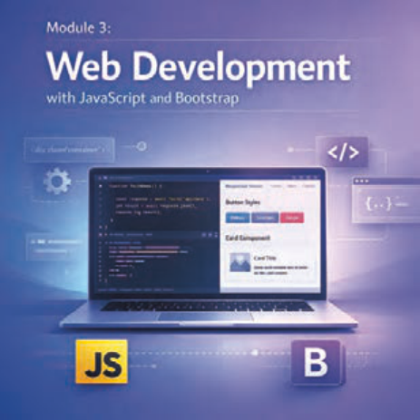

# پودمان سوم

---

<!-- pdf-page: 151 | book-page: 145 -->

**صفحه ۱۴۵**

# پودمان سوم

## تولید صفحات وب تعاملی

تولید صفحات وب تعاملی به معنای ایجاد تجربه‌ای پویا و جذاب برای کاربران است که فراتر از نمایش ساده و بدون تغییر اطلاعات می‌باشد. امروزه وب‌سایت‌ها ابزارهای اصلی ارتباط و تبادل اطلاعات هستند، بنابراین باید بتوانند با کاربران خود تعامل داشته باشند. منظور از تعامل با کاربران این است که عناصر وب‌سایت امکان پاسخ‌دهی به فعالیت‌های کاربر را داشته باشند، مانند پاسخ‌گویی به کلیک‌ها و پر کردن اطلاعات فرم. استفاده از زبان‌های برنامه‌نویسی مانند جاوا‌اسکریپت (`JavaScript`) امکان تعریف پاسخ برای فعالیت‌های کاربران را فراهم می‌کند. جاوا‌اسکریپت با ایجاد انیمیشن‌ها و جلوه‌های بصری، جذابیت بیشتری به صفحات می‌بخشد و کاربران را به ماندن و کاوش بیشتر ترغیب می‌کند. علاوه بر قدرت جاوا‌اسکریپت در ایجاد تعامل، انتخاب یک فریم‌ورک مناسب تأثیر زیادی بر زیبایی و سرعت ساخت سایت دارد. بوت‌استرپ (`Bootstrap`) به عنوان یک فریم‌ورک قدرتمند فرانت‌اند، با ارائه مجموعه‌ای از کلاس‌های `CSS` آماده و کامپوننت‌های جاوا‌اسکریپتی، فرایند طراحی رابط‌های کاربری مدرن و واکنش‌گرا را تسهیل می‌کند. این ابزار به توسعه‌دهندگان امکان می‌دهد که بدون درگیر شدن با پیچیدگی‌های کدنویسی پایه، بر روی خلق تجربه‌های تعاملی و جذاب تمرکز کنند و صفحاتی بسازند که در تمام دستگاه‌ها به شکلی حرفه‌ای و یکسان نمایش داده شوند.

صفحات وب تعاملی و واکنش‌گرا علاوه بر بهبود تجربه کاربری، امکان شکل‌گیری ارتباطات مؤثر و ایجاد اعتماد بین کاربران و وب‌سایت‌ها را فراهم می‌کنند. در این پودمان، با یادگیری اصول برنامه‌نویسی جاوا‌اسکریپت و کار با کلاس‌های بوت‌استرپ، مهارت طراحی صفحات وب تعاملی و واکنش‌گرا را فرا خواهید گرفت.
