# توسعه صفحات وب تعاملی با بوت استرپ


---

<!-- pdf-page: 152 | book-page: 146 -->

**صفحه ۱۴۶**

## واحد یادگیری ١

## توسعه صفحات وب تعاملی با بوت استرپ

### آیا تابه‌حال اندیشیده‌اید

چگونه می‌توان طراحی وب‌سایت‌های واکنش‌گرا و سازگار با موبایل را بدون نوشتن کدهای `CSS` پیچیده انجام داد؟

آیا فریم ورک‌هایی وجود دارند که کلاس‌های آماده `CSS` را برای توسعه‌دهندگان وب ارائه کنند؟

بوت‌استرپ چه کلاس‌ها و اجزای آماده‌ای برای طراحی بخش‌های مختلف صفحات وب دارد؟

چگونه می‌توان با بوت‌استرپ، فرم‌های ورود اطلاعات را با سرعت بالا و به شکل مدرن طراحی کرد؟

چگونه می‌توان طراحی صفحات وب را با استفاده از بوت‌استرپ بهینه کرد تا در تمام دستگاه‌ها به بهترین نحو نمایش داده شوند؟

### در پایان از هنرجو انتظار می‌رود

1 طراحی کامل ساختار یک صفحه وب (شامل هدر، بدنه و فوتر) با استفاده از سیستم شبکه‌بندی (`Grid` `System`) بوت‌استرپ، به‌طوری‌که طرح‌بندی در اندازه‌های مختلف صفحه نمایش (موبایل، تبلت، دسکتاپ) به‌درستی واکنش نشان دهد.

2 انتخاب و به‌کارگیری کلاس‌های کمکی (`Utility` `Classes`) مانند کلاس‌های رنگ، فاصله (`Margin/Padding`)، سایه‌ها و تایپوگرافی برای استایل‌دهی سریع و استاندارد به عناصر بدون نیاز به نوشتن `CSS` دستی برای موارد متداول.

3 ساخت یک نوار ناوبری (`Navbar`) کاربردی و زیبا که شامل لینک‌ها، دکمه‌ها و قابلیت‌های واکنش‌گرا باشد و همچنین طراحی یک فوتر ساختاریافته.

4 مهارت در پیاده‌سازی اجزای رابط کاربری مانند کروسل (تصاویر اسلایدی) و آکاردئون‌ها برای ارائه اطلاعات به شیوه‌ای جذاب و پویا.

5 ساخت فرم‌های ثبت‌نام یا تماس با استایل‌دهی کامل بوت‌استرپ.

6 تغییر و لغو استایل‌های پیش‌فرض بوت‌استرپ با استفاده از روش‌های سفارشی‌سازی برای هماهنگ کردن ظاهر وب‌سایت با برند یا نیازهای خاص پروژه.

### استاندارد عملکرد

کلاس‌های آماده بوت‌استرپ را برای تعیین سبک عناصر مختلف صفحه مانند دکمه‌ها، فرم‌ها و منوها و... به کار ببرد و توانایی طراحی واکنش‌گرای صفحه را در دستگاه‌های مختلف داشته باشد.


---

<!-- pdf-page: 153 | book-page: 147 -->

**صفحه ۱۴۷**

### تعریف فریم ورک

فریم‌ورک (`Framework`) یک چارچوب نرم‌افزاری از پیش طراحی‌شده است که به منظور سرعت بخشیدن به فرایند طراحی و توسعه وب‌سایت‌ها و اپلیکیشن‌های وب به‌کار می‌رود. یک فریم ورک با ارائۀ مجموعه‌ای از ابزارها، کتابخانه‌ها و الگوهای آماده، به توسعه‌دهندگان امکان می‌دهد که تنها روی ویژگی‌ها و عملکردهای خاص پروژه تمرکز کنند و از کارهای تکراری و ابتدایی دوری کنند.

```
Bootstrap چیست؟
```

بوت‌استرپ یک فریم‌ورک متن باز برای طراحی ظاهر سایت است که شامل مجموعه‌ای از کدهای آماده نوشت‌هشده با زبان‌های `Css`،`Html` و `Java` `Script` است. توسعه‌دهندگان به‌جای اینکه از صفر همه چیز را بنویسند از این کدهای آماده استفاده می‌کنند.

ویژگی‌های `Bootstrap:` بوت‌استرپ دارای ویژگی‌های متعددی در زمینه طراحی صفحات وب است که باعث محبوبیت آن در میان توسعه‌دهندگان و طراحان وب شده است. این ویژگی‌ها به شرح زیر است:

طراحی واکنش‌گرا (`Responsive` `Design`): بوت‌استرپ دارای یک سیستم گرید 12 ستونی است که امکان طراحی واکنش‌گرا را برای دستگاه‌های مختلف فراهم می‌کند.

اجزای از پیش طراحی‌شده (`Components`): بوت‌استرپ شامل اجزای مختلفی مانند دکمه‌ها، فرم‌ها، منوی ناوبری، کاردها، مدال‌ها و نوار جست‌وجو است که به‌صورت آماده قابل استفاده هستند.

پشتیبانی از جاوا‌اسکریپت: بوت‌استرپ حاوی کتابخانه‌های جاوا‌اسکریپت برای ایجاد تعاملات و انیمیشن‌ها در بخش‌های مختلف صفحه است.

پشتیبانی از مرورگرها: بوت‌استرپ با اکثر مرورگرهای مدرن مانند `Chrome`، `Firefox`، `Safari` و `Edge` سازگار است.

مستندات جامع: سایت رسمی بوت‌استرپ (`getbootstrap.com`) دارای مستندات کامل برای آموزش نحوۀ استفاده از اجزا و کلاس‌های بوت‌استرپ است.

کاربردهای `Bootstrap` طراحی وب‌سایت‌های واکنش‌گرا: طراحی و توسعه وب‌سایت‌های شرکتی، فروشگاهی، وبلاگ‌ها و غیره.

ایجاد رابط‌های کاربری جذاب: طراحی رابط‌های کاربری زیبا و مدرن برای وب‌سایت‌ها و اپلیکیشن‌های وب.

پروژه‌های `minimum` `viable` `product` )`MVP`): ساخت نمونه‌های اولیه وب‌سایت‌ها (`MVP`) و ارزیابی ایده‌های طراحی.

طراحی فرم‌ها: طراحی فرم‌های زیبا و واکنش‌گرا توسط کلاس‌های آماده بوت‌استرپ.


---

<!-- pdf-page: 154 | book-page: 148 -->

**صفحه ۱۴۸**

به‌کارگیری بوت‌استرپ در صفحه وب برای استفاده از امکانات بوت‌استرپ در یک صفحه وب، ابتدا باید فایل `HTML` پایه ایجاد شود و سپس فایل‌های `CSS` و جاوا‌اسکریپت بوت‌استرپ به آن الحاق شود. فایل پایه شامل برچسب‌های `<DOCTYPE`!>،

```
<html>، <head>، متاتگ‌های viewport، <title> و <body> است.
```

استفاده از `CDN1` در صفحه وب

### کار کارگاهی

یک صفحه وب با نام `test-bs.html` ایجاد کنید و برچسب‌های اولیه آن را بنویسید. سپس سایت `getbootstrap.com` را باز کنید. صفحه را تا بخش `Include` `via` `CDN` پیمایش کنید تا کدهای آماده `<Link>` و `<script>` را مشاهده کنید. کد `<link>` را در بخش `<head>` و کد `<script>` را قبل از `<body/>` کپی کنید. این دو کد فایل‌های `CSS` و جاوا‌اسکریپت بوت استرپ را به صفحه وب الحاق می‌کنند.

کد لینک و اسکریپت بوت‌استرپ حاوی یک ویژگی به‌نام `Integrity` است که برای حفظ امنیت فایل دریافت شده از `CDN` استفاده می‌شود. با این حال امکان استفاده از کلاس‌های بوت‌استرپ بدون `Integrity` هم فراهم است. به همین دلیل در کد فوق ویژگی `Integrity` حذف شده است تا خوانایی کد افزایش یابد ولی استفاده از این ویژگی در پروژه‌های واقعی ضروری است.

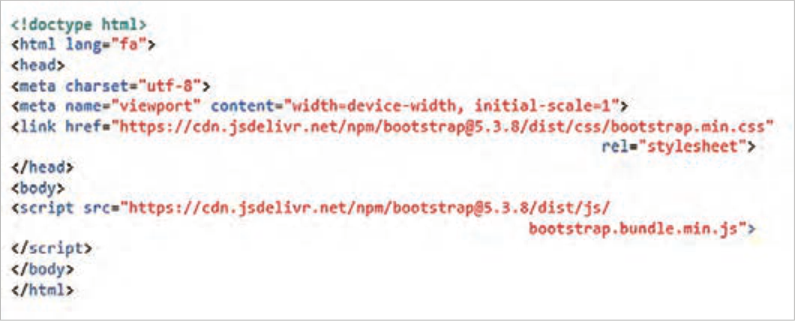

کلاس‌ها و کامپوننت‌های بوت‌استرپ کلاس‌های بوت‌استرپ مجموعه‌ای از استایل‌های از پیش تعریف شده هستند که امکان طراحی سریع و راحت اجزای رابط کاربری صفحات وب را فراهم می‌کنند. این کلاس‌ها که با استفاده از `CSS` ایجاد شده‌اند، به توسعه‌دهنده وب کمک می‌کنند که با نوشتن کدهای `CSS` کمتر، عناصری کاربرپسند و واکنش‌گرا را به صفحه وب اضافه کند.

```
)شبکه توزیع محتوا( CDN: Content Delivery Network١
```


---

<!-- pdf-page: 155 | book-page: 149 -->

**صفحه ۱۴۹**

کامپوننت‌های بوت‌استرپ عناصر از پیش طراحی شده‌ای هستند که امکان طراحی سریع و آسان رابط کاربری وب‌سایت‌ها را فراهم می‌کنند. توسع‌هدهندۀ وب می‌تواند به کمک این عناصر آماده، بدون نوشتن کدهای `CSS` و `JavaScript`، عناصر کاربرپسند و واکنش‌گرا را به صفحه وب اضافه کند. از جمله کامپوننت‌های بوت‌استرپ می‌توان به دکمه، نوار ناوبری1، کروسل2، آکاردئون3 و مُدال4 اشاره نمود. این بخش به معرفی کلاس‌ها و کامپوننت‌های بوت‌استرپ می‌پردازد.

کلاس‌های `Utility` : کلاس‌های `Utility` در بوت‌استرپ، به‌طور ویژه برای استایل‌دهی عناصر صفحه استفاده می‌شوند و به‌طور مستقیم با `HTML` و `CSS` کار می‌کنند. برای استفاده از این کلاس‌ها نیازی به جاوا‌اسکریپت نیست. کلاس‌های آماده بوت‌استرپ برای تعیین رنگ، اندازه عناصر، فواصل، خط دور، سایه و غیره قابل استفاده هستند.

کلاس‌های رنگ: کلاس‌های رنگ بوت‌استرپ به دو دستۀ رنگ‌های زمینه و رنگ متن تقسیم می‌شوند.

هر یک از کلاس‌های رنگ دارای مفهوم و رنگ مشخصی هستند. کلاس‌های رنگ زمینه و متن به ترتیب دارای پیشوند `bg` و `text` هستند. برخی از این کلاس‌ها در جدول زیر گردآوری شده است:

جدول 1 کلاس‌های رنگ `Bootstrap`

کلاس رنگ زمینه

کلاس رنگ متن

مفهوم

```
bg-primary
text-primaryرنگ اصلی
bg-secondary
text-secondaryرنگ ثانویه
bg-success
```

`text-success`رنگ موفقیت

```
bg-danger
text-dangerرنگ خطر
bg-warning
text-warningرنگ هشدار
bg-info
```

`text-info`رنگ اطلاعات

```
bg-light
text-lightرنگ روشن
bg-dark
```

`text-dark`رنگ تیره

1- نوار ناوبری (`Navbar`): نوار بالاتری صفحه که معمولاً شامل لوگو، لین‌کها و منوهاست.

2- کروسل (`Carousel`): یک عنصر تعاملی که مجموعه‌ای از تصاویر یا محتوا را به صورت پشت سرهم در یک فضای مشخص نمایش م‌یدهد و کاربر م‌یتواند بین آنها جابه‌جا شود.

3- آکاردئون (`Accordion`): یک بخش قابل باز و بسته شدن برای نمایش محتوا.

4- مُدال (`Modal`): پنجره یا کادر محاوره‌ای که روی محتوای صفحه ظاهر م‌یشود.


---

<!-- pdf-page: 156 | book-page: 150 -->

**صفحه ۱۵۰**

### کنجکاوی

برای کسب اطلاعات بیشتر دربارۀ سایر کلاس‌های رنگ، عبارت `Bootstrap5.3` `background` و `Bootstrap5.3` `colors` را در گوگل جست‌وجو کنید.

استفاده از کلاس‌های رنگ بوت استرپ

### کار کارگاهی

فایل `test-bs.html` را باز کنید، سپس یک عنصر `<div>` با مشخصات زیر بعد از برچسب `body` درج کنید.

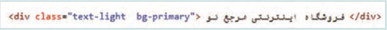

فایل را ذخیره کنید و نتیجه را در مرورگر بررسی کنید.

به انتهای کلاس رنگ، عبارت `subtle` را اضافه کنید (`bg-primary-subtle`) و نتیجه را در مرورگر مشاهده کنید.

کلاس‌های تعیین اندازه (`Sizing`) بوت‌استرپ دارای دو مجموعه کلاس `*-w` و `*-h` برای تعیین پهنا و ارتفاع عناصر است. پارامتر * می‌تواند جایگزین اعداد 25،50، 75 و 100 و عبارت `auto` شود. اختصاص کلاس `w-75` برای یک عنصر باعث می‌شود که پهنای عنصر برابر 75% پهنای عنصر والد باشد. کلاس‌های `w-auto` و `h-auto` پهنا و ارتفاع یک عنصر را به اندازۀ محتوای آن تنظیم می‌نمایند.

استفاده از کلاس‌های `Sizing`

### کار کارگاهی

در فایل `test-bs.html` یک عنصر `div` دیگری به شکل زیر به صفحه وب اضافه کنید. این عنصر حاوی یک عنصر پاراگراف است که پهنا و ارتفاع پاراگراف، 75% پهنا و ارتفاع عنصر `div` خواهد بود.

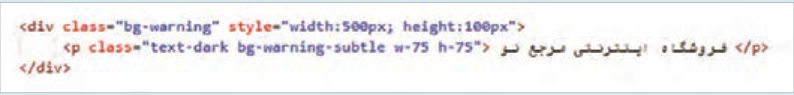

در کد فوق پهنا و ارتفاع عنصر پاراگراف توسط کلاس‌های `w-75` و `h-75` مشخص شده است. فایل را ذخیره کنید و نتیجه را در مرورگر بررسی کنید.

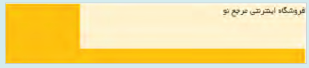


---

<!-- pdf-page: 157 | book-page: 151 -->

**صفحه ۱۵۱**

کلاس‌های `margin` و `padding` بوت‌استرپ دارای دو مجموعه کلاس `m`{`side`}`-size` و `p`{`side`}`-size` برای تعیین فاصلۀ اطراف و فضای اضافی داخل عناصر است که در `CSS` توسط ویژگی‌های `margin` و `padding` تعیین می‌شوند. پارامتر `side` تعیی‌نکنندۀ جهت درج حاشیه یا فضای خالی است و پارامتر `size` اندازه حاشیه یا فضای خالی را تعیین می‌کند. مجموعه کلاس‌های `m` و`p` و مفهوم آنها در جدول زیر آمده است:

جدول 2- کلاس‌های `margin` و `padding` در بوت‌استرپ

کلاس‌های `margin`کلاس‌های `padding`

مفهوم

```
m-size
```

`p-size` در تمام جهات

```
m{t}-size
p{t}-size
```

بالا (`top`)

```
m{e}-size
p{e}-size
```

سمت راست در `ltr` (`end`)

```
m{b}-size
p{b}-size
پایین(bottom)
m{s}-size
p{s}-size
```

سمت چپ در `ltr` (`start`)

```
m{x}-size
p{x}-size
```

چپ و راست (محور `x`)

```
m{y}-size
p{y}-size
```

بالا و پایین (محور `y`)

مقدار `size` عددی بین صفر تا پنج است. هر یک از اعداد این محدوده بیانگر فاصله مشخصی بر حسب `px` است.

جدول 3 مقادیر پارامتر `size` بر حسب واحد اندازه گیری `px`

اندازه بر حسب `Sizepx`

`4px`

1

`8px`

2

`16px`

3

`24px`

4

`48px`

5

پارامتر `size` می‌تواند دارای مقدار `auto` نیز باشد. عبارت `auto` به معنای تنظیم خودکار است. استفاده از `mx-auto` باعث تنظیم فاصله چپ و راست عنصر با مقادیر مساوی می‌گردد، به‌طوری‌که عنصر در وسط عنصر والد خود قرار گیرد.


---

<!-- pdf-page: 158 | book-page: 152 -->

**صفحه ۱۵۲**

استفاده از کلاس‌های `margin` و `padding`

### کار کارگاهی

در ادامه کارگاه قبل یک عنصر `div` با مشخصات زیر به صفحه وب اضافه کنید:

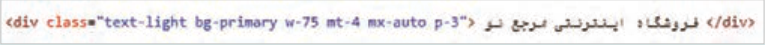

در کد فوق مقدار فاصله عنصر `<div>` از عنصر بالایی برابر `24px` یا (`mt-4`) و مقدار فاصله چپ و راست آن به‌صورت خودکار (`mx-auto`) تنظیم شده است. همچنین فضای اضافی داخل عنصر از همه جهات برابر با `16px` (`p-3`) تعیین شده است.

```
کلاس‌های border، rounded و shadow
```

بوت‌استرپ حاوی مجموعه‌ای از کلاس‌ها درباره خط دور، گردی گوشه‌ها و سایر عناصر است. کلاس‌های `border`، برای ایجاد خط دور، تعیین رنگ و ضخامت آن مورد استفاده قرار می‌گیرند. کلاس‌های `rounded` برای گردکردن گوشه‌ها و کلاس‌های `shadow` برای ایجاد سایر عناصر کاربرد دارند. جدول ٤ به معرفی انواع کلاس‌های `border`، `rounded` و `shadow` می‌پردازد.

جدول 4 انواع کلاس‌های `border`، `rounded` و `shadow`

سایه و اندازه آن

گردی گوشه‌ها

رنگ خط دور

خط دور و ضخامت آن

```
border-primary
rounded
border-secondary
border
rounded-circle
-shadow-none shadow
border-success
border-1
rounded-pill
```

`sm`

```
danger-danger
border-2
rounded-top
shadow
border-info
border-3
rounded-bottom
shadow-lg
border-warning
border-4
rounded-start
border-light
border-5
rounded-end
border-dark
```

جدول 5 کلاس‌های بوت‌استرپ برای تعیین اندازه گردی گوشه‌ها و ضخامت خط دور

اندازه

مقدار گردی گوشه‌ها

ضخامت خط دور

خط دور

`1px`

```
0px (no rounding)
1 rounded
1 border
```

`2px`

`2px`

```
2 rounded
2 border
```

`4px`

`3px`

```
3 rounded
3 border
```

`6px`

`4px`

```
4 rounded
4 border
```

`5px`

```
5 rounded
5 border
```


---

<!-- pdf-page: 159 | book-page: 153 -->

**صفحه ۱۵۳**

در مجموعه کلاس‌های `rounded`، کلاس `rounded-circle` برای گرد شدن کامل یک عنصر به‌کار می‌رود.

شرط گرد‌شدن کامل یک عنصر، برابر بودن پهنا و ارتفاع آن است. کلاس `rounded-pill` نیز برای گرد شدن گوشه‌ها همانند قرص یا کپسول به‌کار می‌رود. کلمات `start` و `end` به سمت چپ و راست یک عنصر اشاره دارند.

استفاده از کلاس‌های `border`، `shadow` و `rounded`

### کار کارگاهی

در ادامه کارگاه قبل، دو عنصر با مشخصات زیر به صفحه `test-bs.html` اضافه کنید.

برای ایجاد کادر مستطیلی تصویر زیر، کد زیر را بنویسید:

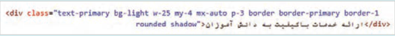

برای ایجاد تصویر مدور، تصویر یک محصول را با ابعاد یکسان به صفحه اضافه کنید و تنظیمات آن را به شکل زیر انجام دهید:

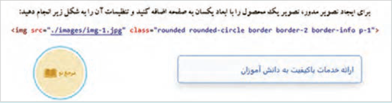

```
کلاس‌هایtypography
```

کلاس‌های متنی بوت‌استرپ برای تنظیم اندازه و وزن فونت، تراز، استایل لیست‌ها و موارد دیگر استفاده می‌شود. جدول ٦ به برخی از کلاس‌های متنی اشاره دارد.

جدول 6 کلاس‌های متنی `Bootstrap`

اندازه متن

وزن

تراز متن

استایل لیست

آرایش متن

```
fs-1 … fs-6
fw-bold
text-start
list-unstyled
text-decoration-none
```

`h1` … `h6`

```
fw-light
text-center
list-inline
text-capitalize
display-1 … display-4
fw-lighter
text-end
text-uppercase
```

کلاس‌های `*-fs` برای تنظیم اندازه فونت عناصر متنی از کوچک (`fs-6`) به بزرگ (`fs-1`) کاربرد دارد.

کلاس‌های `h1` تا `h6` برای تنظیم اندازه برچسب‌های عنوان استفاده می‌شود.

کلاس‌های `*-display` برای ایجاد عناوین بزرگ و جلب توجه کاربر استفاده می‌شوند و مفهوم خاصی را منتقل نمی‌کنند.


---

<!-- pdf-page: 160 | book-page: 154 -->

**صفحه ۱۵۴**

کلاس `list-unstyled` استایل پیش فرض لیست را حذف می‌کند؛ به این معنی که علائم یا شماره‌های کنار عنصر ناپدید شده و مقدار `padding-left` برابر صفر می‌گردد.

کلاس `list-inline` عناصر لیست را آماده چیدمان افقی می‌کند، به‌شرطی که عناصر لیست دارای کلاس `-list` `inline-item` باشند. این نوع لیست برای منوهای ساده و ناوبری‌های کوچک کاربرد دارد.

کلاس‌های `felx` بوت‌استرپ دارای کلاس‌های مختلفی در زمینه طراحی عناصر صفحه با تکنیک `Flexbox` است. سیستم فلکس دارای دو کلاس پایه با اسامی `d-flex` و `d-inline-flex` است که برای عناصر نگهدارنده استفاده می‌شوند. به‌طور مثال بخش معرفی محصولات نیازمند یک عنصر نگهدارنده است که محصولات درون آن به‌صورت انعطاف‌پذیر کنار هم قرار گیرند. جدول زیر برخی از کلاس‌های فلکس را بر‌اساس موضوعات مختلف معرفی می‌کند.

جدول 7 کلاس‌های `Flexbox`

تراز افقی عناصر

تراز عمودی عناصر

جهت چیدمان

انتقال به سطر بعد

```
justify-content-start
align-items-start
flex-row
flex-wrap
justify-content-center
align-items-center
flex-row-reverse
flex-nowrap
justify-content-end
align-items-end
flex-column
flex-wrap-reverse
justify-content-between
align-items-baseline
flex-column-reverse
justify-content-around
justify-content-evenly
```

کلاس‌های `*-justify-content` برای تعیین تراز افقی محتوا در یک عنصر نگهدارنده استفاده می‌شوند. سه کلاس اول، محتوای یک عنصر را در سمت چپ (`start`)، وسط (`center`) و راست (`end`) تراز می‌کنند. سه کلاس بعدی نحوه توزیع عناصر را بر اساس فاصله بین آنها مشخص می‌کنند.

کلاس‌های `*-align-items` برای تعیین تراز عناصر در راستای عمودی استفاده می‌شوند.

به‌کارگیری کلاس‌های مختلف در لایه تصاویر محصولات

### کار کارگاهی

در این کارگاه کد لایه «جدیدترین محصولات» را توسط کلاس‌های بوت‌استرپ به شکل زیر تغییر خواهید داد.

1 فایل `index.html` مربوط به واحد کار 1 را باز کنید. کد لینک و اسکریپت `CDN` بوت‌استرپ 5 را در مکان مناسب اضافه کنید.

2 در عنصر `<main>`، تغییرات زیر را اعمال کنید:

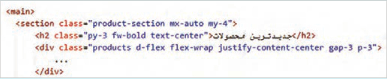


---

<!-- pdf-page: 161 | book-page: 155 -->

**صفحه ۱۵۵**

```
3 استایل‌های مربوط به .products-section h2، .products و ویژگی margin در .products-section را
```

از فایل `styles.css` حذف کنید.

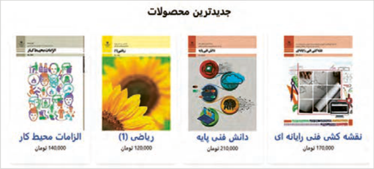

طراحی بخش معرفی فروشگاه

### کار کارگاهی

در این کارگاه یک بخش با محتوای متنی در انتهای صفحه فروشگاه ایجاد خواهید کرد. برای طراحی این قسمت از کلاس‌های مختلف بوت‌استرپ استفاده کنید.

در فایل `index.html` برچسب `<article>` را به شکل زیر قبل از برچسب `<main/>` اضافه نمایید:

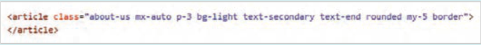

تیترها و پاراگراف‌های زیر را درون برچسب `<article>` اضافه کنید:

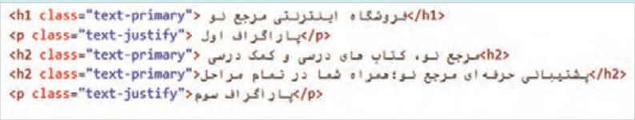

فایل را ذخیره کنید و نتیجه را در مرورگر مشاهده کنید.

بوت‌استرپ نسخه ۳ دارای کلاسی به نام `text-justify` بود که برای تراز کردن دوطرفه متن (`justify`) به‌کار می‌رفت. این کلاس در بوت‌استرپ نسخه ۵ موجود نیست. بنابراین، برای ایجاد تراز دوطرفه متن در پاراگراف‌ها، لازم است کلاس سفارشی `text-justify` را با استفاده از کد زیر به فایل `styles.css` اضافه نمایید:

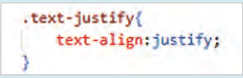


---

<!-- pdf-page: 162 | book-page: 156 -->

**صفحه ۱۵۶**

محتوای عناصر پاراگراف را بر اساس تصویر زیر تکمیل نمایید. برای نمایش کلمات به‌صورت ضخیم (`bold`)، از تگ مناسب استفاده کنید فایل را ذخیره و نتیجه را در مرورگر بررسی کنید.

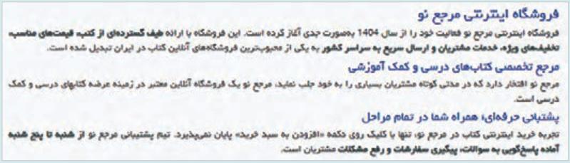

برای اصلاح نمای موبایل، کلاس `w-75` را از عنصر `article` حذف کنید و استایل مربوط به آن را به فایل `styles.css` اضافه کنید:

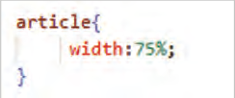

برای دستگاه‌هایی با پهنای کمتر از 600 پیکسل قانون زیر را در فایل `styles.css` اضافه کنید:

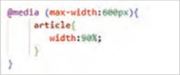

### بیشتر بدانید

طراحی نوار ابزار حاوی لوگو، کادر جست‌وجو، گزینه‌های ورود | ثبت نام و سبد خرید در این کارگاه ناحیه‌ای مشابه تصویر زیر را در بالای نوار منو ایجاد خواهید کرد:

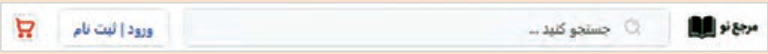

یک لوگو با ارتفاع 70 پیکسل ایجاد کنید و سپس فایل تصویر را با نام `logo.jpg` در پوشه `images` سایت ذخیره نمایید.

درون کادر جست‌وجو باید یک آیکن جست‌وجو ظاهر شود. برای دانلود آیکن جست‌وجو از سایت `svgrepo.com` استفاده کنید و عبارت `search` را در آن جست‌وجو کنید. آیکن دلخواه خود را توسط دکمه `Edit` `vector` در کوچک‌ترین اندازه و رنگ دلخواه تنظیم کرده و سپس روی دکمه `Export` کلیک کنید. فایل آیکن را با نام `search.svg` در پوشه تصاویر سایت (`images`) ذخیره نمایید.


---

<!-- pdf-page: 163 | book-page: 157 -->

**صفحه ۱۵۷**

تصویر صفحۀ قبل حاوی لوگو، کادر جست‌وجو (شامل آیکن جست‌وجو و کادر متنی)، گزینه ورود| ثبت‌نام و سبد خرید است. این عناصر را به شکل زیر به صفحه `index.html` قبل از عنصر `nav` اضافه کنید:

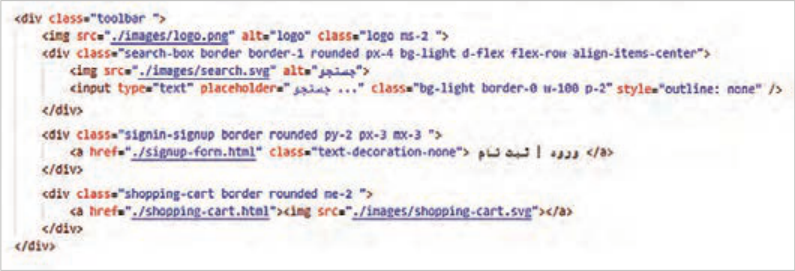

استایل عناصر را در نمای دسکتاپ به شکل زیر تنظیم کنید:

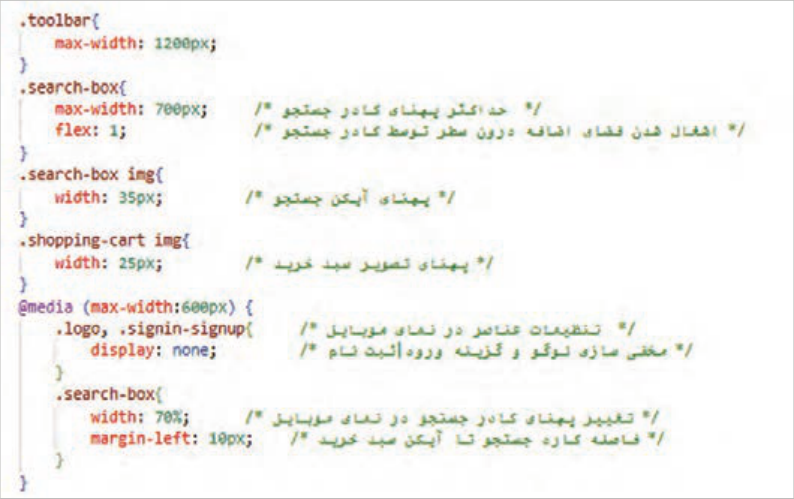

کلاس‌های زیر را به عنصر `toolbar` اضافه کنید. سپس فایل را ذخیره کرده و نتیجه را در مرورگر بررسی نمایید.

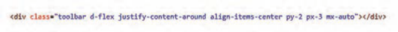


---

<!-- pdf-page: 164 | book-page: 158 -->

**صفحه ۱۵۸**

با تنظیمات `CSS` فوق، گزینه «ورود|ثبت‌نام» و لوگو از نمای موبایل حذف می‌شود، بنابراین این گزینه‌ها باید در جای دیگری نمایش داده شود. بهتر است این گزینه‌ها به‌صورت یک لایۀ ثابت در پایین صفحه نمایش داده شوند. بدین منظور کد زیر را قبل از `<main/>` وارد کنید:

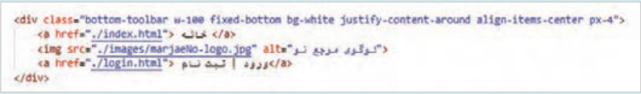

کلاس `fixed-bottom` لایه `bottom-toolbar` را در پایین صفحه ثابت نگه می‌دارد.

استایل زیر را برای عنصر `bottom-toolbar` بنویسید:

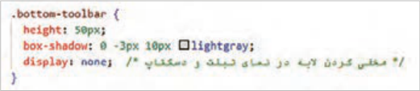

استایل زیر را برای نمایش صحیح نوار ابزار در نمای موبایل اضافه کنید:

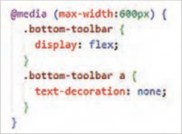

با این تنظیمات عنصر `bottom-toolbar` به‌صورت شکل زیر در پایین دستگاه موبایل ظاهر می‌شود.

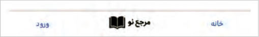

برای فاصله گرفتن منو از `toolbar`، از کلاس `mt-3` در برچسب `<nav>` استفاده کنید.

با توجه به اینکه گزینه‌های ورود|ثبت نام و سبد خرید به بخش `toolbar` اضافه شده است، بنابراین عنصر `user-actions` را از منوی ناوبری (عنصر `top-menu`) حذف کنید. سپس استایل‌های مربوط به آن را از فایل `styles.css` حذف کنید. با حذف شدن ناحیه `user-action` نیازی به ویژگی‌های فلکس در کلاس `.top-menu` نیست. پس ویژگی‌های فلکس را هم حذف کنید. در انتها آنچه درون کلاس `top-menu` باقی می‌ماند ویژگی `max-width` خواهد بود.

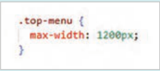


---

<!-- pdf-page: 165 | book-page: 159 -->

**صفحه ۱۵۹**

بهتر است که گزینه‌های منو در راستای افقی در وسط صفحه توزیع شوند، برای این کار از کلاس `-justify` `content-center` در عنصر `ul` استفاده کنید:

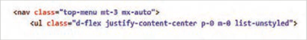

توسط کد فوق تمام ویژگی‌های انتخاب‌گر `.top-menu` `ul` با کلاس‌های بوت‌استرپ معادل جایگزین شد. بنابراین ویژگی‌های درون انتخابگر `.top-menu` `ul` را از فایل `styles.css` حذف کنید.

انتظار می‌رود که با تنظمیات فوق نتیجه زیر حاصل شود:

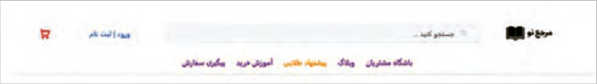

سفارشی‌سازی کلاس‌های بوت استرپ کلاس‌های بوت‌استرپ دارای ویژگی‌ها و مقادیر از پیش تعیین شده‌ای هستند که امکان طراحی سریع عناصر صفحه را فراهم می‌کنند. گاهی لازم است که عملکرد این کلاس‌ها توسط توسعه‌دهندۀ صفحات تغییر نماید.

این کار توسط `CSS` و `SASS`١ امکان‌پذیر است. برای تغییر استایل یک کلاس توسط `CSS` لازم است که ویژگی کلاس مورد نظر با مقادیر جدید تنظیم شود. در حالت پیش‌فرض اعمال کلاس بوت‌استرپ دارای اولویت بالاتری است. بنابراین برای بالا بردن اهمیت کلاس سفارشی باید از کلمه `important` ! در انتهای مقدار جدید استفاده شود، در غیر این‌صورت مقدار جدید اعمال نمی‌شود.

تغییر استایل کلاس رنگ بوت‌استرپ

### کار کارگاهی

در این کارگاه رنگ کلاس `bg-light` را در فایل `index.html` تغییرخواهید داد. بدین منظور استایل زیر را برای کلاس `bg-light` به شکل زیر بنویسید:

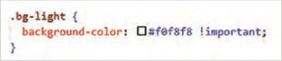

الحاق فایل `styles.css` باید بعد از الحاق فایل `bootstrap.min.css` انجام شود، در غیر این‌صورت اولویت اجرا با تنظیمات پیش فرض کلاس بوت استرپ خواهد بود. کلاس `bg-light` در دو عنصر کادر جست‌وجو و `article` مورد استفاده قرار گرفته است. بعد از ذخیره‌سازی کد فوق بررسی کنید که آیا تغییر رنگ در این دو عنصر اعمال شده است یا خیر.

١ ابزاری است که نوشتن، سازمان‌دهی و نگهداری کدهای `CSS` را در پروژه‌های وب ساده‌تر و حرفه‌ای‌تر می‌کند.


---

<!-- pdf-page: 166 | book-page: 160 -->

**صفحه ۱۶۰**

شبکه‌بندی صفحه (`Grid` `Systems`) بوت‌استرپ دارای یک سیستم شبکه‌بندی با نام `Grid` است که توسط `Flexbox` ایجاد شده است و امکان تقسیم پهنای صفحه را به 12ستون فراهم می‌کند. هر سلول در این شبکه می‌تواند محتوای بخشی از صفحه را درون خود نگه دارد. سیستم `Grid` امکان گروه‌بندی ستون‌ها را برای ایجاد ستون‌های عریض‌تر فراهم می‌کند به‌طوری‌که فضای کافی برای قرار دادن محتوا درون یک ستون موجود باشد. سیستم `Grid` واکنش‌گرا است و بسته به اندازه صفحه، ستون‌ها را به‌طور خودکار مرتب می‌کند.

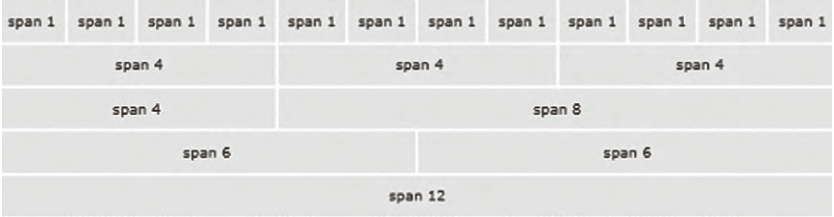

استفاده از کلاس‌های شبکه‌بندی (`rows` و `columns`) برای ایجاد سطرها و ستون‌های شبکه از کلاس‌های `row` و `col` استفاده می‌شود. کلاس `row` باعث می‌شود سلول‌های شبکه در یک خط افقی قرار بگیرند و فواصل مناسب بین آنها اعمال شود. پهنای ستون‌ها به‌صورت خودکار توسط پارامتر `size` در نام کلاس `col` مشخص می‌شود. شکل کلی کلاس `col` به صورت `-col` `breakpoint-size` است، پارامتر `breakpoint` به اندازه دستگاه (`sm`, `md`, `lg`,`xl`, `xxl`) و پارامتر سایز به اندازه ستون اشاره دارد. به‌عنوان مثال `col-sm-3` یعنی اشغال سه ستون از 12 ستون در تمام دستگاه‌های بزرگ‌تر یا مساوی 576 پیکسل.

شبکه سطرها و ستون‌ها باید درون یک عنصر نگهدارنده قرارگیرد. بوت‌استرپ دارای دو کلاس با اسامی `container` و `container-fluid` است که برای ایجاد نگهدارنده استفاده می‌شوند. تفاوت این دو نگهدارنده در میزان حاشیه چپ و راست آنهاست. کلاس `container` یک فضای خالی با پهنای مساوی در چپ و راست عنصر نگهدارنده ایجاد می‌کند، در حالی‌که کلاس `container-fluid` تمام پهنای صفحه را اشغال می‌کند.

### مثال

در مثال زیر یک سطر با سه ستون ایجاد می‌شود که سهم هر ستون برابر 4 از 12 خواهد بود:

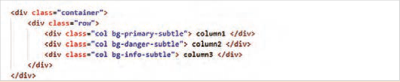

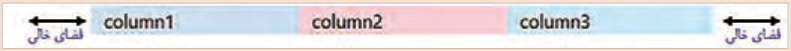


---

<!-- pdf-page: 167 | book-page: 161 -->

**صفحه ۱۶۱**

ستون‌های مثال صفحه قبل در تمام دستگاه‌ها در کنار هم نمایش داده می‌شوند. اگر به جای کلاس `col` از کلاس `col-sm-4` استفاده شود، این ستون‌ها در تمام دستگاه‌های بزرگ‌تر یا مساوی 576 پیکسل در کنار هم خواهند بود، اما در دستگاه‌های کوچک‌تر، به‌صورت پشته روی هم قرار می‌گیرند.

پارامترهای `breakpoint` و `size` مشخص می‌کنند که نحوه نمایش ستون‌ها در دستگاه‌های مختلف (موبایل، تبلت، دسکتاپ) چگونه باشد.

سیستم `grid` دارای کلاس‌های مختلفی برای اندازه ستون‌ها در دستگاه‌های مختلف است که در جدول زیر به آنها اشاره شده است:

جدول8 پارامترهای کلاس`-col` برای دستگاه‌های مختلف

پارامتر

### کاربرد

توضیح برای دستگاه‌های بسیار کوچک پهنای صفحه کمتر از 576 پیکسل`-col`

بدون پیشوند }`sm-`{`n`برای دستگاه‌های کوچک پهنای صفحه بزرگ‌تر یا مساوی 576 پیکسل`-col-sm` }`md-`{`n`برای دستگاه‌های متوسط پهنای صفحه بزرگ‌تر یا مساوی 768 پیکسل`-col-md` }`lg-`{`n`برای دستگاه‌های بزرگ پهنای صفحه بزرگ‌تر یا مساوی 992 پیکسل`-col-lg` }`xl-`{`n`برای دستگاه‌های بزرگ پهنای صفحه بزرگ‌تر یا مساوی 1200 پیکسل`-col-xl` }`xxl-`{`n`برای دستگاه‌های بزرگ پهنای صفحه بزرگ‌تر یا مساوی 1400 پیکسل`-col-xxl` {`n`} عددی از 1 تا 12 است. منظور از `n` تعداد ستون‌هایی است که یک عنصر از ۱۲ ستون `grid` اشغال می‌کند.

### مثال

__4 و 12 __8 ایجاد می‌شود:

در مثال زیر یک ردیف با دو ستون در دو اندازه 12

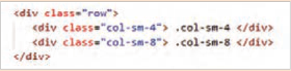

__4

این دو ستون در دستگاه‌هایی با پهنای بزرگ‌تر یا مساوی 576 پیکسل در کنار هم و با اندازه‌های 12 __8 نمایش داده می‌شوند. اما در دستگاه‌های کوچک‌تر، محتوای ستون‌ها روی هم قرار می‌گیرند و و 12 در نتیجه هر ستون 100% پهنای صفحه را اشغال خواهد کرد.

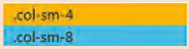

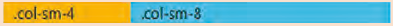

پهنای دستگاه: بزرگ‌تر یا مساوی 576 پیکسل پهنای دستگاه: کمتر از 576 پیکسل


---

<!-- pdf-page: 168 | book-page: 162 -->

**صفحه ۱۶۲**

### مثال

برای ایجاد طرح‌بندی‌های پویا و انعطا‌فپذیر می‌توان کلاس‌های فوق را به‌صورت ترکیبی استفاده نمود. مانند مثال زیر:

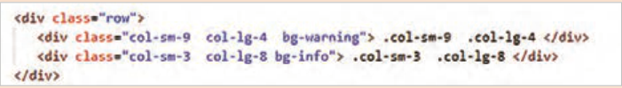

این دو ستون در دستگاه‌های کوچک‌تر از 576 پیکسل زیر هم نمایش داده می‌شوند؛ در دستگاه‌هایی

__9 و 12 __3 و در دستگاه‌های

با پهنای بزرگ‌تر از 576 پیکسل و کوچک‌تر از 992 پیکسل در اندازه 12

__4 و 12 __8 نمایش داده می‌شوند.

بزرگ‌تر با اندازه 12

طرح‌بندی فوتر صفحه وب

### کار کارگاهی

در فایل `index.html`، ناحیه فوتر را به شکل زیر بعد از برچسب `<main/>` ایجاد کنید:

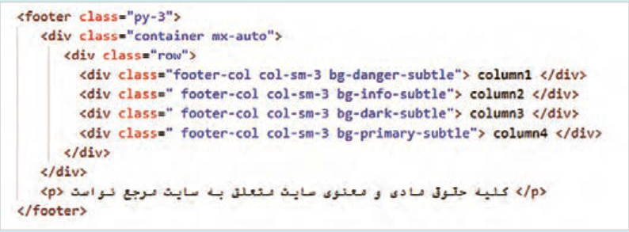

برای محتوای ستون اول از کد زیر استفاده کنید:

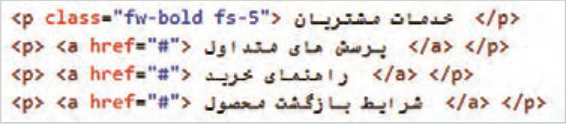

ستون دوم مربوط به آیکن شبکه‌های اجتماعی است. برای به‌دست آوردن کد آیکن‌ها وارد آدرس `.icons` `getbootstrap.com` شوید و در انتهای این صفحه، در بخش `CDN` لینک فایل `CSS` آیکن‌ها را کپی کنید و در بخش `<head>` بچسبانید. این لینک به شکل زیر است:

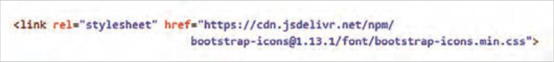


---

<!-- pdf-page: 169 | book-page: 163 -->

**صفحه ۱۶۳**

سپس به ابتدای صفحه آیکن‌ها برگردید و برای جست‌وجوی آیکن، در کادر `ilterf` نام شبکه اجتماعی مورد نظر را بنویسید. بعد از ظاهر شدن آیکن‌ها روی یک مورد به دلخواه کلیک کنید تا صفحه اختصاصی آیکن باز شود. در بخش `icon` `font` کد `html` را کپی کنید و آن را در ستون دوم فوتر بچسبانید. محتوای ستون دوم را به شکل زیر تنظیم کنید:

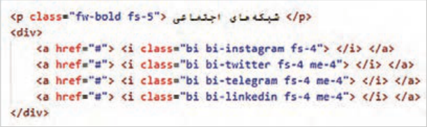

در ستون سوم کد شکل زیر را وارد کنید:

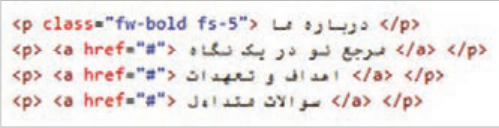

در ستون چهارم کد شکل زیر را بنویسید:

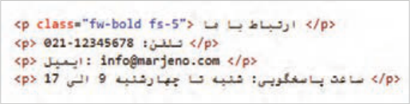

برای حذف زیرخط پیوندها و تنظیم رنگ و اندازه متون فوتر، استایل شکل زیر را به فایل `styles.css` اضافه کنید:

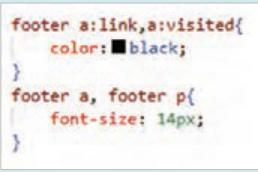

برای تنظیم استایل پاراگراف «کلیه حقوق مادی و معنوی ....» از کد شکل زیر استفاده کنید:

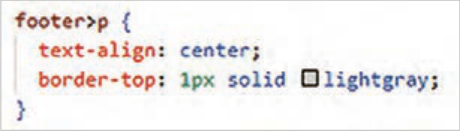


---

<!-- pdf-page: 170 | book-page: 164 -->

**صفحه ۱۶۴**

این استایل متن پاراگراف را در وسط صفحه به همراه یک خط در بالای آن نمایش می‌دهد. استایل فوق فقط روی پاراگراف آخر اعمال می‌شود، چرا که تنها این پاراگراف فرزند مستقیم عنصر `footer` است.

برای تغییر تراز عناصر در نمای موبایل و جابه‌جا شدن محل نمایش پاراگراف آخر، استایل شکل زیر را اضافه کنید:

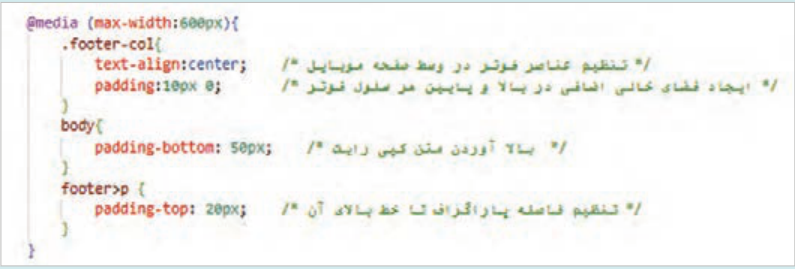

به‌دلیل حضور `bottom-navbar` در پایین صفحه، امکان مشاهده پاراگراف انتهایی فوتر در نمای موبایل فراهم نیست؛ به همین دلیل موقعیت پاراگراف توسط ویژگی `position` و `bottom` تنظیم شده است.

بعد از اینکه همه عناصر ب‌هدرستی در جای خود قرار گرفتند، رنگ زمینۀ ستون‌ها را حذف کنید.

واکنش‌گرایی و کلاس‌های مرتبط واکنش‌گرایی به‌معنای توانایی یک صفحه وب برای تغییر و سازگاری با اندازه‌ها و ویژگی‌های مختلف دستگاه‌ها و صفحه نمایش‌ها است. در یک طراحی واکنش‌گرا عناصر وب‌سایت به‌طور خودکار اندازه و چیدمان خود را تغییر می‌دهند تا مناسب با اندازۀ صفحه نمایش کاربر باشند. هدف از انجام یک طراحی واکنش‌گرا (`Responsive`) این است که تجربه کاربری بهتری برای بازدیدکنندگان فراهم شود. برای طراحی عناصر واکنش‌گرا، روش‌های مختلفی به شرح زیر موجود است:

`Media` `query` 1: برای تنظیم ویژگی‌های عناصر در دستگاه‌های مختلف `Flexbox` 2: برای مدیریت نحوه چینش عناصر و فضای بین آنها `CSS` `Grid` 3: برای سازمان‌دهی عناصر در سطرها و ستون‌ها

4 استفاده از `max-width` به جای `width` برای اینکه تصاویر در اندازه‌های مختلف به‌درستی نمایش داده شوند:

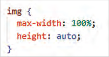

5 استفاده از واحدهای نسبی %، `rem` و `em` به‌جای استفاده از واحدهای ثابت (مانند `px`)

6 به‌کارگیری فریم‌ورک‌هایی مانند بوت‌استرپ که دارای کلاس‌های واکنش‌گرای آماده هستند.


---

<!-- pdf-page: 171 | book-page: 165 -->

**صفحه ۱۶۵**

### کنجکاوی

در مورد واحدهای `rem` و `em` تحقیق کنید.

کلاس‌های واکنش‌گرای بوت‌استرپ دارای موضوعات مختلفی هستند که در جدول ٩ به آنها پرداخته شده است:

جدول9 کلاس‌های واکنش‌گرای بوت‌استرپ

نوع کلاس

نام کلاس‌ها

```
Container
container و container-sm، container-md، container-lg و...
```

`Grid`

```
row، row-cols، col، col-sm، col-md و col-lg و...
d-flex، d-*-flex، d-*-inline، d-*-block start، d-*-none مانند زیر:
Layout
d-sm-none، d-md-block، flex-md-row، justify-content-sm-center
align-items-md- و...
Margin
m-*-size مانند mb-sm-3 و mx-sm-1
Padding
p-*-size مانند py-sm-3، px-lg-3
d-none ، d-block،d-*-none، d-*-block
Display Classes
```

`Image`

```
img-fluid
Components
button، form، navbar، cards، carousel و...
```

در کلاس‌های جدول 10 علامت * معادل `sm`،`lg` و... است.

```
جدول10 Breakpoints
کلاسBreakpoint
```

پهنای صفحه کمتر از `xs576` `px`

```
Extra small
```

`sm`

`Small`

576 `px` و بیشتر

`md`

```
Medium
```

768 `px` و بیشتر

`lg`

`Large`

992 `px`و بیشتر

`xl`

1200 `px`و بیشتر

```
Extra large
```

`xxl`

1400 `px`و بیشتر

```
Extra extra large
```


---

<!-- pdf-page: 172 | book-page: 166 -->

**صفحه ۱۶۶**

کار با کلاس‌های واکنش‌گرای `Bootstrap`

### کار کارگاهی

در این کارگاه با به‌کارگیری کلاس‌های بوت‌استرپ تغییراتی را در صفحه `index.html` ایجاد خواهید کرد.

بخش اول استفاده از کلاس‌های `row-cols:` در کارگاه قبل اندازه ستون‌ها توسط کلاس `col-sm-3` مشخص شد. این کلاس باعث می‌شود که در دستگاه‌های بزرگ‌تر از 576 پیکسل، ستون‌ها در کنار هم نمایش داده شوند و در دستگاه‌های کوچک‌تر، به‌صورت پشته (`stack`) روی هم قرار گیرند.

بوت استرپ دارای کلاس واکنش‌گرای دیگری با نام `row-cols` است که امکان تعیین تعداد ستون‌ها (در هر ردیف) را در دستگاه‌های مختلف فراهم می‌کند؛ به‌گونه‌ای که اندازه ستون‌ها در عنصر `row` مشخص می‌شود، نه در عناصر `.col` جدول زیر نحوۀ استفاده از این دو روش را نمایش می‌دهد.

روش تعیین اندازه ستون

### توضیحات

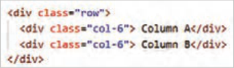

تعیین اندازۀ ستون در

این کد یک سطر (`row`) با دو ستون (`col-6`) ایجاد می‌کند. هر ستون نیمی از

عناصر `col`

٦ ) را اشغال می‌نماید.

__

پهنای سطر (٢١

`B`

`A`

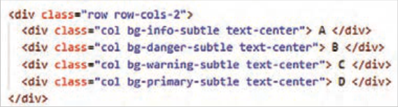

`B`

`A`

`D`

`C`

تعیین اندازه ستون در عناصر `row`

کلاس `row-cols-2` باعث ایجاد 2 ستون در هر سطر می‌گردد. در کد فوق 4 عنصر `col` وجود دارد؛ بنابراین دو سطر، هر یک حاوی دو ستون تولید می‌شود.

در صورت افزودن تعداد بیشتری از `col`، ستون‌ها به ردیف بعدی منتقل می‌شوند.

`Bootstrap` به‌طور خودکار عرض ستون‌ها را تنظیم می‌کند؛ بنابراین نیازی به تعیین اندازه دستی برای هر ستون ندارید.


---

<!-- pdf-page: 173 | book-page: 167 -->

**صفحه ۱۶۷**

1 در فایل `index.html` کدهای زیر را بعد از جدیدترین محصولات اضافه کنید:

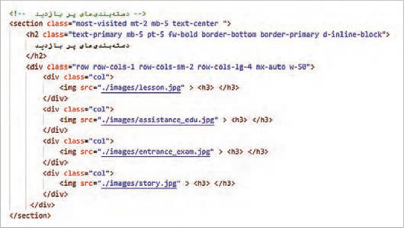

فایل را ذخیره کنید و نتیجه را در مرورگر بررسی کنید. سپس مراحل زیر را انجام دهید و بعد از هر مرحله، نتیجه را مشاهده کنید.

2 برای تمام تصاویر از کلاس‌های `border`، `border-4` و `rounded-circle` استفاده کنید تا تصاویر به شکل گرد و دارای خط دور باشند.

3 برای هر کلاس `col` کلاس `mb-3` را اضافه کنید تا تصاویر در نمای موبایل از تصویر زیرین خود فاصله بگیرند.

4 برای تنظیم اندازه تصویر، استایل شکل زیر را به فایل `styles.css` اضافه کنید.

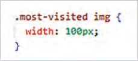

عنوان هر محصول را داخل برچسب`<h3>` قرار دهید:

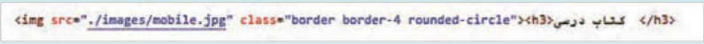

5 برای تنظیم اندازه متن `h3` و فاصله آن از تصویر بالا، استایل شکل زیر را بنویسید:

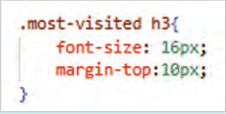


---

<!-- pdf-page: 174 | book-page: 168 -->

**صفحه ۱۶۸**

انتظار می‌رود که بعد از سرانجام مراحل قبل خروجی زیر در نمای دسکتاپ حاصل شود.


6 برای مشاهده وضعیت تصاویر در دستگاه‌های مختلف، کلید `f12` را بفشارید. در پاسخ به پنجره پیغام، دکمه `Open` `Dev` `tools` را انتخاب کنید. مطابق تصویر زیر از نوار ابزار بالای صفحه دکمه `Toggle` `Device` را انتخاب کنید:


7 از کشوی `Dimension` نوع دستگاه را انتخاب کنید و سپس وضعیت تصاویر را مشاهده کنید.


8 در صورت تمایل گزینه `Responsive` را از درون کشو انتخاب کنید و سپس با درگ کردن لبه سمت راست دستگاه، پهنای آن را به دلخواه تغییر دهید.

عملکرد کلاس‌های `row-cols` در کارگاه فوق به شرح زیر است:

`row-cols-sm-1:` در دستگاه‌هایی با پهنای 576 پیکسل و بیشتر، تصاویر محصولات در 2 ستون نمایش داده می‌شود.

`row-cols-lg-2:` در دستگاه‌هایی با پهنای 992 پیکسل و بیشتر، تصاویر محصولات در 4 ستون نمایش داده می‌شود.

بخش دوم استفاده از کلاس‌های `container` کلاس‌های `container` واکنش‌گرا هستند و پهنای متفاوتی را در دستگاه‌های مختلف برای عنصر نگهدارنده ایجاد می‌کنند.


---

<!-- pdf-page: 175 | book-page: 169 -->

**صفحه ۱۶۹**

کلاس‌های `container` و پهنای آنها در دستگاه‌های مختلف

```
XX-Large
X-large
```

`Large`

```
Medium
```

`Small`

```
Extra small
```

`1400px`≤

`1200px`≤

`992px`≤

`768px`≤

`576px`≤

`576px<`

`1320px`

`1140px`

`960px`

`720px`

`540px`

%100

```
.Container
```

`1320px`

`1140px`

`960px`

`720px`

`540px`

%100

```
.Container-sm
```

`1320px`

`1140px`

`960px`

`720px`

%100

%100

```
.Container-md
```

`1320px`

`1140px`

`960px`

%100

%100

%100

```
.Container-lg
```

`1320px`

`1140px`

%100

%100

%100

%100

```
.Container-xl
```

`1320px`

%100

%100

%100

%100

%100

```
.Container-xxl
```

%100

%100

%100

%100

%100

%100

```
.Container-fluid
```

در کارگاه «طراحی بخش معرفی فروشگاه» پهنای عنصر `article` در دستگاه دسکتاپ و موبایل به ترتیب 75% و 90% تعیین شد. در اینجا قصد داریم به‌جای استفاده از کدهای `CSS` از کلاس‌های واکنش‌گرای `container` استفاده کنیم. بدین منظور مراحل زیر را دنبال کنید:

در عنصر `article` از کلاس `container-sm` استفاده کنید:


هر دو استایل عنصر `article` را از فایل `styles.css` حذف کنید.

فایل‌های `HTML` و `CSS` را ذخیره کنید و نتیجه را در مرورگر بررسی کنید. با این تغییر، پهنای عنصر `article` برای دستگاه‌هایی با پهنای صفحه 576 پیکسل و بزرگ‌تر، توسط کلاس `container` تعیین می‌شود و برای دستگاه‌های کوچک‌تر، پهنای عنصر برابر 100% خواهد بود.

بخش سوم کار با کلاس‌های `display` در کارگاه «طراحی `Toolbar`» یک نوار ابزار در بالای صفحه، طراحی شد. گزینه‌های «ثبت نام|ورود» و لوگوی آن در نمای موبایل مخفی شد و در پایین صفحه درون یک لایه جدید با نام `bottom-toolbar` قرار گرفت. هدف این کارگاه این است که کنترل نمایش/عدم نمایش عناصر لایه‌های `toolbar` و `bottom-toolbar` به کلاس‌های `*-d` سپرده شود و کدهای `CSS` مربوط به آنها حذف گردد.


---

<!-- pdf-page: 176 | book-page: 170 -->

**صفحه ۱۷۰**

ابتدا کلاس `d-flex` و `d-lg-none` را به مجموعه کلاس‌های عنصر `bottom-toolbar` اضافه کنید:


ویژگی `display:none` را از مجموعه ویژگی‌های عنصر `.bottom-toolbar` در فایل `styles.css` حذف کنید.

در قانون `media`، انتخاب‌گر `.bottom-toolbar` را حذف کنید. فایل را ذخیره و نتیجه را در مرورگر بررسی کنید.

برای مخفی کردن دو عنصر «ثبت نام|ورود» و لوگو در پهنای کمتر از 992 پیکسل، کلاس‌های `d-none` و `d-lg-block` را به عناصر `signin-signup` و `logo` در عنصر `toolbar` اضافه کنید:


بعد از اضافه کردن کلاس‌های `*-d`، استایل زیر را از قانون `media` حذف کنید.


فایل را ذخیره و نتیجه را در مرورگر بررسی کنید. انتظار می‌رود که در دستگاه‌های 992 پیکسل و بزرگ‌تر، چهار عنصر لوگو، کادر جست‌وجو، گزینه «ورود|ثبت نام» و سبد خرید حضور داشته باشند، اما در دستگاه‌های کوچک‌تر، دو عنصر لوگو و «ورود|ثبت نام» مخفی شوند.

برای کنترل مقدار فضای اضافی در اطراف عنصر `Toolbar`، کلاس `p-3` را به عنصر `toolbar` اختصاص دهید و سپس ویژگی `padding` را در کلاس `toolbar` حذف کنید. از کشوی `Dimension` در مرورگر، گزینۀ `Responsive` را انتخاب کنید و سپس نتیجۀ کار را بررسی کنید.


بخش چهارم ایجاد تصویر واکنش گرا هدف این بخش اضافه کردن یک بنر به بالای عنصر `toolbar` است، به‌طوری‌که تصویر بنر نسبت به پهنای صفحه واکنش‌گرا باشد. برای این کار تصویر `top-banner.jpg` را در ابتدای برچسب `<header>` درج کنید و کلاس `img-fluid` را برای آن استفاده کنید:

```
>"class="img-fluid w-100 "img src="./images/top-banner.gif<
```

کلاس `img-fluid` یکی از کلاس‌های مهم `Bootstrap` برای واکنش‌گرا کردن تصاویر است و باعث می‌شود که تصویر متناسب با اندازۀ والدش تغییر اندازه دهد؛ از عرض `container` بزرگ‌تر نشود و همچنین در موبایل، تبلت و دسکتاپ درست نمایش داده شود.


---

<!-- pdf-page: 177 | book-page: 171 -->

**صفحه ۱۷۱**

البته ایجاد تصویر واکنش‌گرا به استفاده از کلاس `img-fluid` خلاصه نمی‌شود. بهتر است در خصوص تصاویری که تمام پهنا را اشغال می‌کنند، نسخۀ دیگری از تصویر برای دستگاه‌های کوچک‌تر طراحی شود. در مثال زیر سه نسخه از تصویر بنر برای موبایل، تبلت و دسکتاپ استفاده شده است. مرورگر با توجه به پهنای صفحه، تصویر مناسب را برای نمایش انتخاب می‌کند:


اکثر مرور‌گرهای مدرن امروزی از برچسب `picture` پشتیبانی می‌کنند؛ بنابراین در مرورگرهای مدرن، تصاویری که در برچسب‌های `<source>` تعیین شده است، نمایش داده می‌شوند. در مرورگرهای قدیمی مانند اینترنت اکسپلورر 11 و قدیمی‌تر، تصویر پیش‌فرض ظاهر می‌شود. در کد شکل بالا، تصویر پیش‌فرض در برچسب `` مشخص شده است.

### فعالیت

سه تصویر بنر در سه اندازه مختلف، برای نمایش در موبایل، تبلت و دسکتاپ طراحی‌کنید و کدنویسی نمایش آنها را مطابق با کد فوق انجام دهید. انتظار می‌رود خروجی به صورت شکل زیر حاصل گردد.


توجه

چنانچه لبه‌های بنر مماس با لبه‌های مرورگر نیست، مقدار `padding` و `margin` را برای عنصر `header` برابر صفر قرار دهید.

```
اجزای رابط کاربری (User Interface Components)
```

کاربران صفحات وب توسط اجزای مختلفی با صفحه وب تعامل و ارتباط دارند. این اجزا شامل دکمه‌ها، منوها، نوار جست‌وجو، آیکن‌ها، فرم‌ها، تصاویر، رنگ‌ها، فونت‌ها و سایر عناصر بصری هستند که تجربه کاربری را شکل می‌دهند. بوت‌استرپ دارای مجموعه‌ای از کلاس‌های آماده برای اجزای رابط کاربری مختلف مانند نوارناوبری، فرم، دکمه، منوی آکاردئون و... است که در این بخش به آنها پرداخته می‌شود.


---

<!-- pdf-page: 178 | book-page: 172 -->

**صفحه ۱۷۲**

```
Navbar
```

کلاس `navbar` برای ایجاد نوار ناوبری (`Navigation` `Bar`) یا منوی بالای صفحه استفاده می‌شود. این کلاس ب‌ههمراه کلاس‌های دیگری همچون `*-navbar-expand` برای تعیین رفتار و ظاهر نوار ناوبری در اندازه‌های مختلف صفحه نمایش به کار می‌رود. مجموعۀ کلاس‌های `Navbar` به شرح زیر است:

`navbar:` کلاس اصلی برای ایجاد نوار ناوبری است.

`*-navbar-expand:` این کلاس‌ها تعیین می‌کنند که نوار ناوبری در چه پهنایی به صورت افقی ظاهر شود و در چه پهنایی جمع شود. کاراکتر * می‌تواند جایگزین عبارات `sm`، `md`، `lg` یا `xl` شود. به‌طور مثال استفاده از `navbar-expand-sm` باعث می‌شود که نوار ناوبری در دستگاه‌هایی با عرض 576 پیکسل و بیشتر، به‌صورت افقی ظاهر شود و در دستگاه‌های کوچک‌تر جمع شده و به شکل دکمه همبرگری (☰) نمایش داده شود.

`navbar-brand:` برای نمایش لوگو یا نام برند در نوار ناوبری استفاده می‌شود.

`navbar-nav:` برای ایجاد لیست ناوبری (`Navigation` `list`) در نوار ناوبری استفاده می‌شود.

`nav-link:` برای لینک‌های موجود در لیست ناوبری استفاده می‌شود.

`navbar-toggler:` برای دکمۀ کوچک منو استفاده می‌شود. این دکمه در نمای موبایل ظاهر می‌شود تا کاربر با کلیک روی آن، محتوای منو را مشاهده نماید و با کلیک مجدد منو را ببندد. (دکمه‌ای برای کنترل باز و بسته شدن منو ایجاد می‌کند) `navbar-toggler-icon:` به منظور نمایش آیکن همبرگر (☰) برای دکمه منو در حالت جمع‌شده به‌کار می‌رود.

`navbar-collapse:` برای گروه‌بندی و مخفی کردن گزینه‌های منو در دستگاه‌های کوچک استفاده می‌شود.

`dropdown:` برای ایجاد منوهای کشویی (پایین افتادنی) در نوار ناوبری به‌کار می‌رود.

`navbar-light` و `navbar-dark:` برای تعیین رنگ محتوای نوار ناوبری استفاده می‌شود تا خوانایی عناصر درون آن حفظ شود. کلاس `navbar-light` موجب ایجاد یک نوار ناوبری با پس زمینه روشن و رنگ متن تیره می‌گردد و کلاس`navbar-dark` یک نوار ناوبری با پس‌زمینۀ تیره و متن‌های روشن ایجاد می‌کند.

انتخاب صحیح این کلاس‌ها باعث افزایش خوانایی و بهبود تجربه کاربری می‌شود.


---

<!-- pdf-page: 179 | book-page: 173 -->

**صفحه ۱۷۳**

طراحی نوار ناوبری

### کار کارگاهی

در این کارگاه، نوار ناوبری بوت‌استرپ را با قابلیت جمع شدن، به صفحه `index.html` اضافه خواهید کرد. قبل از انجام این کار، کد مربوط به `top-menu` را حذف کنید یا آن را به‌طور کامل درون علائم <-- --!> قرار دهید تا مرورگر محتوای آن را تفسیر نکند.

عملکرد صحیح نوار ناوبری نیازمند فایل `bootstrap.bundle.min.js` است. اگر این فایل در بخش `<head>` یا قبل از `<body/>` موجود نیست، آن را مطابق توضیحات استفاده از `CDN` در صفحه وب به صفحه اضافه کنید و گرنه با کلیک روی دکمه همبرگری (☰)، محتوای آن نمایش داده نخواهد شد.

کدهای شکل زیر را جایگزین عنصر `top-menu` نمایید:


کد بالا شامل دو عنصر «دکمه» و «ناحیه قابل جمع شدن» است. برای ایجاد دکمه از برچسب `<button>` استفاده شده است. درون این برچسب یک عنصر `<span>` با کلاس `-navbar-toggler` `icon` قرار دارد که موجب نمایش یک آیکن سه خطی می‌گردد.

محتوای لیست درون یک عنصر نگهدارنده با شناسه `navbar` `Collapse` قرار گرفته است. انتظار می‌رود که با کلیک روی دکمه منو، ناحیه حاوی لیست باز شود. بدین منظور از ویژگی `data-bs-target` با مقدار `navbarCollapse#` استفاده شده است.

`"data-bs-target="#navbarCollapse` شناسه (`ID`) منویی را مشخص می‌کند که باید باز یا بسته شود.

ویژگی `"data-bs-toggle="collapse` باعث می‌شود که با کلیک روی دکمه، عمل باز و بسته شدن منو انجام شود.

رنگ نوار ناوبری توسط `bg-primary` تعیین شده است در صورت تمایل می‌توانید از سایر کلاس‌های رنگ زمینه استفاده نمایید.

کلاس `collapse` باعث می‌شود که محتوای داخل `div` به‌صورت جمع‌شده (`collapsed`) باشد و با دکمه `toggle` باز/بسته شود. (این کلاس قابلیت باز و بسته شدن محتوا را فعال می‌کند.) کلاس `navbar-collapse` باعث می‌شود که هنگام باز شدن منو، لینک‌ها به‌صورت عمودی (زیر هم) قرار گیرند و مقدار فضای داخلی (`padding`) منو به‌صورت استاندارد و هماهنگ با سایر اجزای ناوبری باشد. در صورتی‌که فقط از `collapse` استفاده شود لینک‌های منو ظاهر نامرتبی خواهند داشت.


---

<!-- pdf-page: 180 | book-page: 174 -->

**صفحه ۱۷۴**

حالا نوبت نوشتن لیست عناصر منو است. کد شکل زیر را در محل تعیی‌نشده در کد قبل اضافه کنید:


در عنصر والد لیست (`ul`) از کلاس `navbar-nav` و در عناصر لیست از کلاس `.nav-item` استفاده شده است. در حالت پیش‌فرض گزینه‌های منوی ناوبری در سمت راست صفحه ظاهر می‌شود. برای تنظیم حاشیه چپ و راست منو از کلاس `mx-auto` استفاده شده است.

فایل را ذخیره کنید و نتیجه را در مرورگر بررسی کنید.

کلاس `navbar-expand-lg` باعث می‌شود که نوار منو در پهنای بالاتر از 992 پیکسل به‌صورت افقی ظاهر گردد. پارامتر `lg` را به `md` تبدیل کنید و نتیجه تغییر را بررسی کنید.

در سایت‌های فروشگاهی، منوی ناوبری در نمای موبایل و تبلت پنهان می‌شود، کلاس‌های `d-none` و `d-md-block` را به عنصر `nav` اضافه کنید و نتیجه را در نمای موبایل و تبلت بررسی کنید.

### کنجکاوی

کلاس `active` که فقط روی گزینه اول اعمال شده است چه تأثیری در ظاهر گزینه دارد؟

گزینه اول اغلب سایت‌های فروشگاهی «دسته‌بندی محصولات» است که حاوی لیستی از طبقه‌بندی محصولات می‌باشد. برای ایجاد این گزینه، کد شکل زیر را قبل از اولین عنصر لیست فوق (باشگاه مشتریان) اضافه کنید:


`nav-item:` برای هر یک از گزینه‌های منو به‌کار می‌رود.


---

<!-- pdf-page: 181 | book-page: 175 -->

**صفحه ۱۷۵**

`dropdown:` این کلاس برای عنصر حاوی زیرمنو به‌کار می‌رود.

`nav-link:` برای استایل‌دهی به لینک‌های نوار ناوبری (`Navbar`) استفاده می‌شود و لینک را مطابق استایل `Navbar` نمایش می‌دهد.

`active:` این کلاس ظاهر یک گزینه را متفاوت (ضخیم‌تر) از سایر گزینه‌ها نمایش می‌دهد و به‌معنای فعال بودن یک گزینه است.

`dropdown-toggle:` این کلاس به جاوا‌اسکریپت بوت‌استرپ اطلاع می‌دهد که این عنصر قابلیت باز و بسته شدن دارد، همچنین یک فلش کوچک ▼در کنار گزینه منو اضافه می‌کند که به‌معنای داشتن زیر منو است.

`"data-bs-toggle="dropdown:` برای فعال‌سازی عملکرد دو حالته منو (باز و بسته) کاربرد دارد.

`dropdown-menu:` این کلاس معمولاً برای عنصر `<ul>` به‌کار می‌رود و باعث می‌شود که محتوای لیست به‌صورت یک جعبه پنهان در زیر گزینه منو قرار گیرد.

`dropdown-item:` برای تعیین استایل هر یک از گزینه‌های منوی کشویی کاربرد دارد.

کلاس `active` را از گزینه اول لیست مرحلۀ قبل(باشگاه مشتریان)، حذف کنید. فایل را ذخیره کنید.

انتظار می‌رود که نتیجۀ زیر حاصل شود:


همان‌طور‌که گفته شد، کلاس `dropdown-toggle` باعث نمایش فلش رو به پایین می‌شود. در صورت تمایل می‌توانید آن را حذف کنید، اما لازم است که با افزودن استایل زیر، نمایش زیرمنو را در حالت `hover` فعال کنید:


### نکته

با توجه به اینکه رویداد `hover` در نمای موبایل اتفاق نمی‌افتد، پس این کد فقط در نمای دسکتاپ عمل می‌کند.

دکمه‌ها دکمه یکی از عناصر تعاملی صفحه است که امکان انجام یک عملیات را با کلیک کاربر فراهم می‌کند. ایجاد دکمه در صفحه وب از طریق سه برچسب زیر امکان پذیر است:

```
button< 1>
input< 2>
```

`a<` 3>


---

<!-- pdf-page: 182 | book-page: 176 -->

**صفحه ۱۷۶**

در بوت‌استرپ، کلاس‌های مختلفی برای استایل‌دهی به دکمه‌ها وجود دارد. این کلاس‌ها به شما امکان می‌دهند تا ظاهر دکمه‌ها را از نظر رنگ، اندازه، و سایر ویژگی‌ها سفارشی کنید. برای تعیین ظاهر دکمه توسط کلاس‌های بوت‌استرپ، استفاده از کلاس `btn` ضروری است. برای انتخاب رنگ و اندازه دکمه می‌توان کلاس‌های دیگر مربوط به دکمه را نیز به کلاس `btn` اضافه نمود.

این کلاس به‌صورت خلاصه در جدول ١١ آمده است:

جدول 11 کلاس‌های دکمه در بوت استرپ

نوع کلاس

نام کلاس‌ها

رنگ

```
btn-primary، btn-secondary، btn-danger، btn-light، btn-dark، btn-link و...
```

خط دور دکمه‌ها

```
btn-outline-primary، btn-outline-secondary و....
```

اندازه دکمه‌ها`btn-sm`، `btn-lg` وضعیت غیر‌فعال`disabled`

### مثال

در مثال زیر شش دکمه با برچسب‌ها و کلاس‌های مختلف ایجاد شده است:


### بیشتر بدانید

طرح‌بندی صفحه اختصاصی محصول در این کارگاه، صفحه نمایش اطلاعات محصول را در سه ستون حاوی تصویر محصول، ویژگی‌های محصول و قیمت محصول طراحی خواهید کرد. در این صفحه بخش `header` و `footer` مشابه فایل `index.html` است، فقط در بخش `main` دارای محتوای متفاوت است. جهت سرعت گرفتن کار طراحی، یک کپی از فایل `index.html` ایجاد کنید. برای این کار فایل `index.html` را در ویرایشگر متنی باز کنید. از منوی `File` گزینه `Save` `As` را انتخاب کنید و سپس عبارت `product-details.html` را به‌عنوان نام صفحه بنویسید.


---

<!-- pdf-page: 183 | book-page: 177 -->

**صفحه ۱۷۷**

محتوای برچسب `<main>` را به‌طور کامل پاک کنید. فایل را ذخیره کنید و صفحه `product-details` را در مرور‌گر به نمایش بگذارید تا از درستی عملکرد خود اطمینان حاصل کنید. در این مرحله صفحه `product-details` باید حاوی نوار بنر بالای صفحه، نوار لوگو، نوار ناوبری و فوتر باشد.

کد شکل زیر را برای طر‌حبندی صفحۀ محصول درون برچسب `<main>` بنویسید:


در این طرح‌بندی از سیستم `Grid` استفاده شده است. سهم ستون‌ها در دستگاه‌های 992 پیکسل و

__4 ، 12

__5

__3 است. در پهنای 768 تا 992 پیکسل سهم هر ستون برابر 12

__4 است و در

بزرگ‌تر برابر 12

و 12

دستگاه‌های کوچک‌تر محتوای ستون‌ها روی هم قرار می‌گیرند.

پهنای عنصر `product-information` را به شکل زیر در فایل `styles.css` تعریف کنید:


تصویر کتاب «دانش فنی پایه» را به شکل زیر به ستون اول اضافه کنید:


برای اینکه تصویر محصول در تمام دستگاه‌ها در وسط ستون قرار گیرد، کلاس‌های `d-flex`، `-justify` `content-center` و `align-items-center` را به ستون اول، بعد از کلاس `col-lg-4` اضافه کنید:


برای اینکه اندازۀ تصویر در دستگاه‌های کوچک‌تر از 768 پیکسل کنترل شود، استایل زیر را به فایل `styles.css` اضافه کنید:


---

<!-- pdf-page: 184 | book-page: 178 -->

**صفحه ۱۷۸**

محتوای ستون دوم را به‌صورت شکل زیر بنویسید:

کلاس `fs-3` اندازه متن و کلاس `text-sm-end` تراز متن را (در سمت راست ستون) تعیین می‌کند.


استایل محتوای ستون دوم را مطابق شکل زیر تنظیم کنید:


در نمای موبایل، محتوای ستون دوم به لبۀ سمت راست مرورگر می‌چسبد و جلوه خوشایندی ندارد. برای اینکه محتوا از سمت راست فاصله بگیرد، به‌طوری‌که در وسط ستون قرار گیرد، محتوای ستون دوم، درون عنصر `div` با کلاس `details-container` قرار گرفته است. ویژگی‌های این عنصر را مطابق شکل زیر تنظیم کنید:


کد نوشته شده در شکل زیر را درون ستون سوم وارد کنید:


---

<!-- pdf-page: 185 | book-page: 179 -->

**صفحه ۱۷۹**

استایل محتوای ستون سوم را به مطابق شکل زیر بنویسید:


انتظار می‌رود که نتیجۀ کار در دستگاه‌های 992 پیکسل و بزرگ‌تر به شکل زیر باشد:


### فعالیت

در فایل `index.html` محصول «دانش فنی پایه» را به صفحۀ `product-details.html` پیوند دهید.

فرم‌ها فرم‌های ورود اطلاعات، ابزارهایی برای تعامل کاربر با صفحه و جمع‌آوری اطلاعات هستند. ظاهر فرم‌های ورود، نقشی حیاتی در تجربۀ کاربری و موفقیت یک وب‌سایت دارد. فرم‌های جذاب و کاربرپسند، باعث افزایش تعامل کاربران و ایجاد حس اعتماد و رضایت می‌شوند. در مقابل، فرم‌های نامرتب و گیج‌کننده می‌توانند منجر به سردرگمی کاربران، افزایش نرخ خروج از صفحه و در نهایت کاهش اعتبار وب‌سایت شوند.


---

<!-- pdf-page: 186 | book-page: 180 -->

**صفحه ۱۸۰**

بوت‌استرپ دارای مجموعه‌ای از کلاس‌های آماده برای طرح‌بندی انواع فرم‌هاست. به کمک این کلاس‌ها می‌توان فرم‌های واکنش‌گرا و جذاب را با سرعت بالا و کمترین نیاز به کدنویسی ایجاد نمود. جدول ٢١ حاوی برخی کلاس‌های فرم در بوت‌استرپ 5 است.

جدول 12 کلاس‌های فرم

نام کلاس

### کاربرد

```
form-control
```

تعیین استایل فیلدهای ورودی مانند `input`, `textarea` و `select`

`form-label`تعیین استایل برچسب‌های فرم `form-check`استایل‌دهی به کادرهای تأیید و دکمه‌های رادیویی

```
form-check-label
```

این کلاس برای متن کنار کادر تأیید یا دکمه رادیویی استفاده می‌شود.

`form-check-input`برای استایل‌دهی به کادر تأیید و دکمه رادیویی

```
form-text
```

این کلاس برای نمایش توضیح کمکی زیر یک فیلد فرم استفاده می‌شود.

### بیشتر بدانید

طراحی فرم ثبت نام در این کارگاه یک فرم ثب‌تنام را به شکل روبه‌رو توسط کلاس‌های بوت‌استرپ طراحی خواهید کرد.


1 یک صفحه وب با نام `signup-form.html` ایجاد کنید و کدهای اولیه سند `HTML` را درون آن بنویسید. سپس متاتگ‌های `charset`، `viewport`، `title` و لینک `CDN` بوت‌استرپ را در بخش `<head>` به صفحه اضافه کنید. همچنین جهت نمایش صفحه را به‌صورت `rtl` تنظیم کنید.


---

<!-- pdf-page: 187 | book-page: 181 -->

**صفحه ۱۸۱**

2 در صفحه `signup-form.html` تنها یک فرم نمایش داده می‌شود. این فرم باید در راستای افقی و عمودی در وسط صفحه ظاهر گردد. بنابراین ویژگی‌های برچسب `body` را به شکل زیر تنظیم کنید:


`vh` یک واحد اندازه‌گیری در `CSS` است که مخفف `Viewport` `Height` است. کلمه `viewport` به بخشی از صفحه اشاره دارد که در معرض دید کاربر است. `1vh` برابر 1% ارتفاع `viewport` است. بنابراین، `height:100vh` به معنای آن است که ارتفاع عنصر `<body>` باید برابر 100% ارتفاع `viewport` باشد.

به عبارت دیگر، این عنصر باید تمام ارتفاع صفحه را اشغال کند.

استفاده از کلاس‌های `d-flex` و `align-items-center` باعث می‌شود که محتوای بخش `body` در وسط صفحه قرار گیرد.

3 درون عنصر `body` یک عنصر نگهدارنده با محتوای شکل زیر ایجاد کنید:


4 پهنای فرم باید در دستگاه‌های مختلف کنترل شود. برای این‌کار بهتر است از کلاس‌های `grid` استفاده شود تا بسته به اندازۀ دستگاه، پهنای عنصر نگهدارنده فرم تغییر نماید. در کد فوق یک عنصر نگهدارنده با کلاس `row` ایجاد شده است و درون آن تنها یک ستون حاوی فرم و عنوان آن موجود است. با توجه به اینکه فرم درون ستون `grid` قرار دارد، بنابراین پهنای فرم وابسته به پهنای ستون تغییر خواهد کرد.

کلاس `justify-content-center` باعث قرار گرفتن محتوای عنصر نگهدارنده در وسط صفحه خواهد شد.

کلاس‌های `col-10`، `col-md-6` و `col-lg-5` پهنای ستون `grid` را در دستگاه‌های موبایل، تبلت و دسکتاپ تعیین می‌کنند.


---

<!-- pdf-page: 188 | book-page: 182 -->

**صفحه ۱۸۲**

5 محتوای فرم را به مطابق کدهای شکل زیر در محل تعیین شده در کد فوق، به صفحه اضافه کنید:


فایل را ذخیره کنید و نتیجه را در مرورگر بررسی کنید.

6 رنگ متن عنوان فرم را به رنگ آبی و رنگ متن برچسب‌ها را به رنگ خاکستری تغییر دهید. این کار را توسط کلاس‌های بوت‌استرپ انجام دهید.

7 زیرخط پیوند «ورود» در پایین صفحه را توسط کلاس بوت‌استرپ حذف کنید.

### بیشتر بدانید

`Modal`

مُدال یک رابط کاربری است که به‌صورت یک کادر محاوره‌ای شناور در بالای صفحه، نمایش داده می‌شود و کاربر را وادار می‌کند که قبل از بازگشت به صفحه وب، با آن تعامل داشته باشد. این عنصر معمولاً برای نمایش اطلاعات اضافی، تأیید کاربر، فرم‌ها یا تعاملات دیگر با کاربر استفاده می‌شود.

فشردن کلید `Esc`، کلیک روی دکمه `close` یا ناحیه‌ای خارج از پنجره مدال باعث بسته شدن کادر محاوره‌ای می‌شود.

پنجرۀ مدال دارای سه بخش `header`، `body` و `footer` است. این بخش‌ها توسط کلاس‌های `-modal` `header`، `modal-body` و `modal-footer` ایجاد می‌شوند. مجموعه این سه بخش درون یک عنصر نگهدارنده با کلاس `modal-content` قرار می‌گیرند.

مدال یک عنصر وابسته به جاوا‌اسکریپت است، پس اضافه کردن فایل جاوا‌اسکریپت بوت‌استرپ قبل از `<body/>` ضروری است.

برای نمایش کادر محاوره‌ای نیاز به یک عنصر فعا‌لکننده مانند دکمه است.


---

<!-- pdf-page: 189 | book-page: 183 -->

**صفحه ۱۸۳**


ساختار کامل مدال در `Bootstrap`

نمایش پیغام اضافه شدن محصول به سبد خرید توسط `Modal`

### کار کارگاهی

در کارگاه‌های قبلی، صفحه نمایش اطلاعات محصول (`product-details.html`) را طراحی کردید. در برخی سایت‌های فروشگاهی، زمانی که کاربر روی دکمه «افزودن به سبد خرید» کلیک می‌کند، یک پیغام با محتوای «محصول مورد نظر به سبد خرید اضافه شد» نمایش داده می‌شود. در این کارگاه قصد داریم صفحه `product-details.html` را به همین طریق تغییر دهیم.

فایل `product-details.html` را باز کنید و دکمه افزودن به سبد خرید را به مطابق کد شکل زیر تغییر دهید:


با کلیک روی این دکمه کادر محاوره‌ای (مُدال) با شناسه `addTocartMsg` ظاهر می‌شود.

`btn:` استایل یک دکمۀ بو‌تاسترپ را به عنصر `<button>` اختصاص می‌دهد.

`"data-bs-toggle="modal:` مشخص می‌کند این دکمه برای باز کردن مدال است.

`"data-bs-target="#addToCartMsg:` مشخص می‌کند کدام مدال باز شود.

کد مُدال را بعد از برچسب `<button/>` به صفحه اضافه کنید:


---

<!-- pdf-page: 190 | book-page: 184 -->

**صفحه ۱۸۴**


`tabindex` ترتیب انتقال فوکوس (تمرکز) روی عناصر را هنگام استفاده از کلید `Tab` مشخص می‌کند.

عبارت `tabindex=-1` به معنای آن است که مُدال قابلیت دریافت فوکوس توسط کلید `Tab` را ندارد.

`btn-close` استایل دکمه بستن در پنجره مُدال را به‌صورت یک علامت ضربدر مشخص می‌کند.

`data-bs-dismiss="modal":` رفتار دکمه `close` را مشخص می‌کند؛ به‌صورتی که وقتی کاربر روی دکمه کلیک نماید، مُدال بسته شود.

دکمه `close` بالای پنجره مدال در حالت پیش‌فرض در سمت راست پنجره ظاهر می‌شود. به همین دلیل از کلاس‌های `d-flex`، `justify-content-end` و `ms-0` برای تنظیم محل دکمه استفاده شده است.

بعد از کلیک روی دکمه «مشاهده سبد خرید»، باید صفحه `shopping-cart.html` باز شود. برای این‌کار از ویژگی `onclick` دکمه استفاده کنید و مقدار آن را برابر یک دستور جاوا‌اسکریپت طبق شکل زیر قرار دهید:


```
کروسل (Carousel)
```

کروسل یک ابزار مبتنی بر جاوا‌اسکریپت است که برای ایجاد یک مجموعه اسلاید یا گالری تصاویر افقی استفاده می‌شود. کروسل امکان نمایش چند محتوا یا تصویر را در یک فضای محدود فراهم می‌کند؛ به‌طوری‌که کاربران بتوانند با استفاده از دکمه‌های کنترلی یا با کشیدن (`swipe`)، محتواهای بعدی را مشاهده کنند.

در یک سایت فروشگاهی، کروسل‌ها یا اسلایدرها امکان نمایش مجموعه‌ای از محصولات یا محتوای تبلیغاتی را به‌صورت چرخشی فراهم می‌کنند. استفاده از کروسل تجربۀ کاربری بهتری را برای کاربران ارائه می‌کند.

برای ایجاد یک کروسل بوت‌استرپ از کلاس `carousel` و کلاس‌های زیرمجموعه آن استفاده می‌شود.

جدو‌ل٣١ اسامی کلاس‌ها و کاربرد آنها را توصیف می‌کند:


---

<!-- pdf-page: 191 | book-page: 185 -->

**صفحه ۱۸۵**

جدول ٣١ کلاس‌های کروسل

نام کلاس

### کاربرد

برای نگهدارنده اصلی کروسل استفاده می‌شود. نگهدارندۀ اصلی، تمام اجزای کروسل

```
Carousel
```

را دربرمی‌گیرد.

`Slide`

انیمیشن اسلاید را در هنگام تغییر اسلایدها فعال می‌کند.

```
carousel-inner
```

برای نگهدارندۀ عناصر اسلاید به‌کار می‌رود.

برای هر اسلاید در کروسل استفاده می‌شود. عنصری که دارای کلاس `-carousel`

```
carousel-item
```

`item` است، محتوای اسلاید (تصاویر، متن و...) را در برمی‌گیرد.

```
active
```

مشخص می‌کند کدام اسلاید در حال حاضر نمایش داده می‌شود.

```
carousel-control-prev
```

برای دکمۀ انتقال به اسلاید قبلی استفاده می‌شود.

```
carousel-control-next
```

برای دکمۀ انتقال به اسلاید بعدی استفاده می‌شود.

برای ایجاد نشانگرهای روی اسلاید استفاده می‌شود؛ دایره‌های کوچکی که نشان

```
carousel-indicators
```

می‌دهند چند اسلاید وجود دارد و در حال حاضر کدام اسلاید نمایش داده می‌شود.

```
carousel-caption
```

برای افزودن متن یا توضیحات به اسلایدهای کروسل استفاده می‌شود.

طراحی کروسل بالای صفحه فروشگاه

### کار کارگاهی

در این کارگاه چند تصویر بنر تبلیغاتی را درون کروسل به نمایش خواهید گذاشت.

تصاویر بنرهای تبلیغاتی را با اسامی `slide1`، `slide2` و `slide3` درون پوشه تصاویر پروژه ذخیره نمایید.

کد‌های شکل زیر را در فایل `index.html` در ابتدای برچسب `<main>` وارد کنید:


---

<!-- pdf-page: 192 | book-page: 186 -->

**صفحه ۱۸۶**

فایل را ذخیره کنید و نتیجه را در مرورگر بررسی کنید.

در حال حاضر دکمه‌های کنترلی به کروسل اضافه نشده است، بنابراین برای مشاهده اسلاید بعدی 5ثانیه صبر کنید.

ویژگی `"data-bs-ride="carousel` برای فعال‌سازی حرکت خودکار کروسل استفاده می‌شود. این ویژگی به عنصر کروسل اعلام می‌کند که اسلایدها را پس از یک مدت زمان مشخص تغییر دهد.

مدت زمان نمایش هر اسلاید در اسلایدر با ویژگی `data-bs-interval` قابل تنظیم است. برای این منظور، `-data` `"bs-interval="2000` را به تگ مربوطه اضافه کنید.


کد دکمه‌های «بعدی» و «قبلی» را در محل مشخص‌شده در کد کروسل اضافه کنید:


`"data-bs-target="#banners:` مشخص می‌کند این دکمه کدام `Carousel` را کنترل می‌کند.

`"data-bs-slide="prev:` انتقال به اسلاید قبلی به کمک این ویژگی انجام می‌شود.

کلاس `carousel-control-prev-icon:` این کلاس، آیکن فلش چپ () را برای دکمۀ «اسلاید قبلی» نمایش می‌دهد.

کلاس `visually-hidden` برای مخفی کردن عبارات `Previous` و `Next` از دید کاربران عادی استفاده شده است، اما ابزارهای صفح‌هخوان محتوای عنصر `<span>` را برای کاربران نابینا می‌خوانند. در واقع عنصر `<span>` با ویژگی `visually-hidden` برای کاربران نابینا نوشته می‌شود.

ویژگی`"aria-hidden="true` در دکمه‌های کنترلی به صفحه‌خوان‌ها اعلام می‌کند که این عنصر باید نادیده گرفته شود و برای کاربران نابینا در دسترس نیست.

آکاردئون آکاردئون یکی از اجزای کاربردی بوت‌استرت است که به توسعه‌دهنده امکان می‌دهد محتوا را در بخش‌های قابل باز و بسته شدن نمایش دهد. آکاردئون به‌صورت پیش‌فرض بسته است. با کلیک روی عنوان هر بخش، محتوای مربوط به آن ظاهر می‌شود و با کلیک بعدی مخفی می‌گردد. این ویژگی برای سازمان‌دهی محتوای طولانی و نمایش اطلاعات به صورت فشرده بسیار مفید است.

آکاردئون می‌تواند در طراحی بخش‌های مختلفی کاربرد داشته باشد؛ مانند منوی ناوبری و کشویی، نمایش اطلاعات تکمیلی یک بخش، ایجاد بخش سوالات متداول و غیره.


---

<!-- pdf-page: 193 | book-page: 187 -->

**صفحه ۱۸۷**

در طراحی یک آکاردئون کلاس‌های مختلفی استفاده می‌شود. جدول ٤١ اسامی کلاس‌ها و کاربرد هر یک را نشان می‌دهد.

جدول 14 کلاس‌های آکاردئون

نام کلاس

### کاربرد

این کلاس برای ایجاد نگهدارنده اصلی آکاردئون استفاده می‌شود و تمام عناصر آکاردئون

```
Accordion
```

را در بر می‌گیرد.

یک آکاردئون دارای چند بخش (`Item`) است که هر بخش مجزا از این کلاس استفاده

```
Accordion-item
```

می‌کند. هر بخش شامل یک `header` و یک محتوای قابل جمع شدن است.

این کلاس برای ایجاد `header` در هر بخش استفاده می‌شود و معمولاً شامل یک دکمه یا

```
Accordion-header
```

پیوند است که با کلیک بر روی آن، محتوای مربوط به آن بخش آشکار یا مخفی می‌شود.

```
Accordion-button
```

استایل دکمه‌ای که روی آن کلیک می‌شود را تعیین می‌کند.

```
Accordion-collapse
```

این کلاس برای تعیین استایل عنصری که محتوای قابل جمع شدن دارد به‌کار می‌رود.

```
Accordion-body
```

این کلاس برای ایجاد محتوای قابل نمایش در هر بخش (`Item`) استفاده می‌شود.

```
Collapse
```

برای باز و بسته شدن محتوا به‌کار می‌رود.

`show`

این کلاس باعث می‌شود که محتوای یک عنصر به‌صورت باز نمایش داده شود.

عنصر `<div>` با کلاس `accordion-item` باید به تعداد بخش‌های آکاردئون استفاده شود.


---

<!-- pdf-page: 194 | book-page: 188 -->

**صفحه ۱۸۸**

طراحی بخش پاسخ به پرسش‌های متداول

### کار کارگاهی

در کارگاه طراحی فوتر، گزینه پرسش‌های متداول درون ستون اول قرار گرفت. در این کارگاه صفحه مربوط به این گزینه را طراحی خواهید کرد.

1 فایل `index.html` را باز کنید و از منوی `File` گزینه `Save` `As` را انتخاب کنید. نام فایل جدید را

```
faq.html قرار دهید. کلمه faq مخفف Frequently Asked Questions است.
```

2 محتوای عنصر `main` را به‌طور کامل پاک کنید و کد آکاردئون را به طبق کدهای زیر درون آن بنویسید:


این آکاردئون دارای دو بخش است. با توجه به اینکه کلاس`show` برای بخش اول استفاده شده است در نتیجه محتوای بخش اول در حال نمایش خواهد بود.

3 در حالت پیش‌فرض فلش کنار هر دکمه به‌صورت رو به بالا و در کنار متن دکمه نمایش داده می‌شود.

برای اصلاح این وضعیت از استایل زیر در فایل `styles.css` استفاده کنید:


انتخاب‌گر `accordion-button::after` عنصر بعد از عنوان دکمه (آیکن فلش) را انتخاب می‌کند.


---

<!-- pdf-page: 195 | book-page: 189 -->

**صفحه ۱۸۹**

### فعالیت

بخش سوم را با محتوای زیر به آکاردئون اضافه کنید:

درصورت‌یکه کالا در فروش ویژه باشد، شامل محدودیت در تعداد خرید می‌شود. در غیر این صورت هیچ‌گونه محدودیتی وجود ندارد.

انتظار می‌رود که در پایان خروجی زیر را به‌دست آورید:


### فعالیت

پرسش‌های متداول در بخش فوتر سایت را به فایل `faq.html` لینک کنید.


---

<!-- pdf-page: 196 | book-page: 190 -->

**صفحه ۱۹۰**

### ارزشیابی شایستگی توسعه صفحات وب تعاملی با بوت‌استرپ

استاندارد عملکرد کار: هنرجو باید بتواند با استفاده از `Bootstrap`، قالب واکن‌شگرا و استاندارد طراحی کند، کامپوننت‌های آماده را سفارشی‌سازی نماید، ترکیب `CSS` و `JS` را به درستی به کار گیرد، اصول طراحی واکنش‌گرا را رعایت کند و در پایان یک صفحه وب تعاملی و کاربرپسند ارائه دهد.

نمره

شرایط انجام کار (ابزار،مواد، تجهیزات،

ابزارهای

نتایج

ردیف

### مراحل کار

استاندارد (شاخص‌ها/داوری/نمره‌دهی)

کسب

زمان، مکان و ...)

### ارزشیابی

ممکن شده

توضیح صحیح فریم ورک اضافه‌کردن صحیح `Bootstrap` از طریق `CDN` نصب محلی `Bootstrap` در پروژه لینک‌کردن فایل `CSS` و `JS` بدون خطا انجام

3

کنجکاوی‌ها انجام مراحل با روش‌های دیگر مشاهده

آشنایی و شروع کار با

1

`Bootstrap`رایانه، مرورگر، فایل‌های `CSS/JS`، 15 دقیقه

عملی، توضیح صحیح فری‌مورک اضافه‌کردن صحیح `Bootstrap` از طریق `CDN` نصب محلی `Bootstrap` در پروژه لینک‌کردن فایل `CSS` و `JS` بدون خطا2 تئوری توضیح صحیح فری‌مورک انجام مراحل به‌صورت ناقص1 انجام کنجکاوی‌ها استفاده صحیح از کلاس‌های رنگ اعمال `spacing` استاندارد استفاده از `Flex` برای تراز کردن عناصر سفارشی‌سازی یک کلاس رنگ انجام

3

کارها با روش‌های متفاوت

آشنایی با کلاس‌های آماده

مشاهده

2

`Bootstrap`رایانه مرورگر،`vs` `code`، 25 دقیقه

استفاده صحیح از کلاس‌های رنگ اعمال `spacing` استاندارد استفاده از `Flex` عملی برای تراز کردن عناصر سفارشی‌سازی یک کلاس رنگ 2 انجام مراحل به‌صورت ناقص1 ایجاد ساختار چندستونه با `rows` و `cols` استفاده صحیح از `row` و `cols` طراحی فوتر با `Grid` انجام کنجکاوی‌ها انجام مراحل با چند روش3

شبکه‌بندی و طراحی

مشاهده

3

رایانه مرورگر،`vs` `code`، 25 دقیقه

ایجاد ساختار چندستونه با `rows` و `cols`

ساختار صفحه

عملی استفاده صحیح از `row` و `cols` طراحی فوتر با `2Grid` انجام مراحل به صورت ناقص1 تعریف `Responsive` `Design` انجام کنجکاوی‌ها استفاده ازکلاس‌های

ایجاد ساختار چندستونه با

واکنش‌گرا تغییر تعداد ستون‌ها در اندازه‌های مختلف ایجاد تصویر واکنش‌گرا

3

مشاهده

```
rows و cols
```

با `img` `fluid` انجام مراحل با چند روش عملی

4

استفاده صحیح از `row` و

رایانه مرورگر،`vs` `code`، 25 دقیقه

آزمون ایجاد منوی تعاملی افزودن لینک و زیرمنوها2

`cols` طراحی فوتر با `Grid`

تئوری انجام مراحل به‌صورت ناقص1 طراحی نوار ابزار شامل: لوگو جست‌وجو ورود/ثبت‌نام سبد خرید طراحی کارت محصولات طراحی صفحه اختصاصی محصول انجام کنجکاوی‌ها صفحه فروشگاه دارای: ساختار منظم چیدمان استاندارد محصولات سازگاری

3

کامل با موبایل

طراحی بخش‌های اصلی

مشاهده رعایت فاصله‌گذاری و تراز مناسب انجام مراحل با روش‌های دیگر

5

رایانه مرورگر،`vs` `code`، 25 دقیقه

فروشگاه

عملی طراحی نوار ابزار شامل: لوگو جست‌وجو ورود/ثبت‌نام سبد خرید طراحی کارت محصولات طراحی صفحه اختصاصی محصول2 طراحی نوار ابزار شامل: لوگو جست‌وجو1


---

<!-- pdf-page: 197 | book-page: 191 -->

**صفحه ۱۹۱**

طراحی `Navbar` واکنش‌گرا ساخت فرم ثبت‌نام معتبر ایجاد `Modal` فعال پیاده‌سازی `Carousel` عملکرد صحیح تمام کامپوننت‌ها بدون

3

خطای `JS` هماهنگی ظاهری بین اجزا تعامل کاربر بدون اختلال

اجزای رابط کاربری

مشاهده

6

```
(UI Components) و
```

رایانه مرورگر، `vs` `code`، 30 دقیقه

طراحی `Navbar` واکنش‌گرا ساخت فرم ثبت‌نام معتبر پیاده‌سازی عملی

2

تعاملات

`Carousel` عملکرد صحیح تمام کامپوننت‌ها طراحی `Navbar` واکنش‌گرا ساخت فرم ثبت‌نام 1

شایستگی‌های غیر فنی، ایمنی،

احراز همه شایستگی‌های غیرفنی2

بهداشت، توجهات زیست محیطی و نگرش:

عدم احراز هر یک از شایستگی‌های غیرفنی1 بلی

ارزشیابی کار (شایستگی انجام کار)

خیر

### توضیحات:

1 معیار شایستگی انجام کار:

کسب حداقل نمره 2 از مراحل 1، 3 و 4 (مراحل بحرانی) کسب حداقل نمره 2 از بخش شایستگی‌های غیرفنی، ایمنی، بهداشت، توجهات زیست‌محیطی و نگرش کسب حداقل میانگین 2 از مراحل کار

2 تعریف سطوح شایستگی: صرف‌نظر از اینکه یک تکلیف کاری در چه سطحی از صلاحیت حرفه‌ای انجام می‌شود، در هر محیط کاری ممکن است انجام هر کار با کیفیت مشخصی مورد انتظار باشد. سطح شایستگی انجام کار، معیار اساسی ارزشیابی است.

مهارت (سطح سه): ماهر و قادر به آموزش و هدایت دیگران، توانایی برنامه‌ریزی و تحلیل، پاسخ‌گویی در برابر کارهای خود، سروکار داشتن با سطح وسیعی از کارها و فعالیت‌ها تسلط (سطح چهار): خبرگی در انجام کار و آموزش دیگران، ایجاد نوآوری، سازگاری، عیب‌یابی، هدایت و راهنمایی دیگران.
