# طراحی صفحات وب تعاملی با جاوا اسکریپت


---

<!-- pdf-page: 198 | book-page: 192 -->

**صفحه ۱۹۲**

## واحد یادگیری 2

## طراحی صفحات وب تعاملی با جاوا اسکریپت

### آیا تابه‌حال اندیشیده‌اید

واکنش به کلیک، حرکت ماوس یا فشردن کلیدهای صفح‌هکلید توسط چه زبانی برنامه‌نویسی م‌یشود؟

بازی‌های ساده، اسلایدر تصاویر و منوهای بازشونده توسط چه زبانی ساخته م‌یشوند؟

چگونه م‌یتوان با کلیک روی یک دکمه، عملی را اجرا نمود؟

آیا امکان دسترسی به عناصر صفحه و تغییر محتوا و ویژگ‌یهای آنها وجود دارد؟

آیا می‌توان بدون بار گذاری دوباره صفحه، محتوای آن را تغییر داد؟

چگونه می‌توان اعتبار اطلاعات وارد شده در فرم را پیش از ارسال بررسی نمود؟

محاسبات عددی و پردازش رشت‌ههای ورودی کاربر چگونه انجام م‌یشود؟

### در پایان از هنرجو انتظار می‌رود

با استفاده از متغیرها، عملگرها و ساختارهای کنترلی، منطق موردنیاز برنامه را پیاده‌سازی کند.

نحوه تعریف وظایف تکراری را در قالب توابع بداند و از توابع داخلی جاوااسکریپت برای انجام سریع‌تر کارها استفاده نماید.

با استفاده از انتخابگرهای `DOM`، محتوا و ویژگی‌های عناصر `HTML` را در پاسخ به رویدادها‌یکاربر تغییر دهد.

ورود‌یهای کاربر را در فر‌مها اعتبارسنجی کرده و در صورت وجود خطا، پیام مناسب نمایش دهد.

### استاندارد عملکرد

بتواند با استفاده از `Java` `Script` به‌صورت بهینه و امن، رفتارهای پویا و تعاملی را به صفحات وب اضافه کند و خروجی نهایی را در مرورگرهای مختلف اجرا کند.


---

<!-- pdf-page: 199 | book-page: 193 -->

**صفحه ۱۹۳**

### تعریف جاوا‌اسکریپت

در پودمان دوم، بخش‌هایی از صفحه اول یک فروشگاه اینترنتی با استفاده از `HTML` و `CSS` طراحی شد.

این بخش‌ها ماهیتی ایستا دارند و فاقد قابلیت تعامل با کاربر هستند؛ به این معنا که نمی‌توانند در ازای ورودی‌های کاربر (مانند کلیک یا تایپ) واکنش مناسبی (مانند نمایش پیام یا تغییر محتوا) ارائه دهند. در واقع `HTML` ساختار و محتوای صفحه وب را تعریف می‌کند و `CSS` سبک نمایش عناصر صفحه را تعیین می‌کند.


برای تبدیل ساختار و ظاهر ایستای صفحه به یک تجربه کاربری پویا، تعریف رفتار و منطق صفحه ضروری است. زبان برنامه‌نویسی جاوا‌اسکریپت با فراهم کردن بستر لازم برای مدیریت رویدادها و پردازش داده‌ها، امکان تعامل مستقیم با کاربر و تغییر پویای محتوای صفحه را بدون نیاز به بارگذاری مجدد، میسر می‌سازد.

به بیان ساده، جاوا‌اسکریپت مسئولیت پاسخ‌گویی به اقدامات کاربر و پویا کردن رفتار عناصر صفحه را بر عهده دارد.

**شکل 1**

جاوا‌اسکریپت یک زبان برنامه‌نویسی سمت کاربر (`Front-End`) است، به این معنی که برای اجرای اسکریپت‌های آن نیازی به وب‌سرور نیست و کدهای آن توسط مرورگر اجرا می‌شود. با این‌حال جاوا‌اسکریپت قابلیت اجرا روی سرور را به کمک `Node.js` دارد. جاوا‌اسکریپت یک زبان مفسری است، مفسر جاوا‌اسکریپت یک نرم‌افزار است که کدهای نوشته شده به زبان جاوا‌اسکریپت را تجزیه کرده، سپس آنها را به‌صورت خط به خط خوانده و اجرا می‌کند. مفسرهای جاوا‌اسکریپت ب‌هعنوان بخشی از مرورگرهای وب عمل می‌کنند.

زبان جاوا‌اسکریپت ب‌هعنوان زبان اصلی سمت کاربر، با امکان دستکاری مستقیم مدل اشیای سند (`DOM`)، امکان تغییر ساختار و محتوای عناصر صفحه را در پاسخ به اقدامات کاربر فراهم می‌کند. این زبان با پشتیبانی از الگوهای برنامه‌نویسی شیءگرا و رویدادمحور، به توسعه‌دهندگان امکان می‌دهد که منطق‌های پیچیده، اعتبارسنجی فرم‌ها و ارتباطات غیرهم‌زمان با سرور را پیاده‌سازی کنند. همچنین، گسترش دامنه کاربرد این زبان از طریق محیط‌های اجرا مانند `Node.js`، آن را به ابزاری چندمنظوره برای توسعه وب‌اپلیکیشن‌های تمام‌عیار تبدیل کرده است.

جاوا‌اسکریپت توانایی اضافه کردن قابلیت‌های مختلفی را به صفحه وب دارد که از جمله آنها می‌توان به موارد زیر اشاره نمود:

سبد خرید پویا: امکان افزودن، حذف یا تغییر تعداد محصولات در سبد خرید بدون بارگذاری مجدد صفحه و محاسبه خودکار مجموع قیمت.

اعتبارسنجی فرم‌ها: بررسی صحت اطلاعات وارد شده در فرم ثبت‌نام یا خرید (مانند شماره تماس، کد پستی و ایمیل) قبل از ارسال نهایی.


---

<!-- pdf-page: 200 | book-page: 194 -->

**صفحه ۱۹۴**

نمایش محصولات به‌صورت پویا: فیلتر کردن محصولات بر اساس دسته‌بندی، قیمت یا برند و مرتب‌سازی لیست محصولات در لحظه.

اسلایدر و گالری تصاویر: ایجاد حرکت خودکار یا دستی تصاویر محصولات برای نمایش زوایای مختلف یک محصول.

منوی واکنش‌گرا (`Responsive`): باز و بسته شدن منوی موبایل با کلیک کاربر و نمایش مناسب در دستگاه‌های مختلف.

ارسال پیام (`Notifciation`): نمایش پیام‌های موفقیت (مانند «محصول به سبد اضافه شد») یا خطا به‌صورت پاپ‌آپ (`pop` `up`) تاریخ و ساعت: نمایش تاریخ شمسی یا ساعت جاری برای اطلاع‌رسانی به کاربر.

ذخیره‌سازی موقت: نگهداری اطلاعات ورود یا تنظیمات کاربر در مرورگر (کوکی‌ها) برای تجربه خرید آسان‌تر در بازدیدهای بعدی.

```
محیط توسعه (Development Environment)
```

برای شروع برنامه‌نویسی با جاوا‌اسکریپت، نیاز به یک محیط توسعه مناسب است که امکان نوشتن کد، تست و اشکال‌زدایی آن را فراهم کند. مراحل آماده‌سازی محیط توسعه جاوا‌اسکریپت به شرح زیر است:

انتخاب و نصب ویرایشگر: برای کد‌نویسی با جاوا‌اسکریپت می‌توان از ویرایشگرهای مختلفی مانند `VSCode`،`Sublime` `Text` و `Atom` و `++Notepad` استفاده نمود. این ویرایشگرها دارای امکاناتی نظیر رنگ‌آمیزی کد، تکمیل خودکار کد و ابزارهای خطایابی (`Debug`) هستند که به بهبود کارایی و تجربه برنامه‌نویسی کمک می‌کنند.

انتخاب و نصب مرورگر وب: تمامی مرورگرهای مدرن امروزی همچون `Google` `Chrome`، `Mozilla` `Firefox`، `Microsoft` `Edge` و `Safari` امکان اجرای کدهای جاوا‌اسکریپت را به‌صورت پیش‌فرض دارند.

به علاوه، این مرورگرها دارای ابزارهای توسعه‌دهنده (`Developer` `tools`) هستند که امکانات بیشتری را برای برنامه‌نویس وب فراهم می‌کنند. این ابزارها که توسط کلید `F12` فعال می‌شوند، شامل کنسول، بخش `Element` (حاوی عناصر `HTML` و استایل عناصر)، `Sources` (منابع پروژه) و... هستند (شکل2).


**شکل 2**


---

<!-- pdf-page: 201 | book-page: 195 -->

**صفحه ۱۹۵**

افزودن جاوا اسکرپیت به یک صفحه وب برای درج کدهای جاوا‌اسکریپت در صفحه وب، از تگ `<script></script>` استفاده می‌شود. این تگ می‌تواند در بخش `<head>`، `<body>` مورد استفاده قرار گیرد. محل نوشتن کد جاوا‌اسکریپت وابسته به نوع کد و نیازهای خاص پروژه است. با این‌حال توصیه می‌شود که تا حد امکان این کدها قبل از تگ `<body/>` نوشته شود. با انجام این کار ابتدا محتوای صفحه به‌طور کامل بارگذاری شده و در معرض دید کاربر قرار می‌گیرد، سپس اسکریپت‌ها اجرا می‌شوند، در نتیجه زمان بارگذاری صفحه کوتاه‌تر می‌شود. کدهای جاوا‌اسکریپت می‌توانند در یک فایل خارجی با پسوند `js` نوشته شوند. در این صورت فایل `js` باید به فایل `html` الحاق شود. در بخش بعد توضیحات بیشتری درباره روش‌های فوق ارائه می‌شود.


**شکل 3**

نوشتن کد جاوا‌اسکریپت یک کد جاوا‌اسکریپت حاوی مجموعه‌ای از دستورالعمل‌هاست. هر دستورالعمل یک عملیات مجزا را تعریف می‌کند و با نقطه‌ویرگول (;) از دستور بعدی جدا می‌شود. یکی از ساده‌ترین و پرکاربردترین دستورات جاوا‌اسکریپت، متد`console.log`() است که برای نمایش خروجی کد در کنسول مرورگر مورد استفاده قرار می‌گیرد. نحوه صحیح به‌کارگیری این دستور به شکل زیر است:

;)رشته ثابت یا متغیر( `console.log`

### نکته

توصیه می‌شود که در انتهای دستورات جاوا‌اسکریپت از علامت سمی‌کالن (;) برای اعلام خاتمه دستور استفاده شود، اما استفاده از آن اجباری نیست.

کدنویسی با زبان جاوا‌اسکریپت

### کار کارگاهی

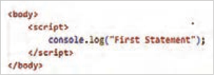

1 برای شروع کار پوشه جدیدی با عنوان `JavaScript` ایجاد کنید و فایل کارگاه‌ها را درون آن ایجاد کنید.

2 در پوشه `JavaScript`، یک فایل با نام`workshop1.html` ایجاد کنید و اسکریپتی مشابه تصویر روبه‌رو درون بخش `<body>` بنویسید.


3 فایل `html.workshop1` را اجرا کنید و برای مشاهده خروجی کد، کلید `F12` را در مرورگر بفشارید تا ابزارهای توسعه‌دهنده (`Developer` `Tools`) ظاهر شوند. سپس برای مشاهده نتیجه اسکریپت روی دکمه `Console` کلیک کنید.


---

<!-- pdf-page: 202 | book-page: 196 -->

**صفحه ۱۹۶**

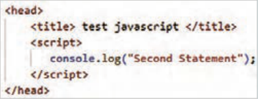

4 اسکریپت مشابهی را به بخش `<head>` اضافه کنید و فایل را ذخیره کنید. انتظار می‌رود که نتیجه کار در کنسول مشابه تصویر روبه‌رو باشد:

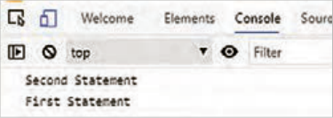

مرور‌گر وب ابتدا اسکریپت بخش `<head>` و سپس اسکریپت بخش `<body>` را اجرا می‌کند. به همین دلیل عبارت `Second` `Statement` جلوتر نمایش داده شده است.

5 یک فایل با نام `script.js` درون پوشه `JavaScript` ایجاد کنید و دستور زیر را درون آن بنویسید:

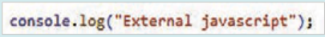

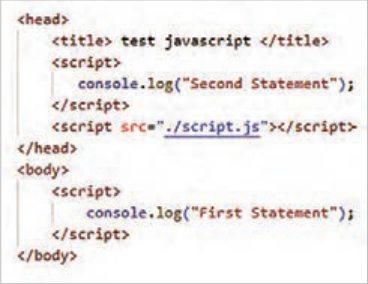

6 سپس محتوای فایل را ذخیره کنید.

```
7 در بخش <head> فایل workshop1.html،
```

فایل `script.js` را به صفحه وب الحاق کنید. دستور الحاق را دقیقًا قبل از تگ `<head/>` قرار دهید:

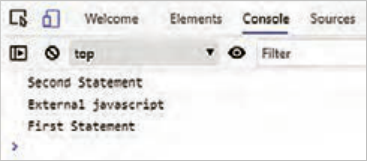

8 خروجی کد را در کنسول مرورگر مشاهده کنید و نتایج حاصل را به ترتیب نمایش عبارات در جای خالی بنویسید.

............................................................................................................................................

9 کد الحاق فایل جاوا‌اسکریپت را به قبل از `<body/>` منتقل کنید و نتیجه این تغییر را در جای خالی بنویسید.

............................................................................................................................................


---

<!-- pdf-page: 203 | book-page: 197 -->

**صفحه ۱۹۷**

10 برای نمایش یک عبارت در مرورگر (نه در بخش `console`) می‌توان از دستور `document.Write` استفاده کرد. این دستور عبارت داخل پرانتز را جایگزین محتوای فعلی صفحه می‌کند. دستور روبه‌رو را به فایل

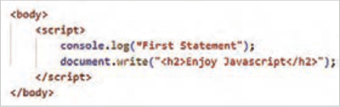

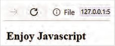

```
workshop1.html اضافه کنید:
```

فایل `HTML` را ذخیره کنید و نتیجه را در صفحه اصلی مرورگر به نمایش بگذارید. عبارت `Enjoy` `JavaScript` در اندازه `h2` درون صفحه مرورگر ظاهر می‌شود.

در صورتی که صفحه وب دارای محتوا باشد، دستور `document.write`() باعث ناپدید شدن محتوای جاری و جایگزین شدن آن با محتوای درون پرانتز می‌گردد. بر این اساس به‌کارگیری این دستور برای انجام برخی تمرین‌های کوچک اشکالی ندارد، اما برای استفاده از آن در پروژه باید با احتیاط رفتار شود.

### کنجکاوی

درباره مزایای اسکریپت نویسی در فایل خارجی تحقیق کنید و نتایج را در کلاس ارائه کنید.

توضیحات (`comments`): جاوا‌اسکریپت امکان ایجاد توضیحات تک خطی و چند خطی را توسط علائم // و /* */ فراهم می‌کند. نوشتن توضیحات برای روشن کردن هدف، عملکرد و منطق کد ضروری است. از علائم کامنت برای لغو اجرای موقت برخی کدها به منظور اشکال‌زدایی برنامه نیز استفاده می‌شود.

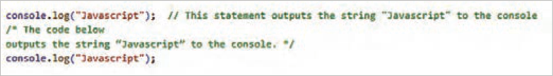

**شکل 4**

متغیرها (`Variables`): جاوا‌اسکریپت دارای دو کلمه کلیدی `let` و `var` برای تعریف متغیرها است. کلمه کلیدی `var` زمانی استفاده می‌شود که پشتیبانی از مرورگرهای قدیمی ضرورت داشته باشد. این کلمه تا سال 2015 برای تعریف متغیر استفاده می‌شد. از سال 2015 کلمه کلیدی `let` برای ایجاد متغیر معرفی شد.

### مثال

مثال زیر نحوه تعریف متغیرهای `x` و `y` را با مقادیر مختلف نمایش می‌دهد:

```
;let x = 10
;var y = 15.75
```


---

<!-- pdf-page: 204 | book-page: 198 -->

**صفحه ۱۹۸**

تعریف متغیرها می‌تواند به‌صورت خودکار نیز انجام شود. تعریف خودکار متغیر زمانی انجام می‌شود که یک متغیر مقداردهی شود.

### مثال

در مثال زیر دو متغیر `x` و `z` به‌صورت خودکار تعریف شده‌اند:

;`x` = 10

;`z` = `x` + 10

### بیشتر بدانید

ثابت‌ها (`constants`): ثابت‌ها (`const`) دارای مقدار ثابتی در طول اجرای برنامه هستند. ثابت‌ها یک‌بار تعریف و مقداردهی می‌شوند و بعد از آن امکان مقداردهی مجدد ندارند.

### مثال

در مثال زیر، ثابت `PI` با مقدار 3.141592 تعریف شده است. تغییر مقدار `PI` در خط دوم و سوم باعث رخداد خطا می‌گردد.

```
;const PI = 3.141592
```

;`PI` = 3.14

```
;PI = PI + 10
```

اصول نام‌گذاری متغیرها نام متغیر می‌تواند حاوی حروف الفبای انگلیسی، اعداد، علامت $ و زیرخط (_) باشد، اما در ابتدای نام متغیر نباید از اعداد استفاده شود.

جاوا‌اسکریپت نسبت به کوچکی و بزرگی حروف حساس است، بنابراین اسامی `price` و `Price` و `PRICE` سه متغیر متفاوت هستند.

کلمات رزرو شدۀ جاوا‌اسکریپت (که معنای خاصی دارند)، نباید ب‌هعنوان نام متغیر استفاده شوند، مانند

```
let و var، if، for و...
```

جاوا‌اسکریپت امکان تعریف متغیرها را در یک خط نیز فراهم می‌کند، اما در پایان هر تعریف متغیر، باید از علامت کاما برای جداسازی استفاده شود.

```
;"let firstName = "Sara", lastName = "Jones", studentId = "1234567
```

مقداردهی به متغیرها توسط عملگر انتساب (=) انجام می‌شود. در صورتی‌که مقداردهی متغیر انجام نشود، مقدار آن تعریف نشده یا )`Undefined`) خواهد بود.

### فعالیت

مشخص کنید که تعریف متغیرهای زیر به‌درستی صورت گرفته است یا خیر.

..……...… ; `myVar` = 2 ..………… ;`2x` = 10

```
..………… ;"user-name ="Safa
```

..………… ;`var` = 20


---

<!-- pdf-page: 205 | book-page: 199 -->

**صفحه ۱۹۹**

نمایش مقدار متغیرها و رشته‌ها برای نمایش مقدار یک متغیر در کنسول مرورگر از دستور `console` به شکل ٥ استفاده می‌شود:

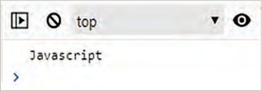

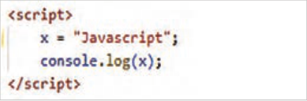

**شکل 5**

با توجه به حساسیت جاوا‌اسکریپت نسبت به کوچکی و بزرگی حروف، نوشتن دستور `console.log`(`X`) باعث نمایش پیغام خطای زیر می‌شود:


**شکل 6**

برای نمایش یک رشته متنی در کنسول یا صفحه وب، از علائم نقل قول در اطراف متن استفاده می‌شود، اما متغیرها نیازی به این علائم ندارند. در مثال زیر یک عبارت متنی به‌همراه مقدار متغیر `x` درون کنسول نمایش داده شده است.

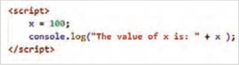


**شکل 7**

در اینجا عملگر + برای چسباندن دو عبارت به یکدیگر استفاده شده است. بسته به نوع داده‌ها، این عملگر می‌تواند به عنوان عملگر محاسباتی جمع یا الحاق رشته‌ها عمل کند.

تعریف متغیر و نمایش آن در جاوا‌اسکریپت

### کار کارگاهی

در ادامه اسکریپت فایل `workshop1.html` متغیرهای `x` و `y` را با مقادیر 5 و 10 تعریف کنید و سپس مقدار آنها را در کنسول مرورگر نمایش دهید:

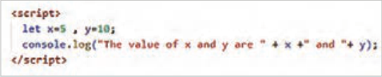

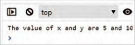

یک متغیر به‌صورت زیر ایجاد کنید و سپس مقدار آن را در کنسول نمایش دهید.

```
;let test
```

با توجه به اینکه متغیر `test` مقدار دهی نشده است، درصورتی که از دستور `console.log`(`test`) استفاده شود، پیغام ……………… ظاهر می‌شود.


---

<!-- pdf-page: 206 | book-page: 200 -->

**صفحه ۲۰۰**

انواع داده در یک زبان برنامه‌نویسی، متغیرها می‌توانند انواع داده‌های مختلفی را درون خود ذخیره کنند. برای ذخیره هر نوع داده میزان حافظه متفاوتی مورد نیاز است؛ انواع داده‌ها به زبان‌های برنامه‌نویسی امکان می‌دهند که از حافظه به‌صورت مؤثرتری استفاده کنند. همچنین برنامه‌نویسان می‌توانند داده‌ها را به شکلی منطقی‌تر و منسجم‌تر سازماندهی کنند. جدول ٥١ انواع داده‌های قابل استفاده در جاوا‌اسکریپت را نمایش می‌دهد.

جدول 15 انواع داده در جاوا‌اسکریپت

ردیف

نوع داده

توضیح

### مثال

شامل مقادیر عددی صحیح و اعشاری;`let` `x` = 20 , `y` = 10.75

1

```
عددی (Number)
```

عباراتی که داخل علامت نقل قول تکی

```
;"let family = "Smith
```

2

رشته‌ای (`String`)

یا دو تایی قرار می‌گیرند، رشته تلقی

```
;"let color = "Orange
```

می‌شوند.

```
;let a = true , b = false
```

3

منطقی (`Boolean`)شامل مقادیر `true` و `false`

```
;"let c = x>y , d = "amin" < "Amin
;]let numbers = [10,20,30,40,50
,"let names = ["sara", "mahdi
```

متغیرهایی از نوع آرایه می‌توانند انواع

```
;]"amir"
```

4

آرایه‌ها (`Array`)

داده مختلفی را درون خود نگهداری

```
,"let data = [100, 5.75, "javascript
```

کنند.

```
;]true
```

اشیای جاوا‌اسکریپت به‌صورت جفت‌های

```
, "let obj = {username: "Alfred
شیء (object)
```

5

ویژگی: مقدار درون آکولاد مشخص

```
;} "password: "admin
```

می‌شوند.

```
-2022-03"(const date = new Date
```

شیء تاریخ با استفاده از کلاس`Date`

6شیء تاریخ (`Date`)

;)"25

ایجاد می‌شود.

کار با انواع داده‌ها

### کار کارگاهی

1 یک سند `HTML` با نام `workshop2.html` ایجاد کنید و در بخش `<body>` برچسب `<script>` را بنویسید. متغیرهای `x`، `Family`، `d` و `names` را مطابق مثال‌های جدول فوق درون تگ `<script>` تعریف کنید و سپس مقادیر آنها را مانند دستور زیر در کنسول نمایش دهید:

```
;)The value of x is: "+ x"(console.log
```


---

<!-- pdf-page: 207 | book-page: 201 -->

**صفحه ۲۰۱**

2 عملگر `typeof` در جاوا‌اسکریپت نوع داده یک متغیر را مشخص می‌کند. این عملگر می‌تواند همراه با پرانتز یا بدون آن استفاده شود. در انتهای اسکریپت فایل `workshop2.html` این عملگر را مطابق مثال زیر برای بررسی نوع داده متغیرهای `x`، `Family`، `d` و `names` به‌کار ببرید و نتایج را در جای خالی بنویسید.

```
…… :x: number Family: ……. d: ……. names ;)(x)x: "+ typeof"(console.log
```

3 رفتار مرورگر را در تفسیر کدهای زیر بررسی کنید و جای خالی را بر اساس نتیجه‌گیری خود تکمیل کنید.

```
;"let a = 10 + 20 + "Blue
;let b = "Blue" + 10 + 20
```

در خط اول، عملوندهای 10 و 20 در ابتدای عبارت محاسباتی قرار گرفته‌اند، پس جاوا‌اسکریپت اعداد

10 و 20 را نوع داده `number` تلقی می‌کند، در نتیجه مقدار ........................ درون متغیر `a` ذخیره می‌شود. در خط دوم به علت قرار گرفتن رشته `Blue` در ابتدای عبارت محاسباتی، عملوندهای بعدی، از نوع داده .......................... تلقی می‌شوند و بنابراین مقدار .......................... درون متغیر`b` ذخیره می‌گردد.

4 نوع داده متغیر می‌تواند در طول برنامه تغییر نماید. در اسکریپت زیر متغیر `x` ابتدا به‌صورت تعریف‌نشده (`Undefined`) ایجاد شده است. نوع داده متغیر `x` در خط 2 با دریافت مقدار 10 به نوع ............................ و در خط 3 با دریافت مقدار `sara1980` به نوع ....................... تغییر می‌کند.

```
;1 let x
```

;2 `x` = 10

```
;"3 x = "sara1980
```

تبدیل نوع داده‌ها جاوا‌اسکریپت امکان تبدیل نوع داده متغیرها را به دو روش امکان‌پذیر می‌سازد: تبدیل ضمنی (`Implicit`) و صریح (`Explicit`). وقتی تبدیل نوع داده متغیر به‌صورت خودکار انجام شود، تبدیل ضمنی صورت گرفته است.

### مثال

مثال زیر نمونه‌ای از تبدیل نوع ضمنی را نمایش می‌دهد:

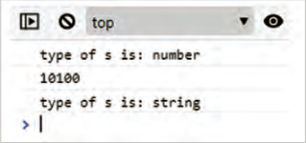

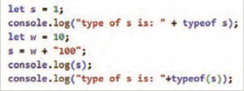

در خط اول، متغیر `s` از نوع عددی تعریف شده است. در خط چهارم نتیجه جمع متغیر `w` و رشته 100، عبارت 10100 است که درون متغیر `s` قرار می‌گیرد. در نتیجۀ نوع داده متغیر `s` به رشته تبدیل می‌شود. به‌کارگیری عملگر `typeof`() در خط 2 و 6 باعث نمایش نوع داده متغیر `s` می‌شود.


---

<!-- pdf-page: 208 | book-page: 202 -->

**صفحه ۲۰۲**

تبدیل صریح نوع داده توسط توابع داخلی جاوا‌اسکریپت انجام می‌پذیرد. توابع مربوط به تبدیل داده شامل `parseInt`()، `parseFloat`()، `Number`()، `String`() و `Boolean`() است که نوع داده آرگومان ورودی را به نوع داده صحیح، اعشاری، عددی، رشته‌ای و منطقی تبدیل می‌کنند.

کار با توابع تبدیل نوع

### کار کارگاهی

متغیرهای زیر را در انتهای اسکریپت فایل `workshop2.html` ایجاد کنید.

;`x` = "15.25" , `y` = 123 , `z` = 1

```
...15... …number… ;(x)1 let num1 = parseInt
```

....………… ...…… (`y`)2 `let` `num2` = `parseFloat`

....………… ...…… ;(`x`)3 `let` `num3` = `Number`

....………… ...…… ;(`true`)4 `let` `num4` = `Number`

....………… ...…… ;(`y`)5 `str` = `String` ...………… ...…… ;(`z`)6 `let` `bool` = `Boolean`

سپس مقدار و نوع داده متغیرهای ایجاد شده در خطوط 2 تا 7 را توسط تابع()`typeof` بررسی کنید و نتیجه را مانند مثال در جای خالی بنویسید. برای بررسی مقادیر و نوع متغیرها مانند الگوی زیر عمل کنید:

```
;)(num1)num1 +": "+ typeof(console.log
```

### نکته

علت عدم استفاده از کلمه کلیدی `let` در متغیرهای `x`، `y`، `z` و `str` این است که این متغیرها در کارگاه‌های قبلی ایجاد شده‌اند. بنابراین استفاده مجدد از کلمه `let` باعث ایجاد خطا می‌شود.

```
عملگرها (Operators)
```

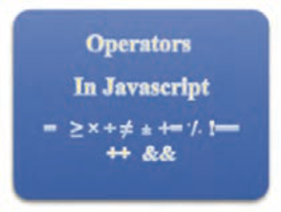

در زبان‌های برنامه‌نویسی عملگرها برای انجام عملیات روی متغیرها و مقادیر به‌کار می‌روند مقادیری که یک عملگر روی آنها عمل می‌کند، عملوند (`Operand`) نامیده می‌شوند. در عبارت `z` = `x` + `y` علائم + و = عملگر هستند و حروف `x`، `y` و `z` عملوند محسوب می‌شوند. در این بخش به شرح عملگرهای جاوا‌اسکریپت پرداخته می‌شود.

شکل ٨


---

<!-- pdf-page: 209 | book-page: 203 -->

**صفحه ۲۰۳**

عملگرهای ریاضی (`Arithmetic`) : این عملگرها برای انجام انواع عملیات محاسباتی ریاضی مورد استفاده قرار می‌گیرند. شرح این عملگرها در جدول ٦١ آمده است:

جدول٦١ عملگرهای ریاضی جاوا‌اسکریپت

عملگر

### توضیحات

### مثال

جمع، تفریق، ضرب و تقسیم و باق‌یمانده `x` = `y+z` , `a` = `a*2`, `n` = `n/10`

% , / , * , - , + --,++افزایش و کاهش به میزان یک واحد`x++`, `y--`, `++z`, `--w` **توان`x` = `y**2`

عملگرهای انتساب (`Assignment`): برای اختصاص یک مقدار به یک متغیر از این عملگرها استفاده می‌شود. برخی از این عملگرها ساده و برخی ترکیبی هستند؛ یعنی علاوه بر انتساب، عمل دیگری را نیز روی عملوندها انجام می‌دهند. جدول ٧١ مجموعه این عملگرها را نمایش می‌دهد.

جدول17 عملگرهای انتساب در جاوا‌اسکریپت

عملگر

### توضیحات

### مثال

عبارت معادل

مقدار عملوند سمت راست (`y`)، درون عملوند سمت چپ (`x`) قرار

`x` = `y`

`x` = `y`

=

می‌گیرد.

حاصل جمع عملوندهای `x` و `y` درون عملوند سمت چپ (`x`) قرار

`x` += `y`

`x` = `x` + `y`

=+

می‌گیرد.

حاصل تفریق عملوندهای `x` و `y` درون عملوند سمت چپ (`x`) قرار

`x` -= `y`

`x` = `x` – `y`

=-

می‌گیرد.

حاصل ضرب عملوندهای `x` و `y` درون عملوند سمت چپ (`x`) قرار

`x` *= `y`

`x` = `x` * `y`

=*

می‌گیرد.

خارج قسمت تقسیم عملوند `x` بر عملوند `y` درون متغیر سمت چپ

`x` /= `y`

`x` = `x` / `y`

=/

(`x`) قرار می‌گیرد.

باقیمانده تقسیم عملوند `x` بر عملوند `y` درون متغیر سمت چپ (`x`)

`x` %= `y`

`x` = `x` % `y`

=%

قرار می‌گیرد.

عملوند `x` را به توان عملوند `y` می‌رساند و نتیجه را درون متغیر `x`

`x` **= `y`

`x` = `x` ** `y`

=**

قرار می‌دهد.


---

<!-- pdf-page: 210 | book-page: 204 -->

**صفحه ۲۰۴**

عملگرهای مقایسه‌ای (`Comparison`): این عملگرها برای مقایسه دو عملوند به‌کار می‌روند.

مجموعه این عملگرها در جدول ٨١ آمده است:

جدول ٨١ عملگرهای مقایسه‌ای

عملگر

### توضیحات

== برای بررسی تساوی دو عملوند از لحاظ مقدار و === برای تساوی دو عملوند از لحاظ

== و ===

مقدار و نوع =! برای بررسی عدم تساوی مقدار دو عملوند و ==! برای بررسی عدم تساوی مقدار و نوع

=! و ==!

دو عملوند

> , <

کوچک‌تر یا بزرگ‌تر بودن عملوند اول نسبت به عملوند دوم

=< , =>کوچک‌تر یا مساوی، بزرگ‌تر یا مساوی

?

عملگر شرطی سه‌تایی که برای انتخاب بین دو مقدار بر اساس یک شرط استفاده می‌شود.

عملگرهای منطقی (`Boolean`): از عملگرهای منطقی برای ترکیب یا معکوس کردن شرایط استفاده می‌شود. این عملگرها امکان ترکیب عبارات منطقی را در شرایط مختلف فراهم می‌کنند. جدول ٩١ عملگرهای منطقی جاوا‌اسکریپت را معرفی می‌کند:

جدول ٩١ عملگرهای منطقی

عملگر

### توضیحات

&&

عملگر `AND` بررسی می‌کند که آیا هر دو عملوند صحیح هستند یا خیر.

||

عملگر `OR` بررسی می‌کند که آیا حداقل یکی از شرط‌ها درست است یا خیر.

!

عملگر `NOT` وضعیت درست یا غلط بودن یک شرط را معکوس می‌کند.


---

<!-- pdf-page: 211 | book-page: 205 -->

**صفحه ۲۰۵**

کار با انواع عملگرهای جاوا‌اسکریپت

### کار کارگاهی

فایل جدیدی با نام `workshop3.html` ایجاد کنید و تگ `<script>` را در بخش `body` بنویسید. سپس اسکریپت زیر را درون آن وارد کنید و نتایج به‌دست آمده را در جاهای خالی بنویسید.

```
;"1 let x = 10, y = 2, z= 3, w=20, s="10", n = "sara", m="sina
```

;++2 `x`

.………………

;3 `y` += `x`

.………………

;4 `--z`

.………………

;5 `z` *= `y`

.………………

;6 `x` /= 2

.………………

;7 `w` %= `z`

.………………

```
……………………………… ;)x: "+x + " , y:" + y + " , z:" + z , " , w:" + w"(8 console.log
```

.……………… ;)`x` < `y`( = 9 `let` `a`

```
.……………… ;)y == z( && )x > y( = 10 Let b
.……………… ;)x === s( = 11 Let c
```

.……………… ;)`y` != `z`( || 12 `Let` `d` = `c` .……………… ;)`n` < `m`( = 13 `Let` `e`

```
;)a: "+a + " , b:" + b + " , c:" + c , " , d:" + d + " , e: "+e"(14 console.log
.……………… ;"x is equal to s": "x is not equal to s" ?)x === s( = 15 result
;(result)16 console.log
```

.………………

### نکته

در هنگام مقایسه دو عملوند توسط عملگرهای == و =! نوع داده عملوندها اهمیتی ندارد و فقط مقادیر آنها بررسی می‌شود؛ درحال‌یکه عملگر === و ==! نوع داده عملوندها را نیز مد نظر دارد.

### نکته

عبارت ?(`x===s`) تساوی دو متغیر `x` و `s` را بررسی می‌کند. اگر نتیجه مقایسه `true` (درست) باشد، عبارت قبل از علامت ? و اگر نتیجه `false` (غلط) باشد، عبارت بعد از علامت : در متغیر `result` ذخیره می‌گردد.


---

<!-- pdf-page: 212 | book-page: 206 -->

**صفحه ۲۰۶**

آرایه‌ها (`Arrays`) متغیرهای آرایه امکان نگهداری چند عنصر با انواع داده‌های مختلف را دارند. در هنگام تعریف یک متغیر از نوع آرایه، مقادیر آرایه درون علامت کروشه نوشته می‌شوند. یک آرایه می‌تواند دارای عناصری با نوع داده یکسان یا متفاوت باشد.

### مثال

در مثال زیر سه آرایه با مقادیر رشته‌ای، عددی و ترکیبی تعریف شده است:

```
;]"let cars = ["Opel", "Saab", "Volvo", "BMW", "Hyundai
;]let numbers = [1, 20 , 5 , 25 , 1000 , 10 , 1 , 5
;]let data = [123, "Opel", false , 12 , 35
```

هر یک از عناصر آرایه دارای اندیس هستند. اندیس عناصر آرایه از صفر شروع می‌شود، بنابراین اگر یک آرایه دارای 5 عنصر باشد، اندیس عنصر اول صفر و اندیس عنصر آخر 4 خواهد بود. برای دسترسی به عناصر آرایه از اندیس عناصر استفاده می‌شود. شکل زیر نمایی از عناصر آرایه `cars` و مقادیر آنها را نمایش می‌دهد:

```
Hyundai
```

`Volvo`

`Saab`

`Opel`مقدار عناصر

`BMW`

0اندیس عناصر

4

3

2

1

**شکل 9**

برای دسترسی به عنصر اول آرایه از عبارت `]cars[0` و برای دسترسی به عنصر چهارم از عبارت `]cars[4` استفاده می‌شود.

### مثال

در خط دوم مثال زیر مقدار عنصر سوم آرایه `cars` و در خط سوم کل آرایه درون کنسول نمایش داده می‌شود.

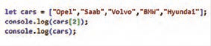

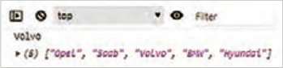

چنانچه اندیس عنصر آرایه مشخص نشود، کل عناصر آرایه روی صفحه چاپ می‌شود.

### نکته

با تعریف آرایه توسط کلمه کلیدی `const` امکان تغییر عناصر آرایه موجود است؛ اما متغیر آرایه نمی‌تواند به آرایه دیگری نسبت داده شود. به‌عنوان مثال نوشتن عبارت زیر با خطا مواجه می‌شود:

```
]"cars = ["Tara", "Shahin", "Dena"," Lamari Eama
```


---

<!-- pdf-page: 213 | book-page: 207 -->

**صفحه ۲۰۷**

ایجاد آرایه و چاپ مقادیر

### کار کارگاهی

1 فایل جدیدی با نام `workshop4.html` ایجاد کنید و درون آن آرایه‌ای با نام `colors` با مقادیر `yellow`، `blue`، `red`، `green` و `orange` تعریف کنید. بعد از بررسی صحت برنامه، دستورات را در جاهای خالی بنویسید.

2 دستوری بنویسید که عنصر `blue` را در کنسول مرورگر نمایش دهد.

……………………………

3 دستوری بنویسید که تمام عناصر آرایه `colors` را به یک باره چاپ نماید.

……………………………

### بیشتر بدانید

آرایه‌های چندبعدی در بخش قبل نحوۀ ایجاد یک آرایۀ تک‌بعدی و دسترسی به عناصر آن معرفی شد. جاوا‌اسکریپت امکان تعریف آرایه چن‌دبعدی را نیز فراهم می‌کند. آرایه چند بعدی زمانی ایجاد می‌شود که هر یک عناصر آرایه محتوای آرایه دیگری باشند. رایج‌ترین نوع آرایه چندبعدی، آرایه دو بعدی است که می‌تواند به عنوان ماتریس استفاده شود.

در مثال زیر یک آرایۀ دو بعدی با نام `users` تعریف شده است:

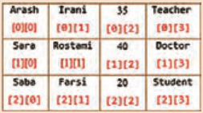

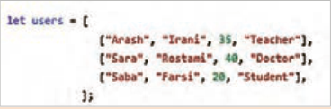

برای دسترسی به عنصر اول آرایۀ اول (`Arash`) باید از عبارت `]users[0][0` استفاده شود و برای دسترسی به عنصر چهارم آرایۀ دوم (`Doctor`) از عبارت `].users[1][3` تصویر سمت راست، اندیس عناصر آرایۀ دوبعدی `users` را نمایش می‌دهد.

کار با آرایه‌های دو بعدی در فایل `workshop4.html` محتوای آرایۀ `users` (مثال قبل) را بنویسید.

1 دستورات زیر را بعد از معرفی آرایه وارد کنید و خروجی هر‌یک از دستورات را در کنسول مرورگر بررسی کنید. نتیجه را مقابل هر دستور یادداشت کنید.

……………………………………… ;(`users`)`console.log` ……………………………………… ;)`]users[1`(`console.log` ……………………………………… ;)`]users[2][3`(`console.log`

2 دستوری بنویسید که باعث نمایش عنصر `Rose` شود.

………………………………….


---

<!-- pdf-page: 214 | book-page: 208 -->

**صفحه ۲۰۸**

اشیا در جاوا‌اسکریپت شیء (`Object`) یک ساختار داده است که برای ذخیرۀ مجموعه‌ای از داده‌های مرتبط، به‌صورت جفت‌های کلید: مقدار استفاده می‌شود، در ساختار داده شیء، مجموعه‌ای از کلیدها (`keys`) به مقادیر (`values`) متناظر خود اشاره می‌کنند. اشیا برای ذخیره و سازماندهی داده‌ها و رفتارهای یک موجودیت استفاده می‌شوند. که ساختاری شبیه به دیکشنری در پاتیون دارد.

### مثال

در مثال زیر شیء `person` دارای چهار ویژگی نام، نام خانوادگی، سن و رنگ چشم است که هر یک دارای مقدار مشخصی هستند:


در هنگام تعریف یک شیء استفاده از فواصل و ایجاد سطر جدید اهمیتی ندارد؛ بنابراین شیء `person` می‌تواند به‌صورت زیر نیز تعریف شود:

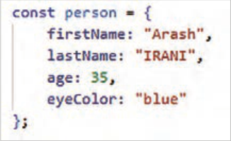

دسترسی به مقدار ویژگی‌های یک شیء از طریق علامت نقطه یا کروشه امکان‌پذیر است. هر دو دستور زیر مقدار ویژگی `firstName` در شیء `person` را نمایش می‌دهد:

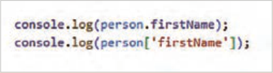

### بیشتر بدانید

یک شیء علاوه بر ویژگی‌ها دارای رفتارهایی است که با عنوان متد تعریف می‌شوند. تعریف متدها معموًلا در انتهای جفت‌های کلید-مقدار شیء انجام می‌شود.

روش جدید

روش قدیم

```
{)(methodName:function
{)(methodName
```

دستوراتی که متد انجام می‌دهد //

دستوراتی که متد انجام می‌دهد //

}

}

در خطوط 13 تا 15 کد صفحه بعد متد `displayInfo`() برای شیء `person` تعریف شده و در خط 17 فراخوانی آن انجام شده است.


---

<!-- pdf-page: 215 | book-page: 209 -->

**صفحه ۲۰۹**

### بیشتر بدانید

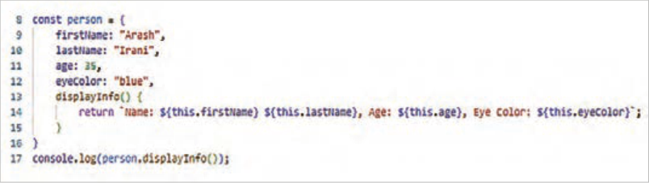

در تعریف فوق، کلمه کلیدی `this` به شیء جاری (`person`) اشاره می‌کند و برای دسترسی به ویژگی‌های شیء جاری به‌کار می‌رود. این متد اطلاعات شیء `person` را به محل فراخوانی برمی‌گرداند.

برای فراخوانی متد شیء، ابتدا نام شیء (`Person`) و سپس نام متد(`displayInfo`) به همراه علائم () نوشته می‌شود.

رشته‌ای که توسط متد `displayInfo`() به محل فراخوانی برگردانده (`return`) می‌شود، باید درون علامت `backtick` قرار گیرد. این علامت در گوشه بالای صفحه کلید، زیر دکمه `esc` واقع شده است.

ایجاد شیء در جاوا‌اسکریپت

### کار کارگاهی

1 فایل جدیدی با نام `workshop5.html` ایجاد کنید.

2 یک شیء با نام `book` با ویژگی‌های `title`، `author` و `year` و مقادیر `"JavaScript"`، `"Douglas` `Crockford"` و 2008 ایجاد کنید.

……………………………………………………………

3 دستوری بنویسید که مقدار ویژگی `author` در شیء `book` را چاپ نماید. ..………………....

### بیشتر بدانید

ترکیب اشیا و آرایه‌ها جاوا‌اسکریپت امکان ترکیب اشیا و آرایه‌ها را با هم فراهم می‌کند. برنامه‌نویس جاوا‌اسکریپت می‌تواند آرایه‌ای از اشیا یا یک شیء شامل آرایه را ایجاد نماید.

### مثال

مثال زیر آرایه‌ای از اشیا را ایجاد می‌کند:

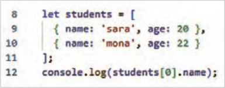


---

<!-- pdf-page: 216 | book-page: 210 -->

**صفحه ۲۱۰**

### مثال

در مثال زیر شیء `school` حاوی آرایه `students` است:

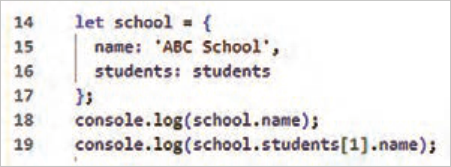


### فعالیت

کار با اشیا و آرایه‌ها در فایل `workshop5.html` آرایه `students` و `school` را مطابق مثال فوق تعریف کنید و نتایج را در کنسول مرورگر بررسی کنید دستوری بنویسید که نام و سن خانم `mona` را در کنسول نمایش دهد.

…………………………………………………

ساختارهای شرطی و حلقه در جاوا‌اسکریپت ساختارهای شرطی و حلقه از اجزای اساسی زبان‌های برنامه‌نویسی، از جمله جاوا‌اسکریپت هستند. ساختارهای شرطی منطق برنامه را بر اساس شرایط خاص کنترل می‌کنند و ساختارهای حلقه عملیات خاصی را به‌صورت تکراری انجام می‌دهند. این بخش به معرفی این ساختارها می‌پردازد.

دستورات شرطی `If` یک دستور شرطی امکان اجرای مجموعه‌ای از دستورات را به ازای برقراری یک شرط خاص فراهم می‌کند.

بسته به نیاز برنامه، دستور `if` می‌تواند به سه صورت نوشته شود. جدول 20 شکل کلی ساختار شرطی `if` را در سه حالت مختلف نمایش می‌دهد.

جدول 20 انواع ساختارهای شرطی `if`

```
else-if
ifif-else ساده
{ (condition1) if
statement1
{(condition) if
{(condition) if
{ (condition2) else if }
Statement1
statements
statement2
{else}
```

}

```
{ else }
Statement2
statement3
```

}

}


---

<!-- pdf-page: 217 | book-page: 211 -->

**صفحه ۲۱۱**

کلمه `Condition` به‌معنای شرط و کلمه `statement` به دستور یا دستوراتی اشاره دارد که به‌ازای برقرار شدن شرط اجرا می‌شوند. منظور از برقرار بودن شرط این است که مقدار عبارت `Condition` برابر `True` باشد. کلمه `else` به‌معنای «درغیراین‌صورت» است. محتوای `else` زمانی اجرا می‌شود که شرط `if` برقرار نباشد. یعنی مقدار عبارت `condition` برابر `False` باشد.

کار با ساختارهای شرطی `if`

### کار کارگاهی

توسط ساختار شرطی `if`، زوج یا فرد بودن عدد `n` را بررسی کنید.

بدین منظور یک فایل جدید با نام `workshop6.html` ایجاد کنید و اسکریپت زیر را درون آن بنویسید:

فایل را ذخیره کنید و نتیجه را در کنسول مرور‌گر مشاهده نمایید. در این اسکریپت، باقی‌ماندۀ تقسیم عدد `n` بر 2 درون متغیر `r` ذخیره می‌شود. چنانچه مقدار باقی‌مانده صفر باشد (یعنی `n` بر 2 بخ‌شپذیر است)، عبارت `"Even` `number"` و در غیراین‌صورت عبارت `"Odd` `number"` روی صفحه ظاهر می‌شود.

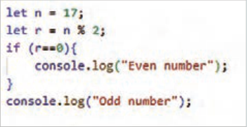

کلمه `Even` به‌معنای زوج و کلمه `Odd` به معنای فرد است.

اسکریپت تشخیص زوج یا فرد بودن یک عدد می‌تواند توسط ساختار `if-else` نیز نوشته شود. اسکریپت قبل را طبق شکل زیر تغییر دهید و نتیجه را در کنسول مرور‌گر بررسی کنید.

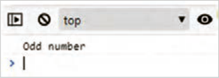

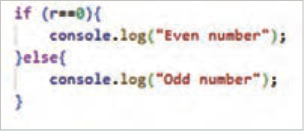

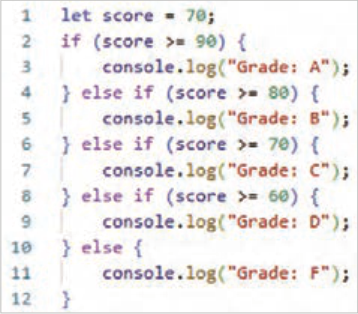

ساختار `else-if:` امکان بررسی چند شرط را به‌صورت پی‌در‌پی فراهم می‌کند. در این مرحله رتبه یک دانش‌آموز بر اساس نمره کس‌بشده مشخص می‌شود. در انتهای اسکریپت قبل، کد روب‌هرو را بنویسید.

در این اسکریپت، متغیر `score` با مقدار 70 برای نگهداری نمره دان‌شآموز تعریف شده است. ابتدا شرط `score>=90` و سپس شرط `score>=80` بررسی می‌شود. با توجه به اینکه

**شکل 10**


---

<!-- pdf-page: 218 | book-page: 212 -->

**صفحه ۲۱۲**

مقدار هر دو شرط نادرست است، بنابراین دستور `console.log`() در خطوط 3 و 5 اجرا نمی‌شود. سپس شرط `score>=70` بررسی می‌شود. با توجه به برقرار بودن شرط، دستور شماره 7 اجرا شده و عبارت `Grade:` `C` روی صفحه چاپ می‌شود. بعد از اجرای دستور 7 شرط‌های بعدی بررسی نمی‌شود و کنترل برنامه به خط 13 منتقل می‌شود.

### بیشتر بدانید

ساختار `Switch` ساختار `switch` برای انتخاب از بین چندین بلوک کد، بر اساس مقدار یک متغیر به‌کار می‌رود. درصورتی‌که شرایط مسئله فقط به مقایسه یک متغیر با مقادیر مشخص محدود شود، می‌توان از ساختار `switch` به‌جای `else-if`های متعدد استفاده نمود.

استفاده از ساختار شرطی `switch`

### کار کارگاهی

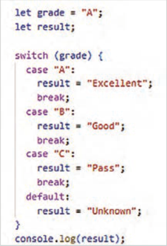

اسکریپتی بنویسید که رتبۀ یک دانش‌آموز را از متغیر `grade` دریافت کند و بر اساس مقدار رتبه، پیغام مناسبی را برای کاربر نمایش دهد.

بدین منظور اسکریپت موجود در فایل `workshop6.html` را درون علائم کامنت قرار دهید و در ادامه، کد روب‌هرو را برای بررسی رتبه بنویسید.

در این مثال ساختار شرطی `switch` مقدار متغیر `grade` را توسط `case`های مختلف بررسی می‌کند، به محض اینکه مقدار مقابل `case` با مقدار متغیر `grade` یکسان شود، دستور بعد از علامت: اجرا شده و سپس خروج از ساختار `switch` توسط دستور `break` انجام می‌شود. اگر مقدار متغیر `grade` با هیچ یک از مقادیر نوشته شده در مقابل `case`ها یکسان نباشد، دستور مربوط به حالت `default` اجرا می‌گردد.

### نکته

اگر شرط یک `case` برقرار شود ولی دستور `break` در آن موجود نباشد، `case` بعدی هم توسط برنامه بررسی می‌شود.

### فعالیت

در `case` `A` دستور `break` را حذف کنید و خروجی برنامه را در مرورگر بررسی کنید. سپس دستور `break` را از مقابل `case`های بعدی حذف کنید و نتیجۀ آن را تحلیل نمایید.


---

<!-- pdf-page: 219 | book-page: 213 -->

**صفحه ۲۱۳**

دستورات حلقه در زبان‌های برنام‌هنویسی برای تکرار اجرای یک بخش از برنامه از دستورات حلقه استفاده می‌شود. حلقه‌های تکرار باعث کاهش حجم برنامه، خوانایی کد، بهینه‌سازی الگوریتم برنامه و افزایش کارایی برنامه می‌شوند.

حلقه‌های تکرار انواع مختلفی دارند. در زبان جاوا‌اسکریپت این حلقه‌ها شامل `for`، `while`، `do` `while`، `for`…`of` و `for`…`in` است.

حلقۀ `for` زمانی که تعداد دفعات تکرار یک کار مشخص باشد، از حلقۀ `for` استفاده می‌شود. شکل کلی حلقۀ `for` به‌صورت زیر است:

```
{ )Initialization; Condition; Increment/Decrement( for
```

کدی که باید تکرار شود

}

حلقۀ `for` نیازمند یک شمارنده برای شمارش تعداد دفعات اجرای حلقه است. شمارنده حلقه یک متغیر است که دارای مقدار اولیه و پایانی است. عبارت `Initiliazation` به مقداردهی اولیه شمارنده حلقه اشاره دارد. در قسمت `Condition` شرط تکرار حلقه بررسی می‌شود. برای خروج از حلقه، شرط حلقه باید نقض شود.

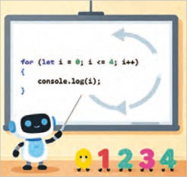

بدین منظور شمارنده حلقه باید در هر بار تکرار حلقه افزوده یا کاسته شود تا مقدار شمارنده از مقدار پایانی گذر کند. عبارات `Increment` و `Decrement` به‌معنای افزایش و کاهش مقدار شمارنده است. در صورت عدم استفاده از آکولاد برای تعیین محدوده بلوک حلقه، فقط اولین دستور جزء حلقه به شمار می‌آید.

**شکل 11**

به‌کارگیری حلقه `for`

### کار کارگاهی

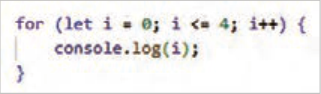

یک فایل جدید با نام `workshop7.html` ایجاد کنید و اسکریپت روبه‌رو را برای چاپ اعداد 0 تا 4 بنویسید.

### نکته

چنانچه شمارنده حلقه توسط کلمه کلیدی `let` تعریف شود، دسترسی به مقدار متغیر شمارنده فقط در داخل بلوک `for` امکان پذیر خواهد بود.

با توجه به این توضیحات درصورتی که بعد از علامت آکولاد بسته، دستور `console.log`(`i`) نوشته شود، پیغام خطا صادر می‌شود.


---

<!-- pdf-page: 220 | book-page: 214 -->

**صفحه ۲۱۴**

### بیشتر بدانید

**جدول 21**

```
حلقه while و do while
```

`while`

این حلقه‌ها مجموعه‌ای از دستورات را

```
do while
```

تا زمان نقض شدن یک شرط، تکرار

{ `do`

```
{(condition) while
```

می‌کنند. شکل کلی این حلقه‌ها

کدی که باید تکرار اجرا شود

کدی که باید تکرار شود

```
;(condition) while }
```

}

به‌صورت مقابل است:

در حلقه `while`، ابتدا شرط داخل پرانتز بررسی می‌شود، اگر شرط برقرار باشد دستورات داخل حلقه اجرا می‌شود، اگر شرط حلقه از ابتدا غلط باشد بنابراین محتوای حلقه اصلاً اجرا نمی‌شود.

محتوای حلقه `do` `while` یک بار اجرا می‌شود، سپس شرط حلقه بررسی می‌شود. در صورت برقرار نبودن شرط، خروج از حلقه صورت می‌پذیرد.

در صورتی‌که شرط حلقه نقض نشود، دستورات حلقه به‌طور مداوم تکرار می‌شوند. این وضعیت با عنوان حلقه بی‌نهایت (`Infinite` `loop`) شناخته می‌شود. حلقه بی‌نهایت می‌تواند منابع سیستم (مانند `CPU` و `RAM`) را به‌صورت بی‌رویه مصرف کند که همین مسئله موجب اختلال در عملکرد مرورگر خواهد شد.

به‌کارگیری حلقه `while` و `do` `while` در فایل `workshop7.html` اسکریپت زیر را برای چاپ عناصر آرایه `colors` با استفاده از حلقه `while` بنویسید.

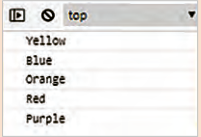

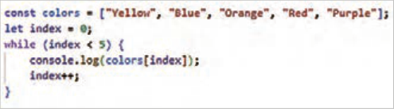

فایل را ذخیره کنید و خروجی آن را در مرورگر به نمایش بگذارید.

حاصل جمع عناصر آرایه `numbers` را به کمک یک حلقه `do` `while` محاسبه کنید و نتیجه را در کنسول نمایش دهید.

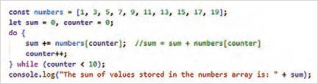

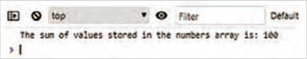


---

<!-- pdf-page: 221 | book-page: 215 -->

**صفحه ۲۱۵**

حلقه `for`…`of:` این حلقه برای پیمایش عناصر یک مجموعه قابل تکرار مانند آرایه، رشته، مجموعه و...

استفاده می‌شود. حلقه `for`…`of` امکان دسترسی به مقادیر عناصر آرایه را فراهم می‌کند.

حلقه `for` … `in:` این حلقه برای پیمایش کلیدهای اشیا (`Objects`) و اندیس آرایه‌ها استفاده می‌شود.

شکل کلی ساختار `for` … `of` و `for` … `in` به‌صورت زیر است:

**جدول 22**

```
for … in
for … of
{ (const key in object) for
{ (const element of iterable) for
```

...…

..…

}

}

متغیر `element` به عناصر آرایه، مجموعه یا کاراکترهای یک رشته و `iterable` به شیء قابل تکرار اشاره دارد.

متغیر `key` به کلید عناصر شیء و اندیس عناصر آرایه اشاره دارد.

کار با ساختار حلقه `for` … `of` و `for` … `in`

### کار کارگاهی

1 در فایل `workshop7.html` اسکریپت زیر را بنویسید و نتیجه را در کنسول مرورگر مشاهده کنید.

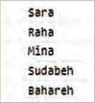

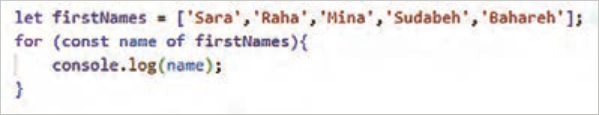

متغیر `name` به عناصر آرایه `firstName` اشاره دارد؛ در هر بار اجرای حلقه، متغیر `name` به عنصر جدیدی از آرایه اشاره می‌کند.

### کنجکاوی

در عبارت ( `const` `name` `of` `firstNames`( `for` چرا از کلمه کلیدی `const` استفاده شده است؟

2 برای بررسی عملکرد حلقه `for` … `in` در پیمایش عناصر اشیا، اسکریپت زیر را بنویسید و نتیجه را در کنسول مرورگر بررسی کنید.

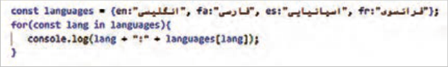


---

<!-- pdf-page: 222 | book-page: 216 -->

**صفحه ۲۱۶**

در کد فوق متغیر `languages` یک شیء حاوی اسامی زبان‌هاست. در این شیء واژه‌های مخفف (مانند `en`، `fa` و...) به عنوان کلید عنصر و عبارت فارسی متناظر آن (مانند انگلیسی، فارسی و...) به عنوان مقدار عنصر مشخص شده است.

در این کد، حلقه `for`…`in` عناصر شیء `languages` را یک‌به‌یک پیمایش می‌کند و کلید هر عنصر را درون متغیر `lang` قرار می‌دهد. سپس دستور `console.log`() نام کلید و مقدار متناظر با آن را در کنسول نمایش می‌دهد.

دستور `break` این دستور برای خروج از حلقه یا ساختار `Switch` به‌کار می‌رود. اگر دستور `break` درون حلقه استفاده شود، اجرای تمام دستورات بعد از آن متوقف شده و خروج از حلقه صورت می‌گیرد.

### نکته

اگر این دستور درون ساختار `switch` استفاده شود، `Case`های بعدی بررسی نخواهند شد و کنترل برنامه به بعد از آکولاد بسته منتقل می‌شود.

به‌کارگیری دستور `Break`

### کار کارگاهی

اسکریپتی بنویسید که اعداد دو رقمی آرایه زیر را در کنسول مرورگر نمایش دهد.

```
;]let data = [10,21,37,43,76,83,98,356,200,353,444,1000
```

برای این‌کار در انتهای فایل `workshop7.html`، اسکریپت زیر را وارد کنید. سپس فایل را ذخیره کرده و خروجی آن را در کنسول به نمایش بگذارید.

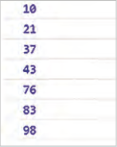

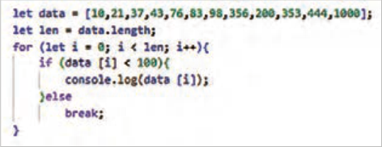

```
دستور continue
```

به‌کارگیری دستور `continue` در یک حلقه باعث می‌شود که اجرای فعلی حلقه متوقف و دور بعدی حلقه اجرا شود. به این معنی که بعد از اجرای دستور `continue` کنترل برنامه به ابتدای حلقه منتقل می‌شود و دور بعدی حلقه (در صورت امکان) اجرا می‌شود.


---

<!-- pdf-page: 223 | book-page: 217 -->

**صفحه ۲۱۷**

به‌کارگیری دستور `Continue`

### کار کارگاهی

اعداد زوج بین 20 تا 35 را در کنار هم با جداکنندۀ خط فاصله (-) نمایش دهید.

در انتهای اسکریپت فایل `workshop7.html`، اسکریپت زیر را بنویسید و نتیجه را در کنسول بررسی کنید.

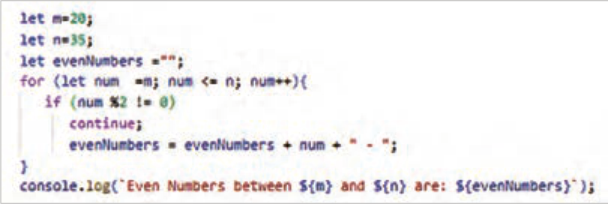


برای حذف خط فاصلۀ آخر (-)، دستور زیر را قبل از دستور `console.log` بنویسید:

```
;)0, -3(evenNumbers = evenNumbers.slice
```

### بیشتر بدانید

حلقه‌های تو در تو حلقه‌هایی که تاکنون معرفی شد، امکان پیمایش عناصر تک‌بعدی را فراهم می‌کنند. برای پیمایش عناصری همچون آرایه دوبعدی نیاز به استفاده از حلقه‌های تودرتو است. این نوع حلقه زمانی ایجاد می‌شود که درون یک حلقه، حلقه دیگری قرار گیرد. در یک حلقۀ تودرتو، حلقۀ داخلی به تعداد دفعات اجرای حلقه خارجی تکرار می‌شود.

### بیشتر بدانید

به‌کارگیری حلقۀ تودرتو

١ جدول ضرب 5*5 را با استفاده از یک حلقه تودرتو نمایش دهید.

٢ اسکریپت زیر را در انتهای اسکریپت فایل `workshop7.html` بنویسید و نتیجه را کنسول بررسی کنید.

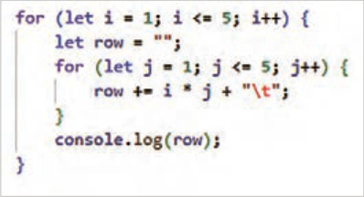

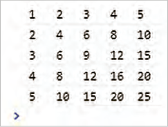

علامت `t\` به معنای `tab` است و برای تنظیم فاصله بین مقادیر استفاده شده است.


---

<!-- pdf-page: 224 | book-page: 218 -->

**صفحه ۲۱۸**

### فعالیت

ب‌هجای دستور `console.log` از دستور `document.write` برای نمایش مقادیر در صفحه مرورگر استفاده کنید.

پیمایش آرایه دوبعدی با استفاده از حلقه `for`

### کار کارگاهی

فایل `product.html` را باز کنید و کدهای جاوا‌اسکریپت زیر را به آن اضافه کنید.

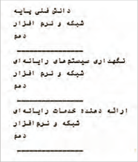

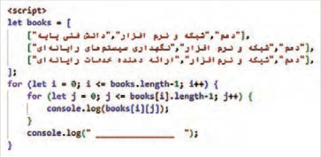

```
توابع(Functions)
```

در زبان‌های برنامه‌نویسی به بلوک‌های کدی که یک کار مشخص را انجام می‌دهند، تابع گفته می‌شود.

برنامه‌نویس می‌تواند مجموعه‌ای از دستورالعمل‌ها را در قالب یک تابع گروه‌بندی کند و سپس آن را به عنوان یک واحد مجزا مورد استفاده قرار دهد. این واحدهای مجزا می‌توانند بارها مورد استفاده قرار گیرند.

استفاده از توابع در برنامه‌نویسی ن‌هتنها سرعت توسعه را افزایش می‌دهد، بلکه خوانایی و قابلیت نگهداری کد را نیز افزایش می‌دهد. مجموعه دستورات نوشته‌شده برای ایجاد یک تابع، تحت یک نام مشخص قابل فراخوانی هستند. یک تابع می‌تواند مقادیری را ب‌هعنوان ورودی دریافت کند و بعد از اجرای دستورات داخل تابع، مقداری را ب‌هعنوان خروجی برگرداند.

در جاوااسکریپت برای ایجاد یک تابع از شکل کلی زیر استفاده می‌شود:

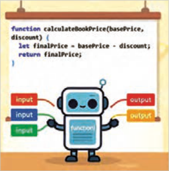

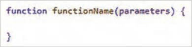

**شکل 12**


---

<!-- pdf-page: 225 | book-page: 219 -->

**صفحه ۲۱۹**

اصول تعریف تابع در جاوا‌اسکریپت به شرح زیر است:

در تعریف تابع ابتدا عبارت کلیدی `function` و سپس نام آن نوشته می‌شود.

نام تابع باید با حرف کوچک شروع شود و هر کلمه جدید با حرف بزرگ آغاز شود.

پارامترهای ورودی تابع درون پرانتز مشخص می‌شود.

تعداد پارامترها می‌تواند صفر، یک یا بیشتر باشد. مجموعه دستورات تابع درون آکولاد نوشته می‌شوند.

خروجی تابع معمولاً توسط تابع `return` به محل فراخوانی برگردانده می‌شود.

دستورات درون تابع زمانی اجرا می‌شوند که تابع فراخوانی شود.

برای فراخوانی تابع باید از نام تابع به همراه آرگومان‌های ورودی استفاده شود. شکل کلی فراخوانی تابع به‌صورت زیر است:

```
functionName(Arguments)
```

### مثال

در مثال زیر تابعی به نام `calculateCartTotal` با سه پارامتر ورودی `price3`, `price2`, `price1` ایجاد شده است. تابع `calculateCartTotal` مجموع مقادیر این سه پارامتر را محاسبه و درون متغیر `total` ذخیره می‌کند. دستور `return` مقدار متغیر `total` را به محل فراخوانی بازمی‌گرداند.

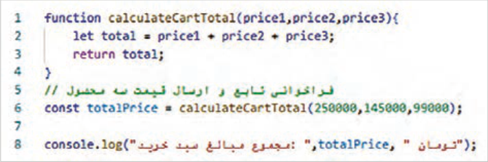


### نکته

پارامترها متغیرهایی هستند که در هنگام تعریف تابع استفاده می‌شوند. در مثال فوق متغیرهای `price3`, `price2`, `price1` پارامتر ورودی تابع هستند. آرگومان به مقادیری گفته می‌شود که هنگام فراخوانی برای تابع ارسال می‌شوند. به عبارت دیگر آرگومان‌ها مقادیری هستند که به پارامترهای تابع نسبت داده می‌شوند.


---

<!-- pdf-page: 226 | book-page: 220 -->

**صفحه ۲۲۰**

ایجاد تابع و فراخوانی آن

### کار کارگاهی

فایل جدیدی با نام `workshop8.html` ایجاد کنید و تابع `calculateCartTotal` را درون آن بنویسید.

سپس تابع را با آرگومان‌های ورودی دلخواه فراخوانی کنید.

یک تابع لزوماً دارای مقدار بازگشتی نیست. یک تابع می‌تواند با هدف اجرای مجموعه‌ای از دستورالعمل‌ها نوشته شود، بدون اینکه مقداری را به محل فراخوانی بازگرداند. در این‌صورت نیازی به استفاده از دستور `return` نخواهد بود. در مثال زیر تابع `showCartTotal` سه مقدار را ب‌هعنوان پارامتر ورودی دریافت می‌کند، حاصل جمع آنها را محاسبه کرده و نتیجه را در کنسول مرورگر نمایش می‌دهد؛ اما هیچ مقداری را به محل فراخوانی برنمی‌گرداند.


توابع آماده جاوا‌اسکریپت (`Built-in` `Functions`) جاوا‌اسکریپت دارای مجموعه‌ای از توابع آماده است که برای انجام عملیات مختلف به‌کار می‌روند. توابع آماده جاوا‌اسکریپت به برنامه‌نویسان امکان می‌دهند که ب‌هراحتی داده‌ها را مدیریت کرده و وظایف پیچیده را به سادگی پیاده‌سازی کنند. این توابع شامل توابع ریاضی، رشته‌ای، آرایه، اشیا، ورودی-خروجی و تاریخ و زمان است که در این بخش به معرفی آنها پرداخته می‌شود.

به کارگیری توابع ریاضی جاوا‌اسکریپت

### کار کارگاهی

توابع ریاضی جاوا‌اسکریپت که درون شیء`Math` سازماندهی شده‌اند، مجموعه‌ای از ابزارهای قدرتمند و کارآمد برای انجام محاسبات پیچیده ریاضی هستند. دسترسی به توابع ریاضی به‌صورت نقطه‌ای `.Math`( `functionName`) امکان‌پذیر است و استفاده از آنها نه‌تنها کدنویسی را کوتاه‌تر و خواناتر می‌کند، بلکه از خطاهای احتمالی در پیاده‌سازی دستی الگوریتم‌ها نیز جلوگیری کرده و عملکرد بهینه‌تری در برنامه‌های کاربردی ایجاد می‌نماید. چند نمونه از توابع پر کاربرد ریاضی در جاوا‌اسکریپت به شرح زیر است:

`:Math.abs`() قدرمطلق مقدار آرگومان ورودی را برمی‌گرداند.

`:Math.round`() مقدار آرگومان ورودی را گرد می‌کند.

`:Math.random`() یک عدد تصادفی بین 0 (شامل) تا 1 (غیرشامل) برمی‌گرداند.

`:Math.max`() بزرگ‌ترین عدد را از بین آرگومان‌های ورودی برمی‌گرداند.

`:Math.min`() کوچک‌ترین عدد را از بین آرگومان‌های ورودی برمی‌گرداند.


---

<!-- pdf-page: 227 | book-page: 221 -->

**صفحه ۲۲۱**

در طراحی فروشگاه‌های اینترنتی، توابع ریاضی جاوا‌اسکریپت نقشی حیاتی ایفا می‌کنند، زیرا مدیریت عملیات اصلی مانند محاسبه قیمت نهایی پس از اعمال تخفیف، جمع‌بندی اقلام سبد خرید و تعیین هزینه‌های حمل‌ونقل مستلزم استفاده دقیق از این توابع است. ب‌همنظور آشنایی با نحوۀ فراخوانی و عملکرد این توابع، فایلی به‌نام `shopping-cart.html` ایجاد کنید و اسکریپت زیر را در آن بنویسید.

سپس نتایج به‌دست‌آمده را در کلاس بررسی و تحلیل کنید.


---

<!-- pdf-page: 228 | book-page: 222 -->

**صفحه ۲۲۲**

به کارگیری توابع رشته ای در جاوا‌اسکریپت

### کار کارگاهی

توابع و ویژگی‌های رشته‌ای جاوا‌اسکریپت، ابزارهای ضروری برای پردازش و مدیریت متن هستند که امکان قالب‌بندی و تغییر رشته‌ها را با دقت و کارایی بالا فراهم می‌کنند. این متدها امکان اعتبارسنجی داده‌های ورودی کاربران، بهینه‌سازی متن برای نمایش یا ارسال به سرور را فراهم می‌کنند. برخی از توابع رشته‌ای جاوا‌اسکریپت به شرح زیر است:

`:toUpperCase`() حروف رشته ورودی را به حالت بزرگ در می‌آورد.

`:indexOf`() اندیس موقعیت کاراکتر یا رشتۀ داخل پرانتز را در رشته اصلی برمی‌گرداند.

`:substring`() یک زیررشته را از رشته اصلی برمی‌گرداند. ورودی‌های این تابع اندیس ابتدا و انتهای زیر رشته است.

`:split`() رشته را بر اساس جداکننده داخل پرانتز (مانند کاما) تقسیم می‌کند و آرایه‌ای از رشته‌ها را برمی‌گرداند.

`:replace`() دو رشته را به عنوان ورودی دریافت کرده و رشتۀ دوم (/) را به‌جای رشتۀ اول (-) در رشته اصلی قرار می‌دهد. این تابع در اولین موقعیت یافتن رشتۀ مورد نظر(-)، جایگزینی رشته را انجام می‌دهد.

`:startsWith`() وجود یک حرف یا رشته را در ابتدای یک متغیر رشته‌ای بررسی می‌کند.

شیء `string` دارای یک ویژگی به‌نام `length` است که طول یک رشته را تعیین می‌کند. بر این اساس، دستور زیر مقدار 11 را نمایش می‌دهد.

```
;(str1.length)console.log
```

فایلی به نام `user-info.html` ایجاد کنید و اسکریپت زیر را برای آشنایی با عملکرد توابع رشته‌ای بنویسید:


---

<!-- pdf-page: 229 | book-page: 223 -->

**صفحه ۲۲۳**

### بیشتر بدانید

به‌کارگیری توابع آرایه در جاوا‌اسکریپت توابع آرایه‌ای جاوا‌اسکریپت، ابزارهای مناسبی برای مدیریت، جست‌وجو، فیلتر و تبدیل داده‌های ساختاریافته هستند. به کمک این متدها می‌توان اعمال مختلفی همچون مرتب‌سازی (`sort`)، فیلتر کردن(`filter`) و استخراج اطلاعات، لیست‌ها را به سادگی و بدون نیاز به نوشتن حلقه‌های پیچیده، انجام داد. برخی از توابع آرایه به شرح زیر است:

`:push`() برای اضافه کردن یک یا چند عنصر به انتهای آرایه استفاده می‌شود.

`:slice`() برای استخراج بخشی از آرایه و ایجاد یک آرایه جدید به‌کار می‌رود.

`:filter`() آرایه جدیدی را با فیلتر کردن عناصر آرایه اصلی براساس یک شرط خاص ایجاد می‌کند.

`:sort`() مرتب‌سازی عناصر آرایه را انجام می‌دهد.

ویژگی `length` تعداد عناصر موجود در آرایه را برمی‌گرداند. به‌طور مثال عبارت `names.length` عدد6 را برمی‌گرداند.

فایلی به نام `customer-list.html` ایجاد کنید و اسکریپت زیر را برای آشنایی با عملکرد توابع آرایه بنویسید. نتایج اسکریپت را در کلاس بررسی و تحلیل کنید.


---

<!-- pdf-page: 230 | book-page: 224 -->

**صفحه ۲۲۴**

### بیشتر بدانید

به کارگیری توابع و دستورات ورودی و خروجی جاوا‌اسکریپت توابع ورودی و خروجی (`I/O`) در جاوا‌اسکریپت، پل ارتباطی بین برنامه و دنیای خارج از آن هستند و امکان ایجاد یک تجریه تعاملی و پویا را برای کاربران فراهم می‌کنند. در محیط مرورگر، این توابع برای دریافت ورودی از کاربر، نمایش جعبه پیغام، نمایش داده در کنسول و دریافت تأیید کاربر استفاده می‌شوند.

برای بررسی عملکرد توابع ورودی و خروجی، یک فایل جدید با نام `user-interaction.html` ایجاد کنید و کد زیر را در بخش `body` بنویسید.


فایل را ذخیره کنید و نتیجه را در مرورگر مشاهده کنید.


`:console.log`() نمایش مقادیر را در کنسول مرورگر به عهده دارد.

`:prompt`() نمایش یک کادر محاوره‌ای برای دریافت داده از کاربر. مقدار دریافتی به محل فراخوانی ارسال می‌شود.

`:alert`() نمایش پنجره هشدار با یک پیام و دکمه `.OK` `:confrim`() نمایش یک پنجره تأیید شامل دکمه `OK` و `.Cancel` مقدار بازگشتی تابع `True` یا

```
False است.
```


پنجره `alert` و `prompt`


پنجره `confrim`

`:document.write`() نوشتن مستقیم در صفحه وب (استفاده از این روش در برنامه‌نویسی مدرن توصیه نمی‌شود).


---

<!-- pdf-page: 231 | book-page: 225 -->

**صفحه ۲۲۵**

### کنجکاوی

تحقیق کنید چرا استفاده از توابع `prompt`() و `confirm`() برای عملیات ورودی می‌تواند باعث مختل شدن تجربه کاربری شود؟

کلا‌سها و اشیا در زبان‌های برنام‌هنویسی، کلاس به معنای الگویی برای ایجاد اشیا است. یک کلاس حاوی مجموعه‌ای از ویژگ‌یها و متدهاست. شیئی که از روی یک کلاس تعریف م‌یشود، دارای ویژگ‌یها و متدهای تعریف شده در آن کلاس خواهد بود.

### بیشتر بدانید

در مثال زیر یک کلاس با عنوان `Person` ایجاد شده است که حاوی ویژگی‌های `name` و `age` است:


متد `constructor` برای تعریف و مقداردهی ویژگی‌های یک شیء استفاده می‌شود. زمانی که یک شیء جدید از یک کلاس ایجاد می‌شود، متد`constructor` به طور خودکار فراخوانی شده و مقادیر اولیه را به ویژگی‌های آن شیء اختصاص می‌دهد. در مثال فوق متد `constructor` دو پارامتر `name` و `age` را می‌پذیرد و آنها را به ویژگی‌های متناظر در شیء نسبت می‌دهد.

کلاس `person` دارای یک متد بنام `greet` است که یک پیغام را در کنسول مرورگر نمایش می‌دهد.

متغیر `person1` یک شیء از نوع کلاس `person` است که مقدار ویژگی‌های آن برابر `amin` و 47 است. این مثال نشان می‌دهد که برای ایجاد یک شیء از روی یک کلاس باید از کلمه کلیدی `new` استفاده شود. با توجه به اینکه کلاس `person` دارای متدی بنام `greet` است، شیء `person1` نیز امکان استفاده از این متد را دارد. متد `greet` باعث نمایش عبارت `"My` `name` `is` `amin` `and` `I` `am` 47 `years` `old"` در کنسول خواهد شد.

ایجاد کلاس و شیء فایل جدیدی با نام `object.html` ایجاد کنید و درون آن کلاس جدیدی با نام `Car` با ویژگی‌های

```
auto_maker، model وyear ایجاد کنید.
```

یک متد با نام `print_Details` برای چاپ ویژگی‌های خودرو بنویسید. نحوه چاپ به‌صورت زیر باشد:

```
Auto maker: Toyota , Model: Camry , Year: 2020
```


---

<!-- pdf-page: 232 | book-page: 226 -->

**صفحه ۲۲۶**

یک شیء با مقادیر `Toyota`، `Camry`، 2020 ایجاد کنید و متد `print_details` را برای شیء جدید مورد استفاده قرار دهید.


دسترسی به عناصر `DOM` جاوا‌اسکریپت برای انجام عملیات مختلف بر روی عناصر صفحه، به دسترسی به آن عناصر نیاز دارد. به همین دلیل جاوا‌اسکریپت دارای متدهایی برای دسترسی به عناصر است. به‌عنوان مثال برای دسترسی به عنصری با شناسه `demo` از متد `getElementById` به‌شکل زیر استفاده می‌شود:

در این اسکریپت مقدار جدید عنصر `para` توسط ویژگی `textContent` مشخص شده است.

برای انتخاب و دسترسی به هر یک از عناصر صفحه روش‌های مختلفی وجود دارد که در این بخش به آنها اشاره می‌شود.

انتخاب براساس `ID:` عناصر صفحه براساس شناسه (`id`) آنها انتخاب می‌شوند.

انتخاب براساس کلاس: مجموعه‌ای از عناصر با نام کلاس مشخص انتخاب می‌شوند.

انتخاب براساس نام تگ: مجموعه‌ای از عناصر با نام تگ یکسان انتخاب می‌شوند.


**شکل 12**


**شکل 13**


---

<!-- pdf-page: 233 | book-page: 227 -->

**صفحه ۲۲۷**

### کنجکاوی

برای مطالعه درباره سایر متدهای دسترسی به عناصر، عبارت «`how` `to` `get` `elements` `by` `JavaScript`» را در گوگل جست‌وجو کنید و از لیست نتایج سایت `w3schools.com` را باز کنید.

در ادامه تمرین‌هایی برای کار روی عناصر مختلف صفحه توسط جاوا‌اسکریپت ارائه می‌گردد.

مدیریت عناصر صفحه توسط جاوا‌اسکریپت

### کار کارگاهی

دسترسی به محتوای عناصر، تغییر محتوا و سبک عناصر: اسکریپتی بنویسید که محتوا و سبک یک دکمه و عنصر متنی را توسط جاوا‌اسکریپت تغییر دهد. این تغییرات باید در هنگام کلیک روی دکمه رخ دهد.

یک فایل به نام `product.html` ایجاد کنید و کد زیر را در بخش `<body>` وارد کنید:


در خطوط 6 تا 13 اسکریپت فوق یک تابع با نام `change`() تعریف شده است که دسترسی به عناصر `addToCart` و `para` و سپس تغییر محتوا و سبک آنها را انجام می‌دهد. تابع `change`() هنگام کلیک روی دکمه فراخوانی می‌شود.

در خطوط 7 و 8 دسترسی به عناصر پاراگراف و دکمه انجام شده است. در خطوط 9 و 10 تغییر محتوای عناصر پاراگراف و دکمه، توسط ویژگی‌های `innerHTML` و `textContent` صورت گرفته است. در خطوط 11 و 12 تغییر سبک عناصر توسط ویژگی `style` انجام شده است. فایل را ذخیره کنید و نتیجه را در مرورگر بررسی کنید.

### بیشتر بدانید

دسترسی به عناصر و تغییر ویژگی آنها: اسکریپتی بنویسید که ویژگی `src` یک تصویر را هنگام قرار گرفتن ماوس روی آن تغییر دهد.


---

<!-- pdf-page: 234 | book-page: 228 -->

**صفحه ۲۲۸**

در فایل `products.html` تصویر یک محصول را به قسمت `<body>` اضافه کنید. سپس اسکریپت زیر را برای تغییر مقدار ویژگی `src` تصویر استفاده کنید.


فایل را ذخیره کنید و نتیجه را در مرورگر بررسی کنید.

با انتقال اشار‌هگر ماوس روی تصویر، رویداد `onmouseover` فعال شده و در نتیجه تابع `changeImage`() برای تغییر تصویر فراخوانی می‌شود. با کنار رفتن ماوس از روی تصویر، رویداد `onmouseleave` فعال شده و بنابراین تابع `resetImage`() فراخوانی می‌شود. این تابع تصویر اولیه را برمی‌گرداند.


در هر دو تابع فوق از متد `setAttribute`() برای تغییر تصویر استفاده شده است.


اضافه و حذف کردن عناصر توسط جاوا‌اسکریپت:

اسکریپتی بنویسید که با کلیک روی یک دکمه با عنوان مشاوره، پانلی را برای راهنمایی کاربر به صفحه اضافه کند و بعد از چند ثانیه آن را ببندید.

یک فایل جدید با نام `open-panel.html` ایجاد کنید و اسکریپت را طبق شکل روبه‌رو درون آن بنویسید.


---

<!-- pdf-page: 235 | book-page: 229 -->

**صفحه ۲۲۹**

استایل عناصر را به بخش `<head>` اضافه کنید. سپس فایل را ذخیره کنید و نتیجه را در مرورگر مشاهده کنید.

با کلیک روی دکمه «مشاوره با کارشناس فروش» تابع `openPanel`() فراخوانی می‌شود. این تابع در خط 3 تا 12 نوشته شده است.

در خط 4 یک عنصر `div` جدید توسط متد `createElement` ایجاد می‌شود.

در خط 5 محتوای عنصر توسط ویژگی `InnerHTML` تعیین می‌گردد.

عنصر جدید نیازمند تعیین استایل است. این استایل توسط کلاس `consultpanel` مشخص می‌شود.

در خط 6 نام کلاس عنصر جدید تعیین می‌شود.

در خط 7 عنصر جدید توسط متد `appendChild` به صفحه اضافه می‌گردد.

پانل مشاوره (عنصر `div`) به‌صورت پیش‌فرض مخفی است. در خط 8 وضعیت نمایش پانل به `block` تغییر می‌کند.

در خط 9 متد `setTimeout` برای تعیین زمان حذف پانل مشاوره استفاده می‌شود.

در خط 9 پانل مشاوره بعد از 5 ثانیه توسط متد `remove` حذف می‌شود.

دسترسی به اطلاعات فرم و اعتبارسنجی داده‌های کاربر: یک اسکریپت ساده برای اعتبارسنجی داده‌های ورودی کاربر بنویسید. در این اعتبارسنجی پر بودن فیلدهای متنی را بررسی کنید، به‌طور‌یکه اگر یک فیلد متنی خالی باشد، پیغام هشداری را نمایش می‌دهد.

یک فایل به‌نام `sign-in.html` ایجاد کنید و کد شکل زیر را درون آن وارد کنید:


این فرم حاوی سه فیلد برای دریافت نام کاربری، کلمه عبور و ایمیل است.


---

<!-- pdf-page: 236 | book-page: 230 -->

**صفحه ۲۳۰**

برای اعتبارسنجی فرم از اسکریپت شکل زیر استفاده کنید. این اسکریپت حاوی تابع `validateForm`() است که مقدار ورودی فیلدهای متنی را بررسی می‌کند. این تابع در رویداد `onsubmit` فرم صفحه قبل فراخوانی می‌شود.


تابع `validateForm`() نام کاربری و کلمه عبور را در خط 2 و 3 دریافت می‌کند و مقدار آنها را درون دو متغیر `username` و `password` قرار می‌دهد. در خط 4 تا 7 خالی بودن `username` بررسی می‌شود، در صورت خالی بودن این متغیر، پیغام هشدار ظاهر می‌شود و دستور `return` `false` از ارسال محتوای فرم به سرور جلوگیری می‌کند. به‌طور مشابه در خط 8 تا 11 خالی بودن متغیر `password` بررسی می‌گردد. در صورت‌یکه شرط `if`های خط 4 و 8 برقرار نباشد، دستور خط 12 اجرا می‌شود و اطلاعات فرم به سرور ارسال می‌شود.

در ادامه طول نام کاربری و کلمه عبور را بررسی کرده؛ به‌طوری‌که اگر طول هر یک از این دو فیلد کمتر از 6 کاراکتر باشد، پیغام هشدار نمایش داده شود. برای این‌کار شرط زیر را بعد از خط 11 بنویسید.


### نکته

`DOM` پایه تمام وب‌سایت‌های تعاملی است؛ تسلط بر آن یعنی قدم گذاشتن به دنیای حرفه‌ای طراحی وب.


---

<!-- pdf-page: 237 | book-page: 231 -->

**صفحه ۲۳۱**

### ارزشیابی شایستگی طراحی صفحات وب تعاملی با جاوااسکریپت

استاندارد عملکرد کار: هنرجو باید بتواند با استفاده از `JavaScript` به‌صورت بهینه و امن، رفتا‌رهای پویا و تعاملی را به صفحات وب اضافه کند و خروجی نهایی را در مرورگ‌رهای مختلف بدون خطا اجرا نماید.

نمره

شرایط انجام کار (ابزار،مواد، تجهیزات،

ابزارهای

نتایج

ردیف

### مراحل کار

استاندارد (شاخص‌ها/داوری/نمره‌دهی)

کسب

زمان، مکان و ...)

### ارزشیابی

ممکن شده

تعریف صحیح جاوااسکریپت و کاربرد آن در وب تشخیص تفاوت `JavaScript` با `HTML` و `CSS` توضیح روش‌های افزودن (`JS` `inline`، داخلی، خارجی) ایجاد فایل `js` و اتصال صحیح آن به `HTML`

3

استفاده از `console.log` بدون خطا اجرای اسکریپت در مرورگر انجام کنجکاوی‌ها انجام مراحل با روش‌های دیگر مشاهده

آشنایی، راه‌اندازی و شروع

عملی

1

رایانه، `IDE`، مرورگر، ۳۰دقیقه، کارگاه

ایجاد فایل `js` و اتصال صحیح آن به `HTML` استفاده از `console.log` بدون

کدنویسی

پرسش خطا اجرای اسکریپت در مرورگر2 شفاهی

فقط تعریف جاوااسکریپت و کاربرد آن در وب تشخیص تفاوت `JavaScript` با `HTML` و `CSS` توضیح روش‌های افزودن (`inline.Js` داخلی، خارجی1)

تعریف متغیر با `let` تشخیص انواع داده توضیح تفاوت == و === شناخت عملگرهای منطقی و ریاضی تبدیل نوع داده

```
(Number, String)
```

3

انجام محاسبات و مقایسه‌ها انجام کنجکاوی‌ها انجام مراحل با روش‌های دیگر مشاهده عملی

2تعریف و استفاده از متغیرها

رایانه، `IDE`، مرورگر، 10 دقیقه

پرسش تعریف متغیر با `let` و `const` تشخیص انواع داده شفاهی توضیح تفاوت == و === شناخت عملگرهای منطقی و ریاضی تبدیل نوع داده

2

(`Number`, `String`) انجام محاسبات و مقایسه‌ها تعریف متغیر با `let` تشخیص انواع داده انجام ناقص مراحل1 تعریف آرایه و شیء تشخیص تفاوت آرایه و شیء شناخت نحوه دسترسی به عناصر ایجاد آرایه یک‌بعدی و دوبعدی ایجاد شیء با چند ویژگی دسترسی و تغییر مقدار عناصر ساخت آرایه محصولات و نمایش اطلاعات آن

3

ایجاد شیء دانش‌آموز با چند ویژگی و نمایش آن پیمایش آرایه با حلقه انجام کنجکاوی‌ها انجام مراحل با روش‌های دیگر مشاهده عملی

3آرایه‌ها و اشیا

رایانه، `IDE`، مرورگر، 15 دقیقه

پرسش ایجاد آرایه یک‌بعدی ایجاد شیء با چند ویژگی دسترسی و تغییر مقدار شفاهی عناصر ساخت آرایه محصولات و نمایش اطلاعات آن شیء دانش‌آموز با

2

چند ویژگی و نمایش آن پیمایش با حلقه تعریف آرایه و شیء تشخیص تفاوت آرایه و شیء شناخت نحوه دسترسی به عناصر ایجاد آرایه یک‌بعدی انجام ناقص مراحل 1

توضیح کاربرد `if` توضیح تفاوت حلقه `for` و `while` شناخت `break` و `continue` استفاده صحیح از `if/else` استفاده از حلقه

3

`while` ،`for` پیمایش آرایه با `for`…`of` انجام کنجکاوی‌ها نجام مراحل با روش‌های دیگر مشاهده

ساختارهای شرطی و

عملی

4

رایانه، `IDE`، مرورگر، 15دقیقه

حلقه‌ها

پرسش توضیح کاربرد `if` توضیح کاربرد `for` و `while` شناخت `break` و `continue` به‌کارگیری `while` ،`for` ،`if` پیمایش آرایه با 2 `for`…`of` شفاهی

انجام ناقص مراحل1


---

<!-- pdf-page: 238 | book-page: 232 -->

**صفحه ۲۳۲**

تعریف تابع تفاوت پارامتر و آرگومان شناخت توابع آماده `Math` و `String` و `Array` ایجاد تابع با پارامتر فراخوانی تابع استفاده از متدهای `Math.random`() `toUpperCase`()

3

`pop` ,)(`push`() نوشتن تابع محاسبه میانگین استفاده از تابع برای مشاهده اعتبارسنجی ورودی استفاده از متدهای آرایه در یک مثال کاربردی انجام عملی، کنجکاوی های انجام مراحل با روش‌های دیگر

5توابع و توابع آماده

رایانه، `IDE`، مرورگر، 15 دقیقه

پرسش شفاهی تعریف تابع به‌کارگیری توابع ریاضی و رشته‌ای2 انجام ناقص مراحل و یا دانش در حد تعریف1 تعریف مفهوم `DOM` توضیح ساختار `document` تعریف کلاس و شیء ایجاد کلاس و نمونه‌سازی انتخاب عناصر ب ا:�`getElementById` `quer`

```
ySelector
```

تغییر محتوا و استایل عناصر ایجاد دکمه‌ای که با کلیک

3

متن صفحه تغییر کند ایجاد فرم ساده و دریافت مقدار ورودی مدیریت رویداد (`event` `handling`) بدون خطا مشاهده انجام کنجکاوی‌ها انجام مراحل با روش‌های دیگر

کلاس‌ها و `DOM` تعامل با

عملی،

6

رایانه، `IDE`، مرورگر، 15 دقیقه

صفحه وب

پرسش شفاهی تعریف مفهوم `DOM` توضیح ساختار `document` تعریف کلاس و شیء ایجاد کلاس و نمونه‌سازی انتخاب عناصر ب ا:�`getElementById` `quer`

2

```
ySelector
```

تعریف مفهوم `DOM` توضیح ساختار `document` تعریف کلاس و شیء انجام ناقص مراحل1 احراز همه شایستگی‌های غیرفنی٢

شایستگی‌های غیر فنی، ایمنی، بهداشت، توجهات زیست محیطی و نگرش:

عدم احراز هر یک از شایستگی‌های غیرفنی١ بلی

ارزشیابی کار (شایستگی انجام کار)

خیر

### توضیحات:

1 معیار شایستگی انجام کار:

کسب حداقل نمره 2 از مراحل 1، 5 و 6 (مراحل بحرانی) کسب حداقل نمره 2 از بخش شایستگی‌های غیرفنی، ایمنی، بهداشت، توجهات زیست‌محیطی و نگرش کسب حداقل میانگین 2 از مراحل کار

2 تعریف سطوح شایستگی: صرف‌نظر از اینکه یک تکلیف کاری در چه سطحی از صلاحیت حرفه‌ای انجام می‌شود، در هر محیط کاری ممکن است انجام هر کار با کیفیت مشخصی مورد انتظار باشد. سطح شایستگی انجام کار، معیار اساسی ارزشیابی است.

مهارت (سطح سه): ماهر و قادر به آموزش و هدایت دیگران، توانایی برنامه‌ریزی و تحلیل، پاسخ‌گویی در برابر کارهای خود، سروکار داشتن با سطح وسیعی از کارها و فعالیت‌ها تسلط (سطح چهار): خبرگی در انجام کار و آموزش دیگران، ایجاد نوآوری، سازگاری، عیب‌یابی، هدایت و راهنمایی دیگران.
