# تولید برنامه شیءگرا


---

<!-- pdf-page: 240 | book-page: 234 -->

**صفحه ۲۳۴**

## واحد یادگیری ۱

## تولید برنامه شیءگرا

### آیا تابه‌حال اندیشیده‌اید

در دنیای واقعی، اشیای مشابه (مانند خودروها) با وجود تفاوت در مدل و رنگ، ویژگی‌ها و رفتارهای مشترکی دارند. این موضوع به کدام مفهوم در برنامه‌نویسی مرتبط است؟

چرا با افزایش حجم برنامه‌ها، نگهداری و اصلاح آنها دشوارتر می‌شود؟ چگونه می‌توان ساختار برنامه را به‌گونه‌ای طراحی کرد که تغییرات، کمترین تأثیر را بر سایر بخش‌ها داشته باشند؟

اگر بخواهید در یک بازی رایانه‌ای، چند شخصیت با رفتارهای مشابه و ویژگی‌های متفاوت طراحی کنید، استفاده از چه روشی در برنامه‌نویسی مناسب‌تر است؟

به چه دلیل در طراحی بسیاری از نرم‌افزارها و برنامه‌های بزرگ، از شیوه برنامه‌نویسی شیءگرا استفاده می‌شود؟

«کلاس» در برنامه‌نویسی به چه چیزی شباهت بیشتری دارد: نقشه یک ساختمان یا خود ساختمان؟

### در پایان از هنرجو انتظار می‌رود

1 کلاس‌های پایتون را با ویژگی‌ها و متدهای مناسب، همراه با تعیین مقادیر پیش‌فرض و مدیریت دسترسی (`public`, `protected`, `private`) طراحی و پیاده‌سازی کند.

2 از کلاس‌ها نمونه (`Instance`) بسازد و مقادیر و ویژگی‌های این نمونه‌ها را در طول اجرای برنامه به طور مؤثر تغییر دهد و مدیریت کند.

3 با استفاده از ارث‌بری برای ایجاد سلسله مراتب کلاس‌ها، فراخوانی متدهای والد و بازنویسی آنها در کلاس‌های فرزند مطابق با نیازهای برنامه اقدام نماید.

4 با استفاده از اصول `OOP`، کدی ماژولار، قابل فهم و با قابلیت استفاده مجدد (`reusable`) بنویسد که از تکرار کد جلوگیری کند.

5 درک اولیه‌ای از نحوه عملکرد متاکلاس‌ها و نقش آنها در تعریف و ساختار کلاس‌ها پیدا کند.

6 مسائل برنامه‌نویسی ساده تا متوسط را با استفاده از برنامه‌نویسی شیءگرا تحلیل کرده و راه‌حل‌های مبتنی بر شیء طراحی و پیاده‌سازی کند.

### استاندارد عملکرد

با استفاده از مفاهیم برنامه‌نویسی شیءگرا در زبان پایتون، مسائل ساده و کاربردی را مدل‌سازی کند، کلاس مناسب طراحی نماید و با ایجاد و به‌کارگیری نمونه‌ها، برنامه‌ای خوانا، قابل اجرا و قابل توسعه تولید کند.


---

<!-- pdf-page: 241 | book-page: 235 -->

**صفحه ۲۳۵**

### برنامه‌نویسی شیءگرا (Object-Oriented Programming)

برنامه‌نویسی شیءگرا روشی از برنامه‌نویسی است که در آن، اجزای برنامه به‌صورت موجودیت‌هایی شبیه به دنیای واقعی مدل‌سازی می‌شوند. در این روش، به‌جای آن‌که فقط به دستورات و توابع فکر کنید، ابتدا به چیزهایی فکرم‌یکنید که در دنیای واقعی وجود دارند، ویژگی دارند و می‌توانند کاری انجام دهند.

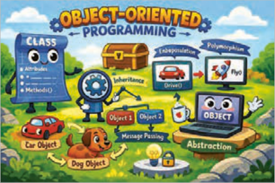

به این چیزها در برنامه‌نویسی، شیء (`Object`) و به این شیوۀ برنامه‌نویسی، شیءگرایی یا به اختصار (`.O.O.P`) گفته می‌شود.

**شکل 1**

در این رویکرد، هدف اصلی، بازآفرینی منطق و ساختار دنیای واقعی در محیط برنامه‌نویسی است. برای درک بهتر این مفهوم، می‌توان به بازی‌های استراتژیک رایج همچون `Age` `of` `Empires` یا `Clash` `of` `Clans` اشاره کرد. در این بازی‌ها، شخصیت‌ها و موجودیت‌ها به گروه‌های گوناگون تقسیم می‌شوند؛ از کارگران و سربازان گرفته تا وسایل نقلیه و ماشین‌آلات جنگی. برنامه‌نویسی شیءگرا با معرفی مفهومی به نام کلاس (`Class`)، به شما کمک می‌کند موجودیت‌های مشابه را در قالب یک گروه قرار دهید. به این ترتیب، می‌توانید هر گروه را به‌صورت یک کلاس در نظر بگیرید و ویژگی‌ها و کارهای مربوط به آن را در برنامه مشخص کنید.


**شکل 2**

فعًلا از دنیای بازی‌ها فاصله گرفته و یک مثال کامًلا واقعی بررسی می‌شود. یک تلفن همراه قدیمی را در نظر بگیرید. این تلفن همراه صرفًا یک وسیلۀ ساده نیست، بلکه دارای مجموعه‌ای از ویژگی‌هاست و قادر است وظایف و عملیات مختلفی را انجام دهد.


برای مثال هر تلفن همراه این ویژگی‌ها را دارد:

دارای رنگ است.

دارای برند است.

دارای مدل است.

میزان شارژ باتری آن در هر لحظه مشخص است.

**شکل 3**


---

<!-- pdf-page: 242 | book-page: 236 -->

**صفحه ۲۳۶**

### نکته

فعلاً با مثال‌هایی از گوشی‌های قدیمی شروع کرده و در ادامه درس به گوشی‌های هوشمند و گوشی‌های مخصوص بازی هم پرداخته خواهد شد.

### فعالیت

بر اساس اطلاعات گوشی خودتان یا یک گوشی دلخواه، اطلاعات جدول زیر را تکمیل نمایید. (جدول ویژگی‌ها) در جدول زیر، نمونه‌هایی از تلفن همراه و ویژگی‌های آنها را مشاهده می‌کنید:

نمونه‌ها / ویژگی‌ها`color`

`brand`

`model`

```
battery
```

گوشی من`gray`

`nokia`

1100

32%

گوشی شما گوشی دوستتان

اگر دو گوشی هم‌مدل داشته باشید، ویژگی‌های آنها مشابه است، اما میزان باتری یا رنگ می‌تواند متفاوت باشد. هرکدام از این گوشی‌ها یک شیء جداگانه محسوب می‌شوند. به مشخصاتی که یک شیء دارد، ویژگی (`Attribute`) گفته می‌شود. این ویژگی‌ها مشخص می‌کنند که هر شیء چه چیزهایی دارد.

همچنین هر تلفن همراه کارهای مختلفی می‌تواند انجام دهد:

روشن و خاموش شود.

تماس بگیرد.

پیام ارسال کند.

### فعالیت

به‌جز کار‌های فوق، با گوشی شخصی خودتان چه کارهای دیگری می‌توانید انجام دهید. جدول زیر را کامل کنید.

1-

3-

2-

4-

متد کارهایی که یک شیء می‌تواند انجام دهد، متد (`Method`) نامیده می‌شود. در حقیقت متد‌ها مانند دستورالعمل‌هایی هستند که به شیء می‌گویند چه کاری انجام دهد.


---

<!-- pdf-page: 243 | book-page: 237 -->

**صفحه ۲۳۷**

در دنیای واقعی، این تلفن همراه یک «شیء» می‌باشد و در برنامه‌نویسی شیءگرا نیز دقیقًا با همین نگاه، اشیا مدل‌سازی می‌شوند.

شیء شیء (`Object`) به هر چیزی گفته می‌شود که:

دارای ویژگی (`Attribute`) باشد.

بتواند کار یا کارهایی (`Method`) انجام دهد.

```
نمونه (Instance)
```

در پایتون، شیءهایی که با استفاده از یک کلاس ساخته می‌شوند، نمونه (`Instance`) آن کلاس نامیده می‌شوند. بنابراین یک تلفن همراه مشخص (مثًًلا موبایل شخصی شما)، یک نمونه (`Instance`) از کلاس تلفن همراه محسوب می‌شود.

### نکته

در این کتاب از این به بعد به جای استفاده از عبارت شیء (`Object`) از اصطلاح نمونه (`Instance`) استفاده می‌شود.

تعریف کلاس (`Class`) حال اگر بخواهید چندین تلفن همراه مختلف بسازید، نوشتن ویژگی‌ها و متدها برای هر کدام به‌صورت جداگانه کار درستی نیست.

برای این کار، به یک قالب کلی نیاز داریم که مشخص کند:

1 هر تلفن همراه چه ویژگی‌هایی دارد.

2 چه کارهایی می‌تواند انجام دهد.

به این قالب کلی، کلاس (`Class`) گفته می‌شود.

کلاس مانند نقشۀ ساخت یک تلفن همراه است و هر تلفن همراهی که ساخته می‌شود، در واقع یک نمونه (`Instance`) از آن کلاس خواهد بود.

جدول ١

اصطلاحات

معنی

```
کلاس (Class)
```

قالب کلی یا نقشه ساخت

```
نمونه (Instance)
```

موجود ساخته‌شده از روی یک کلاس

```
ویژگی (Attribute)
```

چه چیزی دارد؟

```
متد (Method)
```

چه کاری انجام می‌دهد؟


---

<!-- pdf-page: 244 | book-page: 238 -->

**صفحه ۲۳۸**

حالا نوبت آن است که در محیط برنامه‌نویسی، اولین کلاس (`class`) خود را ایجاد کنید و سپس با استفاده از آن کلاس، یک نمونه(`Instance`) بسازید. کد شکل 4 را درون یک فایل جدید به دقت تایپ کنید.

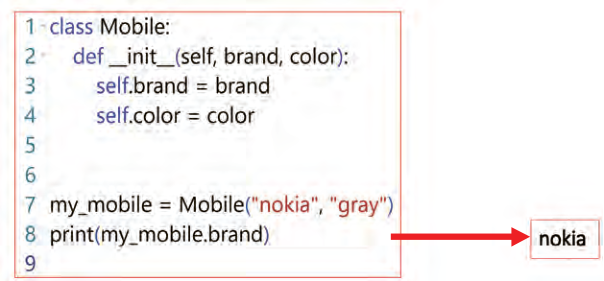

شکل 4 اولین کد برای تعریف کلاس و ساخت نمونه

خط 1: یک کلاس به نام `Mobile` تعریف می‌شود.

کلاس در واقع یک الگو یا نقشه برای ساختن موبایل‌هاست.

دقت کنید کلاس، خود موبایل نیست بلکه الگویی برای ساخت موبایل‌هاست.

بر اساس استانداردهای نام‌گذاری در پایتون (`PEP8`)، نام کلاس‌ها باید با استفاده از شیوۀ `PascalCase` نوشته شود؛ به این معنا که حرف اول نام کلاس و حرف اول تمام کلمات تشکیل‌دهندۀ آن بزرگ باشد.

خط 2: این متد، نقش متِد سازندۀ کلاس را در پایتون بر عهده دارد. به این متد اصطلاحاً `initializer` هم می‌گویند.

هر زمان که از کلاس `Mobile` یک نمونه ساخته شود، یعنی با اجرای خط 7، این متد به‌طور خودکار اجرا می‌شود.

وظیفه اصلی این متد مقداردهی اولیه به ویژگی‌های نمونه (`Instance`) است.

دقت کنید که `___init_` نامی قراردادی در پایتون است و نمی‌توان آن را تغییر داد. در سمت چپ و راست کلمه `init` دو بار کاراکتر زیرخط (`underscore`) تایپ شده است.

خطوط 3 و 4: ویژگی‌های نمونه را مشخص می‌کنند.

هر موبایل یک برند و یک رنگ دارد.

در کد ارائه شده، `self.brand` و `self.color` هر دو به عنوان ویژگی (`attribute`) شناخته می‌شوند.

کلمۀ `self` به همان نمونه‌ای اشاره می‌کند که در حال ساخته شدن است و `brand` و `color` نام ویژگی‌هایی هستند که به آن نمونه تعلق دارند.


---

<!-- pdf-page: 245 | book-page: 239 -->

**صفحه ۲۳۹**

خطوط 5 و 6: خطوط خالی بر اساس استانداردهای کدنویسی پایتون (`PEP8`)، لازم است پس از پایان تعریف کلاس، دو خِط خالی قرار داده شود تا مرز بین کلاس و بخش کدهای سراسری (`Global`) به‌وضوح مشخص شود.

خط 7: ساختن نمونه(`Instance`) در این خط، یک نمونه (`instance`) به نام `my_mobile` از روی کلاس `Mobile` ساخته‌اید.

مقدار `"nokia"` برای ویژگِی `brand` و مقدار `"gray"` برای ویژگِی `color` در نظر گرفته شده‌اند.

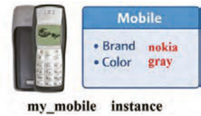

خط 8: دسترسی به ویژگی با استفاده از نام نمونه و علامت نقطه (.)، به ویژگی‌های آن دسترسی پیدا می‌کنید.

این دستور مقدار ویژگی `brand` را برای نمونه `my_mobile` چاپ می‌کند.

**شکل 5**

خط 9: خط خالی طبق استانداردهای `PEP8`، پس از پایان کدها نیز یک خط خالی قرار داده می‌شود تا انتهای فایل از کدها به‌صورت خوانا و استاندارد مشخص شود.

توجه داشته باشید که اگر در این مرحله همۀ جزئیات را به‌طور کامل متوجه نشدید، نگران نباشید؛ این یک مبحث جدید است و با ادامۀ آموزش و فعالیت‌های بیشتر، مرور کدها و ساخت برنامه‌های بیشتر، به مرور، مفاهیم برایتان روشن می‌شود و جا می‌افتد.

حالا برنامه را اجرا کنید، می‌بینید که مقدار ویژگی `brand` از موبایلی که ساخته‌اید یعنی `nokia` چاپ می‌شود.

توجه داشته باشید در این مرحله، کلاس فقط شامل ویژگی‌ها (`Attributes`) است و فعلاً هیچ رفتار یا متدی (`Method`) به‌جز سازنده (`___init_`) برای نمونه‌ها تعریف نشده است.

حالا با یک تصویر روند اجرای برنامه را شرح داده شده است. شکل 6 را به دقت مشاهده کنید.

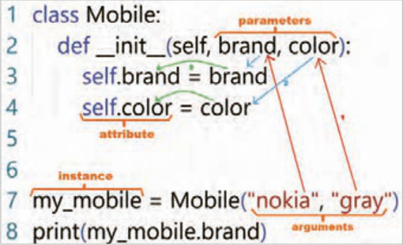

شکل 6 روند اجرای برنامه


---

<!-- pdf-page: 246 | book-page: 240 -->

**صفحه ۲۴۰**

همان‌طور که در شکل مشاهده می‌شود بعد از اجرای خط 7 که برای ساختن نمونه `my_mobile` است مراحل زیر اتفاق می‌افتد:

1 آرگومان‌های `"nokia"` و `"gray"` به متد `___init_` فرستاده و درون پارامترهای `brand` و `color` قرار می‌گیرند.

2 مقدار پارامتر `brand` درون `self.brand` و مقدار پارامتر `color` درون `self.color` ریخته می‌شوند.

3 در این مرحله نمونه مورد نظر ساخته خواهد شد.

### فعالیت

در انتهای برنامه دستوری اضافه کنید که رنگ موبایل را چاپ نماید.

### فعالیت

داخل متد `___init_` دستوری اضافه کنید که مدل گوشی شما را نیز به عنوان ویژگی در نظر بگیرد.

فراموش نکنید که در خط 7 نیز باید مدل گوشی خودتان را اضافه کنید. سعی کنید خودتان این فعالیت را انجام دهید ولی اگر هنوز ابهام داشتید در ادامه پاسخ این کد را می‌بینید و می‌توانید با کد خودتان مقایسه کنید.

در ادامه بر اساس کلاسی که تعریف کرده‌اید یک نمونه دیگر به عنوان موبایلی برای دوستتان بسازید. کد شکل 7 را به دقت بنویسید.

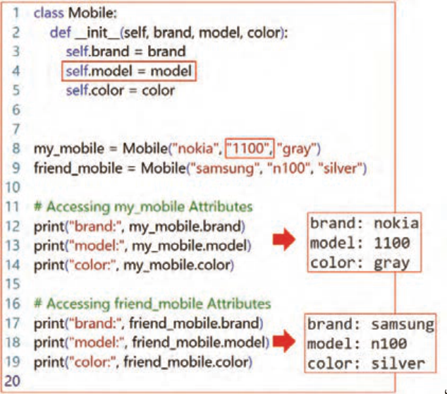

شکل 7 ساختن یک نمونه به عنوان گوشی برای دوستتان


---

<!-- pdf-page: 247 | book-page: 241 -->

**صفحه ۲۴۱**

خط 4: یک ویژگی جدید برای مدل گوشی همراه تعریف و مقداردهی شده است.

خط 9: یک نمونه جدید با نام `friend_mobile` با ویژگی‌هایی متفاوت از `my_mobile` ایجاد شده است.

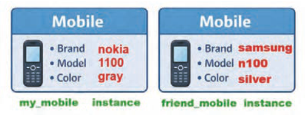

**شکل 8**

خطوط 15 تا 17: در این خطوط ویژگی‌های نمونه دوم چاپ شده است.

### نکته

دقت کنید `my_mobile` و `friend_mobile` هر دو نمونه‌هایی مجزا هستند که از روی کلاس `Mobile` ساخته شده‌اند.

در ادامه یک متد به کلاس `Mobile` اضافه کنید تا مقدار تمام ویژگی‌های نمونه‌ای که ساخته‌اید را چاپ کند. کد قبلی را مانند شکل 9 تغییر دهید.

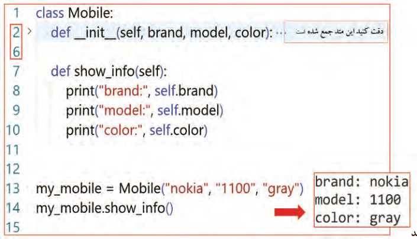

شکل 9 افزودن متد

```
show_info
```


---

<!-- pdf-page: 248 | book-page: 242 -->

**صفحه ۲۴۲**

خط 7: این خط، تعریف یک متد (`method`) به نام `show_info` را در داخل کلاس `Mobile` انجام می‌دهد.

متدها، توابعی هستند که به یک کلاس مرتبط هستند و می‌توانند به ویژگی‌های (`Attributes`) آن کلاس دسترسی داشته باشند.

پارامتر `self` در تعریف متد، به خودِ نمونه‌ای که متد روی آن فراخوانی می‌شود، اشاره می‌کند. به عبارت دیگر، `self` به کلاس `Mobile` اجازه می‌دهد تا به ویژگی‌های (`Attributes`) خاص هر نمونه از نوع `Mobile` دسترسی پیدا کند.

خطوط 8 تا 10: این دستور، مقادیر ویژگی‌های برند، مدل و رنگ نمونه را با استفاده از برچسب‌های مشخص، نمایش می‌دهد.

خط 14: در این خط متد `show_info` از نمونه `my_mobile` فراخوانی و اجرا می‌شود.

به همین ترتیب می‌توانید متدهای بیشتری برای این کلاس تعریف کنید. به عنوان مثال متد `incoming_call` برای نمایش پیام هنگام تماس دریافتی می‌باشد. کدهای این متد را در زیِر متِد `show_info` براساس شکل 10 بنویسید.

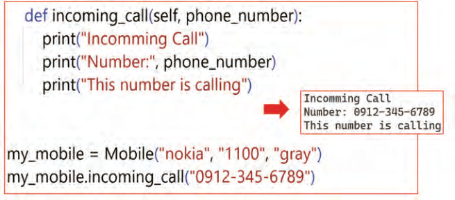

شکل 10 افزودن متد

```
incoming_call
```

اولین خط، تعریف متدی به نام `incoming_call` را در داخل کلاس `Mobile` انجام می‌دهد. این متد یک پارامتر به نام `phone_number` را دریافت می‌کند که نشان‌دهنده شماره تلفن تماس‌گیرنده است.

دستورات داخل متد، پیام ‌"تماس ورودی" و شماره تلفن تماس‌گیرنده را در خروجی نمایش می‌دهند.

دقت کنید این متد باید درون کلاس `Mobile` و هم‌سطح متد `___init_` تعریف شود، بنابراین یک `tab` جلوتر از بدنه کلاس قرار می‌گیرد.

در آخرین خط برنامه متد `incoming_call`  را بر روی نمونه `my_mobile`  فراخوانی می‌کند.

آرگومان "0912-345-6789" به عنوان پارامتر `phone_number`  ارسال می‌شود که نشان‌دهنده شماره تلفن تماس‌گیرنده است. سپس متد اجرا می‌شود و پیام‌های مشخص شده و شماره تلفن ارائه شده را نمایش می‌دهد.


---

<!-- pdf-page: 249 | book-page: 243 -->

**صفحه ۲۴۳**

### فعالیت

در کلاس `Mobile` متدی با نام `make_call` ایجاد کنید. این متد باید یک پارامتر به نام `phone_number` دریافت کند که شماره تلفنی که می‌خواهید با آن تماس بگیرید را در خود نگه دارد. متد باید با چاپ پیام‌هایی مناسب، شروع عملیات شماره‌گیری را اعلام کند. به عنوان مثال، می‌توانید پیام‌هایی مانند

```
"...Calling" یا "...Dialing" را چاپ کنید.
```

تعیین مقدار پیش فرض برای ویژگی‌ها برای جذابیت و کارایی بیشتر در ادامه، یک ویژگی تعریف خواهد شد که بعد از اجرای برنامه مقدار آنها قابل تغییر باشند. از این رو درون کلاس، ویژگی وضعیت روشن و خاموش بودن (`status`) و یک مقدار پیش فرض هم برای آن تعریف خواهد شد. کافیست در متد `___init_` یک ویژگی جدید مانند کد زیر تعریف کنید.

```
"self.status = "on
```

توجه داشته باشید هنگام تعریف نمونه دیگر ضرورتی ندارد مقداری برای این ویژگی تعریف شود.

تغییر مقدار ویژگی: در این روش پس از ایجاد نمونه `my_mobile` به سادگی با نوشتن کد زیر، مقدار آن تغییر خواهد کرد.

```
my_mobile = Mobile("nokia", "1100", "gray")
" my_mobile.status = "off
```

در این دستور از نشانه `dot` یا همان نقطه برای دسترسی به ویژگی یک نمونه استفاده شده است. این خط از پایتون می‌خواهد برای نمونه `my_mobile` ویژگی `status` مرتبط با آن را پیدا کند و در ادامه مقدار "‌ `off"` را درون آن قرار دهد.

```
ارث‌بری (Inheritance)
```

فرض کنید در یک شرکت تولیدکنندۀ گوشی همراه، تاکنون تنها نسخه‌های پایۀ تلفن همراه تولید می‌شده است؛ گوشی‌هایی که امکانات آنها به ویژگی‌هایی مانند برند، مدل، رنگ و وضعیت محدود بوده و فاقد سیستم‌عامل و دوربین هستند. مهم ترین کاری که با این گوشی‌های همراه می‌توان انجام داد، تماس تلفنی و ارسال پیامک است. در این شرکت، یک کلاس اصلی به نام `Mobile` وجود دارد که این ویژگی‌های پایه را مدل‌سازی می‌کند.

حالا شرکت تصمیم گرفته است نسل جدیدی از گوشی‌های همراه را طراحی کند؛ گوشی‌های هوشمند (`Smartphone`) که در کنار ویژگی‌های پایۀ گوشی همراه، قابلیت‌هایی مانند سیستم‌عامل و دوربین را ارائه می‌دهند و همچنین مدل‌هایی تخصصی‌تر، مانند گوشی‌های مناسب بازی (`Gaming` `phone`)، که برای اجرای بهتر بازی‌ها با امکانات سخت‌افزاری قوی‌تر طراحی شده‌اند.

1 `Smartphone:` تلفن هوشمند نوعی تلفن همراه است که با بهره‌گیری از سیستم‌عامل (`Operating` `System`)، امکان اجرای برنامه‌ها و ارائۀ قابلیت‌های پیشرفته، فراتر از تماس و پیامک را فراهم می‌کند.

دارای ویژگی دوربین پیشرفته دارای ویژگی سیستم عامل قابل نصب و ارتقا


---

<!-- pdf-page: 250 | book-page: 244 -->

**صفحه ۲۴۴**

2 `Gaming` `phone:` نوعی گوشی هوشمند است که علاوه بر داشتن تمام قابلیت‌های یک `Smartphone`، به‌طور ویژه برای اجرای بازی‌ها طراحی شده و از امکانات سخت‌افزاری قوی‌تری برخوردار است.

دارای ویژگی پردازنده گرافیکی قوی و مجزا دارای ویژگی حافظه گرافیکی بالا


شکل 11 موبایل پایه، هوشمند و موبایل مخصوص بازی

در پی این تصمیم از برنامه‌نویسان شرکت خواسته شده است کلاس‌های لازمر برای موبایل‌های تخصصی را نوشته و تعریف کنند.

جدول ٢

پردازنده

برند

مدل

رنگ وضعیت

دوربینسیستم عامل1

حافظه

گرافیکی

```
Mobile
```

















```
Smartphone
```

















```
GamingPhone
```

















همان‌طور که در جدول مشاهده می‌شود، تمام گوشی‌ها ویژگی‌های مشترکی دارند: برند، مدل، رنگ و وضعیت. بنابراین، تعریف مجدد این ویژگی‌ها در هر یک از کلاس‌های گوشی‌های تخصصی، منجر به تکرار کد خواهد شد.

برای جلوگیری از تکرار کد و استفادۀ بهتر از ویژگی‌های مشترک گوشی‌ها، می‌توان از مفهوم ارث‌بری (`Inheritance`) در برنامه‌نویسی شیءگرا استفاده کرد.

ارث‌بری به این معناست که یک کلاس جدید می‌تواند ویژگی‌ها (`Attributes`) و رفتار(`Method`) یک کلاس دیگر را به ارث ببرد و از آنها استفاده کند.

در این روش، ابتدا یک کلاس کلی‌تر تعریف می‌شود که شامل ویژگی‌های مشترک تمام گوشی‌ها مانند برند، مدل، رنگ و وضعیت است. به این نوع کلاس، کلاس والد (`Parent` `class` یا `Super` `class`) گفته می‌شود.

در این مثال، کلاس `Mobile` به‌عنوان کلاس والد، شامل تمام ویژگی‌های مشترک همۀ موبایل‌هاست.

```
1- Operating System
```


---

<!-- pdf-page: 251 | book-page: 245 -->

**صفحه ۲۴۵**

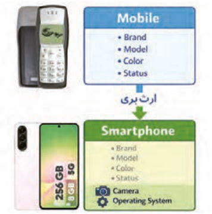

سپس کلاس‌های تخصصی‌تر براساس کلاس پایه ایجاد می‌شود. به این کلاس‌ها، کلاس فرزند (`Child` `class`) گفته می‌شود. برای نمونه، کلاس `Smartphone` که از کلاس `Mobile` ارث‌بری می‌کند، تمام ویژگی‌های کلاس `Mobile` را به‌صورت خودکار در اختیار دارد و می‌تواند علاوه بر آن، ویژگی‌ها و رفتارهای اختصاصی خود مانند سیستم‌عامل و دوربین را تعریف کند.

استفاده از این رویکرد نتایج زیر را به همراه دارد:

کاهش حجم کدنویسی افزایش خوانایی کد بهبود قابلیت نگه‌داری برنامه

**شکل 12**

در ادامه یک کلاس جدید به نام `SmartPhone` تعریف شده است که از کلاس `Mobile` ارث‌بری می‌کند.

کد شکل13 را ملاحظه بفرمایید.

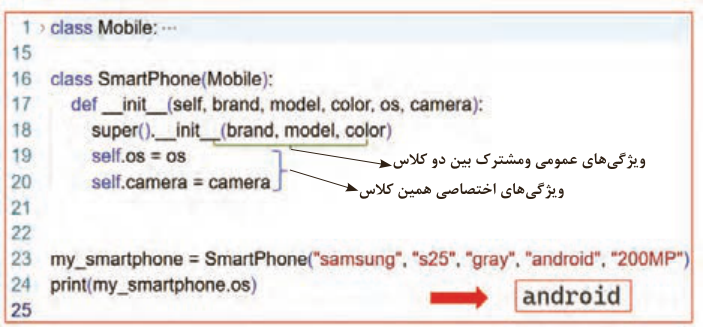

ویژگ‌یهای عمومی ومشترک بین دو کلاس ویژگ‌یهای اختصاصی همین کلاس

شکل 13 تعریف کلاس `SmartPhone`

خط 16: در این خط، کلاسی به نام `SmartPhone` تعریف می‌شود که از کلاس `Mobile` ارث‌بری می‌کند.

این یعنی کلاس `SmartPhone` علاوه بر ویژگی‌ها و متدهای خودش، تمام ویژگی‌ها و متدهای کلاس `Mobile` را ارث‌بری کرده و به آنها دسترسی دارد.

به کلاس `Mobile` در این حالت، کلاس والد (`Parent` `class` یا `Super` `class`) گفته می‌شود.

به کلاس `SmartPhone`، کلاس فرزند (`Child` `class`) گفته می‌شود.

در این خط، جلوی نام کلاس `SmartPhone` داخل پرانتز نام کلاس والد (`Parent` `class`) باید نوشته شود.

خط 17: در این خط، متد سازندۀ (`___init_`) کلاِس `SmartPhone` تعریف می‌شود.

این متد در زمان ساخته شدن یک نمونه جدید از کلاس `SmartPhone` به‌صورت خودکار اجرا می‌شود.


---

<!-- pdf-page: 252 | book-page: 246 -->

**صفحه ۲۴۶**

پارامترهای این سازنده شامل ویژگی‌های عمومی گوشی (`brand`، `model` و`color`) و همچنین ویژگی‌های اختصاصی گوشی هوشمند (`os` و `camera`) هستند.

خط 18: در این خط، سازنده کلاس والد (`Mobile`) با استفاده از تابع `super` فراخوانی می‌شود.

از متد `super` برای دسترسی به متدها و ویژگی‌های کلاس والد در مبحث وراثت استفاده می‌شود.

وقتی یک کلاس از کلاس دیگری ارث‌بری می‌کند، با استفاده از `super` می‌توان متدهای کلاس والد را فراخوانی کرد، بدون اینکه نام کلاس والد به‌صورت مستقیم نوشته شود.

دقت کنید در این دستور تنها ویژگی‌های مشترک کلاس فرزند و کلاس والد به متد `___init_` از کلاس والد ارسال شده است.

با این کار، مقداردهی اولیه ویژگی‌هایی که در کلاس`Mobile` تعریف شده‌اند انجام می‌گیرد.

دقت کنید اگر این خط از کد نوشته نشود، ویژگی‌های کلاس والد در کلاس فرزند، مقداردهی نمی‌شوند.

به این ترتیب، از تکرار کد جلوگیری شده و ویژگی‌های مشترک بین کلاس‌ها به شکل اصولی مدیریت می‌شوند.

خط 19: در این خط، ویژگی `os` برای نمونه جاری ساخته می‌شود و مقدار آن برابر با مقدار ورودی پارامتر `os` قرار می‌گیرد.

این ویژگی نشان‌دهنده سیستم‌عامل گوشی هوشمند است.

خط 20: در این خط، ویژگی `camera` برای نمونه جاری ساخته می‌شود و مقدار آن برابر با مقدار ورودی پارامتر `camera` قرار می‌گیرد.

این ویژگی مشخصات دوربین گوشی هوشمند را نگهداری می‌کند.

خط 23: در این خط، یک نمونه (`Instance`) از کلاس `SmartPhone` ساخته می‌شود.

در زمان ساخت این نمونه، متد سازنده کلاس `SmartPhone` اجرا شده و مقادیر ارسال‌شده به پارامترها اختصاص داده می‌شوند.

علاوه بر این، با استفاده از تابع `super`، سازنده کلاس والد (`Mobile`) اجرا می‌شود تا ویژگی‌های پایۀ گوشی، که در کلاس والد تعریف شده‌اند، مقداردهی شوند.

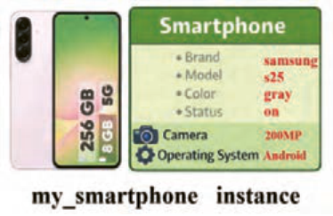

خط 24: در این خط، مقدار ویژگی `os` از نمونه `_my` `smartphone` خوانده شده و در خروجی برنامه چاپ می‌شود.

خروجی این دستور مقدار `"android"` خواهد بود.

**شکل 14**

### فعالیت

به برنامه فوق دستوراتی اضافه کنید تا سایر ویژگی‌های نمونه `my_smartphone` را چاپ کنید.


---

<!-- pdf-page: 253 | book-page: 247 -->

**صفحه ۲۴۷**

فراخوانی متدهای کلاس والد از طریق کلاس فرزند:

تا اینجا متوجه شدید که کلاس `SmartPhone` ویژگی‌های کلاس `Mobile` را به ارث برده است. اگر کد کلاس `SmartPhone` را مشاهده کنید، درون آن به‌جز متد `___init_` متد دیگری وجود ندارد. برای بررسی اینکه آیا از کلاس والد (`Parent`) متدها را هم به ارث برده است یا خیر، دستور زیر را در انتهای برنامه نوشته و برنامه را اجرا می‌کنیم:

```
brand: samsung model: s25 color: gray  )(my_smartphon.show_info
```

**شکل 15**

با مشاهده خروجی متوجه می‌شوید نمونه `my_smartphone` متد `show_info` را از کلاس `Mobile` به ارث برده است.

### فعالیت

به برنامه فوق دستوراتی اضافه کنید تا سایر متد‌های نمونه `my_smartphone` را فراخوانی و اجرا کند.

ایجاد متد مستقل از والد درون کلاس فرزند:

در اینجا یک سؤال مطرح می‌شود که آیا کلاس فرزند (`Child` `class`) می‌تواند خودش به‌صورت مستقل متد داشته باشد؟

پاسخ مثبت است. برای این منظور می‌توانید متدهای جدید و مستقل درون کلاس فرزند تعریف و از آنها استفاده کنید.

در ادامه به کلاس `SmartPhone` متدهای `take_picture` برای گرفتن عکس و `show_os_info` برای نمایش ویژگی نام سیستم عامل را اضافه می‌کنید. کد شکل 16 را به دقت نوشته و اجرا کنید.

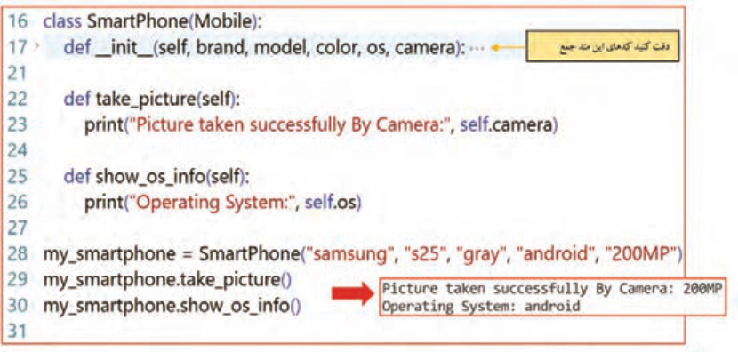

شکل 16 تعریف دو متد جدید درون کلاس `SmartPhone`


---

<!-- pdf-page: 254 | book-page: 248 -->

**صفحه ۲۴۸**

خطوط 22 و 23: در این خطوط، متد `take_picture` تعریف شده و درون آن یک پیغام مبنی بر موفقیت در گرفتن عکس چاپ شده است.

خطوط 25 و 26: در این خطوط، متد `show_os_info` تعریف شده و درون آن مشخصات ویژگی سیستم‌عامل چاپ شده است.

بازنویسی متد والد درون کلاس فرزند (`Method` `Override`) می‌دانید که در کلاس `Mobile` متدی با نام `show_info` تعریف شده است که اطلاعات عمومی گوشی را نمایش می‌دهد. حال اگر کلاسی مانند `SmartPhone` از کلاس `Mobile` ارث‌بری کند، این متد نیز به کلاس فرزند منتقل شده و بدون تغییر قابل استفاده خواهد بود.

در گوشی‌های هوشمند، علاوه بر اطلاعات عمومی، نمایش اطلاعات بیشتری مانند نام سیستم‌عامل و مشخصات دوربین اهمیت دارد. استفادۀ مستقیم از متد `show_info` کلاس والد برای کلاس `SmartPhone` کافی نیست و لازم است رفتار این متد متناسب با ویژگی‌های کلاس فرزند تغییر کند.

برای حل این مشکل، متد `show_info` در کلاس`SmartPhone` بازنویسی می‌شود. به این ترتیب، می‌توان ابتدا با دستور`super`() متد کلاس والد را اجرا کرد و سپس اطلاعات جدید مورد نیاز را نمایش داد. این کار باعث می‌شود در متد بازنویسی‌شدۀ کلاس فرزند، ابتدا دستورات متد والد اجرا شده و سپس دستورات جدید نوشته و اجرا شوند.

اکنون می‌توانید متد `show_info` را مطابق کد زیر در کلاس `SmartPhone` اضافه نمایید و نتیجۀ اجرای برنامه را مشاهده کنید.

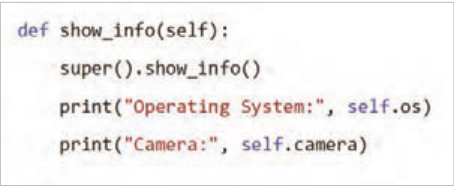

**شکل 17**

در خط اول کد، متدی با نام `show_info` درون کلاس `SmartPhone` تعریف شده است. نام این متد دقیقًا با نام متد موجود در کلاس والد یکسان است؛ به همین دلیل این متد به‌عنوان بازنویسی (`Override`) متد کلاس والد شناخته می‌شود.

در دومین خط، با استفاده از متد `super`، متد `show_info` از کلاس والد (`Mobile`) اجرا می‌شود. به این ترتیب، اطلاعات عمومی گوشی مانند برند، مدل و رنگ که در کلاس والد تعریف شده‌اند، در ابتدای همین متد نمایش داده می‌شوند.

در سومین خط، مقدار ویژگی `os` که مربوط به کلاس `SmartPhone` است، چاپ می‌شود. این ویژگی نشان‌دهندۀ نام سیستم‌عامل گوشی هوشمند می‌باشد و در کلاس والد وجود ندارد.

در آخرین خط، مقدار ویژگی `camera` نمایش داده می‌شود. این ویژگی نیز مخصوص کلاس `SmartPhone` بوده و مشخصات دوربین گوشی هوشمند را نشان می‌دهد.


---

<!-- pdf-page: 255 | book-page: 249 -->

**صفحه ۲۴۹**

بازنویسی متد والد در کلاس فرزند، به گونه‌ای که نام متد یکسان باقی بماند اما نحوۀ اجرای آن تغییر کند، بازنویسی متد یا `Method` `Override` نامیده می‌شود.

### فعالیت

با توجه به مطالبی که تا کنون فرا گرفته اید، کلاس `GamingPhone` را مطابق توضیحات زیر پیاده‌سازی کنید:

کلاس `GamingPhone` از کلاس `SmartPhone` ارث‌بری می‌کند.

این کلاس، علاوه بر ویژگی‌های به‌ارث‌رسیده از کلاس پایه `Mobile` و کلاس `SmartPhone`، شامل دو ویژگی اختصاصی زیر است:

`gpu:` نام پردازنده گرافیکی `vram:` میزان حافظه گرافیکی این کلاس، علاوه بر متدهای به‌ارث‌رسیده از کلاس‌های `Mobile` و `SmartPhone`، شامل متد زیر نیز می‌باشد:

متد `gaming_mode:` این متد هنگام فراخوانی، پیامی مناسب چاپ می‌کند که فعال بودن حالت بازی گوشی را نشان می‌دهد.

پیام چاپ‌شده می‌تواند شامل نام گوشی، نام پردازندۀ گرافیکی و میزان حافظۀ گرافیکی باشد.

تا اینجا با تعریف کلاس `Mobile` و ساخت نمونه‌هایی از آن آشنا شدید. همچنین دیدید که می‌توان به ویژگی‌های هر نمونه دسترسی داشت و مقدار آنها را تغییر داد. اما این پرسش مطرح می‌شود که آیا همۀ ویژگی‌های یک کلاس باید به‌صورت آزاد قابل تغییر باشند؟

ویژگی‌های عمومی (`Public`) در حالت عادی، ویژگی‌های یک کلاس، عمومی (`Public`) هستند. یعنی از هر بخش از برنامه می‌توان به آنها دسترسی داشت و مقدارشان را تغییر داد. برخی ویژگی‌ها حتی اگر به‌صورت عمومی تعریف شوند، مشکلی ایجاد نمی‌کنند؛ زیرا تغییر آنها باعث بروز خطای منطقی در برنامه نمی‌شود. در کلاس `Mobile` که قبلاً ساختیم، سه ویژگی `brand` ،`model` و `color` از این نوع هستند زیرا:

تغییر آنها خطرناک نیست.

نیازی به کنترل خاص ندارند.

بنابراین می‌توانند به‌صورت `Public` باقی بمانند.

حال فرض کنید ویژگی باتری گوشی را نیز به‌صورت عمومی تعریف کنید (برای سادگی، فرض کنید مقدار اولیه باتری 100% در نظر گرفته شده است):

```
self.battery = 100
```

در این حالت، می‌توان مقدار باتری را به شکل زیر تغییر داد:

```
my_mobile.battery = 150
my_mobile.battery = -20
```


---

<!-- pdf-page: 256 | book-page: 250 -->

**صفحه ۲۵۰**

این دستورات از نظر پایتون بدون خطا اجرا می‌شوند؛ اما از نظر منطقی مقادیر نامعتبری هستند. شارژ باتری یک تلفن همراه نمی‌تواند بیشتر از 100 درصد یا مقدار منفی داشته باشد.

مشکل اینجاست که ویژگی‌های کلاس به‌صورت آزاد در دسترس هستند و هیچ کنترلی بر نحوۀ تغییر آنها وجود ندارد. این موضوع می‌تواند باعث بروز خطاهای منطقی در برنامه شود و در برنامه‌های بزرگ، نگهداری و توسعۀ آن را دشوار کند.

برای حل این مشکل، می‌توان برخی ویژگی‌ها را به‌گونه‌ای تعریف کرد که دسترسی مستقیم به آنها از بیرون کلاس محدود شود و تغییر آنها فقط از طریق متدهای مشخص انجام گیرد. به این نوع ویژگی‌ها، ویژگی خصوصی (`Private`) گفته می‌شود.

ویژگی‌های خصوصی (`Private`) در پایتون، ویژگی‌های خصوصی با استفاده از دو زیرخط (_ _) در ابتدای نام آنها تعریف می‌شوند.

برای مثال، در کلاس `Mobile` می‌توان ویژگی باتری را به‌صورت زیر تعریف کرد:

```
self._ _battery = 100
```

با این کار:

دسترسی مستقیم به ویژگی از بیرون کلاس محدود می‌شود.

تغییر مقدار آن فقط از طریق متدهای کلاس امکان‌پذیر است.

کنترل منطقی روی داده‌ها برقرار می‌شود.

ویژگی‌های محافظت‌شده (`Protected`) در بخش‌های قبل دیدید که ویژگی‌های یک کلاس می‌توانند عمومی (`Public`) یا خصوصی (`Private`) باشند.

اما گاهی شرایطی وجود دارد که:

نمی‌خواهید یک ویژگی از بیرون کلاس مستقیمًا استفاده یا تغییر داده شود.

ولی می‌خواهید کلاس‌های فرزند بتوانند به آن ویژگی دسترسی داشته باشند.

برای چنین حالتی از ویژگی‌های محافظت‌شده (`Protected`) استفاده می‌شود. در زبان پایتون، اگر نام یک ویژگی با یک زیرخط (_) شروع شود، آن ویژگی به‌عنوان `Protected` در نظر گرفته می‌شود.

```
"self._status = "on
```

جدول ٣

سطح دسترسی

نحوه نوشتن

توضیح عمومی (`Public`)`battery`دسترسی آزاد از همه‌جا `_battery` _دسترسی فقط داخل همان کلاس

```
خصوصی (Private)
```

`_status`دسترسی از درون کلاس و کلاس‌های فرزند

محافظت‌شده (`Protected`)


---

<!-- pdf-page: 257 | book-page: 251 -->

**صفحه ۲۵۱**

این نوع نام‌گذاری نشان می‌دهد که ویژگی برای استفادۀ داخلی کلاس و کلاس‌های فرزند طراحی شده است و نباید مستقیمًا از بیرون کلاس تغییر داده شود.

### نکته

`Protected` در پایتون یک قرارداد برنامه‌نویسی است، نه یک محدودیت اجباری. یعنی پایتون جلوی دسترسی مستقیم را نمی‌گیرد، اما به برنامه‌نویس هشدار می‌دهد که این ویژگی نباید مستقیمًا از بیرون کلاس تغییر داده شود.

تا اینجا با سه سطح دسترسی به ویژگی‌های یک کلاس آشنا شدید:

سطوح دسترسی مختلف شامل ویژگی‌های عمومی، خصوصی و محافظت‌شده، به شما کمک می‌کنند تا دسترسی به داده‌های یک کلاس را کنترل کنید. به همین دلیل لازم است جزئیات داخلی کلاس‌ها پنهان شوند و دسترسی به داده‌ها به‌صورت کنترل‌شده انجام گیرد. این مفهوم در برنامه‌نویسی شیءگرا با عنوان کپسوله‌سازی (`Encapsulation`) شناخته می‌شود. کپسوله‌سازی به معنای:

پنهان‌سازی جزئیات داخلی یک کلاس و کنترل نحوۀ دسترسی به داده‌ها و رفتارهای آن می‌باشد و یکی از مفاهیم اصلی برنامه‌نویسی شیءگرا محسوب می‌شود.


---

<!-- pdf-page: 258 | book-page: 252 -->

**صفحه ۲۵۲**

### ارزشیابی شایستگی تولید برنامه شیء گرا

استاندارد عملکرد کار: هنرجو بتواند با به‌کارگیری مفاهیم شیء‌گرایی در پایتون، کلاس و شیء تعریف کند، وراثت و بازنویسی متدها را پیاده‌سازی نماید، سطوح دسترسی را مدیریت کند و رفتار کلاس‌ها را تا سطح مقدماتی متاکلاس تحلیل و اجرا کند به‌گونه‌ای که برنامه بدون خطا و با ساختار صحیح اجرا شود.

نمره

شرایط انجام کار (ابزار،مواد، تجهیزات،

ابزارهای

نتایج

ردیف

### مراحل کار

استاندارد (شاخص‌ها/داوری/نمره‌دهی)

کسب

زمان، مکان و ...)

### ارزشیابی

ممکن شده

1 تعریف صحیح کلاس و سازنده (`___init_`) بررسی فایل کد

2 ایجاد نمونه بدون خطای اجرایی 3 تغییر صحیح مقدار ویژگی‌ها 4 اجرای برنامه

3

نوشته‌شده،

و نمایش خروجی درست5 انجام کنجکاوی ها6 انجام مراحل به رو‌شهای دیگر

رایانه یا لپ‌تاپ سالم، نصب `Python` (نسخه `x.3`)، اجرای

1 تعریف صحیح کلاس و سازنده (`___init_`)

1ایجاد و کار با کلاس پایه

ویرایشگر کد (مانند `IDLE` یا `VS` `Code`) زمان

عملی برنامه

2 ایجاد نمونه بدون خطای اجرایی3 تغییر صحیح مقدار ویژگی‌ها4 اجرای

2

25دقیقه، اجرای فعالیت در کارگاه .

و مشاهده برنامه و نمایش خروجی درست خروجی، چک‌لیست

انجام ناقص مراحل1 عملکردی.

1 تعریف ویژگی با مقدار پیش‌فرض2 استفاده صحیح از _ و _ _ 3 درک محدودیت دسترسی و تحلیل خطا 4 رعایت قراردادهای نام‌گذاری 5 انجام

3

مشاهده

رایانه مجهز به `Python`، شامل کلاس با

کنجکاوی‌ها 6 انجام مراحل به روش‌های دیگر

مدیریت ویژگی‌ها و سطوح

عملی،

2

ویژگی‌های مختلف، زمان 15 دقیقه، محیط

دسترسی

تحلیل کد

1 تعریف ویژگی با مقدار پیش‌فرض 2 استفاده صحیح از _ و _ _ 3 درک

کارگاهی استاندارد.

محدودیت دسترسی و تحلیل خطا4 رعایت قراردادهای نام‌گذاری2 هنرجو انجام ناقص مراحل1

1 تعریف صحیح کلاس فرزند2 استفاده درست از 3 `super` انتقال صحیح ویژگی‌های والد 4 انجام کنجکاو‌یها 5 انجام مراحل به رو‌شهای دیگر3

رایانه با محیط اجرای `Python`، شامل کلاس

مشاهده

1 تعریف صحیح کلاس فرزند2 استفاده درست از 3 `super` انتقال صحیح

3پیاده‌سازی وراثت

ویژگی‌های والد2

والد، زمان 25 دقیقه، کلاس رایانه.

عملیات انجام ناقص مراحل1 تعریف متد جدید در کلاس فرزند2 بازنویسی صحیح متد والد (`Override`)

3

توسعه و بازنویسی رفتار

3 انجام کنجکاوی‌ها 4 انجام مراحل به روش‌های دیگر

کلاس‌ها

مشاهده

4

رایانه، زمان 25 دقیقه، محیط کارگاهی.

1 تعریف متد جدید در کلاس فرزند2 بازنویسی صحیح متد والد (`Override`)

شرایط انجام کار

عملی

2

انجام ناقص مراحل1

1 استفاده صحیح از ()2 `type` تشخیص تفاوت کلاس و نمونه3 تحلیل اجرای خروجی به صورت مفهومی 4 انجام کنجکاوی‌ها 5 انجام مراحل به رو‌شهای

3

دستورات دیگر

```
type()
```

رایانه مجهز به `Python`، زمان 15 دقیقه، محیط و تحلیل

5بررسی نوع و ساختار کلاس

1 استفاده صحیح از ()2 `type` تشخیص تفاوت کلاس و نمونه 3 تحلیل

کلاس عملی.

خروجی، خروجی به صورت مفهومی2 پرسش شفاهی تحلیلی انجام ناقص هر مرحله1


---

<!-- pdf-page: 259 | book-page: 253 -->

**صفحه ۲۵۳**

شایستگی‌های غیر فنی، ایمنی،

احراز همه شایستگی‌های غیرفنی2

بهداشت، توجهات زیست محیطی

عدم احراز هر یک از شایستگی‌های غیرفنی1

و نگرش:

بلی

ارزشیابی کار (شایستگی انجام کار)

خیر

### توضیحات:

1 معیار شایستگی انجام کار:

کسب حداقل نمره 2 از مراحل 1، 2، 3 و 4 (مراحل بحرانی) کسب حداقل نمره 2 از بخش شایستگی‌های غیرفنی، ایمنی، بهداشت، توجهات زیست‌محیطی و نگرش کسب حداقل میانگین 2 از مراحل کار

2 تعریف سطوح شایستگی: صرف‌نظر از اینکه یک تکلیف کاری در چه سطحی از صلاحیت حرفه‌ای انجام می‌شود، در هر محیط کاری ممکن است انجام هر کار با کیفیت مشخصی مورد انتظار باشد. سطح شایستگی انجام کار، معیار اساسی ارزشیابی است.

مهارت (سطح سه): ماهر و قادر به آموزش و هدایت دیگران، توانایی برنامه‌ریزی و تحلیل، پاسخ‌گویی در برابر کارهای خود، سروکار داشتن با سطح وسیعی از کارها و فعالیت‌ها تسلط (سطح چهار): خبرگی در انجام کار و آموزش دیگران، ایجاد نوآوری، سازگاری، عیب‌یابی، هدایت و راهنمایی دیگران.
