# توسعه برنامه شیء‌گرا


---

<!-- pdf-page: 260 | book-page: 254 -->

**صفحه ۲۵۴**

## واحد یادگیری 2

## توسعه برنامه شیء‌گرا

### آیا تابه‌حال اندیشیده‌اید

چرا نمی‌توان همیشه از متغیرها برای نگهداری اطلاعات استفاده کرد؟

چه تفاوتی بین «ذخیره موقت اطلاعات در حافظه (`RAM`)» و «ذخیره در فایل» وجود دارد؟

اگر چند بار برنامه را اجرا کنید و هر بار در فایل بنویسید، چه اتفاقی برای محتوای قبلی می‌افتد؟

چه زمانی استفاده از فایل متنی ساده کافی است و چه زمانی بهتر است از `JSON` استفاده کنید؟

اگر مسیر فایل اشتباه باشد، برنامه چگونه باید رفتار کند؟

اگر قرار باشد یک برنامه فروشگاهی طراحی کنید، چه اطلاعاتی باید در فایل ذخیره شود و چرا؟

### در پایان از هنرجو انتظار می‌رود

1 از کلاس `"Path"` و ماژول `"pathlib"` برای مدیریت مسیرها (`Path` `Objects`) استفاده کند.

2 محتوای فایل‌های متنی را بخواند و داده‌ها را در آنها بنویسد، اضافه کند و فایل‌ها را ایمن ببندد.

3 داده‌ها را از چندین فایل بخواند، محتوای آنها را ترکیب کند و با استفاده از حلقه‌ها، مجموعه‌ای از فایل‌ها را پردازش نماید.

4 خطاهای رایج مانند `"FileNotFoundError"` و `"ZeroDivisionError"` را تشخیص داده و با استفاده از `"try/except"` از توقف برنامه جلوگیری کند و پیام‌های خطای مناسب نمایش دهد.

5 ساختار `"JSON"` را درک کرده و داده‌ها را با استفاده از `json.loads`() بخواند و با `json.dump`() در فایل بنویسد.

### استاندارد عملکرد

هنرجو باید بتواند با استفاده از شیء `Path` به‌صورت ایمن و دقیق عملیات ایجاد، خواندن، نوشتن و مدیریت فایل‌های متنی و `JSON` را انجام دهد و خطاها و استثناهای احتمالی را به‌درستی کنترل کند.


---

<!-- pdf-page: 261 | book-page: 255 -->

**صفحه ۲۵۵**

### آشنایی با فایل در پایتون

در این واحد یادگیری با کار با فایل‌ها و ذخیره‌سازی داده‌ها آشنا می‌شوید تا برنامه‌های شما کاربردی‌تر و پایدارتر شوند. می‌آموزید چگونه داده‌ها را ذخیره و بازیابی کنید و با استفاده از مدیریت استثناها از توقف برنامه در شرایط غیرمنتظره جلوگیری نمایید.

همچنین با ماژول `json` آشنا خواهید شد که امکان نگهداری اطلاعات کاربران را فراهم می‌کند.

فرض کنید برنامه‌ای برای ثبت مخاطبین یک تلفن همراه نوشته‌اید. اگر برنامه را اجرا کنید و چند مخاطب وارد کنید، تا زمانی که برنامه باز است اطلاعات در حافظه نگهداری می‌شوند. اما اگر برنامه بسته شود، تمام اطلاعات از بین می‌روند.


برای اینکه اطلاعات به‌صورت دائمی ذخیره شوند و بعداً بتوانید دوباره به آنها دسترسی داشته باشید، لازم است از فایل‌ها استفاده کنید.

فایل‌ها امکان ذخیره اطلاعات روی حافظه جانبی (مانند هارد دیسک) را فراهم می‌کنند.

**شکل 18**

کار با فایل اطلاعات زیادی در فایل‌های متنی ذخیره می‌شوند؛ مثل نمرات دانش‌آموزان، لیست قیمت‌ها، داده‌های آب و هوا،ترافیک، یا متن یک داستان. برای اینکه یک برنامه بتواند از این اطلاعات استفاده کند، باید فایل را بخواند. اولین گام برای استفاده از یک فایل متنی، این است که فایل را وارد حافظه برنامه کنید، بعد از آن می‌توانیدکل فایل را یک‌جا بخوانید یا آن را خط‌به‌خط بررسی کنید. خواندن فایل به برنامه کمک می‌کند تا اطلاعات را تحلیل، نمایش یا تغییر دهد.


**شکل 19**


---

<!-- pdf-page: 262 | book-page: 256 -->

**صفحه ۲۵۶**

ایجاد فایل متنی ابتدا یک فایل متنی به نام `mobile_bransd.txt` بسازید و برندها را در آن بنویسید (هر برند دریک خط):

خواندن کل فایل در پایتون برای خواندن کل محتویات فایل از کتابخانه `pathlib` استفاده کنید.


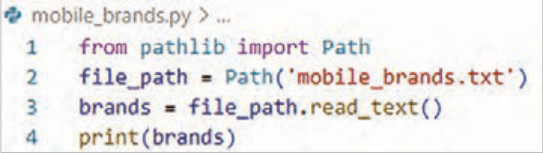

**شکل 20**

توضیح کد:

```
from pathlib import Path
```

این خط کلاس `Path` را از کتابخانۀ `pathlib` وارد می‌کند. `Path` ابزاری برای کار با مسیر فایل‌ها و پوشه‌ها است و استفاده از آن ساده‌تر و امن‌تر از `open` معمولی است.

```
path = Path('mobile_brands.txt')
```

در اینجا `path` یک کلاس است که برای مدیریت مسیر فایل‌ها ساخته شده است. با نوشتن:

```
path = Path('mobile_brands.txt')
```

یک نمونه (`object`) از کلاس `Path` ساخته می‌شود. این نمونه می‌داند که فایل `mobile_brands.txt` کجاست، ولی هنوز خود فایل باز نشده یا خوانده نشده به عبارت ساده: `path` فقط نشانی فایل روی رایانه را نگه می‌دارد.

وقتی می‌نویسید `path.read_text`() آن وقت فایل باز و خوانده می‌شود، یک `Path` `object` ساخته شده است که به فایل `mobile_brands.txt` اشاره می‌کند. چون این فایل در همان پوشه‌ای است که فایل پایتون (`.py`) قرار دارد، فقط نام فایل کافی است. اگر فایل در پوشه‌ای دیگر بود، باید مسیر کامل یا نسبی آن را بدهید.

```
brnds = path.read_text()
```

با متد `read_text` کل محتوای فایل خوانده می‌شود. نتیجه به‌صورت یک رشته (`string`) در متغیر `contents` ذخیره می‌شود. هر خط فایل در رشته با کاراکتر `\n` جدا شده است.


---

<!-- pdf-page: 263 | book-page: 257 -->

**صفحه ۲۵۷**

محتویات `brands` درخروجی چاپ می‌شود.

```
print(brands)
```

خروجی مثال:


**شکل 21**

حذف خط خالی اضافی: گاهی `read_text`() یک خط خالی اضافی در انتهای فایل ایجاد می‌کند. برای حذف آن می‌توانید از متد `rstrip` استفاده کنید.

```
brands = brands.rstrip()
```

حالا خروجی تمیز و بدون خط خالی نمایش داده می‌شود.

مسیرهای نسبی و مطلق فایل‌ها آدرس نسبی و مطلق مانند داشتن یک نقشه دقیق برای دسترسی به فایل‌های شماست. آدرس مطلق تضمین می‌کند که برنامه شما روی هر سیستمی، دقیقاً همان فایل را پیدا کند؛ اما آدرس نسبی به شما کمک می‌کند کدی بنویسید که بدون تغییر، در هر پوشه‌ای جابجا شود و باز هم فایل‌های مورد نیازش را بیابد.

وقتی نام فایلی مثل `mobile_brands.txt` را به `Path` می‌دهید، پایتون در پوشه‌ای که فایل در حال اجرا (یعنی برنامه `.py` شما) در آن قرار دارد، جستجو می‌کند.گاهی اوقات، بسته به نحوه سازماندهی کارهایتان، فایلی که می‌خواهید باز کنید ممکن است در همان پوشه برنامه شما نباشد. مثلاًً، شاید برنامه‌هایتان را در پوشه‌ای به نام `py_progs` و داخل آن پوشه‌ای به نام `text_files` برای جدا کردن فایل‌های متنی از برنامه‌ها نگهداری کنید. با اینکه `text_files` داخل `py_progs` است، اگر فقط نام فایلی را در `text_files` به `Path` بدهید، کار نمی‌کند؛ چون پایتون فقط در `py_progs` جستجو می‌کند و متوقف می‌شود؛ به `text_files` نگاه نمی‌کند. برای اینکه پایتون بتواند فایل‌ها را از پوشه‌ای غیر از پوشه برنامه شما باز کند، نیاز به مسیر صحیح دارید.


**شکل 22**


---

<!-- pdf-page: 264 | book-page: 258 -->

**صفحه ۲۵۸**

دو راه برای مشخص کردن مسیر فایل‌ها در برنامه‌نویسی وجود دارد:

1 آدرس نسبی (`Relative` `File` `Path`): این آدرس به پایتون می‌گوید که مکان مورد نظر را نسبت به پوشه برنامه در حال اجرا پیدا کند. از آنجایی که `text_files` داخل `py_progs` است، باید مسیری بسازید که با پوشه `text_files` شروع شود و به نام فایل ختم شود. نحوه ساخت این مسیر این‌گونه است:

```
path = Path('text_files/filename.txt')
```

2 آدرس مطلق (`Absolute` `File` `Path`): در این نوع آدرس دهی شما می‌توانید دقیقاً به پایتون بگویید فایل در کجای رایانه شما قرار دارد، صرف نظر از اینکه برنامه در حال اجرا کجاست. اگر آدرس نسبی کار نکرد، می‌توانید از آدرس مطلق استفاده کنید. مثلاًً، اگر `text_files` را در پوشه‌ای غیر از `py_progs` قرار داده‌اید، دادن آدرس `'text_files/filename.txt'` کافی نیست؛ چون پایتون آن را فقط داخل `python_work` جست‌وجو می‌کند. در این حالت، باید آدرس مطلق را بنویسید تا مشخص شود پایتون کجا را جست‌وجو کند. آدرس‌های مطلق معمولاً بلندتر هستند، چون از پوشه ریشه سیستم عامل شروع می‌شوند:

```
path = Path('/home/eric/py_progs/text_files/filename.txt')
```

با استفاده از آدرس‌های مطلق، می‌توانید فایل‌ها را از هر نقطه‌ای در سیستم خود بخوانید. برای شروع، ساده‌ترین کار این است که فایل‌ها را در همان پوشه برنامه خودتان یا در پوشه‌ای مانند `text_files` درون پوشه برنامه نگهداری کنید.

### نکته

سیستم‌های ویندوز هنگام نمایش مسیر فایل‌ها از بک‌اسلش (\) به جای اسلش (/) استفاده می‌کنند، اما شما همیشه در کد خود از اسلش (/ ) استفاده کنید، حتی در ویندوز. کتابخانه `pathlib` به طور خودکار هنگام تعامل با سیستم عامل شما، نمایش صحیح مسیر را به کار می‌گیرد.

کار با محتویات فایل بعد از خواندن فایل متنی، محتوای آن در برنامه به‌صورت یک رشته (`string`) در اختیارشما قرار می‌گیرد.

تبدیل محتوا به لیست: برای اینکه بتوانید روی هر برند تلفن همراه جداگانه کارکنید، لازم است متن فایل را به لیستی از خطوط تبدیل کنید.

حالا هر برند یک عضو از لیست است و می‌توانید با آن کارکنید.

-)(`splitlines` رشته متنی را به لیستی از خطوط تقسیم می‌کند.

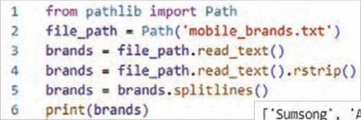


**شکل 23**


---

<!-- pdf-page: 265 | book-page: 259 -->

**صفحه ۲۵۹**

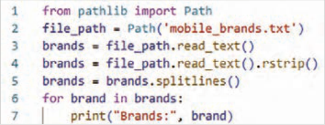


**شکل 24**

شمارش داده‌ها: مثلاً تعداد برندهای موجود در فایل:

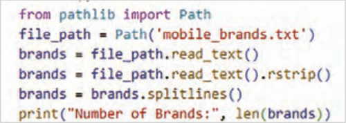


**شکل 25**

### فعالیت

برنامه را به نحوی تغییر دهید که بتوانید تعداد کاراکترهای هر برند را مشاهده کنید.

جست‌وجو در محتویات فایل بررسی اینکه آیا یک برند خاص در فایل وجود دارد یا نه:

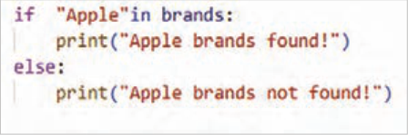


**شکل 26**


---

<!-- pdf-page: 266 | book-page: 260 -->

**صفحه ۲۶۰**

پیمایش خطوط فایل با حلقه `for`

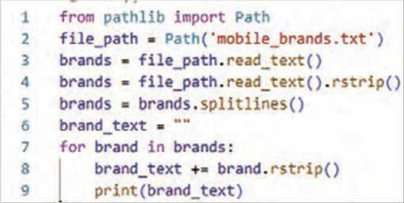


**شکل 27**

### فعالیت

کد‌های برنامه را به نحوی تغییردهید که بعد از نام هر برند یک جداکننده قرار گیرد.

نوشتن در فایل: نوشتن یک خط پس از تعیین مسیر، می‌توانید با استفاده از متد () `write_text` در یک فایل متنی بنویسید. برای دیدن نحوۀ کار این تابع، یک پیام ساده نوشته و آن را به جای چاپ روی صفحه، در فایل متنی ذخیره کنید (شکل ٧٢):

پس از نوشتن برنامه و اجرای آن، خروجی در ترمینال مشاهده نمی‌کنید. حالا فایل `mobile_brands.txt` را باز کنید. مشاهده می‌کنید متن شما در فایل نوشته و محتویات قبلی آن پاک شده است.

اگر فایل از قبل وجود داشته باشد، ()`write_text` محتوای فعلی فایل را پاک کرده و محتوای جدید را در فایل می‌نویسد.

متد ()`write_text` چند کار را در پشت صحنه انجام می‌دهد. اگر فایلی که مسیر به آن اشاره می‌کند وجود نداشته باشد، آن فایل را ایجاد می‌کند.

همچنین، پس از نوشتن رشته در فایل، مطمئن می‌شود که فایل به درستی بسته شده است. فایل‌هایی که به درستی بسته نشده‌اند می‌توانند منجر به از دست رفتن یا خراب شدن داده‌ها شوند.

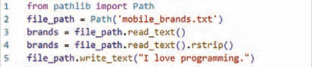

**شکل 28**

### نکته

دو متد `read_text` و `write_text` به‌طور داخلی مدیریت بستن فایل را انجام می‌دهند. در این حالت‌ها، `pathlib` خودش تضمین می‌کند که فایل به‌طور ایمن باز و سپس بسته شود.


---

<!-- pdf-page: 267 | book-page: 261 -->

**صفحه ۲۶۱**

اضافه کردن برند جدید برای نوشتن بیش از یک خط در یک فایل، باید رشته‌ای بسازید که شامل کل محتوای فایل باشد و سپس () `write_text` را با آن رشته فراخوانی کنید.

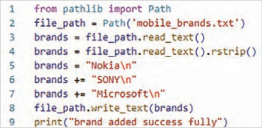

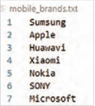

**شکل 29**

### فعالیت

دو برند دیگر`"LG"` و`"Motorola"` را به فایل `"mobile_brands.txt"` اضافه کنید.

### فعالیت

برنامه‌ای بنویسیدکه در یک حلقه مدل تلفن‌های همراه را از کاربر بپرسد. وقتی پاسخ می‌دهد، آنها را در فایلی به نام `"mobile_model.txt"` بنویسد. هر مدل در یک خط از فایل ظاهر شود.

مدیریت استثناها (`Exceptions`) در هنگام اجرای برنامه، ممکن است خطاهایی رخ دهند که باعث توقف برنامه شوند. پایتون برای برخورد با این خطاها از سازوکاری به نام استثنا (`Exception`) استفاده می‌کند.


هر وقت پایتون در اجرای برنامه با مشکلی روبه‌رو شود و نداند چه باید بکند، یک «شیء استثنا» ایجاد می‌کند.

اگر برنامه‌نویس کدی برای مدیریت آن استثنا نوشته باشد، برنامه بدون توقف به کار خود ادامه می‌دهد. اما اگر استثنا مدیریت نشده باشد، اجرای برنامه متوقف و پیغامی شامل نوع خطا و محل آن نمایش داده می‌شود که به آن ردیابی (`Traceback`) می‌گویند.

**شکل 30**


---

<!-- pdf-page: 268 | book-page: 262 -->

**صفحه ۲۶۲**

مدیریت خطای اشتباه درنوع داده: گاهی برنامه‌نویس اشتباهًا داده‌ای از نوع نادرست وارد می‌کند. مثًًلا وقتی می‌خواهد رشته‌ای (متن) را به عدد تبدیل کند اما مقدارش فقط متن باشد، خطای `ValueError` پیش می‌آید:

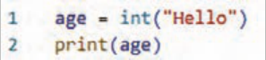

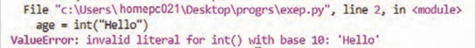

**شکل 31**


مدیریت خطای تقسیم بر صفر: یکی از خطاهای رایج در برنامه‌نویسی، تقسیم عدد بر صفر است. این کار از نظر ریاضی ممکن نیست و پایتون سعی می‌کند برنامه را ادامه دهد ولی این کار ممکن نیست، پس برنامه متوقف و پایتون چیزی به اسم ردیابی برگشتی یا همان `Traceback` نشان می‌دهد.

**شکل 32**

یعنی وقتی پایتون با چنین دستوری روبه‌رو می‌شود، استثنایی به نام `ZeroDivisionError` ایجاد می‌کند.

یعنی: خطا دقیقاً در کدام خط پیش آمده است. چه نوع خطایی بوده است (مثلاًً `ZeroDivisionError` یا `ValueError`). و تابع یا بخشی از کد که باعث خطا شده است را نشان می‌دهد.

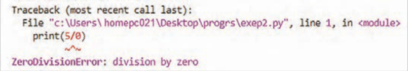

**شکل 33**

از این اطلاعات می‌توانید برای اصلاح برنامه استفاده کنید. به پایتون بگویید که هنگام وقوع این نوع استثنا چه کاری انجام دهد. به این ترتیب، اگر دوباره اتفاق بیفتد، آماده خواهید بود.

مدیریت خطا با بلوک‌های `try-except:` برای مدیریت استثناها در پایتون از بلوک‌های `try` و `except` استفاده می‌شود.

بخش `try` شامل دستوری است که ممکن است خطا ایجاد کند.

بخش `except` مشخص می‌کند اگر خطایی رخ داد، برنامه چه واکنشی نشان دهد.

با استفاده از این روش، می‌توانید برنامه‌هایی بنویسید که به جای نمایش پیام‌های پیچیده و گیج‌کننده، پیام‌های قابل فهم به کاربر نشان دهد.


---

<!-- pdf-page: 269 | book-page: 263 -->

**صفحه ۲۶۳**

مدیریت خطای اشتباه درنوع داده: در این‌جا پایتون نمی‌تواند کلمه `"Hello"` را به عدد تبدیل کند، پس استثنا تولید می‌شود، اما برنامه با استفاده از بلوک `try-except` کنترل خطا را در دست می‌گیرد.

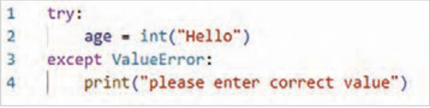

**شکل 34**

در اینجا پایتون نمی‌تواند عدد 5 را بر عدد 0 تقسیم کند، پس استثنا تولید می‌شود، اما برنامه با استفاده از بلوک `try-except` کنترل خطا را در دست می‌گیرد.

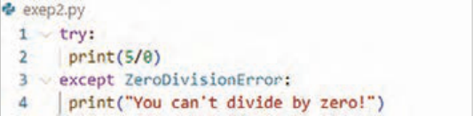

**شکل 35**

استفاده از استثنائات برای جلوگیری از خطا: مدیریت صحیح استثناها (خطاها) زمانی اهمیت حیاتی پیدا می‌کند که برنامه پس از وقوع خطا، همچنان کارهای دیگری برای انجام دادن داشته باشد. این موقعیت به‌ویژه در برنامه‌هایی که به طور مداوم از کاربر ورودی دریافت می‌کنند، رایج است. اگر برنامه بتواند به ورودی نامعتبر به شیوه‌ای مناسب پاسخ دهد، به‌جای متوقف شدن و از کار افتادن، می‌تواند به‌طور هوشمندانه ورودی‌های معتبرتری را از کاربر درخواست کند و به اجرای خود ادامه دهد.

برای یادگیری این موضوع توضیحاتی که در ادامه آمده است را با دقت بخوانید و انجام دهید.

این برنامه از کاربر می‌خواهد که عدد اول را وارد کند و اگر کاربر برای خروج `q` را وارد نکند، عدد دوم را وارد می‌کند.

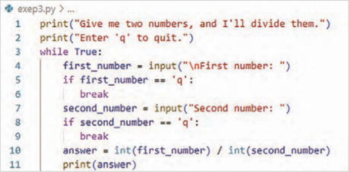

**شکل 36**


---

<!-- pdf-page: 270 | book-page: 264 -->

**صفحه ۲۶۴**

سپس این دو عدد را بر هم تقسیم می‌کند تا به جواب برسد.

این برنامه هیچ کاری برای مدیریت خطاها انجام نمی‌دهد، اگر کاربر عدد دوم را صفر واردکند، درخواست تقسیم بر صفر باعث از کار افتادن آن می‌شود:

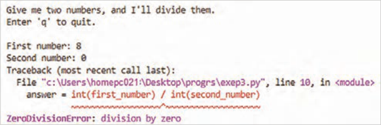

**شکل 37**

### نکته

اگرچه توقف ناگهانی برنامه (`crash`) قطعًا بد است، اما نمایش جزئیات فنی خطا (`Traceback`) نیز ایده خوبی نیست. این جزئیات برای کاربران معمولی سردرگم‌کننده است و در محیط‌های مخرب، اطلاعات ارزشمندی را در اختیار مهاجمان قرار می‌دهد. مهاجم با دیدن `Traceback`، نه تنها نام برنامه شما را می‌فهمد، بلکه می‌تواند بخشی از منطق کد را که دچار نقص شده‌است، مشاهده‌کند. یک مهاجم حرفه‌ای می‌تواند از این اطلاعات برای فهمیدن اینکه دقیقاً چه نوع حملاتی را باید علیه کد شما به کار ببرد، استفاده کند.

کاربرد `The` `else` `Block:` وقتی در پایتون از دستورات `try` و `except` استفاده کنید، در واقع به مفسر (رایانه) می‌گویید: "یک کار را امتحان کن، و اگر خراب شد، این کار جایگزین را انجام بده." حالا، بلوک `else` دقیقًا به چه دردی می‌خورد؟


`else` یعنی: "فقط و فقط در صورتی این کار را انجام بده که بلوک `try` کاملاً، بدون هیچ خطایی، موفقیت‌آمیز بود."

**شکل 38**


---

<!-- pdf-page: 271 | book-page: 265 -->

**صفحه ۲۶۵**

اگر خطایی در بلوک `try` (مثلاًً تقسیم عدد بر صفر) رخ دهد، پایتون مستقیم به بلوک `except` می‌رود و بلوک `else` کاملاً نادیده گرفته می‌شود. این قابلیت کمک می‌کند، کدی را که فقط پس از موفقیت کامل اجرا شود (مثلاًً نمایش نتیجه نهایی یا ذخیره در فایل)، از کدی که فقط برای تست خطا نوشته شده جدا کنید. این کار برنامه را هم تمیزتر و هم منطقی‌تر می‌کند.

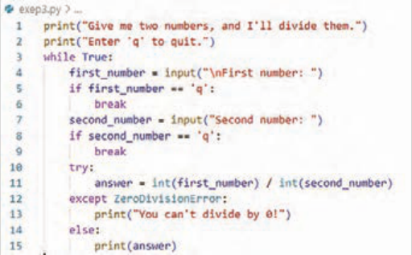

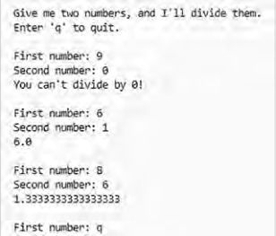

**شکل 39**


مدیریت خطای `File` `Not` `Found` `Error:` این خطا یکی از رایج‌ترین استثناهایی است که برنامه‌نویسان هنگام کار با فایل‌ها با آن روب‌هرو می‌شوند. دلایل متعددی برای این خطا وجود دارد: مسیر اشتباه، نام فایل غلط، یا حذف شدن فایل.

بلوک `try-except` اجازه می‌دهد که کد را اجرا کنید و در صورت بروز این مشکل خاص، به جای متوقف شدن برنامه، یک واکنش مناسب نشان دهید.

**شکل 40**

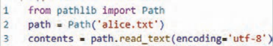

در مثال برنامه تلاش می‌کند فایلی را که اصًلا وجود ندارد بخواند.

**شکل 41**


---

<!-- pdf-page: 272 | book-page: 266 -->

**صفحه ۲۶۶**

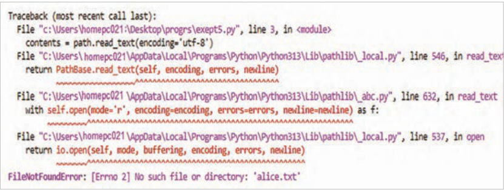

**شکل 42**

توجه داشته باشید که از متد ()`read_text` کمی متفاوت از آنچه قبلاً دیدید استفاده شده است. آرگومان `encoding` زمانی ضروری است که کدگذاری پیش‌فرض سیستم شما با کدگذاری فایلی که در حال خواندن آن هستید مطابقت نداشته باشد. این وضعیت به احتمال زیاد هنگام خواندن فایلی رخ می‌دهد که روی سیستم شما ایجاد نشده باشد.

پایتون نمی‌تواند از یک فایلی که وجود ندارد بخواند، بنابراین یک استثنا (`Exception`) ایجاد می‌کند (به عبارتی، خطا صادر می‌کند).

بنابراین برای مدیریت خطایی که ایجاد می‌شود، بلوک `try` با خطی که در `traceback` به عنوان مشکل‌ساز شناسایی شده است، آغاز می‌شود.

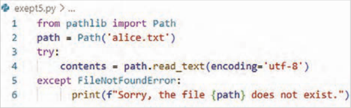

**شکل 43**

در مثال کد خط ٤ که شامل ()`read_text` است باعث بروز خطا شده است.

در این مثال، کد موجود در بلوک `try` خطای `FileNotFoundError` تولید می‌کند، بنابراین یک بلوک `except` که با خطا مطابقت دارد، باید نوشته شود. سپس پایتون کد موجود در آن بلوک را زمانی که فایل پیدا نمی‌شود اجرا می‌کند و نتیجه به جای یک `traceback`، یک پیام خطای کاربرپسند است:


**شکل 44**


---

<!-- pdf-page: 273 | book-page: 267 -->

**صفحه ۲۶۷**

حالا اگر فایل `alice.txt` را ایجاد کنید و آن را در پوشه مناسب قرار دهید این بار بلوک `try` اجرا خواهد شد.

برنامه فایل را پیدا می‌کند و وارد بلوک `else` می‌شود.

متن آلیس در سرزمین عجایب را واردکنید، پایتون متن فایل را به‌عنوان یک رشته طولانی درنظر می‌گیرد.

برای تولید لیستی از تمام کلمات موجود در کتاب، از متد رشته‌ای استفاده کنیدکه به طور پیش‌فرض یک رشته را در هر جایی که فضای خالی پیدا کند، تقسیم می‌کند.

برای شمارش تعداد این کلمات از )(`len` استفاده کنید.

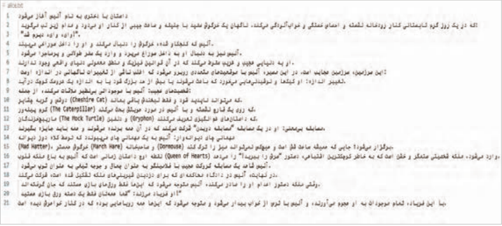

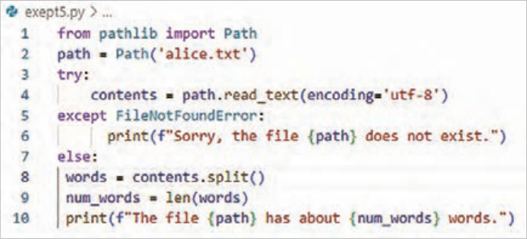


**شکل 45**


---

<!-- pdf-page: 274 | book-page: 268 -->

**صفحه ۲۶۸**

کار با چند فایل کار با چند فایل یکی از مهارت‌های مهم است، چون تقریباً هیچ برنامه واقعی فقط با یک فایل کار نمی‌کند.

کار با چند فایل یعنی برنامه بتواند بدون تکرار کد:

چندین فایل را پشت هم بخواند و روی همه آنها یک عملیات مشابه انجام دهد. پس لازم است یک تابع تعریف کنید و همچنین خطاها هم مدیریت و سپس نتایج ذخیره شوند.

برای انجام این کارکتاب‌های بیشتری را برای تحلیل اضافه کنید.

برای اینکه اجرای تحلیل روی چندین کتاب مختلف ساده‌تر و منظم‌تر شود بهتر است، بخش اصلی برنامه را به یک تابع به نام `count_word` منتقل کنید. اگر کدها را با برنامه قبل مقایسه کنید، متوجه می‌شوید تغییرات شامل اصلاح تو رفتگی و انتقال به بدنه تابع است.

خط 2: تابع `def` `count_words`(`path`) یک ورودی به نام `path` می‌گیرد که مسیر یک فایل متنی است.

خط 11: این خط از کد نام فایل‌ها به‌صورت رشته‌های متنی (`String`) در یک لیست به نام`filenames` ذخیره می‌کند.

```
]'filenames = ['alice.txt','moby_dick.txt','little_women.txt
```

خط 12: در این خط ازیک حلقه `for` برای بررسی تک‌تک فایل‌های داخل لیست و به دست آوردن تعداد کلمات متن فایل استفاده شده است.

خط 13: نام فایل به یک شیء از نوع `Path` تبدیل می‌شود.

خط 14: تابع `count_words` برای آن فایل اجرا می‌شود.

و اگر فایلی وجود نداشته باشد، برنامه خطا نمی‌دهد و پیام مناسب نمایش می‌دهد.

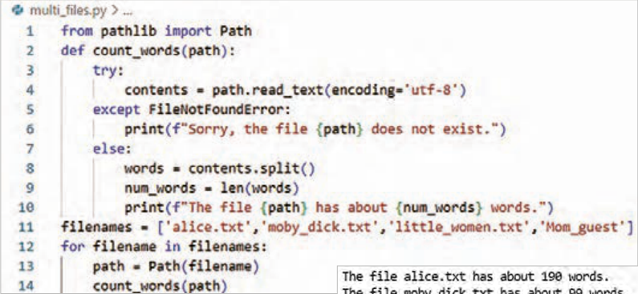

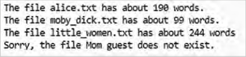

**شکل 46**


---

<!-- pdf-page: 275 | book-page: 269 -->

**صفحه ۲۶۹**

نادیده گرفتن خطا (`Failing` `Silently`) در مثال قبلی، به کاربر اطلاع داده می‌شد که یکی از فایل‌ها در دسترس نیست. با این وجود، در همه برنامه‌ها نیازی نیست تمام خطاهای رخ‌داده به کاربر نمایش داده شود.

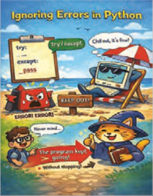

در این حالت، خطا رخ می‌دهد، اما هیچ‌گونه پیامی به کاربر نمایش داده نمی‌شود و روند اجرای برنامه بدون وقفه ادامه می‌یابد.

برای پیاده‌سازی این حالت، از ساختار `try-except` استفاده می‌شود. با این تفاوت که در بخش `except` به‌صورت صریح به مفسر پایتون دستور داده می‌شود هیچ عملی انجام ندهد. پس دستور`print` بعد از `except` را حذف کنید تاپیام خطا نمایش داده نشود و به جای آن دستور `pass` را اضافه کنید.

**شکل 47**

در زبان برنامه‌نویسی پایتون، دستور `pass` برای خالی نگه‌داشتن یک بلوک کد و انجام ندادن هیچ‌گونه عملی به کار می‌رود.


اگر فایل وجود نداشته باشد، خطا رخ می‌دهد، اما هیچ پیامی نمایش داده نمی‌شود، برنامه متوقف نمی‌شود و اجرای برنامه ادامه پیدا می‌کند.

**شکل 48**

### فعالیت

همان‌طور که در برنامه تقسیم عدد بر صفر دیدید با یک پیام خطا کاربر از خطای تقسیم بر صفر آگاه می‌شد. این برنامه را به نحوی تغییر دهید که هرگاه مخرج یک تقسیم صفر بود بدون توقف برنامه، پیامی هم نمایش داده نشود.

ذخیره‌سازی داده‌ها در بیشتربرنامه‌ها، مثل تنظیمات دلخواه کاربری برای یک بازی یا داده‌هایی برای نمایش نمودار، اطلاعاتی از کاربران دریافت می‌شود. صرف نظر از نوع آنها، اطلاعات وارد شده در ساختارهای داده‌ای مانند لیست‌ها و دیکشنری‌ها ذخیره می‌شوند. اما وقتی برنامه بسته می‌شود، این داده‌ها از بین می‌روند. برای حفظ اطلاعات برای دفعات بعد اجرای برنامه‌ها می‌توانید آنها را در فایل ذخیره کنید. یکی از ساده‌ترین روش‌ها برای این‌کار، استفاده از فایل‌های `JSON` است که کمک می‌کنند داده‌های پایتون به‌صورت متنی ذخیره و در اجرای بعدی برنامه دوباره خوانده‌شوند. این قالب مخصوص پایتون نیست و در زبان‌های برنامه‌نویسی دیگر نیز کاربرد دارد. در پایتون برای کار با `JSON` از ماژول`json` استفاده می‌شود.

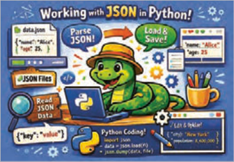

**شکل 49**


---

<!-- pdf-page: 276 | book-page: 270 -->

**صفحه ۲۷۰**

`json.dump`() داده‌ها را به قالب `JSON` تبدیل می‌کند و `json.loads`() داده‌های ذخیره شده را دوباره به ساختارهای پایتون برمی‌گرداند.

فایل‌های`JSON` به دلیل سادگی، خوانایی و کاربردگسترده یکی از روش‌های مهم ذخیره‌سازی داده‌ها در برنامه‌نویسی هستند.

ذخیره یک لیست در فایل `JSON` توضیح کد:

خط 2 ماژول `json` وارد برنامه شده‌است.

خط 3 لیستی از برندهای تلفن همراه برای ذخیره‌سازی ایجاد شده است.

خط 5 با استفاده از تابع `dump`، داده‌های مورد نظر به قالب `JSON` تبدیل شده‌است. خروجی این تابع یک رشته متنی است که نمایانگر داده‌ها به‌صورت `json` است

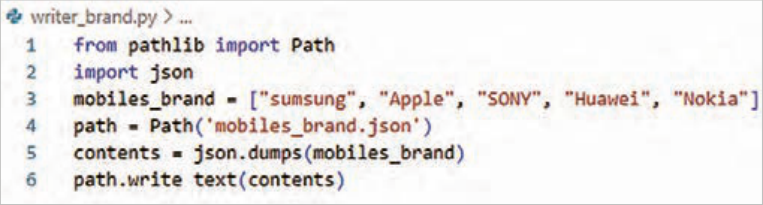

**شکل 50**

خط 6 این رشته متنی با استفاده از متد `write-text` داخل فایل ذخیره می‌شود.

این برنامه خروجی در صفحه نمایش ندارد، اما اگر فایل `mobiles_brand.json` را باز کنید خواهید دید که داده‌ها به شکلی ذخیره شده‌اند که بسیار شبیه به ساختار داده‌ها در پایتون است.

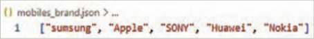

**شکل 51**

خواندن داده‌ها از فایل `JSON` برای برگرداندن اطلاعات ذخیره شده در فایل`JSON` به حافظه، لازم است برنامه‌ای دیگر نوشت.

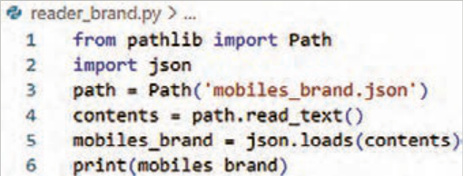


**شکل 52**


---

<!-- pdf-page: 277 | book-page: 271 -->

**صفحه ۲۷۱**

توضیح کد:

خط 2 ابتدا ماژول `json` وارد برنامه شده است.

خط3 سپس محتوای فایل `JSON` را خوانده و به‌صورت یک رشته متنی ذخیره شده است.

خط 4 از آنجا که فایل `JSON` در اصل یک فایل متنی با قالب مشخص است، با استفاده از متد `read_text`() خوانده شده است.

خط 5 در مرحله بعد با استفاده از تابع `loads`، این رشته متنی به ساختار داده‌ای مناسب در پایتون تبدیل شده است. در این برنامه، داده‌ها دوباره به‌صورت یک لیست از اعداد در حافظه ذخیره می‌شوند.

پس از این مرحله، می‌توانید از داده‌ها مانند سایر لیست‌های پایتون استفاده کنید. به این ترتیب اطلاعاتی که قبلاً در فایل `JSON` ذخیره شده بودند، در اجرای بعدی برنامه دوباره قابل استفاده خواهند بود.

مثال: برنامه‌ای بنویسید که مشخصات فنی یک گوشی هوشمند (شامل برند، مدل، مقدار رم و وضعیت گارانتی) را در قالب یک دیکشنری تعریف کند. سپس این برنامه باید:

با استفاده از کتابخانه `json` و کلاس `Path` از کتابخانه `pathlib` این دیکشنری را در فایلی به‌نام

```
mobile_specs.json ذخیره کند.
```

در مرحله بعد، فایل را باز کرده، محتوا را خوانده و فقط «مدل» و «مقدار رم» گوشی را در خروجی چاپ کند.

### فعالیت

خطوط کد برنامه را با کمک هنرآموز محترم خود توضیح دهید.

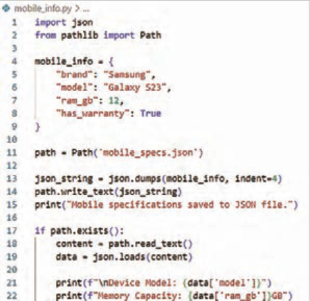

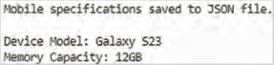


---

<!-- pdf-page: 278 | book-page: 272 -->

**صفحه ۲۷۲**

### فعالیت

در کد نوشته شده قرار است اطلاعات آب‌وهوای یک شهر را در فایل ذخیره و سپس آن را بازخوانی کند.

بخش‌هایی از کد که با علامت _________ مشخص شده است را با دستورات صحیح پر کنید.

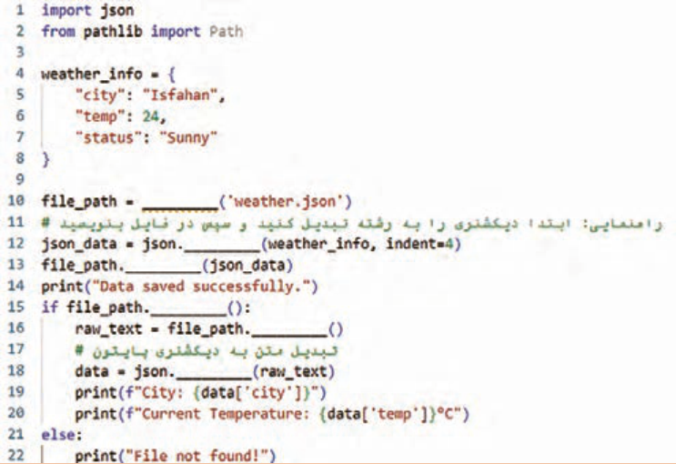


---

<!-- pdf-page: 279 | book-page: 273 -->

**صفحه ۲۷۳**

### ارزشیابی شایستگی توسعه برنامه شیء گرا

استاندارد عملکرد کار: هنرجو باید بتواند با استفاده از شیء `Path` به‌صورت ایمن و دقیق عملیات ایجاد، خواندن، نوشتن و مدیریت فایل‌های متنی و `JSON` را انجام دهد و خطاها و استثناهای احتمالی را به‌درستی کنترل کند.

نمره

شرایط انجام کار (ابزار،مواد، تجهیزات،

ابزارهای

نتایج

ردیف

### مراحل کار

استاندارد (شاخص‌ها/داوری/نمره‌دهی)

کسب

زمان، مکان و ...)

### ارزشیابی

ممکن شده

مشاهده درک مفهوم فایل و شیء `Path` ایجاد فایل و نوشتن محتوا انجام کنجکاوی‌ها انجام مراحل با روش‌های دیگر3 نصب توسط درک مفهوم فایل و شیء `Path` ایجاد فایل و نوشتن محتوا2 هنرجو، تمرین عملی

رایانه با `Python` `3.x`، ویرایشگر کد (`VS` `Code/`

ایجاد و خواندن فایل با

1

بررسی کد

`Path`

15 دقیقه

و اجرای برنامه، انجام ناقص مراحل1 مشاهده خروجی، پرسش کوتاه خواندن خطوط فایل با `splitlines` حذف خطوط خالی انجام کنجکاوی‌ها اجرای انجام مراحل با روش‌های دیگر3 برنامه و بررسی خواندن فایل بدون خطا خواندن خطوط فایل با ()`splitlines` حذف خطوط خالی2

پردازش و پیمایش خطوط

حذف

2

فایلهمانند مرحله ۱

خطوط خالی و انجام ناقص مراحل1 پیمایش صحیح اجرای استخراج کلمات از خطوط افزودن محتوا به فایل انجام کنجکاوی‌ها انجام مراحل با روش‌های دیگر3 برنامه و بررسی

3استخراج و افزودن محتواهمانند مرحله ۱

استخراج کلمات از خطوط افزودن محتوا به فایل2 استخراج و افزودن انجام ناقص مراحل1 محتوا اجرای جستجو در فایل نوشتن تابع پردازش شرطی انجام کنجکاوی‌ها انجام مراحل با روش‌های دیگر3 برنامه و نمایش

4جستجو و فیلتر محتواهمانند مرحله ۱

جستجو در فایل نوشتن تابع پردازش شرطی2 خطوط مطابق انجام ناقص مراحل1 شرط

```
درک try except و else مدیریت FileNotFoundError و Fail
```

اجرای `Safe` انجام کنجکاوی ها انجام مراحل با روش‌های دیگر3 برنامه، بررسی

```
درک try except و else مدیریت FileNotFoundError و Fail
```

مدیریت استثنا و امنیت

5

`2Safe`

عملیات فایلهمانند مرحله ۱

کنترل خطا و پیام‌های انجام ناقص مراحل1 خطا


---

<!-- pdf-page: 280 | book-page: 274 -->

**صفحه ۲۷۴**

تبدیل داده‌ها به `JSON` و ذخیره در فایل خواندن فایل `JSON` و تبدیل اجرای برنامه، مجدد به لیست انجام کنجکاوی‌ها

3

بررسی انجام مراحل با روش‌های دیگر

6

کار با `JSON` و `Path`همانند مرحله 1

صحت تبدیل داده‌ها به `JSON` و ذخیره در فایل خواندن فایل `JSON` و تبدیل ذخیره و مجدد به لیست2 بازیابی

`JSON`

انجام ناقص مراحل1

شایستگی‌های غیر فنی، ایمنی،

احراز همه شایستگی‌های غیرفنی2

بهداشت، توجهات زیست محیطی

عدم احراز هر یک از شایستگی‌های غیرفنی1

و نگرش:

بلی

ارزشیابی کار (شایستگی انجام کار)

خیر

### توضیحات:

1 معیار شایستگی انجام کار:

کسب حداقل نمره 2 از مراحل 1، 2، 3، 5 و 6 (مراحل بحرانی) کسب حداقل نمره 2 از بخش شایستگی‌های غیرفنی، ایمنی، بهداشت، توجهات زیست‌محیطی و نگرش کسب حداقل میانگین 2 از مراحل کار

2 تعریف سطوح شایستگی: صرف‌نظر از اینکه یک تکلیف کاری در چه سطحی از صلاحیت حرفه‌ای انجام می‌شود، در هر محیط کاری ممکن است انجام هر کار با کیفیت مشخصی مورد انتظار باشد. سطح شایستگی انجام کار، معیار اساسی ارزشیابی است.

مهارت (سطح سه): ماهر و قادر به آموزش و هدایت دیگران، توانایی برنامه‌ریزی و تحلیل، پاسخ‌گویی در برابر کارهای خود، سروکار داشتن با سطح وسیعی از کارها و فعالیت‌ها تسلط (سطح چهار): خبرگی در انجام کار و آموزش دیگران، ایجاد نوآوری، سازگاری، عیب‌یابی، هدایت و راهنمایی دیگران.
