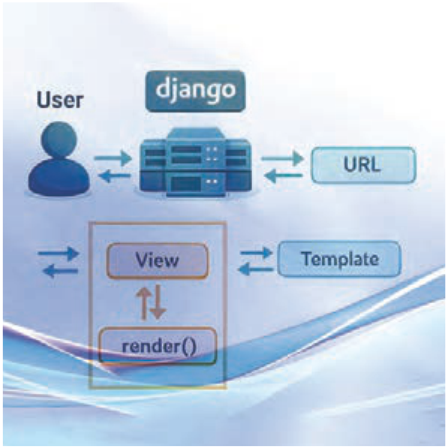

# پودمان پنجم

---

<!-- pdf-page: 281 | book-page: 275 -->

**صفحه ۲۷۵**

# پودمان پنجم

## برنامه‌نویسی جنگو

تا حالا فکر کرده‌اید سایت‌هایی مثل اینستاگرام، دیوار یا کافه‌بازار چطور ساخته شده‌اند؟

وقتی وارد یک سایت می‌شوید و اطلاعاتی مثل وضعیت آب‌وهوا، پست‌ها، پیام‌ها یا قیمت‌ها را می‌بینید، پشت‌صحنۀ این سایت‌ها چه اتفاقی می‌افتد؟

در پودمان‌های قبل، شما با مفهوم برنامه‌نویسی آشنا شده‌اید و کدهایی نوشته‌اید که روی رایانه خودتان اجرا می‌شوند.

اما در دنیای واقعی، برنامه‌نویسی فقط به اجرای برنامه روی یک سیستم محدود نمی‌شود.

وب‌سایت‌ها، فروشگاه‌های اینترنتی، شبکه‌های اجتماعی، سامانه‌های آموزشی و حتی بسیاری از اپلیکیشن‌های تلفن همراه، همگی به یک بخش بسیار مهم به‌نام `backend` متصل هستند. منظور از `backend` برنامه‌نویسی سمت سرور است جایی که منطق اصلی برنامه، پردازش داده‌ها، ارتباط با پایگاه‌داده و مدیریت کاربران انجام می‌شود.

در این پودمان با ابزاری قدرتمند با نام جنگو (`Django`) آشنا می‌شوید.
