# ایجاد وب اپلیکیشن


---

<!-- pdf-page: 282 | book-page: 276 -->

**صفحه ۲۷۶**

## واحد یادگیری ١

## ایجاد وب اپلیکیشن

### آیا تابه‌حال اندیشیده‌اید

وب سایت با وب اپلیکیشن چه تفاوت‌هایی دارد؟

چگونه می‌توانید یک وب اپلیکیشن بسازید؟

یک وب اپلیکیشن چطور با کاربر تعامل می‌کند؟

### در پایان از هنرجو انتظار می‌رود

1 با مزایای جنگو آشنا شود.

2 ساختار یک پروژه جنگو را درک کند.

3 روند کار جنگو، جهت تعامل با کاربر را درک کرده و درباره آن استدلال نماید.

4 مفهوم `url` ،`view` و `template` در جنگو را درک کند.

5 هنرجو بتواند به‌صورت عملی یک وب اپلیکیشن ساده را پیاده‌سازی کند.

### استاندارد عملکرد

هنرجو باید با درک صحیحی که از ساختار جنگو کسب کرده است، بتواند یک وب اپلیکیشن ساده را در رایانه خود پیاده‌سازی کند.


---

<!-- pdf-page: 283 | book-page: 277 -->

**صفحه ۲۷۷**

جنگو چیست؟

جنگو (`Django`) یک `framework` منبع‌باز (`open` `source`) است که با زبان برنامه‌نویسی `Python` نوشته و برای ساخت و پیاده‌سازی بخش `backend` وب‌سایت‌ها (`Website`) و وب اپلیکیشن‌ها (`Web` `Application`) استفاده می‌شود.

جدول 1 مقایسه وب‌سایت و وب اپلیکیشن

معیار

وب‌سایت (`Website`)

```
وب اپلیکیشن (Web Application)
```

هدف اصلی

اطلاع‌رسانی و نمایش محتوا

انجام عملیات و پردازش داده

تعامل کاربر

کم یا تقریبًا یک‌طرفه

زیاد و دوطرفه

نیاز به لاگین

معموًلا ندارد

معموًلا دارد

پردازش سمت سرور

کم

زیاد

وابستگی به `backend`

کم یا متوسط

بسیار زیاد

تغییر محتوا توسط کاربر

معموًلا ندارد

دارد

مثال‌ها

سایت خبری، سایت شرکتی، بلاگپنل کاربری، فروشگاه آنلاین، سامانه

آموزشی

مزایای جنگو جنگو یک `framework` امن و سریع است که قابلیت‌های آمادۀ زیادی را در اختیار برنامه‌نویس قرار می‌دهد.

به همین دلیل، سرعت توسعۀ نرم‌افزار در جنگو بسیار بالاست.

در پروژه‌های جنگو، با افزایش تعداد کاربران نیز می‌توان تنها با اعمال تغییراتی اندک، همچنان یک وب‌سایت سریع و امن داشت.

یکی دیگر از مزایای جنگو، وجود مستندات (راهنمای) جامع و همچنین یک جامعۀ بزرگ و فعال از برنامه‌نویسان است. این یعنی اگر هنگام کار با جنگو با مشکلی مواجه شوید، با یک جست‌وجوی ساده در اینترنت می‌توانید راه‌حل‌ها و توضیحات زیادی از سوی برنامه‌نویسان دیگر پیدا کنید.


از دیگر مزیت‌های مهم جنگو، وجود فرصت‌های شغلی فراوان در حوزۀ پایتون و `framework` جنگو است که آن را به گزینه‌ای مناسب برای یادگیری و ورود به بازار کار تبدیل می‌کند.

شرکت‌های بزرگی در دنیا و ایران از

شکل 1 شرکت‌هایی که از جنگو استفاده کرده‌اند

جنگو استفاده کرده‌اند.


---

<!-- pdf-page: 284 | book-page: 278 -->

**صفحه ۲۷۸**

### کنجکاوی

در مورد شرکت‌های ذکر شده تحقیق کنید.

پروژه نهایی این کتاب در پایان این کتاب، با استفاده از جنگو یک وب اپلیکیشن واقعی نمایش وضعیت آب‌وهوا طراحی خواهد شد (شکل 2).

در این پروژه کاربر می‌تواند نام یک شهر را جهت نمایش وضعیت آب‌وهوا انتخاب و مشاهده نماید.

این وب اپلیکیشن اطلاعات آب‌وهوا را به‌صورت آنلاین دریافت کرده و نتیجه را به‌صورت لحظه‌ای نمایش می‌دهد.

پروژه به شما کمک می‌کند یاد بگیرید جنگو در عمل چگونه کار می‌کند و یک وب‌سایت چگونه ساخته می‌شود.

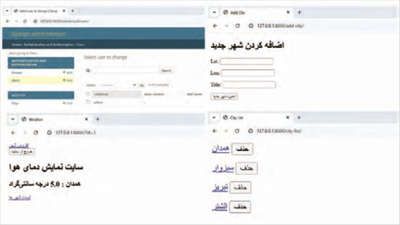

شکل 2 بخش‌هایی از پروژه نهایی

نصب جنگو ابتدا مطمئن شوید آخرین نسخه پایتون روی رایانه شما نصب باشد و رایانه به اینترنت متصل باشد. برای این کار وارد برنامه `Vscode` شده اگر از قبل فایل یا پوشه‌ای باز بود با دستور `Close` `Folder` از منوی `File` آن را ببندید سپس از منوی `terminal`، یک ترمینال جدید باز کنید.

در ادامه همانند شکل 3 درون قسمت ترمینال دستورات را به‌ترتیب اجرا نمایید.


---

<!-- pdf-page: 285 | book-page: 279 -->

**صفحه ۲۷۹**

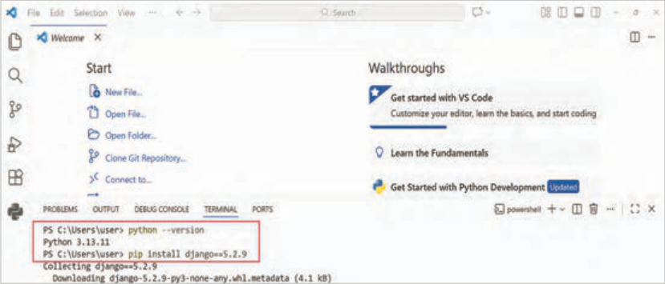

شکل 3 نصب جنگو نسخه5.2.9

نمایش پیام `Successfully` `installed` `Django-5.2.9` نشان‌دهنده نصب موفقیت‌آمیز جنگو است.

درصورتی‌که پیغام نصب موفقیت‌آمیز جنگو را مشاهده نکردید، از هنرآموز خود راهنمایی بگیرید.

می‌توانید آخرین نسخه منتشر شده جنگو را هم نصب کنید، فقط باید در سایت `pypi.org` و صفحه جنگو، نسخه پایتون سازگار را به‌دست آورید.

```
وارد آدرس https://pypi.org/project/Django شوید و در بخش Programming Language نسخه‌های
```

پایتون پشتیبانی شده جنگو را مشاهده کنید (شکل 4).

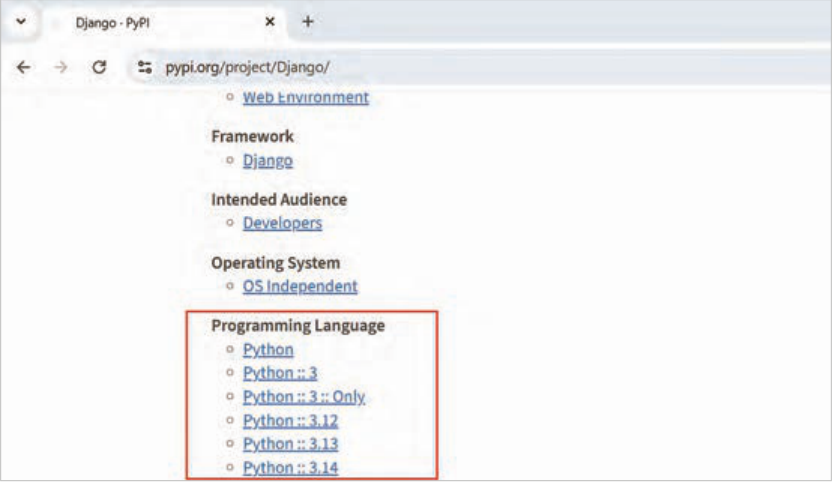

شکل 4 نسخه‌های پایتون مناسب برای جنگو


---

<!-- pdf-page: 286 | book-page: 280 -->

**صفحه ۲۸۰**

### ایجاد پروژه آب‌وهوا

در `Vscode` از منو `File` گزینه `Open` `Folder` را کلیک کنید. سپس یک‌پوشه جدید با نام `meteo` در مسیر دلخواه ایجاد کرده و پوشه `meteo` ساخته شده را باز کنید (شکل 5):

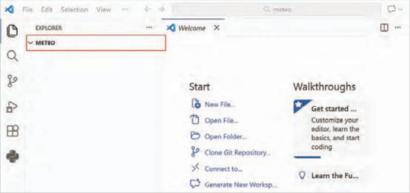

شکل 5 باز کردن پوشه `meteo`

دوباره ترمینال را باز و دستور زیر را اجرا کنید (شکل 6):

```
.django-admin startproject config
```

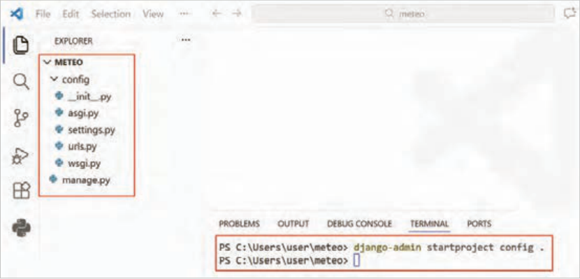

شکل 6 ایجاد پروژه


---

<!-- pdf-page: 287 | book-page: 281 -->

**صفحه ۲۸۱**

دستور قبل، پوشه پروژه را با نام `Config` در مسیر جاری ایجاد می‌کند که حاوی فایل تنظیمات `settings.py` و فایل‌های اصلی پروژه است. حرف نقطه در انتهای دستور فوق به معنی مسیر جاری است.

آشنایی با برخی فایل‌های اصلی پروژه فایل`settings.py:` تنظیمات اصلی پروژه در این فایل قرار می‌گیرند.

فایل`urls.py:` هرگاه کاربر وارد یک آدرس (`URL`) شود، این فایل تعیین می‌کند که سایت کدام صفحه یا بخش را نمایش دهد.

### کنجکاوی

در مورد کاربرد فایل‌های دیگر موجود در پروژه تحقیق کنید.

اجرای پروژه جنگو دستور زیر را در ترمینال اجرا نمایید.

```
python manage.py runserver
```

دستور `runserver` یک وب سرور (`web` `server`) مجازی کوچک برای پروژه جنگو راه‌اندازی می‌کند، این وب سرور فقط مخصوص برنامه‌نویس جنگو است تا بتواند پروژه جنگو را در رایانه خودش اجرا کند (شکل 7).

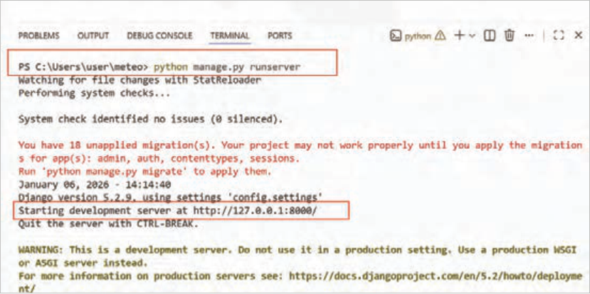

شکل 7 راه‌اندازی موفق وب سرور جنگو


---

<!-- pdf-page: 288 | book-page: 282 -->

**صفحه ۲۸۲**

بعد از اجرای دستور، یک فایل با نام `db.sqlite3` کنار فایل `manage.py` ساخته می‌شود. این فایل، پایگاه‌داده پیش‌فرض جنگو است. جنگو از این فایل برای مدیریت پایگاه‌داده و جداول استفاده می‌کند.

همان‌طوری که در شکل 7 مشخص شده است، می‌توانید سایت خود را در آدرس `http://127.0.0.1:8000` مشاهده کنید.

با تایپ آدرس فوق درون نوار آدرس مرورگر، صفحه اصلی سایت را مشابه شکل 8 مشاهده می‌کنید. ممکن است به‌دلیل نسخه‌های متفاوت جنگو تصویر متفاوتی مشاهده کنید.

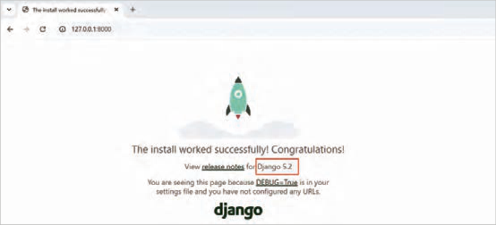

شکل 8 اجرای موفقیت‌آمیز سایت

آدرس `ip` که جنگو روی آن اجرا می‌شود، 127.0.0.1 است. این آدرس به آدرس `local` معروف است. این `ip` به رایانه جاری اشاره می‌کند، یعنی همین رایانه‌ای که سرور جنگو را روی آن اجرا کرده‌اید. اگر رایانه شما در یک شبکه قرار داشته باشد، رایانه‌های دیگر نمی‌توانند با این آدرس، به رایانه شما متصل شوند.

### کنجکاوی

بررسی کنید، برای پروژه‌هایی که در بستر اینترنت در حال استفاده هستند، از چه وب‌سرورها و چه پایگاه داده‌هایی استفاده می‌شود؟

ساخت اولین `app` در جنگو یک پروژه جنگو می‌تواند شامل یک یا چندین `app` (اپلیکیشن) باشد. پروژه‌ای که با دستور `startproject` ایجاد کردید، هنوز `app` ندارد. در جنگو می‌توانید برای وظایف مستقل یک `app` ایجاد کنید.

فرض کنید پروژه شما یک کارخانه در دنیای واقعی است، واحدهای تولید کارخانه هر‌کدام می‌توانند مانند یک `app` باشند. به‌عنوان‌مثال، واحدی که وظیفه رنگ‌کردن خودرو را بر‌عهده دارد، مستقل از واحدهای دیگر می‌تواند عمل کند. کافی است یک خودرو به این واحد تحویل شود و رنگ درخواستی مشخص شود. این واحد کار خود را انجام داده و خودرو را رنگ شده تحویل می‌دهد.

هر `app` وظیفه خاصی انجام می‌دهد و باید به‌صورتی ایجاد گردد که قابلیت استفاده مجدد داشته باشد، یعنی یک `app` را بتوان در پروژه دیگری استفاده کرد و همان وظیفه را به‌خوبی انجام دهد.


---

<!-- pdf-page: 289 | book-page: 283 -->

**صفحه ۲۸۳**

برای ساخت `app` از دستور `startapp` استفاده می‌شود، ابتدا سرور جنگو را متوقف کرده (با `ctrl` + `c`) و سپس دستور زیر را اجرا کنید.

```
python manage.py startapp weather
```

یک‌پوشه با نام `weather` ساخته می‌شود. پوشه `weather` در حقیقت یک `app` جنگویی است که وظیفه نمایش وضعیت آب‌وهوای شهر موردنظر را برعهده دارد.

پس از ساخت `weather` `app` ساختار پروژه همانند شکل 9 خواهد بود.

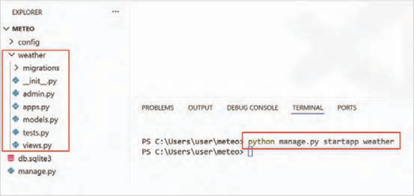

شکل 9 محتوای `weather` `app`

معرفی `app` ایجاد شده به جنگو در `settings.py` در این مرحله، لازم است `app` ساخته شده به جنگو معرفی شود. برای این کار فایل `settings.py` را باز کنید و `weather` را مطابق شکل 10 به انتهای لیست `INSTALLED_APPS` اضافه کنید.

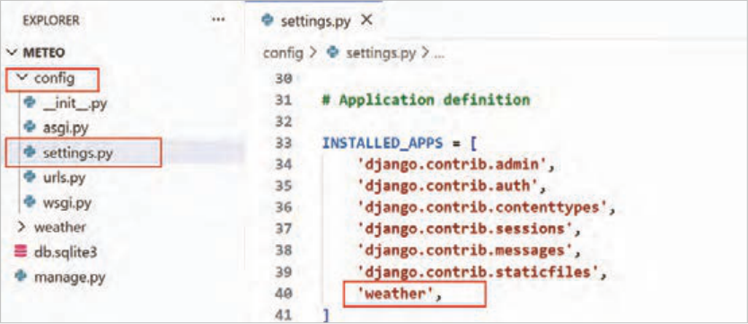

شکل 10 اضافه‌کردن `weather` به `installed_apps`


---

<!-- pdf-page: 290 | book-page: 284 -->

**صفحه ۲۸۴**

ساخت اولین `view` هر `view` که در فایل `views.py` است، برحسب وظیفه‌اش، با کاربر تعامل می‌کند، پس برای نمایش دمای یک شهر، یک `view` باید ساخته شود.

فایل‌های `View` در جنگو مسئول پاسخ‌گویی به درخواست کاربران هستند، یعنی `Request` کاربر را بعد از مسیریابی می‌گیرند و به آن درخواست یک پاسخ درست می‌دهند.

مرحله اول: فایل `views.py` را باز کنید. یک تابع با نام `show_temp_view` همانند شکل 11 اضافه کنید:

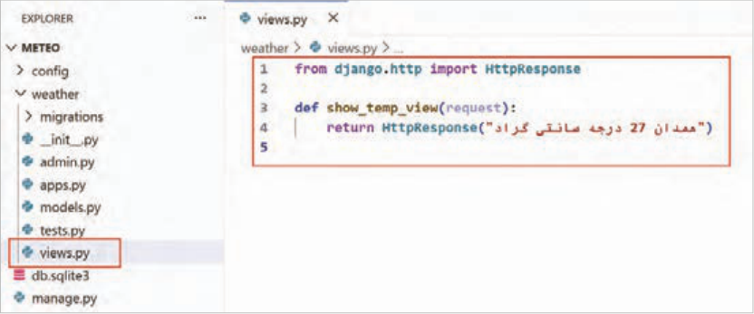

شکل 11 ایجاد `view` با نام `show_temp_view`

### توضیحات کدها:

خط 1: کلاس `HttpResponse` از ماژول `http` وارد (`import`) شده است.

خط 3: یک تابع با نام `show_temp_view` ایجاد شده است. هر `view` در جنگو، تابعی است که باید پارامتر `request` را داشته باشد.

خط 4: یک `object` از نوع `HttpResponse` ایجاد شده است. `HttpResponse` محتوای نهاییِ ارسال‌شده به مرورگر را در خود نگهداری می‌کند و مشخص می‌کند کاربر چه چیزی از سرور دریافت کند.

تابع `show_temp_view` در فایل `views.py` فقط یک متن ساده، نمایش خواهد داد.

فایل را ذخیره نمایید و سرور جنگو را با `python` `manage.py` `runserver` راه‌اندازی کنید.

آدرس صفحه اصلی را وارد کنید، باز هم صفحه خوشامدگویی را می‌بینید. پس لازم است تغییراتی اعمال کنید تا در صفحه اصلی سایت، به‌جای خوشامدگویی متن «همدان 27 درجه سانتی‌گراد» نمایش داده شود.

فایل `urls.py` در پوشه `config` را باز کنید (شکل 12).


---

<!-- pdf-page: 291 | book-page: 285 -->

**صفحه ۲۸۵**

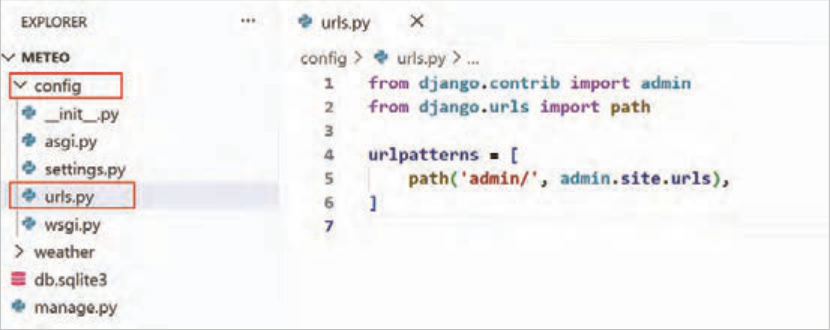

شکل 12 فایل `urls.py`

بعد از ایجاد پروژه، فایل `urls.py` نیز کنار `settings.py` ایجاد می‌شود. هرگاه کاربر وارد یک آدرس (`URL`) شود، این فایل تعیین می‌کند که سایت کدام صفحه یا بخش را نمایش دهد.

### توضیحات کدها:

خط 4: جنگو از یک لیست با نام `urlpatterns` برای مدیریت آدرس صفحات سایت استفاده می‌کند.

خط 5: هر عضو از `urlpattrns` یک `path` است که معادل آدرس یک صفحه در سایت است. به‌صورت پیش‌فرض یک `path` برای صفحه پنل ادمین جنگو با مقدار `/admin` وجود دارد که معادل آدرس `http://127.0.0.1:8000/admin` در مرورگر است.

آدرس `http://127.0.0.1:8000/admin` را در مرورگر باز کنید. صفحه ورود به پنل ادمین همانند شکل 13 از شما نام کاربری و رمز عبور را درخواست می‌کند. در ادامه روش ساخت نام کاربری و رمز عبور را خواهید آموخت.

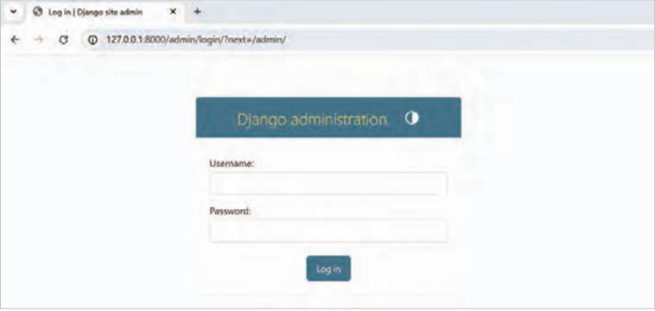

شکل 13 صفحه ورود به پنل ادمین


---

<!-- pdf-page: 292 | book-page: 286 -->

**صفحه ۲۸۶**

مرحله دوم: دوباره وارد فایل `urls.py` شده و تغییراتی همانند شکل 14 در فایل اعمال کنید.

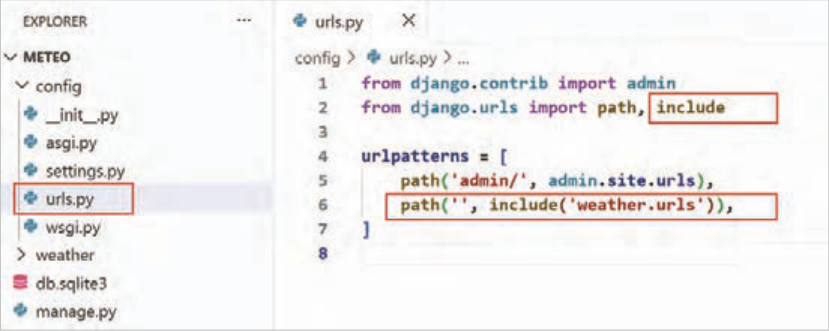

شکل 14 اضافه‌کردن `path` جدید

### توضیحات کدها:

خط 2: ماژول `include` وارد (`import`) شده است.

خط 6: یک `path` جدید اضافه شده است. اولین آرگومان تابع `path` در این دستور فقط یک‌رشته خالی است و به این معناست که اگر در آدرس (`URL`) رسیده به سرور جنگو، جلوی آدرس سایت هیچ عبارتی درج نشده بود، با استفاده از ماژول `include` به سراغ فایل `urls.py` در `weather` `app` بروید و کار را از آنجا ادامه دهید. در واقع این خط، درخواست‌های صفحۀ اصلی را به `weather` `app` ارسال می‌کند.

مرحله سوم: وارد پوشه `weather` شده و برای `weather` `app` یک `urls.py` همانند شکل 15 ایجاد کنید.

هر `app` می‌تواند یک `urls.py` اختصاصی داشته باشد.

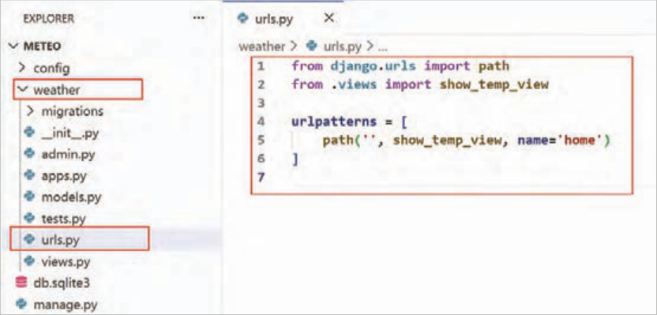

شکل 15 ایجاد فایل `urls.py` برای `app`


---

<!-- pdf-page: 293 | book-page: 287 -->

**صفحه ۲۸۷**

### توضیحات کدها:

خط 1: تابع `path` وارد (`import`) شده است.

خط 2: تابع `show_temp_view` از `views.py` وارد (`import`) شده است.

خط 5: یک `path` اضافه شده است. این `path` به این معنی است که اگر کاربر صفحه اصلی سایت را باز کرد، `show_temp_view` از درون فایل `views.py` اجرا شود. به این `path` پارامتر `name` اضافه شده است.

در جنگو هر آدرس (`URL`) می‌تواند یک نام داشته باشد تا در هر جایی دیگر، راحت‌تر به آن ارجاع داده شود.

این اسم هیچ تأثیری روی خود آدرس `URL` ندارد و فقط برای ارجاع‌دادن استفاده می‌شود.

پارامتر `name` در مسیرهای جنگو مانند یک اسم مستعار برای آن آدرس است که به آن `URL` `name` هم می‌گویند.

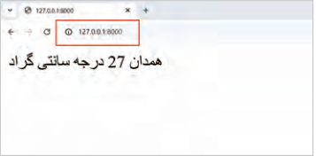

فایل را ذخیره نمایید و با `runserver` سرور جنگو را راه‌اندازی کنید.

صفحه اصلی سایت را در مرورگر باز کنید.

تبریک، شما اولین `view` جنگو خود را با موفقیت ایجاد کردید (شکل 16).

شکل 16 خروجی اولین `view` جنگو

### فعالیت

با تکمیل `view` و فایل `urls.py` اطلاعات دمای تهران را نمایش دهید.

آشنایی با تابع `render` در جنگو برای نمایش بهتر `view` از فایل‌های `html` استفاده می‌شود. هر `app` در جنگو، می‌تواند فایل‌های `html` مخصوص به خود را به‌صورت جداگانه داشته باشد، برای انجام این کار یک‌پوشه به اسم `templates` در `app` ایجاد کنید و فایل‌های `html` را در آن ذخیره کنید. به این فایل‌های `html` در جنگو `template` گفته می‌شود.

شکل 17 را مشاهده کنید، مسیر طی شدۀ `request` (درخواست وب) در جنگو قابل‌مشاهده است.

طبق تصویر، درخواست ارسالی کاربر، ابتدا به سرور جنگو منتقل شده، سپس با استفاده از `url` به `view` مناسب ارسال می‌شود، هر `view` با کمک فایل `html` یا همان `template` اطلاعات قابل نمایش را آماده کرده و برای کاربر ارسال می‌کند.

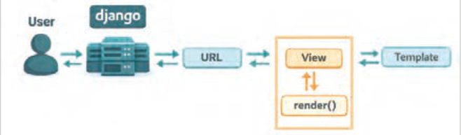

شکل 17 مسیر طی شده یک `request` در جنگو


---

<!-- pdf-page: 294 | book-page: 288 -->

**صفحه ۲۸۸**

همان‌طور‌که در شکل 17 اشاره شده است، تابع `render` در `view` می‌تواند اطلاعات را به فایل `html` ارسال کند تا به کمک قابلیت‌های جنگو، اطلاعات ارسالی به فایلِ `html` با آن ترکیب شده و به کاربر نمایش داده شود.

در ادامه، در دو مرحله می‌توانید یک عدد تصادفی را به‌عنوان دمای هوای شهر همدان، با کمک تابع `render` به یک فایل `html` ارسال کرده و به کاربر نمایش دهید.

مرحله اول: فایل `views.py` را باز کنید و `show_temp_view` را همانند شکل 18 تغییر دهید.

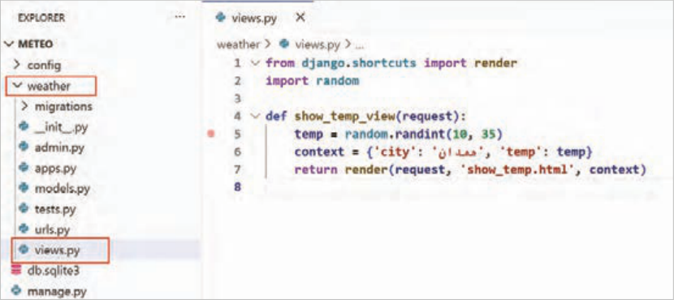

شکل 18 استفاده از تابع `render`

### توضیحات کدها:

خط 1: تابع `render` از ماژول `shortcuts` وارد (`import`) شده است.

خط 2: ماژول `random` وارد (`import`) شده است.

خط 5: یک عدد تصادفی به‌عنوان دمای هوا برای شهر همدان انتخاب می‌شود، این اطلاعات در صفحه اصلی سایت نمایش داده خواهد شد.

خط 6: یک دیکشنری شامل نام شهر (`city`) و دمای شهر (`temp`) ایجاد شده و در متغیری با نام `context` ذخیره شده است.

خط 7: از تابع `render` استفاده شده است. برای این تابع سه آرگومان ارسال شده است. آرگومان اول `request` است که از ورودی `view` دریافت شده است. آرگومان دوم نام فایل `html` موجود در پوشه `templates` و آرگومان سوم یک دیکشنری است که برای `html` ارسال شده است.

مرحله دوم: یک‌پوشه با نام `templates` در `weather` `app` بسازید و یک فایل `html` با نام `show_temp.html` درون آن ایجاد کنید.

فایل `show_temp.html` و هر فایل `html` دیگری که در این پوشه قرار بگیرد، به‌اصطلاح یک `template` است.


---

<!-- pdf-page: 295 | book-page: 289 -->

**صفحه ۲۸۹**

فایل `show_temp.html` و محتوای آن را همانند شکل 19 ایجاد کنید.

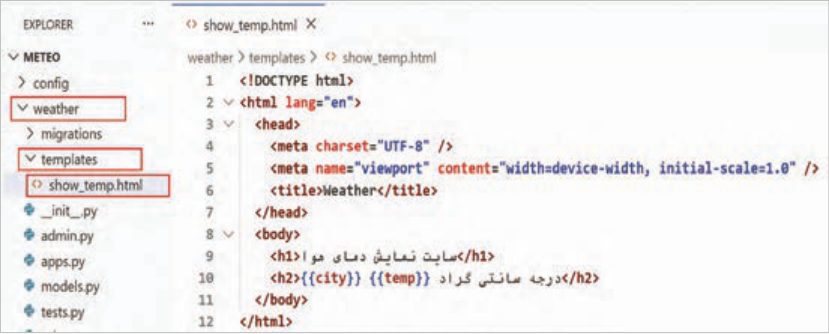

```
شکل 19 محتویات show_temp.html
```

### توضیحات کدها:

خط 10: از {{`city`}} و {{`temp`}} جهت‌نمایش نام شهر و دمای شهر استفاده شده است. علامت {{}} جهت‌نمایش متغیرها در `template` به‌کار می‌رود.

این متغیرها، کلیدهای دیکشنری `context` هستند که تابع `render` آن را برای `show_temp.html` ارسال کرده است.

همان‌طور‌که مشخص است، می‌توانید در `template` از این متغیرها، درون تگ‌های `html` استفاده کنید.

فایل‌ها را ذخیره کنید. سپس وارد `terminal` شده و با کلیدهای ترکیبی `ctrl` + `c` وب سرور جنگو را متوقف کنید و دوباره با دستور `runserver` آن را راه‌اندازی کنید.

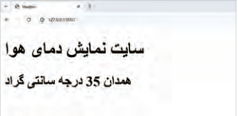

اکنون صفحه اصلی سایت را `refresh` کنید. تغییرات جدید را مشاهده خواهید کرد (شکل 20).

شکل 20 مشاهده تغییرات جدید

روند طی شده نمایش دمای هوا، از لحظه ورود درخواست کاربر به سرور جنگو تا نمایش اطلاعات با `template`، در شکل 21 شبیه‌سازی شده است.

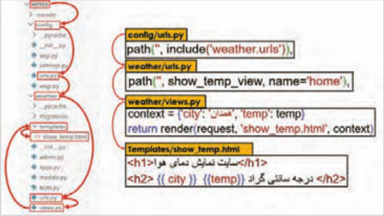

شکل 21 روند نمایش دمای هوا


---

<!-- pdf-page: 296 | book-page: 290 -->

**صفحه ۲۹۰**

### فعالیت

با استفاده از تابع `render` و ایجاد یک `template` مناسب برای `view`، دمای هوای شهر خودتان را با اعداد تصادفی نمایش دهید.

### نمایش دمای هوای واقعی

جهت‌نمایش دمای هوای لحظه‌ای شهرها می‌توانید از سایت‌هایی مثل `https://open-meteo.com` استفاده کنید. این سایت ابزاری در اختیار برنامه‌نویس قرار می‌دهد تا بتواند دمای هوای شهرهای مختلف را نمایش دهد.

سایت `open-meteo` یک `API` رایگان دارد که با دریافت طول و عرض جغرافیایی، اطلاعات آب‌وهوای منطقه موردنظر را در قالب `JSON` ارائه می‌دهد.

به‌عنوان‌مثال، اگر آدرس زیر را برای دریافت وضعیت آب‌وهوای شهر همدان در مرورگر باز کنید، نتیجه با قالب `JSON` نمایش داده خواهد شد (شکل 22).

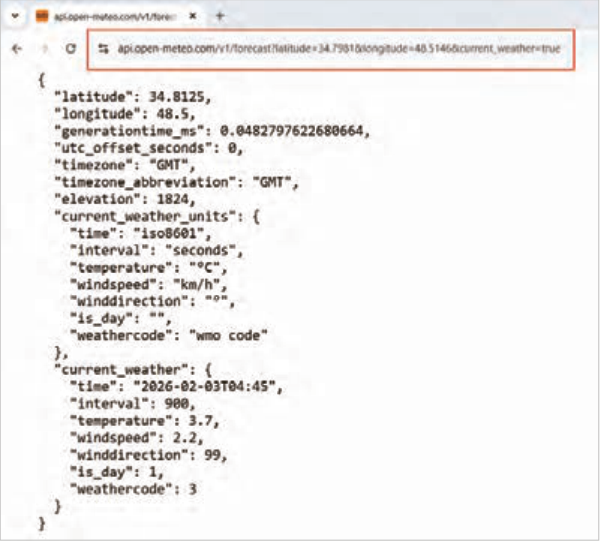

شکل 22 دریافت دمای شهر همدان از `API` آنلاین

```
-meteo.com/v1/forecast?latitude=34.7981&longitude=48.5146&currenthttps://api.open
weather=true
```

`API` مانند یک پل بین دو برنامه است. یعنی زمانی که یک برنامه (مثًلا پروژه جنگو) به اینترنت وصل می‌شود، از طریق `API` می‌تواند از یک سایت دیگر داده بگیرد.

در این پروژه، با استفاده از `API` سرویس `open-meteo` اطلاعات آب و هوایی دریافت می‌شود. `open-meteo` این اطلاعات را به‌صورت داده‌های منظم در قالب (`Json`) برمی‌گرداند، سپس پروژه جنگو آنها را نمایش می‌دهد.


---

<!-- pdf-page: 297 | book-page: 291 -->

**صفحه ۲۹۱**

ارسال مقدار `latitude` و `longitude` برای دریافت اطلاعات آب‌وهوا اجباری است.

اکنون جهت‌نمایش دمای فعلی شهر همدان تابع `show_temp_view` را از داخل فایل `views.py` همانند شکل 23 تغییر دهید.

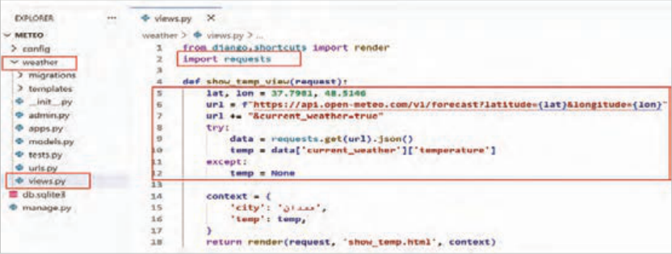

شکل 23 تغییر در `view` جهت دریافت اطلاعات از `API`

### توضیحات کدها:

خط 2: کتابخانه `requests` وارد (`import`) شده است. این کتابخانه باید از قبل نصب شده باشد. با دستور

```
(pip install requests)
```

خط 5: مقادیر `latitude` و `longitude` همان طول و عرض جغرافیایی هستند که برای شهر همدان مشخص شده و در متغیرهای `lat` و `lon` ذخیره شده‌اند.

خط 6 و 7: متن درخواست به‌صورت `get` و با استفاده از `lat` و `lon` آماده شده است.

خط 8: با استفاده از `try` خطای احتمالی مدیریت شده است، به‌عنوان‌مثال اگر اینترنت وصل نباشد، `except` در خط 11 مقدار `temp` را برابر `None` خواهد کرد و سایت با مشکل مواجه نمی‌شود.

خط 9: درخواست به سرور `open-meteo.com` ارسال شده و نتیجه با قالب `json` در دیکشنری `data` ذخیره شده است.

خط 10: مقدار `temperature` از دیکشنری `data` استخراج شده و در متغیر `temp` ذخیره شده است.

در فایل `show_temp.html` تغییراتی برای مدیریت خطا همانند شکل 24 اعمال کنید.

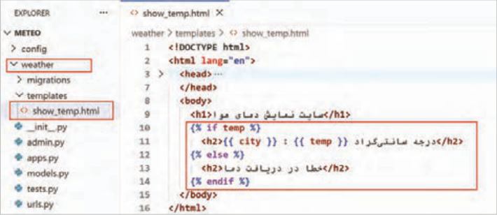

شکل 24 تغییرات در `template` جهت مدیریت خطای احتمالی


---

<!-- pdf-page: 298 | book-page: 292 -->

**صفحه ۲۹۲**

### توضیحات کدها:

خط 10: در `template` از دستور شرطی `if` استفاده شده است. درصورتی‌که `temp` مقدار داشته باشد و `None` نباشد، دمای شهر نمایش داده می‌شود.

خط 13: در صورت بروز خطا، پیغامی مناسب به کاربر نمایش داده می‌شود.

اکنون فایل‌ها را ذخیره کرده و پس از اطمینان از اتصال به اینترنت، صفحه اصلی سایت را `refresh` کنید. خروجی صفحه اصلی سایت، همانند شکل 25 خواهد بود (واضح است که دمای هوا برای شما ممکن است متفاوت نمایش داده شود و البته سرعت باز شدن صفحه اصلی سایت، به‌سرعت اینترنت شما ارتباط دارد، چون در کدها به `open-meteo.com` متصل شده‌اید.)

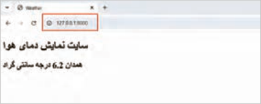

شکل 25 نمایش دمای همدان به‌صورت آنلاین

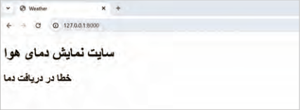

درصورتی‌که ارتباط با سایت برقرار نشود، خروجی همانند شکل 26 خواهد بود.

شکل 26 نمایش خطای مناسب به کاربر

### فعالیت

با استفاده از سایت `open-meteo.com` دمای هوای شهر خود را در صفحه اول سایت نمایش دهید.


---

<!-- pdf-page: 299 | book-page: 293 -->

**صفحه ۲۹۳**

### ارزشیابی شایستگی ایجاد وب اپلیکیشن

استاندارد عملکرد کار: هنرجو باید با درک صحیحی که از ساختار جنگو کسب کرده است، بتواند یک وب اپلیکیشن ساده را در رایانه خود پیاده‌سازی کند.

نمره

شرایط انجام کار (ابزار،مواد، تجهیزات،

ابزارهای

نتایج

ردیف

### مراحل کار

استاندارد (شاخص‌ها/داوری/نمره‌دهی)

کسب

زمان، مکان و ...)

### ارزشیابی

ممکن شده

پرسش

1 توضیح مفهوم و مزایای جنگو 2 تحلیل پروژه آب‌وهوا و اجزای آن 3 مقایسه جنگو با پایتون خالص انجام کنجکاوی3 شفاهی، آزمون

آشنایی با جنگو و پروژه

1 توضیح مفهوم و مزایای جنگو 2 تحلیل پروژه آب‌وهوا و اجزای آن3 مقایسه

1

نهایی ابزار: رایانه زمان: 10 دقیقه؛ مکان: کارگاه

کتبی جنگو با پایتون خالص2 کوتاه، اجرای انجام ناقص هر یک از مراحل1 عملی

1 اجرای دستور `pip` `install` `django` بدون خطا 2 بررسی نسخه جنگو آزمون

3

3 آماده‌سازی پوشه پروژه 4 انجام کارها با روشی دیگر 5 انجام کنجکاوی‌ها

ابزار: رایانه سیستم‌عامل نصب‌شده،

کتبی

نصب جنگو و راه‌اندازی

2

`Django`،`Python` اینترنت (یا بسته آفلاین)،

1 اجرای دستور `pip` `install` `django` بدون خطا 2 بررسی نسخه جنگو کوتاه،

محیط توسعه

2

دسترسی نصب؛ زمان: 15 دقیقه؛

اجرای

3 آماده‌سازی پوشه پروژه عملی انجام ناقص هر یک از مراحل1

1 استفاده از دستور `startproject` و بررسی ساختار 2 مشاهده صفحه آزمون پیش‌فرض جنگو 3 تشریح فایل‌های اصلی پروژه 4 انجام کارها با روشی

3

ابزار: رایانه، `Django` نصب‌شده، ترمینال، مرورگر کتبی

دیگر 5 انجام کنجکاو‌یها

ایجاد و اجرای اولین پروژه

3

وب، زمان: 15 دقیقه؛ مکان: کارگاه

کوتاه،

1 استفاده از دستور `startproject` و بررسی ساختار2 مشاهده صفحه

جنگو

اجرای پیش‌فرض جنگو3 تشریح فایل‌های اصلی پروژه2 عملی انجام ناقص هر یک از مراحل1

1 اجرای دستور 2 `startapp` `weather2` تغییر در `settings.py` و آزمایش آزمون اجرا 3 بیان ارتباط پروژه با `app`ها 4 انجام کارها با روشی دیگر5 انجام

3

کتبی کنجکاوی‌ها

ساخت و معرفی اولین `app`

ابزار: رایانه، ترمینال، `Django`، زمان: 15 دقیقه؛

4

کوتاه،

1 اجرای دستور 2 `startapp` `weather2` تغییر در `settings.py` آزمایش

در پروژه

مکان: کارگاه

اجرای اجرا 3 بیان ارتباط پروژه با `app`ها2 عملی انجام ناقص هر یک از مراحل1

1 ایجاد تابع در 2 `views.py2` اتصال `view` به قالب با 3 `render` آزمون ویرایش فایل 4 `urls.py4` انجام کارها با روشی دیگر5 انجام کنجکاو‌یها3 کتبی

ساخت اولین `view` و

ابزار: ویرایشگر کد (`VS` `Code`) ترمینال، مرورگر؛

5

کوتاه،

1 ایجاد تابع در 2 `views.py2` اتصال `view` به قالب با `render`

آشنایی با تابع `render`

زمان: 25 دقیقه؛

2

اجرای

3 ویرایش فایل `urls.py` عملی انجام ناقص هر یک از مراحل1

1 اجرای `view` با `context` داده‌های دما 2 مشاهده و تحلیل خروجی در آزمون مرورگر3 بررسی عملکرد کلی وب‌اپلیکیشن4 انجام کارها با روشی دیگر

3

کتبی

5 انجام کنجکاوی ها

نمایش دمای واقعی در

ابزار: ویرایشگر کد(`VS` `Code`) و ترمینال،

6

کوتاه،

وب‌اپلیکیشن

مرورگر؛ زمان: 35 دقیقه

1 اجرای `view` با `context` داده‌های دما2 مشاهده و تحلیل خروجی در اجرای مرورگر3 بررسی عملکرد کلی وب‌اپلیکیشن2 عملی انجام ناقص هر یک از مراحل1


---

<!-- pdf-page: 300 | book-page: 294 -->

**صفحه ۲۹۴**

شایستگی‌های غیر فنی، ایمنی،

احراز همه شایستگی‌های غیرفنی2

بهداشت، توجهات زیست محیطی

عدم احراز هر یک از شایستگی‌های غیرفنی1

و نگرش:

بلی

ارزشیابی کار (شایستگی انجام کار)

خیر

### توضیحات:

1 معیار شایستگی انجام کار:

کسب حداقل نمره 2 از مراحل 1، 2، 3، 4، 5 و 6 (مراحل بحرانی) کسب حداقل نمره 2 از بخش شایستگی‌های غیرفنی، ایمنی، بهداشت، توجهات زیست‌محیطی و نگرش کسب حداقل میانگین 2 از مراحل کار

2 تعریف سطوح شایستگی: صرف‌نظر از اینکه یک تکلیف کاری در چه سطحی از صلاحیت حرفه‌ای انجام می‌شود، در هر محیط کاری ممکن است انجام هر کار با کیفیت مشخصی مورد انتظار باشد. سطح شایستگی انجام کار، معیار اساسی ارزشیابی است.

مهارت (سطح سه): ماهر و قادر به آموزش و هدایت دیگران، توانایی برنامه‌ریزی و تحلیل، پاسخ‌گویی در برابر کارهای خود، سروکار داشتن با سطح وسیعی از کارها و فعالیت‌ها تسلط (سطح چهار): خبرگی در انجام کار و آموزش دیگران، ایجاد نوآوری، سازگاری، عیب‌یابی، هدایت و راهنمایی دیگران.
