# توسعه وب اپلیکیشن


---

<!-- pdf-page: 301 | book-page: 295 -->

**صفحه ۲۹۵**

## واحد یادگیری ٢

## توسعه وب اپلیکیشن

### آیا تابه‌حال اندیشیده‌اید

یک سایت چطور با پایگاه داده ارتباط برقرار می‌کند؟

یک وب اپلیکیشن چطور کاربر مهمان را تشخیص می‌دهد؟

اطلاعاتی که کاربران در فرم‌ها وارد می‌کنند، چطور در پایگاه داده ذخیره می‌شود؟

برنامه‌نویس چگونه می‌تواند از بروز خطاها در سایت جلوگیری کند؟

### در پایان از هنرجو انتظار می‌رود

1 بتواند با استفاده از جنگو در پایگاه داده تغییرات اعمال کند.

2 مفهوم فیلد و جدول در جنگو را درک کرده و درباره آن استدلال نماید.

3 با استفاده از جنگو، بتواند اطلاعات فرم‌ها را در پایگاه داده ذخیره نمایند.

4 با مفهوم `ORM` در جنگو آشنا شود و بتواند پرس‌وجوهای ساده بنویسد.

5 مشکلات و باگ‌های مرسوم در وب اپلیکیشن‌ها را بشناسد و بتواند به‌صورت عملی مشکلات را برطرف نماید.

### استاندارد عملکرد

هنرجو بتواند با ساخت `Model` در جنگو و استفاده از فرم‌های `HTML` ارتباط با پایگاه داده را پیاده‌سازی کند و اطلاعاتی که کاربران وارد می‌کنند را در جداول ذخیره و بازیابی نماید.


---

<!-- pdf-page: 302 | book-page: 296 -->

**صفحه ۲۹۶**

### ساخت جدول شهر در پایگاه داده

تا این مرحله سایت شما فقط دمای شهرهایی را نمایش می‌دهد که در `view` مشخص کرده‌اید، یعنی در `show_temp_view` اسم شهر ثابت است و همیشه دمای یک شهر، نمایش داده خواهد شد. روش بهتر این است که کاربر مهمان، قابلیت انتخاب شهر موردنظرش را داشته باشد.

جهت پیاده‌سازی این قابلیت، نیاز است، اطلاعات شهرها را به همراه طول و عرض جغرافیایی هر شهر، در پایگاه داده ذخیره کنید، سپس وقتی کاربر وارد سایت شد، لیستی از شهرها را مشاهده کرده و با کلیک روی نام شهر، دمای شهر موردنظر خود را ببیند.

برای پیاده‌سازی این قابلیت باید یک جدول (`table`) در پایگاه‌داده ایجاد کنید.

هر `app` یک فایل با نام `models.py` دارد. جنگو برای ساخت جداول از مدل‌ها (`model`) استفاده می‌کند. هر مدل در جنگو معادل یک جدول، با همان نام، در پایگاه‌داده است. در اولین قدم باید درون فایل `models.py` کلاس لازم برای تعریف جدول و ستون‌های جدول ایجاد شود.

فایل `models.py` در `weather` `app` را باز کنید. سپس محتوای این فایل را همانند شکل 27 تغییر دهید.

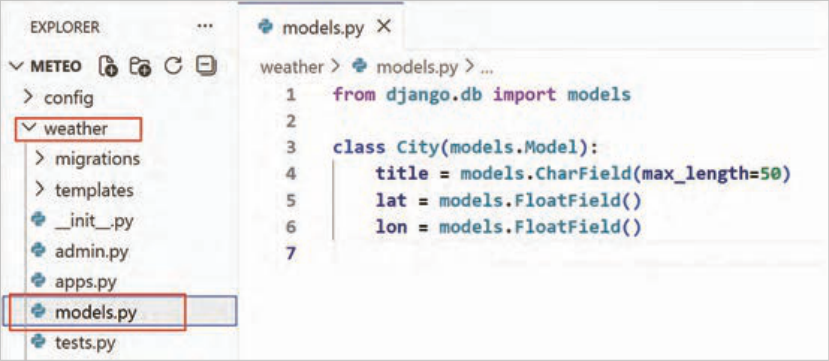

شکل 27 ساخت مدل `City`

### توضیحات کدها:

خط 1: ماژول `models` از ماژول `django.db`، وارد (`import`) شده است. در واقع با این خط، ابزارها و کلاس‌های لازم برای تعریف مدل‌های پایگاه‌داده (`Database` `Models`) وارد (`import`) می‌شوند.

خط 3: کلاس `City` جهت ساخت جدول شهرها با ارث‌بری از `Model` ایجاد شده است. `Model` کلاس پایه جنگو برای ساخت مدل‌ها (جدول‌های پایگاه‌داده) است و امکانات لازم برای ارتباط با پایگاه‌داده را فراهم می‌کند.

خط 4: این دستور یک فیلد برای نگهداری نام شهر به‌صورت متن، در جدول می‌سازد که حداکثر 50 کاراکتر طول دارد. برای `CharField` تعیین‌کردن `max_length` اجباری است.

خط 5: از `FloatField` جهت نگهداری اعداد اعشاری استفاده شده است. عرض جغرافیایی (`Latitude`) و طول جغرافیایی (`Longitude`) هر دو عدد اعشاری هستند.


---

<!-- pdf-page: 303 | book-page: 297 -->

**صفحه ۲۹۷**

برای استفاده از مدل `City`، نیاز است که جدول معادلش در پایگاه‌داده ساخته شود.

در ترمینال دستور `makemigrations` را همانند شکل 28 اجرا کنید.

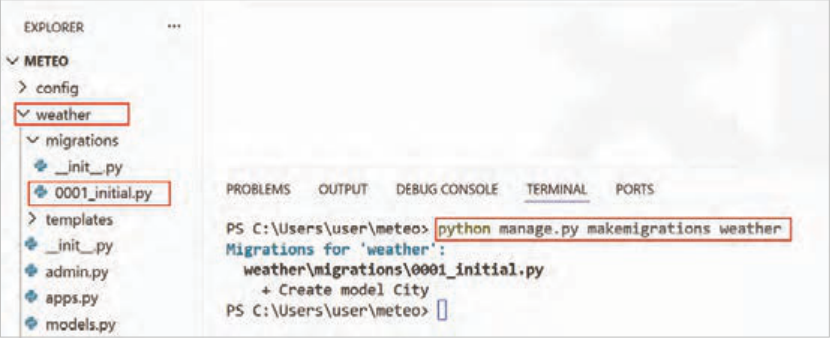

شکل 28 اجرای دستور `makemigrations`

وقتی `makemigrations` را اجرا می‌کنید، درون `weather` `app`، فایلی با نام `0001_initial.py` در پوشه `migrations` ایجاد می‌شود. این فایل کدهای لازم جهت تبدیل مدل به جدول واقعی را آماده‌سازی می‌کند.

در مرحله بعد دستور `migrate` را همانند شکل 29 در ترمینال اجرا کنید.

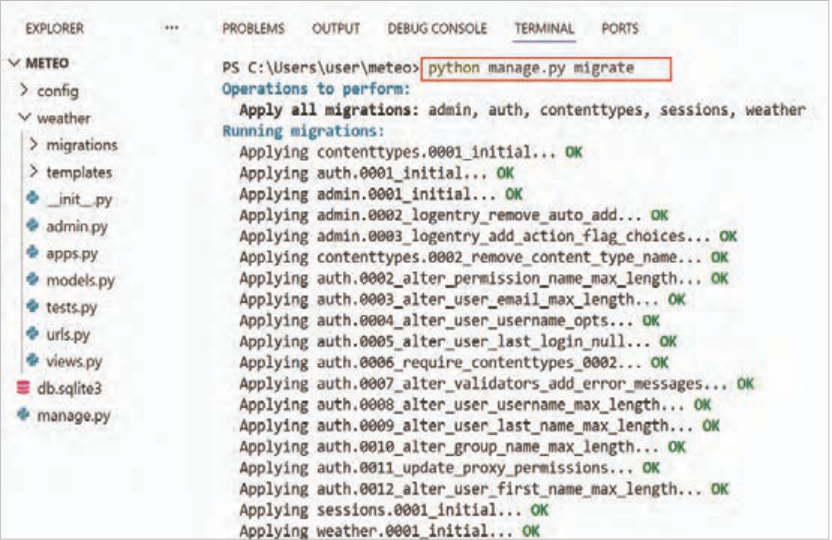

شکل 29 اجرای دستور `migrate`


---

<!-- pdf-page: 304 | book-page: 298 -->

**صفحه ۲۹۸**

پس از اجرای `migrate`، جدول‌های پیش‌فرض جنگو و جدول `city` در پایگاه‌داده `db.sqlite3` ساخته می‌شوند.

مشاهده جداول پایگاه‌داده برای مشاهده ساختار و محتوای جداول درون پایگاه‌داده، می‌توانید افزونه `SQLite` `Viewer` را به‌عنوان یک ابزار کمکی نصب کنید. برای نصب این افزونه مطمئن شوید که اینترنت متصل باشد (شکل 30).

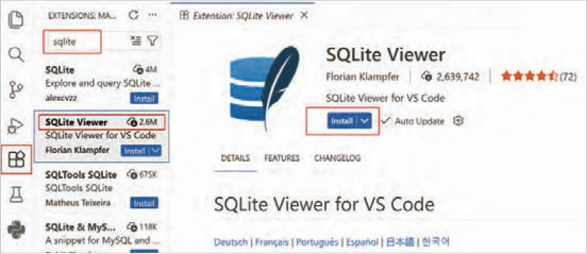

شکل 30 جست‌وجوی افزونه `SQLite` `Viewer`

پس از نصب افزونه ذکر شده، با کلیک بر روی فایل `db.sqlite3` جدول‌های پیش‌فرض جنگو و جدول `city` را مشاهده خواهید کرد (شکل 31).

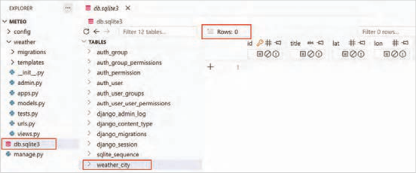

شکل 31 جداول پایگاه‌داده


---

<!-- pdf-page: 305 | book-page: 299 -->

**صفحه ۲۹۹**

همان‌طور‌که در‌شکل 31 مشخص است، جدول `city` با پیشوند `weather` ساخته شده است. با کلیک روی جدول `weather_city`، لیست فیلدها در سمت راست نمایش داده می‌شود. در حال حاضر هیچ رکوردی در جدول `city` وجود ندارد.

با افزونه `SQLite` `Viewer` فقط می‌توانید محتوا و ساختار جداول را مشاهده کنید و امکان ذخیره اطلاعات وجود ندارد.

برای تغییر محتوای جدول `city` و یا افزودن نام شهرهایی جدید به جدول لازم است وارد پنل ادمین جنگو شوید. البته هنوز نمی‌توانید از طریق پنل `admin` داده‌های مربوط به شهر‌ها را وارد دیتابیس کنید، چرا که هنوز کاربر `admin` تعریف نشده است؛ بنابراین در مرحله بعد نوبت تعریف کاربر `admin` است.

پنل مدیریت جنگو برای ورود به پنل ادمین، نیاز به نام کاربری و رمز عبور است. دستور زیر را در ترمینال وارد کنید:

```
python manage.py createsuperuser
```

جنگو از شما نام کاربری درخواست می‌کند (شکل 32).

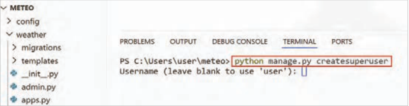

شکل 32 اجرای دستور `createsuperuser`

همان‌گونه که مشخص است، نام کاربر جاری ویندوز را به‌عنوان نام کاربری پیشنهاد داده است.

می‌توانید نام کاربری `admin` و یا هر نام کاربری دیگری را به‌دلخواه وارد کنید، سپس به‌ترتیب، ایمیل، کلمه عبور و تکرار کلمه عبور را وارد کنید (شکل 33).

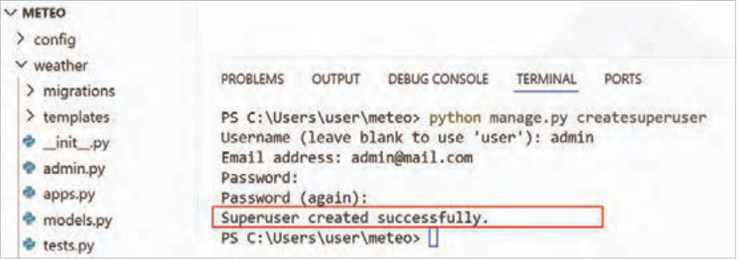

شکل 33 ایجاد موفق کاربر ادمین


---

<!-- pdf-page: 306 | book-page: 300 -->

**صفحه ۳۰۰**

### نکته

می‌توانید ایمیل را خالی وارد کنید، همچنین اگر رمز عبور ساده‌ای وارد کنید، همانند شکل 34 به شما اخطار خواهد داد.

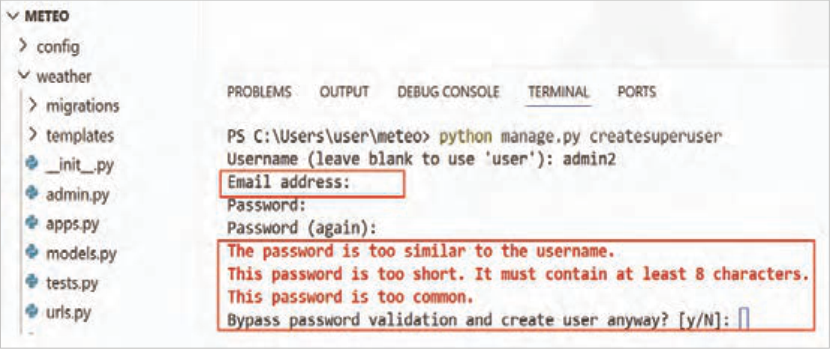

شکل 34 اخطار ساده‌بودن رمز ادمین

پس از ایجاد کاربر ادمین، با افزونه `SQLite` `Viewer` می‌توانید، کاربر ایجاد شده را در جدول `auth_user` همانند شکل 35 مشاهده کنید.

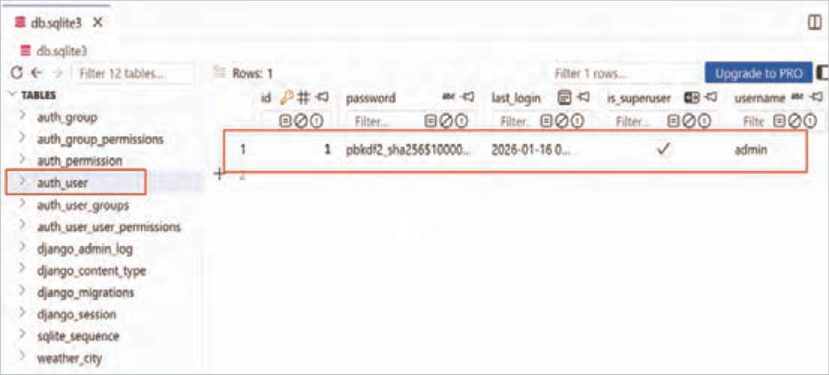

شکل 35 نمایش کاربر `admin` ایجاد شده در دیتابیس


---

<!-- pdf-page: 307 | book-page: 301 -->

**صفحه ۳۰۱**

اکنون جهت ورود به پنل مدیریت ادمین جنگو، سرور جنگو را روشن کرده و صفحه ادمین را با تایپ آدرس زیر در نوار آدرس مرورگر، باز کنید:

```
http://127.0.0.1:8000/admin/
```

سپس با نام کاربری و رمز عبوری که ساخته‌اید، وارد شوید.

پنل ادمین همانند شکل 36 نمایش داده خواهد شد.

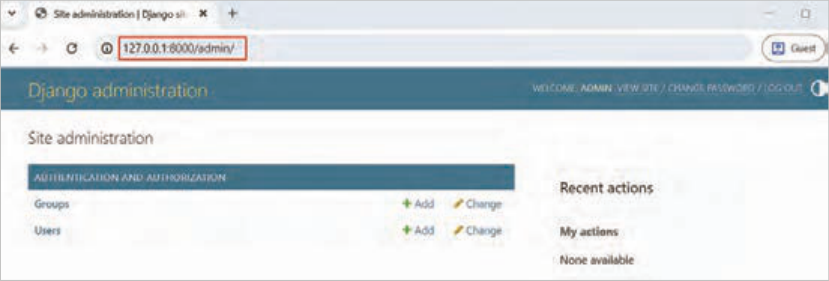

شکل 36 ورود موفق به پنل ادمین جنگو

در قسمت `1Authentication` `and` `Authorization` با استفاده از `Users` می‌توان کاربران سایت را مشاهده و مدیریت کرد.

با استفاده از دکمه `add` می‌توان کاربر جدید ایجاد کرد. برای ایجاد کاربر جدید، لازم است فیلدهای نام کاربری، رمز عبور و تکرار رمز عبور را وارد کرده و دکمه `save` را بزنید (شکل 37).

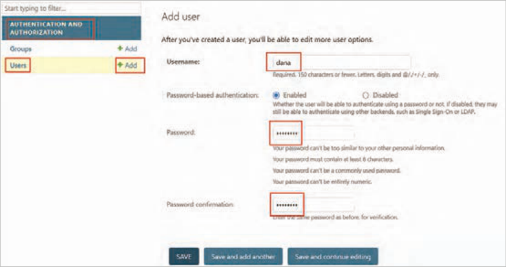

شکل 37 فرم ساخت کاربر جدید

1- احراز هویت و مجوز


---

<!-- pdf-page: 308 | book-page: 302 -->

**صفحه ۳۰۲**

پیغام ذخیره موفقیت‌آمیز همانند شکل 38 مشاهده خواهید کرد. در این مرحله می‌توانید اطلاعات تکمیلی، مثل نام، نام خانوادگی، ایمیل و… را برای کاربر ایجاد شده ثبت کنید.

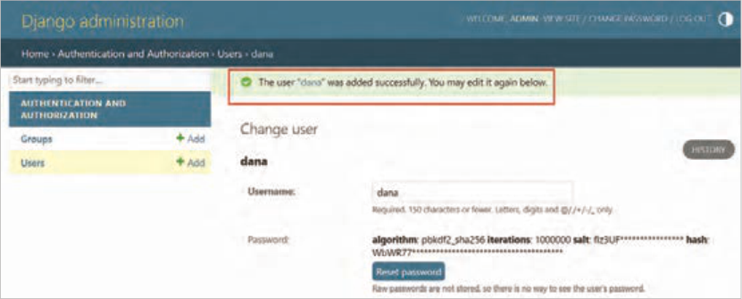

شکل 38 ذخیره موفق کاربر

برای مشاهده لیست کاربران ایجاد شده، روی `Users` کلیک کنید (شکل 39).

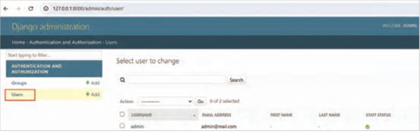

شکل 39 مشاهده لیست کاربران

### فعالیت

با کمک هنرآموز خود، کاربر دیگری ایجاد کنید. سپس با کاربرهای مختلف در پنل ادمین `login` کرده و تفاوت کاربرهای مختلف را بررسی کنید.

افزودن جدول شهر به پنل ادمین اگر دقت کرده باشد در شکل 36، در پنل ادمین جدول شهرها مشاهده نشد، با انجام مراحلی که در ادامه آمده است، می‌توانید جدول `City` را به پنل ادمین اضافه کنید.


---

<!-- pdf-page: 309 | book-page: 303 -->

**صفحه ۳۰۳**

هر `app` در جنگو یک فایل `admin.py` دارد. فایل `admin.py` در `weather` `app` را باز کنید و همانند شکل 40، مدل `City` را به ادمین جنگو معرفی کنید.

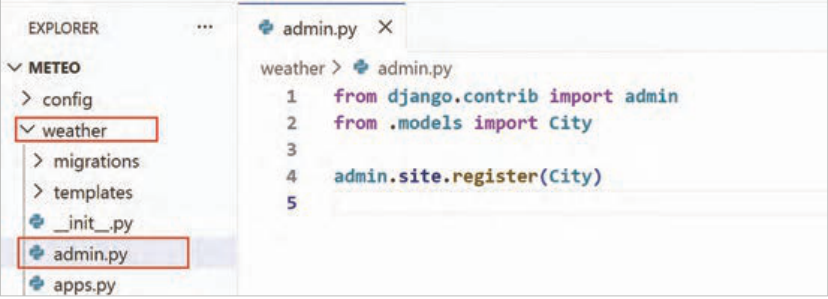

شکل 40 معرفی مدل `City` به پنل ادمین جنگو

### توضیحات کدها:

خط 1: ماژول `admin` جهت مدیریت پنل ادمین از `contrib` وارد (`import`) شده است.

خط 2: مدل `City` از فایل `models.py` وارد (`import`) شده است.

خط 4: مدل `City` با دستور `register` به پنل ادمین معرفی شده است.

اکنون فایل را ذخیره کنید، سپس مرورگر را `refresh` کنید، جدول `city` به ادمین جنگو اضافه شده است و حرف `s` به انتهای نام مدل اضافه شده است (شکل 41).

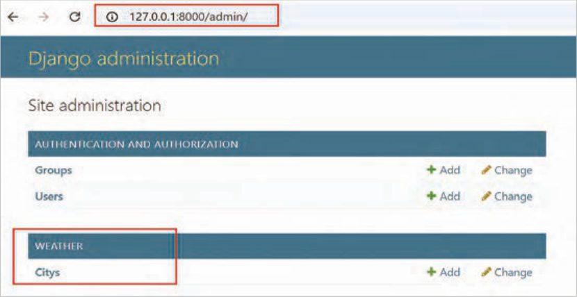

شکل 41 اضافه شدن `City` به پنل ادمین


---

<!-- pdf-page: 310 | book-page: 304 -->

**صفحه ۳۰۴**

وارد کردن اطلاعات شهرها در پنل ادمین، روی دکمه `Add` (مقابل `Citys`) کلیک کنید، فرم ثبت شهر (`Add` `city`) را مشاهده خواهید کرد (شکل 42) .

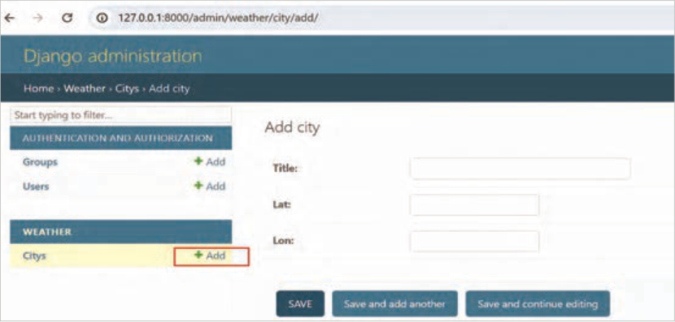

شکل 42 فرم `Add` `city`

### فعالیت

با استفاده از اطلاعات جدول 2، چند شهر را با فرم `Add` `city` در پایگاه داده ذخیره کنید.

جدول 2 طول و عرض جغرافیایی چند شهر

نام شهر

عرض جغرافیایی (`lat`)

طول جغرافیایی (`lon`)

میناب27.1478

57.0738

همدان.798137

.514648

تهران.721935

.334751

الشتر33.8632

.261748

تفرش.693634

.015450

بابل36.5387

52.6765

جهرم.517728

.574453

تبریز.079238

46.2887

سبزوار36.2152

.667857


---

<!-- pdf-page: 311 | book-page: 305 -->

**صفحه ۳۰۵**

### فعالیت

با کمک هنرآموز خود، مقدار طول و عرض جغرافیایی چند شهر دیگر را یافته و در پایگاه داده ذخیره کنید.

پس از ثبت شهرها، با کلیک روی `Citys`، لیست شهرهای ثبت شده نمایش داده می‌شود (شکل 43).

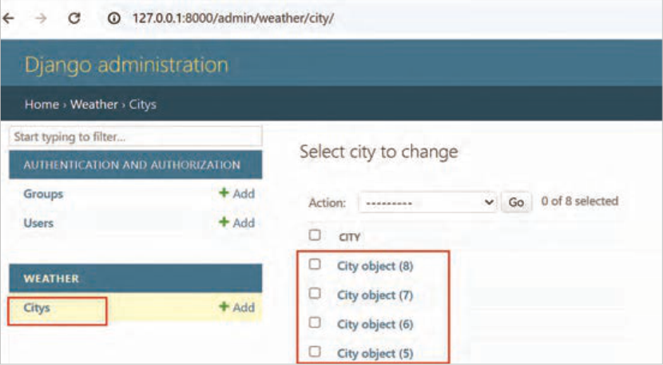

شکل 43 لیست شهرهای ثبت شده

در شکل 43 از `City` `object` برای نمایش عنوان هر شهر استفاده شده است. جهت نمایش مناسب عنوان شهرها، فایل `models.py` را باز کنید و تغییراتی همانند شکل 44 برای مدل `City` اعمال کنید و فایل را ذخیره کنید.

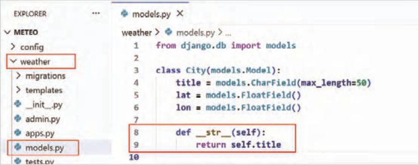

شکل 44 افزودن متد `str` به مدل شهر


---

<!-- pdf-page: 312 | book-page: 306 -->

**صفحه ۳۰۶**

اگر پنل ادمین را `refresh` کنید، نتیجه به‌صورت شکل 45 خواهد بود.

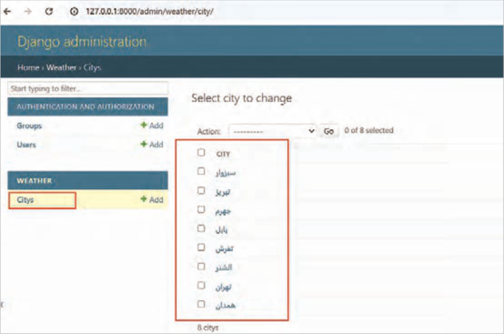

شکل 45 نمایش مناسب عنوان شهرها در پنل ادمین

### کنجکاوی

در زبان انگلیسی جمع `City` برابر با `Cities` است، اما در پنل ادمین جنگو عنوان جدول به‌صورت اشتباه `Citys` نمایش داده می‌شود. بررسی کنید چطور می‌توان این عنوان را در بخش ادمین جنگو تغییر داد.

### آشنایی با ابزار ORM جنگو

اکنون که چند رکورد حاوی نام چند شهر و مختصاتشان را به جدول شهر‌ها اضافه کردید، می‌توانید از داخل فایل `views.py` یکی از رکوردها (مثًلا اولین رکورد) را بخوانید، وضعیت آب و هوای آن شهر را به‌دست آوردید و جهت نمایش به فایل `index.html` ارسال کنید.

برای این‌کار لازم است ابتدا ابزار `ORM` جنگو را بشناسید.

برای کار با پایگاه داده از زبان `SQL` استفاده می‌شود، مثلاً دستور `SELECT` یکی از دستورات اصلی زبان `SQL` است.


---

<!-- pdf-page: 313 | book-page: 307 -->

**صفحه ۳۰۷**

با دستور `SELECT` به‌صورت زیر می‌توانید، همه شهرهای جدول `City` را از پایگاه داده دریافت کنید:

```
SELECT id, title, lat, lon FROM weather_city
```

اما در جنگو یک ابزار مفید با نام `ORM` وجود دارد که کار با پایگاه داده را راحت‌تر می‌کند. `ORM` مثل یک مترجم است. عملیات مربوط به ارتباط با پایگاه داده را با زبان پایتون دریافت و در پشت صحنه، به دستورات `SQL` ترجمه می‌کند.

به‌عنوان مثال دستور معادل پرس و جوی قبلی در `ORM` جنگو به‌صورت زیر است:

```
City.objects.all()
```

در این کد پایتونی، `City` نام مدل است.

اکنون کد `show_temp_view` را با استفاده از `ORM` جنگو همانند شکل 46 تغییر دهید.

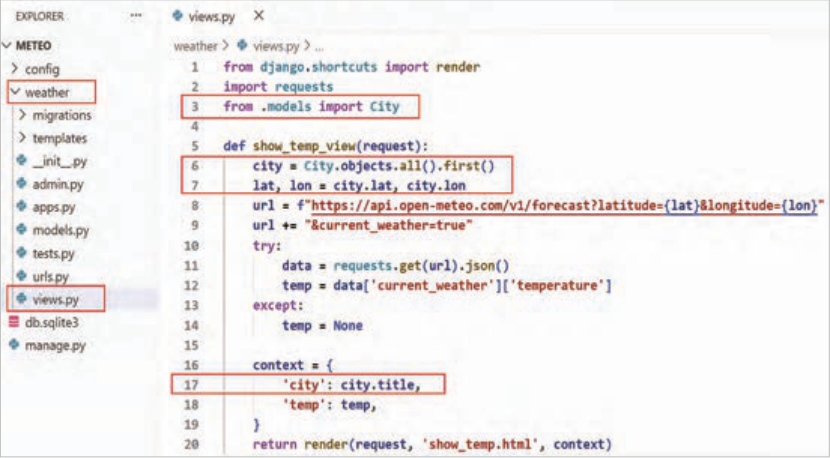

شکل 46 استفاده از `ORM` جنگو

### توضیحات کدها:

خط 3: مدل `City` از `models.py` در این فایل `import` شده است.

خط 6: با استفاده از `ORM` جنگو، اولین شهر ذخیره شده در جدول شهر، در متغیر `city` ذخیره شده است.

خط 7: مقدار `lat` و `lon` از شهرِ واکشی شده از جدول، دریافت و در متغیرهای `lat` و `lon` ذخیره شده است.

خط 17: نام شهر نیز از پایگاه داده دریافت شده و درون دیکشنری `context` ذخیره شده است.

فایل را ذخیره و صفحه اصلی سایت را باز کنید. دمای شهر همدان نمایش داده می‌شود.


---

<!-- pdf-page: 314 | book-page: 308 -->

**صفحه ۳۰۸**

نمایش لیست شهرها تا اینجا توانستید چند شهر را ذخیره‌سازی کنید. قرار است که این شهرها را از پایگاه داده بخوانید و درون سایت به‌صورت یک لیست نمایش دهید تا کاربر بتواند با کلیک بر روی شهر دلخواهش، وضعیت دمای آن شهر را مشاهده کند.

این‌کار به کمک `view` و `template` صورت خواهد گرفت.

در جنگو، `view` می‌تواند اطلاعات را از دیتابیس دریافت کرده و سند `html` را جهت نمایش به کاربر آماده کند.

شکل 47 را مشاهده کنید، `request` از `url` به `view` ارسال شده و `view` با استفاده از `model` و `template`، اطلاعات را جهت نمایش به کاربر آماده می‌کند.

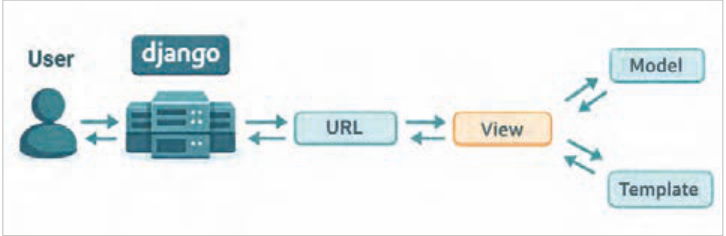

شکل 47 دریافت اطلاعات از مدل توسط `View`

جهت نمایش لیست شهرها در صفحه اصلی سایت می‌توانید چهار مرحله را به‌صورت زیر انجام دهید:

1 ساختن یک تابع با نام `city_list_view` در `Views.py`

```
2 ساختن یک template با نام city_list.html
```

3 تغییر و تنظیم فایل`urls.py`

4 قرار دادن لینک «لیست شهرها» در صفحه اصلی مرحله اول: یک `view` با نام `city_list_view` همانند شکل 48 ایجاد کنید.

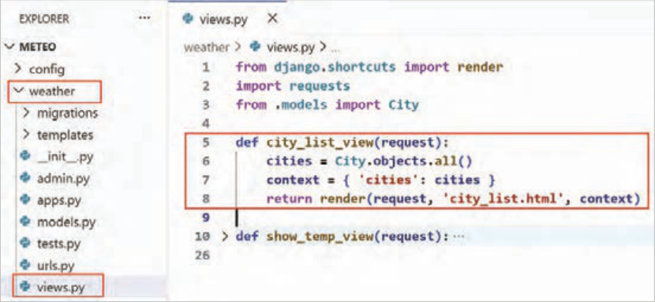

```
شکل 48 افزودن city_list_view
```


---

<!-- pdf-page: 315 | book-page: 309 -->

**صفحه ۳۰۹**

### توضیحات کدها:

خط 6: با استفاده از `ORM` جنگو یک `Query` اجرا شده و لیست همه شهرها از جدول `City` واکشی شده است. `ORM` جنگو دستورات مختص به خود را دارد و این دستورات به کدهای `SQL` تبدیل شده و توسط پایگاه داده اجرا می‌شوند. سپس نتیجه دستور در متغیری با نام `cities` ذخیره شده است.

خط 8: دیکشنری `context` برای `city_list.html` ارسال شده است، مقدار `value` این دیکشنری یعنی `cities` در خط 6 مقداردهی شده است.

مرحله دوم: اکنون یک فایل `html` با نام `city_list.html` درون پوشه `templates` ایجاد کنید، کد این فایل را همانند شکل 49 وارد کنید.

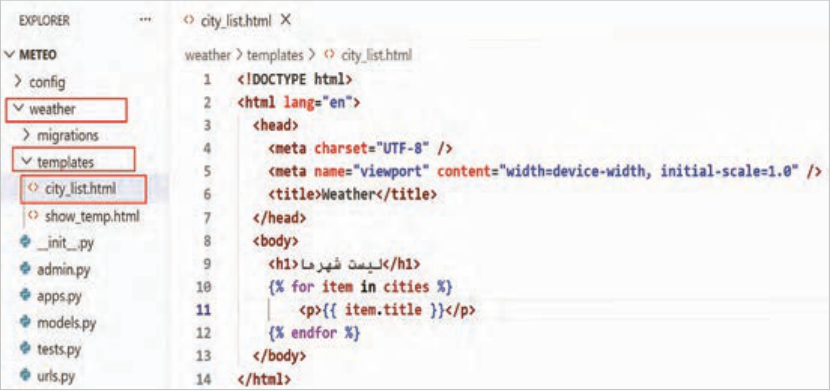

```
شکل 49 افزودن city_list.html
```

### توضیحات کدها:

خط 10: یک حلقه روی `cities` اجرا شده است تا لیست شهرها را به‌صورت تگ `p` در مرورگر نمایش دهد.

`cities` قبًلا در فایل `views.py` درون یک دیکشنری تعریف شده است.

خط 11: با استفاده از {{ }} می‌توانید به فیلدهای هر `item` دسترسی داشته باشید. `title` فیلدی است که برای عنوان شهر، در مدل `City` تعریف کردید.

خط 12: حتمًا باید حلقه `for` را با `endfor` خاتمه دهید، در غیر این‌صورت در مرورگر با خطا مواجه خواهید شد.


---

<!-- pdf-page: 316 | book-page: 310 -->

**صفحه ۳۱۰**

مرحله سوم: فایل `urls.py` در `weather` `app` را همانند شکل 50 تغییر دهید.

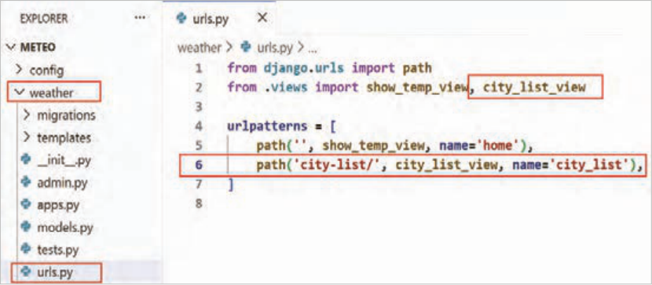

شکل 50 افزودن `path` لیست شهرها به `urls.py`

### توضیحات کدها:

خط 6: یک `path` جدید جهت استفاده از `city_list_view` اضافه شده و به این معنی است که لیست شهرها

```
در آدرس /listhttp://127.0.0.1:8000/city نمایش داده می‌شود.
```

مرحله چهارم: کد `show_temp.html` را جهت اضافه کردن لینک به صفحه لیست شهرها، همانند شکل51 تغییر دهید.

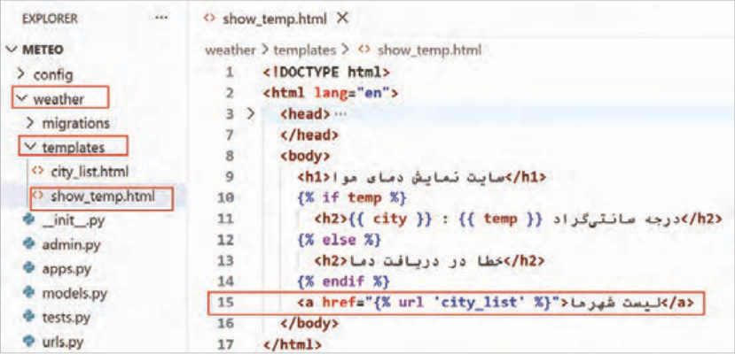

شکل 51 اضافه کردن لینک به لیست شهرها


---

<!-- pdf-page: 317 | book-page: 311 -->

**صفحه ۳۱۱**

### توضیحات کدها:

خط 15: در این خط تگ `a` اضافه شده و مقدار `href` آن برابر عبارت }% `'url` `'city_list` %{ است.

در این عبارت }% `'url` `'city_list` %{ یک `Template` `Tag` است. از تگ `url` استفاده شده است و `city_list` آرگومان آن است. این خط با استفاده از نام مسیر `city_list`، آدرس لینک لیست شهرها را به صورت خودکار تولید می‌کند (شکل 52).

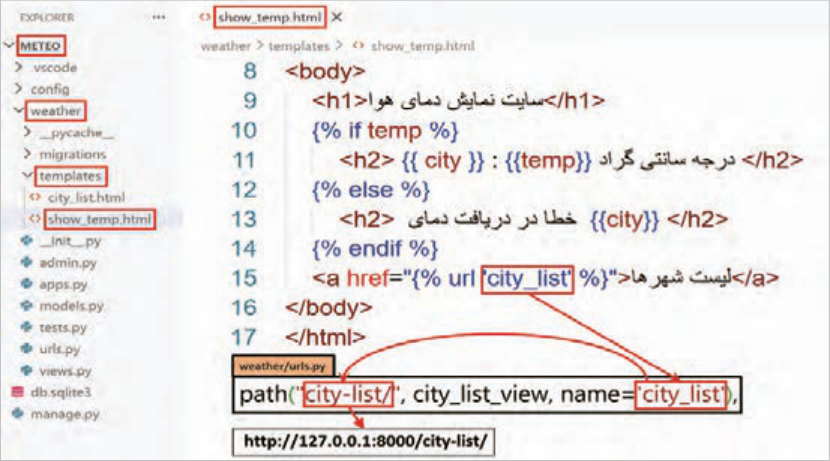

شکل 52 روند کار تگ `url` در جنگو

اکنون فایل را ذخیره کرده و صفحه اصلی سایت را `refresh` کنید، لینک اضافه شده را همانند شکل 53 مشاهده خواهید کرد.

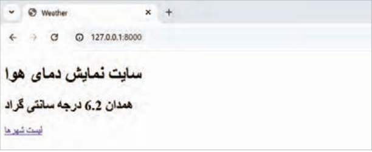

شکل 53 نمایش لینک لیست شهرها


---

<!-- pdf-page: 318 | book-page: 312 -->

**صفحه ۳۱۲**

اکنون روی لینِک اضافه شده (لیست شهرها) کلیک کنید، همانند شکل 54، لیست شهرها را مشاهده خواهید کرد.

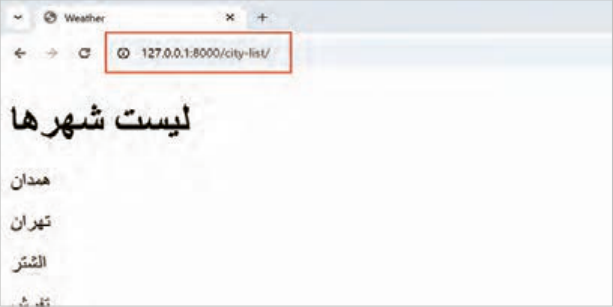

شکل 54 نمایش لیست شهرها

نمایش دمای شهر انتخاب شده توسط کاربر شهرهایی که در لیست شهرها نمایش داده می‌شوند، قابلیت کلیک ندارند، لازم است تغییراتی اعمال کنید تا کاربر امکان کلیک کردن روی شهر مورد نظر خود را داشته باشد، تا دمای شهر انتخاب شده، نمایش داده شود.

ابتدا فایل `city_list.html` را باز کرده و همانند شکل 55، تغییرات مورد نظر را اعمال کنید.

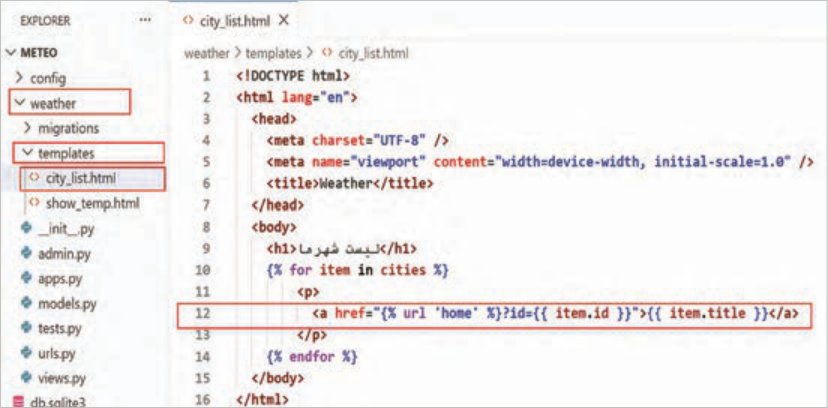

شکل 55 افزودن لینک به هر شهر


---

<!-- pdf-page: 319 | book-page: 313 -->

**صفحه ۳۱۳**

### توضیحات کدها:

خط 10: برای اینکه نام شهرها قابلیت کلیک شدن داشته باشند، یک تگ `a` درون تگ `p` ایجاد شده و جهت نمایش عنوان لینک، از متغیر {{ `item.title` }} استفاده شده است. آدرس لینک (`href`) به صفحه اصلی اشاره کرده و متغیر {{ `item.id` }} به پارامتر `id` مقدار داده است.

این کد `id` را به درخواست `GET` اضافه و به صفحه اصلی ارسال می‌کند. به عنوان مثال اگر آیدی شهر انتخاب شده 11 باشد، کاربر به آدرس زیر منتقل می‌شود:

```
http://127.0.0.1:8000/?id=11
```

در گام بعد، `views.py` را باز کنید و `show_temp_view` را همانند شکل 56 تغییر دهید.

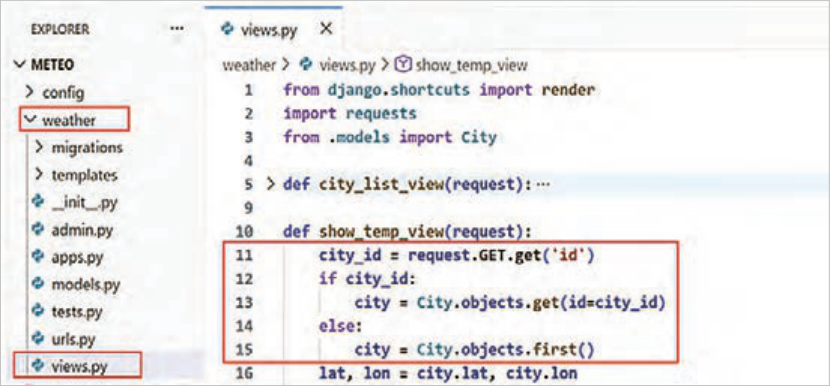

شکل 56 استفاده از `id` جهت انتخاب شهر

### توضیحات کدها:

خط 11: مقدار پارامتر `id` که از طریق متد `GET` در نوار آدرس ارسال شده است، در متغیر `city_id` ذخیره می‌شود.

درصورتی‌که پارامتر `id` در نوار آدرس وجود نداشته باشد، تابع `get`(`'id'`) که بعد از `GET` استفاده شده است، مقدار `city_id` را برابر `None` ذخیره خواهد کرد.

خط 13: اگر `city_id` مقدار داشته باشد، با استفاده از `ORM` جنگو، شهر انتخاب شده توسط کاربر، به‌صورت یک شیء (`object`)، در متغیر `city` ذخیره می‌شود.

خط 15: اگر `city_id` برابر `None` باشد (`id` در نوار آدرس وجود نداشته باشد)، اولین شهر از پایگاه داده واکشی می‌شود.


---

<!-- pdf-page: 320 | book-page: 314 -->

**صفحه ۳۱۴**

اکنون تمام فایل‌ها را ذخیره نموده، صفحه لیست شهرها را `refresh` کنید. همه شهرها لینک دارند.

روی هر شهری که کلیک کنید، در صفحه جدید دمای هوای آن شهر مشاهده می‌شود (شکل 57).

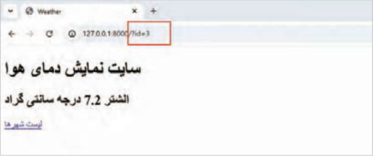

شکل 57 نمایش دمای یک شهر کلیک شده

ورود به سایت (`login`) در حال حاضر، صفحه اصلی و صفحه لیست شهرها توسط کاربر مهمان و کاربر ادمین قابل مشاهده هستند.

اما هر سایت می‌تواند صفحه‌هایی داشته باشد که برای دیده شدن نیاز به `login` (ورود به سایت) داشته باشند. به‌عنوان مثال برای دیدن پنل ادمین جنگو، باید با نام کاربری و رمز عبور ادمین `login` کنید.

شما می‌توانید، امکان دسترسی به قسمت افزودن نام شهرها را فقط به کاربرانی اعطا کنید که با نام کاربری و رمز عبور خودشان وارد سایت می‌شوند.

جنگو خودش به‌طور پیش‌فرض امکاناتی برای مدیریت کاربران دارد تا بتوانید عملیات `login` و `logout` را درون سایت اجرا نمایید. فقط کافیست فایل `template` لازم یعنی `login.html` را در پوشه مناسب ساخته و در فایل `urls` اصلی پروژه (موجود در پوشه `config`) یک `path` جدید اضافه کنید.

مرحله اول: فایل `urls.py` اصلی پروژه را همانند شکل 58 تغییر دهید.

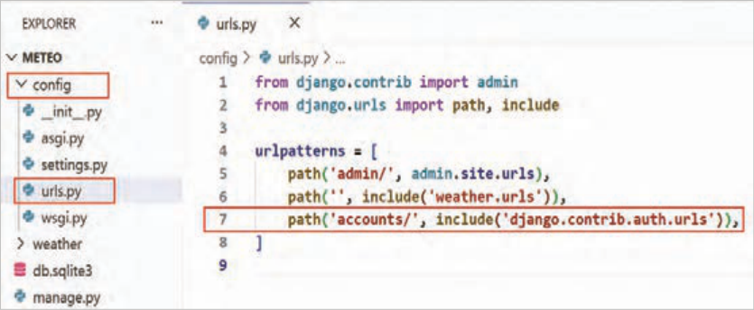

شکل 58 افزودن `path` جدید جهت `login` و `logout`


---

<!-- pdf-page: 321 | book-page: 315 -->

**صفحه ۳۱۵**

### توضیحات کدها:

خط 7: یک `path` جدید اضافه شده است و در ادامه منجر به این خواهد شد که `App` مدیریت کاربران جنگو (`auth`) به کمک `urls` و `views` پیش‌فرض، فایل `login.html` را نمایش دهد. برای مدیریت احراز هویت کاربر در پروژه جنگو، از ماژول `django.contrib.auth` استفاده شده است.

با اضافه‌کردن این خط کد به فایل `urls.py`، امکان ورود، خروج و تغییر رمز عبور به سایت اضافه می‌شود.

همه این قابلیت‌ها توسط ماژول `django.contrib.auth` مدیریت می‌شوند و نیازی به تعریف دستی `path` دیگری ندارید.

مرحله دوم: در پوشه `templates` از `weather` `app`، یک‌پوشه جدید با نام `registration` ایجاد کنید، سپس درون آن یک فایل با نام `login.html` همانند شکل 59 بسازید.

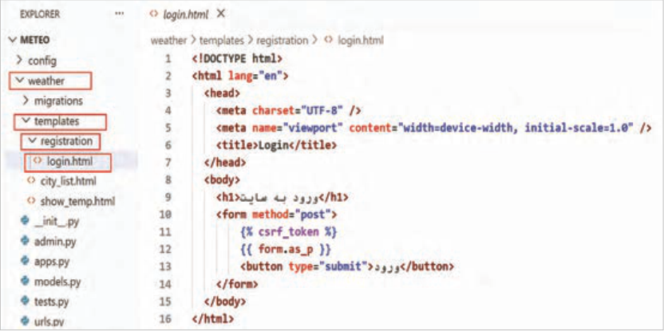

شکل 59 افزودن فایل `login.html`

### توضیحات کدها:

خط 10: یک فرم با متدی از نوع `post` ایجاد شده است.

خط 11: فیلد `csrf_token` به فرم اضافه شده است. `csrf_token` در جنگو یک مقدار امنیتی است که داخل فرم‌ها قرار می‌گیرد تا مطمئن شود درخواست ارسال‌شده واقعًا از همان سایت و توسط کاربر مجاز آمده است.

این توکن از حملۀ `Cross-Site` `Request` `Forgery` جلوگیری می‌کند.

خط 12: فیلدهای فرم را به‌صورت تگ‌های`<p>` در `HTML` نمایش می‌دهد.

خط 13: یک دکمه از نوع `submit` برای ارسال اطلاعات به سرور جنگو اضافه شده است.

### کنجکاوی

در مورد `csrf_token` و حمله `Cross-Site` `Request` `Forgery` تحقیق و بررسی کنید.


---

<!-- pdf-page: 322 | book-page: 316 -->

**صفحه ۳۱۶**

مرحله سوم: در فایل `settings.py`، تنظیمات لازم را برای بعد از اتمام عملیات `login` و `logout` همانند شکل60 انجام دهید.

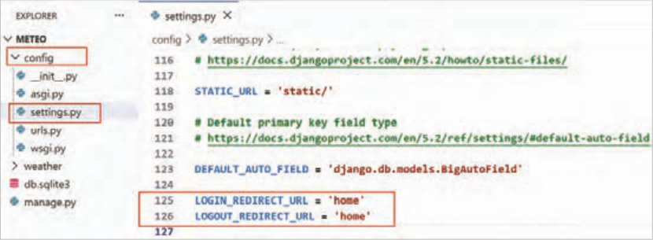

شکل 60 تنظیمات `login` و `logout` در `settings.py`

### توضیحات کدها

خط 125: کاربر بعد از `login` موفق به صفحه `home` منتقل خواهد شد. `home` همان نامی‌است که برای آدرس صفحه اصلی در `urls.py` تعریف شده است.

خط 126: کاربر بعد از `logout` موفق به صفحه `home` منتقل خواهد شد.

مرحله چهارم: در فایل `show_temp.html`، دکمه‌های ورود و خروج را همانند شکل 61 اضافه کنید.

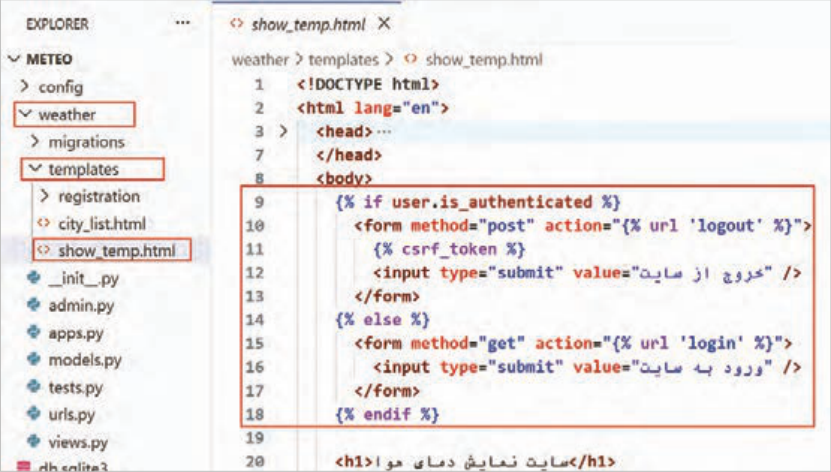

شکل 61 افزودن دکمه ورود و خروج به صفحه اصلی


---

<!-- pdf-page: 323 | book-page: 317 -->

**صفحه ۳۱۷**

### توضیحات کدها:

خط 9: این دستور بررسی می‌کند که آیا کاربر وارد سیستم شده است یا خیر. اگر `user.is_authenticated` مقدار `True` داشته باشد؛ یعنی کاربر احراز هویت شده است و دستورات داخل این شرط اجرا خواهند شد.

خط 10: در این خط یک فرم `HTML`، تعریف شده است که درخواست را با متد `POST` به آدرس خروج از حساب کاربری ارسال می‌کند.

خط 14: از `else` استفاده شده است و به این معنی است، اگر کاربر `login` نباشد، چه چیزی به او نمایش داده شود.

خط 15: در این خط یک فرم با متد `GET` تعریف شده است که کاربر را به صفحه ورود به سایت یعنی صفحه `login` هدایت می‌کند.

اکنون فایل‌ها را ذخیره کرده و سرور جنگو را متوقف و دوباره راه‌اندازی کنید. سپس صفحه اصلی سایت را `refresh` کنید. اگر کاربر `login` نکرده باشد، دکمه ورود به سایت را مشاهده می‌کند (شکل 62).

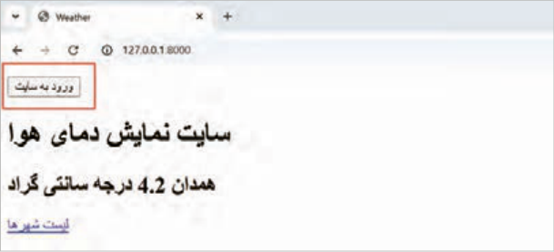

شکل 62 نمایش دکمه ورود برای کاربر مهمان

با کلیک روی دکمه ورود به سایت، کاربر به صفحه `login` منتقل می‌شود (شکل 63).

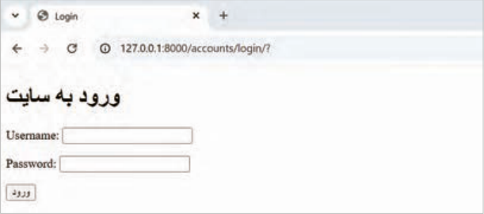

شکل 63 فرم ورود به سایت


---

<!-- pdf-page: 324 | book-page: 318 -->

**صفحه ۳۱۸**

پس از ورود موفق به سایت، کاربر به صفحه اصلی سایت منتقل شده و این بار دکمه خروج از سایت برای کاربر نمایش داده می‌شود.

درصورتی‌که کاربر روی دکمه خروج از سایت کلیک کند، از سایت خارج شده و بلافاصله به صفحه اصلی منتقل خواهد شد.

ثبت شهر جدید با کاربر عضو سایت تاکنون فقط در پنل ادمین و با کاربر `admin` امکان ثبت شهرها را داشتید. اما این امکان وجود دارد که کاربرهای عضو سایت هم بتوانند بدون مراجعه به پنل ادمین، شهر جدید را ثبت کنند.

برای این کار می‌توانید با استفاده از فرم‌های جنگو و انجام چهار مرحلۀ زیر، این قابلیت را به سایت اضافه کنید.

1 ایجاد `forms.py` برای ساخت فرم ثبت شهر جدید

2 ساختن `template` ساده برای فرم

3 ساختن تابع `add_city_view` برای نمایش فرم

4 اضافه‌کردن `path` مخصوص فرم در فایل `urls.py`

5 قراردادن لینک «افزودن شهر» در صفحه اصلی مرحله اول: یک فایل جدید در پوشه `weather` با نام `forms.py` ایجاد کنید و همانند شکل 64 آن را تکمیل کنید.

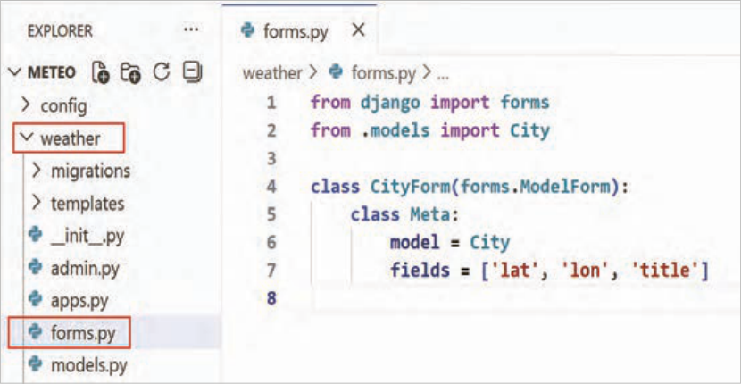

شکل 64 ایجاد `CityForm`


---

<!-- pdf-page: 325 | book-page: 319 -->

**صفحه ۳۱۹**

### توضیحات کدها:

خط 1: ماژول `forms` درون این فایل `import` شده است. این ماژول همه کارهای مربوط به فرم‌ها را پشتیبانی می‌کند.

خط 2: کلاس `City` از فایل `model` درون این فایل `import` شده است. `City` همان مدل شهر‌ها است که قبًلا تعریف کرده‌ایم.

خط 4: یک کلاس با نام `CityForm` ساخته شده است که از `ModelForm` ارث‌بری می‌کند.

خط 5: برای تعیین مدل و فیلدهایی که می‌خواهید نمایش داده شود باید از یک کلاس `Meta` در کلاس اصلی استفاده شود و در آن مدل و فیلدها مشخص گردد.

خط 6: کلاس `City` به‌عنوان `model` تعیین شده است.

خط 7: لیست فیلدهایی که می‌خواهید نمایش داده شود، تعیین شده است.

مرحله دوم: فایل `add_city.html` را همانند شکل 65 ایجاد کنید.

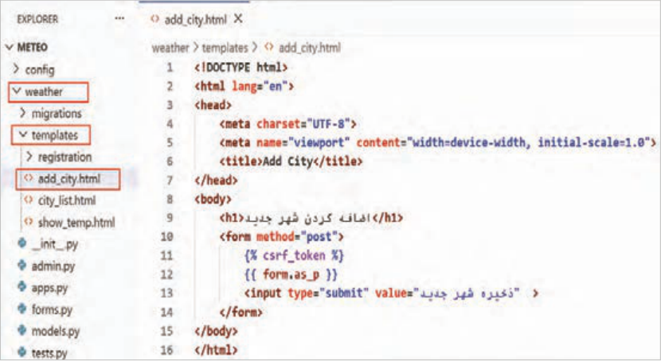

```
شکل 65 افزودن add_city.html
```

### توضیحات کدها:

یک فرم با متد از نوع `post` ایجاد شده است. این فرم طول و عرض جغرافیایی و همچنین نام شهر را از کاربر گرفته و برای سرور جنگو ارسال می‌کند تا در دیتابیس ذخیره شود.


---

<!-- pdf-page: 326 | book-page: 320 -->

**صفحه ۳۲۰**

مرحله سوم: در فایل `views.py` تابع `add_city_view` را همانند شکل 66 اضافه کنید.

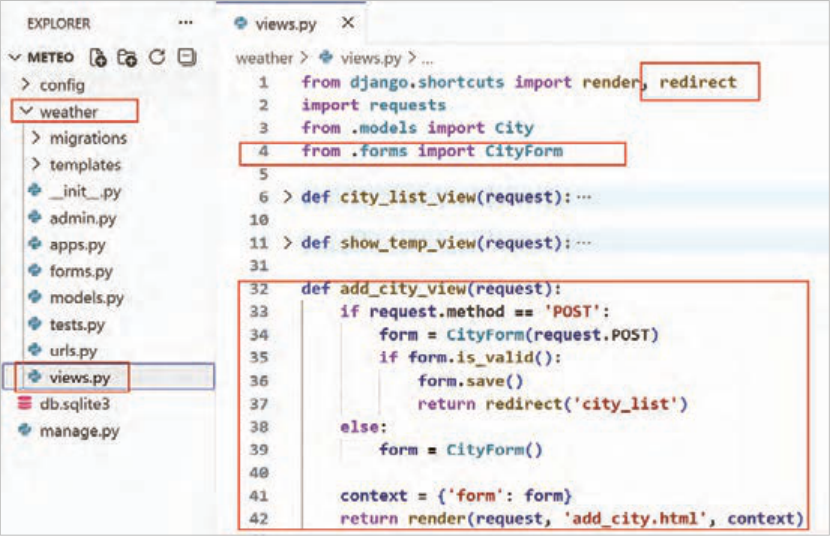

شکل 66 ایجاد `view` جهت افزودن شهر

### توضیحات کدها:

خط 1: متد `redirect` درون این فایل `import` شده است.

خط 4: کلاس `CityForm` از فایل `forms.py` درون این فایل `import` شده است.

خط 33: اگر کاربر در صفحه «اضافه‌کردن شهر»، اطلاعات فرم را وارد کرده و دکمه «ذخیره شهر جدید» را کلیک کند، یک `request` از نوع `post` برای `add_city_view` ارسال می‌شود، در این خط نوع `request` با `if` بررسی شده است.

خط 34: یک فرم از `CityForm` براساس نوع درخواست ارسال‌شدۀ کاربر ایجاد و در متغیر `form` ذخیره شده است تا به کمک آن اطلاعاتی که کاربر به‌وسیله آن فرم ارسال کرده است، ذخیره شود.

خط 35: تابع `is_valid` فیلدهای وارد شده کاربر را بررسی می‌کند. در `request` ارسال کاربر، باید فیلدهای اجباری مقدار گرفته باشند و همچنین نوع فیلدها صحیح باشد.

خط 36: در صورت معتبر بودن درخواست، اطلاعات در جدول `city` ذخیره خواهد شد.

خط 37: پس از ذخیره موفق اطلاعات شهر، کاربر به صفحه لیست شهرها منتقل خواهد شد.

خط 39: وقتی کاربر آدرس این صفحه را در مرورگر وارد می‌کند، یک درخواست از نوع `GET` اتفاق افتاده است، در این حالت، نوع `request` چیزی غیر از `POST` است، پس یک فرم جدید از `CityForm` ایجاد و در متغیر `form` ذخیره شده است تا فرم افزودن شهر به کاربر نمایش داده شود.


---

<!-- pdf-page: 327 | book-page: 321 -->

**صفحه ۳۲۱**

خط 41: فرم ساخته شده، در دیکشنری `context` قرار گرفته و در خط بعد به `add_city.html` ارسال شده است.

مرحله چهارم: در فایل `urls.py` مربوط به `weather` `app` یک `path` جدید همانند شکل 67 اضافه کنید.

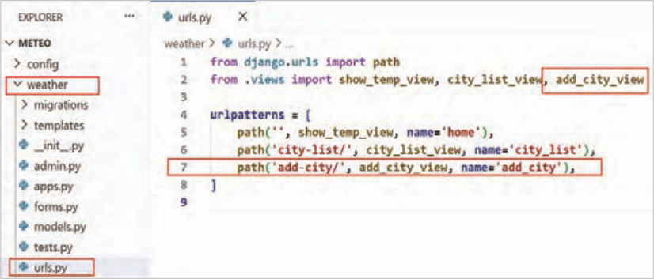

شکل 67 اضافه‌کردن `path` جدید برای افزودن شهر

### توضیحات کدها:

یک `path` جدید جهت افزودن شهر اضافه شده است.

مرحله پنجم: در فایل `show_temp.html` یک لینک برای افزودن شهر، در خط 10 همانند شکل 68 اضافه کنید.

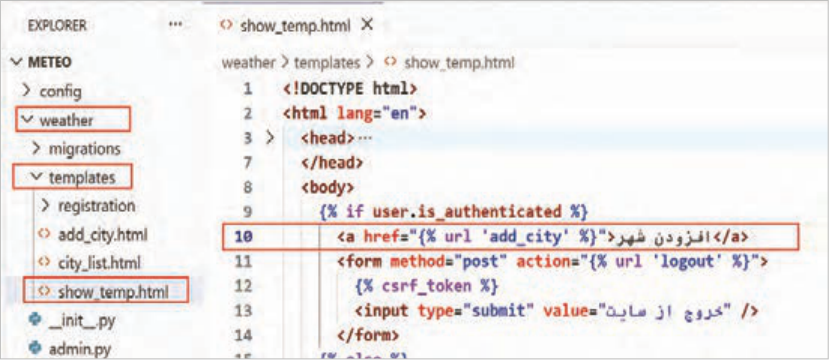

شکل 68 ایجاد لینک به صفحه افزودن شهر


---

<!-- pdf-page: 328 | book-page: 322 -->

**صفحه ۳۲۲**

اکنون همه فایل‌ها را ذخیره و صفحه اصلی سایت را `refresh` کنید.

با دکمه [ورود به سایت] `login` کنید. لینک افزودن شهر برای شما نمایش داده خواهد شد (شکل 69).

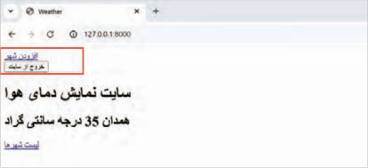

شکل 69 نمایش لینک پس از `login` کاربر

بر روی لینک «افزودن شهر» کلیک کنید، سپس همانند شکل 70، اطلاعات شهر موردنظر خود را وارد و دکمه ذخیره شهر جدید را کلیک کنید. در صورت ذخیره موفِق این فرم، کاربر به صفحه لیست شهر‌ها منتقل و شهر اضافه شده به انتهای لیست افزوده خواهد شد.

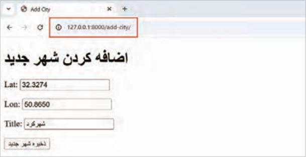

شکل 70 فرم اضافه‌کردن شهر جدید

حذف شهر با کاربر عضو سایت در این پروژه می‌توانید امکان حذف شهرها را به کاربر عضو سایت بدهید، این کار را در سه مرحله می‌توانید انجام دهید.


---

<!-- pdf-page: 329 | book-page: 323 -->

**صفحه ۳۲۳**

مرحله اول: یک `view` جدید با نام `delete_city_view` در `views.py` همانند شکل 71 ایجاد کنید.

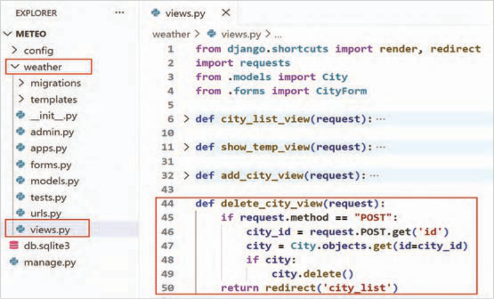

شکل 71 ساخت `view` جهت حذف شهرها

### توضیحات کدها:

خط 49: دستور `delete` از `ORM` جنگو استفاده می‌کند و شهر انتخاب شده را از پایگاه‌داده حذف می‌کند.

خط 50: بعد از حذف‌کردن شهر، کاربر را به لیست شهرها منتقل می‌کند.

مرحله دوم: یک `path` جدید برای `delete_city_view` در `urls.py` همانند شکل 72 اضافه کنید.

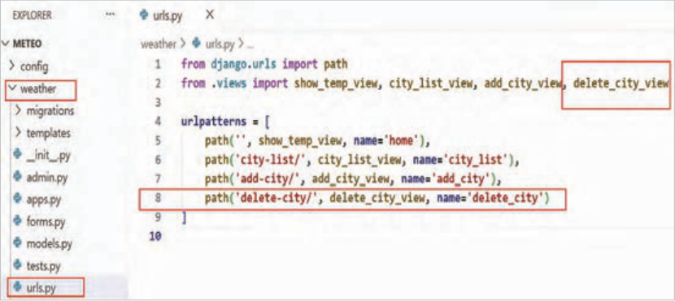

شکل 72 افزودن `path` جدید برای حذف شهرها


---

<!-- pdf-page: 330 | book-page: 324 -->

**صفحه ۳۲۴**

مرحله سوم: فایل `city_list.html` را همانند شکل 73 تغییر دهید.

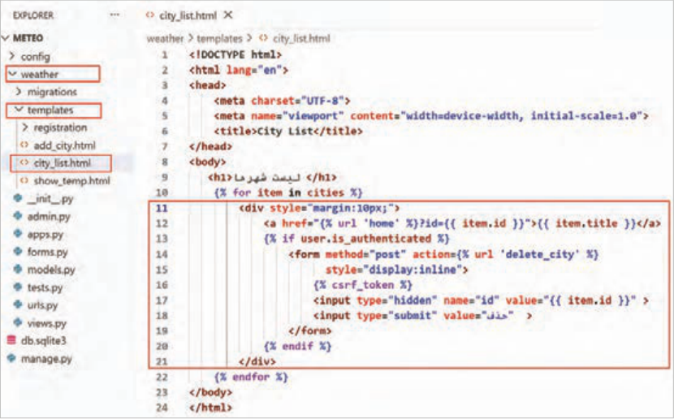

شکل 73 اضافه‌کردن دکمه حذف به `city_list.html`

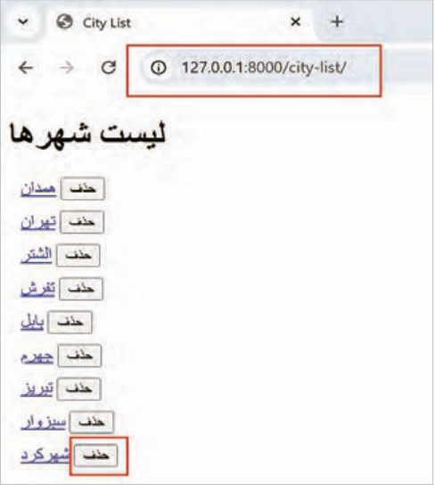

### توضیحات کدها:

خط 13: این دستور باعث می‌شود دکمه حذف شهر فقط برای کاربر `login` شده نمایش داده شود.

خط 14: یک فرم با متد از نوع `POST` ایجاد شده است. در `action` این فرم، به `_delete` `city` اشاره شده است، یعنی درخواست حذف به `view` حذف شهر ارسال خواهد شد.

خط 17: آیدی شهر به‌صورت یک فیلد مخفی (`hidden`) اضافه شده است. آیدی شهر در خروجی نمایش داده نخواهد شد.

فایل‌ها را ذخیره کنید، صفحه لیست شهرها را باز کنید. خروجی همانند شکل 74 خواهد بود.

شکل 74 دکمه حذف در لیست شهرها


---

<!-- pdf-page: 331 | book-page: 325 -->

**صفحه ۳۲۵**

با کلیک روی لینک حذف مقابل هر شهر، شهر موردنظر حذف شده و لیست شهرها به‌روزرسانی می‌شود.

درصورتی‌که کاربر مهمان باشد، لینک حذف را مشاهده نخواهد کرد.

### فعالیت

با دانشی که از پودمان‌های قبل کسب کرده‌اید، ظاهر سایت را با `html` و `css` و `bootstrap` زیبا کنید.

### بهینه‌سازی و امن کردن پروژه

در این مرحله، برای بهینه‌سازی پروژه، ایرادها و باگ‌های امنیتی پروژه بررسی می‌شوند.

باگ کدنویسی شماره یک:

اگر هیچ شهری در جدول `City` وجود نداشته باشد یا همه شهرها حذف شده باشند، در صفحه اصلی سایت خطایی همانند شکل 75 مشاهده خواهد شد.

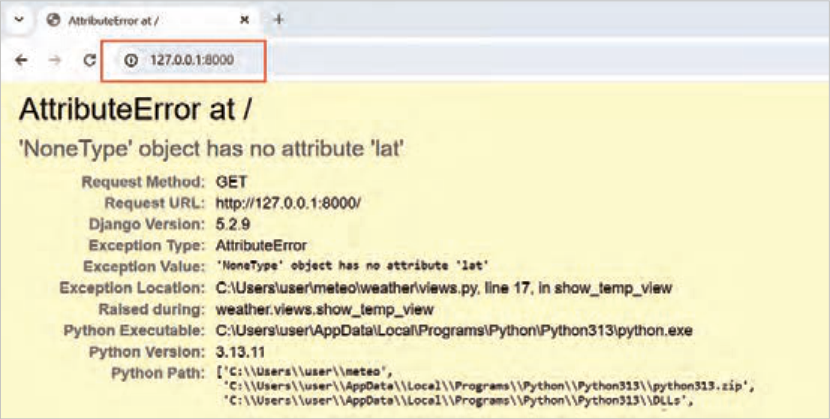

شکل 75 خطا در صورت خالی بودن جدول شهرها


---

<!-- pdf-page: 332 | book-page: 326 -->

**صفحه ۳۲۶**

باگ کدنویسی دوم:

اگر کاربر `id` شهر را در نوار آدرس مرورگر، دستی تغییر دهد و `id` وارد شده در پایگاه‌داده وجود نداشته باشد، در صفحه اصلی سایت خطایی همانند شکل 76 نمایش داده می‌شود.

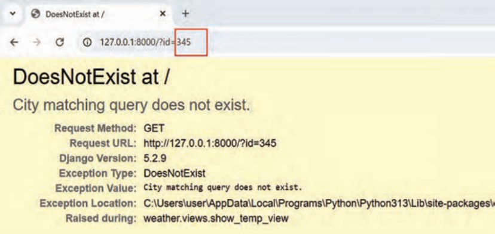

شکل 76 خطا در صورت اشتباه بودن آیدی شهر

راه‌حل باگ اول و دوم: برای رفع این ایراد، کد `show_temp_view` را همانند شکل 77 تغییر دهید.

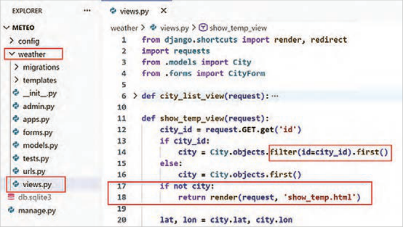

شکل 77 رفع ایراد کد


---

<!-- pdf-page: 333 | book-page: 327 -->

**صفحه ۳۲۷**

### توضیحات کدها:

خط 14: به‌جای استفاده از تابع `get` از تابع `filter` و `first` استفاده شده است. تابع `get` در صورتی خطا می‌دهد که مقدار موردنظر در دیتابیس وجود نداشته باشد. اما تابع `filter` این رفتار را ندارد و باعث بروز خطا نخواهد شد. پس باگ دوم را پوشش می‌دهد.

خط 17: درصورتی‌که `city` مقدار نداشته باشد، درخواست به `API` آب‌وهوا ارسال نمی‌شود و مستقیمًا `show_temp.html` نمایش داده می‌شود. این خط نیز باگ اول را پوشش می‌دهد، قبل از اصلاح کدها اگر هیچ شهری در دیتابیس وجود نداشت، مقدار `city` برابر `None` می‌شد. پس هنگام دریافت `lat` کد به خطا می‌خورد. با تغییراتی که اعمال شد، این باگ برطرف شده است.

باگ امنیتی:

اگر کاربر عضو سایت نباشد، اما آدرس صفحه افزودن شهر و حذف شهرها را داشته باشد، بدون `login` در سایت می‌تواند، شهر اضافه کرده و یا شهر حذف نماید.

راه‌حل باگ امنیتی: برای رفع این ایراد، کد `add_city_view` را همانند شکل 78 تغییر دهید.

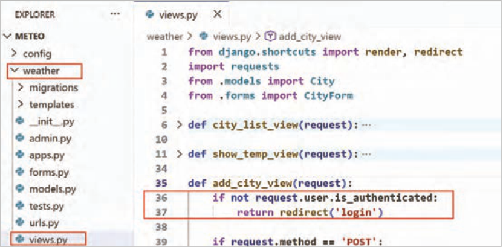

شکل 78 رفع باگ امنیتی کد

### توضیحات کدها:

خط 36: درصورتی‌که کاربر `login` نکرده باشد، در خط بعدی به صفحه `login` منتقل خواهد شد. همین کد را می‌توانید برای `delete_city_view` هم استفاده کنید.

با این تغییرات، اگر کاربر `login` نباشد؛ ولی آدرس افزودن شهر و حذف شهر را در مرورگر وارد کند، به صفحه `login` منتقل خواهد شد.

### کنجکاوی

بررسی کنید چه موارد دیگری می‌تواند این پروژه را بهبود دهد.


---

<!-- pdf-page: 334 | book-page: 328 -->

**صفحه ۳۲۸**

### ارزشیابی شایستگی توسعه وب اپلیکیشن

استاندارد عملکرد کار: هنرجو بتواند با ساخت `Model` در جنگو و استفاده از فرم های `HTML` ارتباط با پایگاه داده را پیاده‌سازی کند و اطلاعاتی که کاربران وارد م‌یکنند را در جداول ذخیره و بازیابی نماید.

نمره

شرایط انجام کار (ابزار،مواد، تجهیزات،

ابزارهای

نتایج

ردیف

### مراحل کار

استاندارد (شاخص‌ها/داوری/نمره‌دهی)

کسب

زمان، مکان و ...)

### ارزشیابی

ممکن شده

توضیح تفاوت بین ساختار پایگاه‌داده و جداول آن. شرح وظیفه و اهمیت `ORM` در جنگو.

شناخت اجزای اصلی پنل مدیریت جنگو و کاربرد آن. موفقیت در تعریف صحیح مدل `City` با فیلدهای لازم (مانند نام شهر، دما و …). کار با `ORM:` نوشتن

3

کوئری‌های ساده با `ORM` برای خواندن (مثًلا `City.objects.all`()) داده‌ها.

موفقیت در ثبت `City` در پنل ادمین و امکان مشاهده، افزودن و ویرایش داده‌ها از طریق آن وارد کردن چند رکورد نمونه (چند شهر) به جدول از طریق پنل ادمین.

مشاهده انجام کنجکاو‌یها انجام کار با چند روش عملی

```
DE: VS Code PostgreSQL فریم‌ورک
```

پایگاه‌داده، `ORM` و پنل

پرسش

1

موفقیت در تعریف صحیح مدل `City` با فیلدهای لازم (مانند نام شهر، دما و

جنگو رایانه شخصی یا لپ‌تاپ با سیستم عامل

مدیریت

کتبی …). کار با `ORM:` نوشتن کوئری‌های ساده با `ORM` برای خواندن (مثًلا

زمان 25 دقیقه مکان سایت رایانه

آزمون

```
City.objects.all()) داده‌ها.
```

شفاهی

2

موفقیت در ثبت `City` در پنل ادمین و امکان مشاهده، افزودن و ویرایش داده‌ها از طریق آن وارد کردن چند رکورد نمونه (چند شهر) به جدول از طریق پنل ادمین.

توضیح تفاوت بین ساختار پایگاه‌داده و جداول آن. شرح وظیفه و اهمیت `ORM` در جنگو.

1

شناخت اجزای اصلی پنل مدیریت جنگو و کاربرد آن شناخت نقش `views` در پردازش درخواست‌ها و ارسال پاسخ. درک نحوه ارسال داده از `view` به `template` (قالب `HTML`) آشنایی با مفاهیم اولیه تعامل کاربر (مانند کلیک روی لینک). ایجاد یک `view` و `template` برای نمایش لیستی از نام شهرها که از پایگاه‌داده خوانده شده‌اند. پیاده‌سازی

3

مکانیزم انتخاب شهر (مثلاً با لینک یا فرم). ایجاد یک `view` که شهر انتخاب شده را دریافت کند. نمایش دمای مربوط به شهر انتخاب شده در صفحه.

مشاهده تعریف `URL`های مناسب برای دسترسی به این قابلیت‌ها.

```
DE: VS Code PostgreSQL
```

عملی

کار با داده‌ها و نمایش

فریم‌ورک جنگو رایانه شخصی یا لپ‌تاپ با پرسش

2

ایجاد یک `view` و `template` برای نمایش لیستی از نام شهرها که از

اطلاعات

سیستم عامل زمان 25 دقیقه مکان سایت کتبی

پایگاه‌داده خوانده شده‌اند. پیاده‌سازی مکانیزم انتخاب شهر (مثلاً با لینک یا

رایانه

آزمون فرم). ایجاد یک `view` که شهر انتخاب شده را دریافت کند.

2

شفاهی نمایش دمای مربوط به شهر انتخاب شده در صفحه. تعریف `URL`های مناسب برای دسترسی به این قابلیت‌ها.

توضیح نقش `views` در پردازش درخواست‌ها و ارسال پاسخ توضیح نحوه ارسال داده از `view` به `template` (قالب `HTML`) توضیح مفاهیم اولیه

1

تعامل کاربر (مانند کلیک روی لینک).

توضیح با فرایند احراز هویت (`Login/Logout`) در جنگو توضیح مفهوم سطوح دسترسی (`Permissions`) و چگونگی اعمال آن‌ها شناخت مخاطرات امنیتی دسترسی‌های غیرمجاز راه‌اندازی صحیح سیستم ورود کاربران.

3

اطمینان از اینکه صفحات افزودن و حذف شهر فقط برای کاربران وارد شده (عضو سایت) قابل دسترسی باشند موفقیت در پیاده‌سازی قابلیت افزودن شهر مشاهده جدید و حذف شهر موجود، فقط توسط کاربران وارد شده انجام کنجکاوی ها عملی

```
DE: VS Code PostgreSQL فریم‌ورک
```

احراز هویت و مدیریت

پرسش

3

جنگو رایانه شخصی یا لپ‌تاپ با سیستم عامل

راه‌اندازی صحیح سیستم ورود کاربران. اطمینان از اینکه صفحات افزودن و

دسترسی‌ها

کتبی

زمان 25 دقیقه مکان سایت رایانه

حذف شهر فقط برای کاربران وارد شده (عضو سایت) قابل دسترسی باشند آزمون

2

موفقیت در پیاده‌سازی قابلیت افزودن شهر جدید و حذف شهر موجود، فقط شفاهی توسط کاربران وارد شده.

توضیح با فرایند احراز هویت (`Login/Logout`) در جنگو. توضیح مفهوم سطوح دسترسی (`Permissions`) و چگونگی اعمال آنها. توضیح مخاطرات

1

امنیتی و دسترسی‌های غیرمجاز راه‌اندازی صحیح سیستم ورود کاربران.


---

<!-- pdf-page: 335 | book-page: 329 -->

**صفحه ۳۲۹**

شناسایی انواع باگ‌های کدنویسی (منطقی، اجرایی) درک اصول اولیه امنیت وب (مانند جلوگیری از تزریق کد، حملات `CSRF` و …).

آشنایی با مفاهیم اولیه بهینه‌سازی کد و عملکرد.

رفع باگ ۱ (جدول خالی): پیاده‌سازی منطق صحیح در `view` یا `template` برای مدیریت حالتی که جدول `City` خالی است، بدون ایجاد خطا. رفع باگ ۲ (تغییر `ID` در `URL`): پیاده‌سازی بررسی صحت `id` شهر

3

در `view` قبل از تلاش برای نمایش اطلاعات آن، جهت جلوگیری از خطا یا نمایش اطلاعات نادرست.

رفع باگ امنیتی (دسترسی غیرمجاز): اطمینان کامل از اینکه هیچ کاربری بدون `Login` نمی‌تواند به صفحات افزودن/حذف شهر دسترسی پیدا کند و مشاهده عملیات را انجام دهد.

عملی

```
DE: VS Code PostgreSQL فریم‌ورک
```

ارائه کد تمیزتر و کارآمدتر (در صورت امکان، بسته به سطح دو

رفع اشکالات و بهینه‌سازی

پرسش

4

جنگو رایانه شخصی یا لپ‌تاپ با سیستم عامل

امنیتی

کتبی رفع باگ ۱ (جدول خالی): پیاده‌سازی منطق صحیح در `view` یا `template`

زمان 30دقیقه مکان سایت رایانه

آزمون برای مدیریت حالتی که جدول `City` خالی است، بدون ایجاد خطا رفع شفاهی باگ ۲ (تغییر `ID` در `URL`): پیاده‌سازی بررسی صحت `id` شهر در `view` قبل از تلاش برای نمایش اطلاعات آن، جهت جلوگیری از خطا یا نمایش

2

اطلاعات نادرست.

رفع باگ امنیتی (دسترسی غیرمجاز): اطمینان کامل از اینکه هیچ کاربری بدون `Login` نمی‌تواند به صفحات افزودن/حذف شهر دسترسی پیدا کند و عملیات را انجام دهد.

شناسایی انواع باگ‌های کدنویسی (منطقی، اجرایی) درک اصول اولیه امنیت وب (مانند جلوگیری از تزریق کد، حملات `CSRF` و …).

1

آشنایی با مفاهیم اولیه بهینه‌سازی کد و عملکرد.

شایستگی‌های غیر فنی، ایمنی،

احراز همه شایستگی‌های غیرفنی2

بهداشت، توجهات زیست محیطی و نگرش:

عدم احراز هر یک از شایستگی‌های غیرفنی1 بلی

ارزشیابی کار (شایستگی انجام کار)

خیر

### توضیحات:

1 معیار شایستگی انجام کار:

کسب حداقل نمره 2 از مراحل 2 و 3 (مراحل بحرانی) کسب حداقل نمره 2 از بخش شایستگی‌های غیرفنی، ایمنی، بهداشت، توجهات زیست‌محیطی و نگرش کسب حداقل میانگین 2 از مراحل کار

2 تعریف سطوح شایستگی: صرف‌نظر از اینکه یک تکلیف کاری در چه سطحی از صلاحیت حرفه‌ای انجام می‌شود، در هر محیط کاری ممکن است انجام هر کار با کیفیت مشخصی مورد انتظار باشد. سطح شایستگی انجام کار، معیار اساسی ارزشیابی است.

مهارت (سطح سه): ماهر و قادر به آموزش و هدایت دیگران، توانایی برنامه‌ریزی و تحلیل، پاسخ‌گویی در برابر کارهای خود، سروکار داشتن با سطح وسیعی از کارها و فعالیت‌ها تسلط (سطح چهار): خبرگی در انجام کار و آموزش دیگران، ایجاد نوآوری، سازگاری، عیب‌یابی، هدایت و راهنمایی دیگران.
